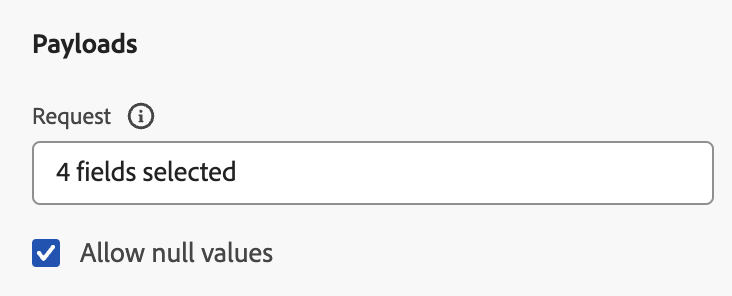

# Een aangepaste handeling configureren {#configure-a-custom-action}

>[!CONTEXTUALHELP]
>id="ajo_journey_action_custom_configuration"
>title="Aangepaste acties"
>abstract="Als u een derdesysteem gebruikt om berichten te verzenden of als u reizen API vraag naar een derdesysteem wilt verzenden, gebruik douaneacties om zijn verbinding aan uw reis te vormen."

Als u een derdesysteem gebruikt om berichten te verzenden of als u reizen API vraag naar een derdesysteem wilt verzenden, gebruik douaneacties om zijn verbinding aan uw reis te vormen. Bijvoorbeeld kunt u met de volgende systemen met douaneacties verbinden: Epsilon, Slack, [&#x200B; Adobe Developer &#x200B;](https://developer.adobe.com){target="_blank"}, Vuurbasis, enz.

Aangepaste acties zijn aanvullende acties die door technische gebruikers worden gedefinieerd en beschikbaar worden gesteld aan verkopers. Als deze zijn geconfigureerd, worden ze weergegeven in het linkerpalet van uw reis, in de categorie **[!UICONTROL Action]** . Leer meer op [&#x200B; deze pagina &#x200B;](../building-journeys/about-journey-activities.md#action-activities).

## Configuratiestappen {#configuration-steps}

Hier zijn de belangrijkste stappen die worden vereist om een douaneactie te vormen:

1. Selecteer **[!UICONTROL Configurations]** in de sectie van het menu BEHEER. Klik in de sectie **[!UICONTROL Actions]** op **[!UICONTROL Manage]** . Klik op **[!UICONTROL Create Action]** om een nieuwe handeling te maken. Het deelvenster Handelingsconfiguratie wordt aan de rechterkant van het scherm geopend.

   

1. Voer een naam in voor de handeling.

   >[!NOTE]
   >
   >Alleen alfanumerieke tekens en onderstrepingstekens zijn toegestaan. De maximumlengte is 30 tekens.

1. Voeg een beschrijving aan uw actie toe. Deze stap is optioneel.
1. Het aantal ritten dat deze handeling gebruikt, wordt weergegeven in het veld **[!UICONTROL Used in]** . U kunt op de knop **[!UICONTROL View journeys]** klikken om de lijst met ritten weer te geven die deze handeling gebruiken.
1. Definieer de verschillende **[!UICONTROL URL Configuration]** -parameters. Zie [deze pagina](../action/about-custom-action-configuration.md#url-configuration).
1. Configureer de sectie **[!UICONTROL Authentication]** . Deze configuratie is het zelfde als voor gegevensbronnen.  Zie [deze sectie](../datasource/external-data-sources.md#custom-authentication-mode).
1. Definieer de **[!UICONTROL Action parameters]** . Zie [deze pagina](../action/about-custom-action-configuration.md#define-the-message-parameters).
1. Klik op **[!UICONTROL Save]**.

   De aangepaste handeling is nu geconfigureerd en klaar om te worden gebruikt tijdens uw reizen. Zie [deze pagina](../building-journeys/about-journey-activities.md#action-activities).

   >[!NOTE]
   >
   >Wanneer een douaneactie in een reis wordt gebruikt, zijn de meeste parameters read-only. U kunt alleen de velden **[!UICONTROL Name]** , **[!UICONTROL Description]** , **[!UICONTROL URL]** en **[!UICONTROL Authentication]** wijzigen.

## Beperkingen{#custom-actions-limitations}

De acties van de douane komen met een paar beperkingen die op [&#x200B; worden vermeld deze pagina &#x200B;](../start/guardrails.md).

In parameters voor aangepaste handelingen kunt u een eenvoudige verzameling en een verzameling objecten doorgeven. Leer meer over inzamelingsbeperkingen op [&#x200B; deze pagina &#x200B;](../building-journeys/collections.md#limitations).

De parameters voor aangepaste handelingen hebben een verwachte indeling (bijvoorbeeld tekenreeks, decimaal, enz.). U moet deze verwachte formaten zorgvuldig respecteren. Leer meer in dit [&#x200B; gebruiksgeval &#x200B;](../building-journeys/collections.md).

De acties van de douane steunen JSON formaat slechts wanneer het gebruiken van [&#x200B; verzoek &#x200B;](../action/about-custom-action-configuration.md#define-the-message-parameters) of [&#x200B; antwoordladloads &#x200B;](../action/action-response.md).

>[!NOTE]
>
>Wanneer een eindpunt een reactietijd meer dan 0.75 seconden heeft, worden zijn vraag van de douaneactie verpletterd door de specifieke langzaam [&#x200B; dienst van de douaneactie &#x200B;](../configuration/external-systems.md#response-time) in plaats van de standaarddienst.

## Best practices{#custom-action-enhancements-best-practices}

Wanneer het kiezen van een eindpunt om het gebruiken van een douaneactie te richten, ben zeker dat:

* Dit eindpunt kan de productie van de reis steunen, gebruikend configuraties van [&#x200B; het Throttling API &#x200B;](../configuration/throttling.md) of [&#x200B; Capping API &#x200B;](../configuration/capping.md) om het te beperken. Wees voorzichtig dat een snelheidsbegrenzingsconfiguratie niet lager kan zijn dan 200 TPS. Om het even welk gericht eindpunt zal minstens 200 TPS moeten steunen.
* Dit eindpunt moet een reactietijd hebben zo laag mogelijk. Afhankelijk van uw verwachte productie, zou het hebben van een hoge reactietijd de daadwerkelijke productie kunnen beïnvloeden.

Een maximum van 300.000 vraag over één minuut wordt bepaald voor alle douaneacties. Daarnaast wordt de standaarduitlijning uitgevoerd per host en per sandbox. Als u bijvoorbeeld op een sandbox twee eindpunten met dezelfde host hebt (bijvoorbeeld: `https://www.adobe.com/endpoint1` en `https://www.adobe.com/endpoint2` ), wordt de aftopping toegepast op alle eindpunten onder de host adobe.com. De &quot;eindpunt1&quot;en &quot;eindpunt2&quot;zullen de zelfde het begrenzen configuratie delen en het hebben van één eindpunt bereikt de grens zal een effect op het andere eindpunt hebben.

Deze grens is geplaatst gebaseerd op klantengebruik, om externe eindpunten te beschermen die door douaneacties worden gericht. U moet hiermee rekening houden bij reizen voor uw publiek door een juiste leessnelheid te definiëren (5000 profielen/s wanneer aangepaste handelingen worden gebruikt). Indien nodig, kunt u deze het plaatsen met voeten treden door een grotere het maximum van het maximum of het vertragen grens door onze Capping/het Draaien APIs te bepalen. Zie [deze pagina](../configuration/external-systems.md).

U zou openbare eindpunten met douaneacties niet om verschillende redenen moeten richten:

* Zonder behoorlijk het in kaart brengen of het vertragen, is er een risico om teveel vraag naar een openbaar eindpunt te verzenden dat zulk volume niet kan steunen.
* De gegevens van het profiel kunnen door douaneacties worden verzonden, zodat het richten van een openbaar eindpunt tot onbedoeld het delen van persoonlijke informatie buiten zou kunnen leiden.
* U hebt geen controle over de gegevens die door openbare eindpunten worden teruggekeerd. Als een eindpunt zijn API verandert of onjuiste informatie begint te verzenden, zullen die in verzonden mededelingen, met potentiële negatieve gevolgen ter beschikking worden gesteld.

## Toestemming en gegevensbeheer {#privacy}

In Journey Optimizer kunt u beleid voor gegevensbeheer en toestemming toepassen op uw aangepaste acties om te voorkomen dat bepaalde velden worden geëxporteerd naar systemen van derden of om klanten uit te sluiten die niet hebben ingestemd met het ontvangen van e-mail, push- of SMS-berichten. Raadpleeg de volgende pagina&#39;s voor meer informatie:

* [&#x200B; het bestuur van Gegevens &#x200B;](../action/action-privacy.md).
* [&#x200B; Toestemming &#x200B;](../action/action-privacy.md).

## Eindpuntconfiguratie {#url-configuration}

Wanneer u een aangepaste handeling configureert, moet u de volgende **[!UICONTROL Endpoint Configuration]** -parameters definiëren:

{width="70%" align="left"}

1. Geef in het veld **[!UICONTROL URL]** de URL van de externe service op:

   * Als de URL statisch is, voert u de URL in dit veld in.

   * Als de URL een dynamisch pad bevat, voert u alleen het statische gedeelte van de URL in, dat wil zeggen het schema, de host, de poort en eventueel een statisch gedeelte van het pad.

     Voorbeeld: `https://xxx.yyy.com/somethingstatic/`

     U geeft het dynamische pad van de URL op wanneer u de aangepaste handeling aan een rit toevoegt. [Meer informatie](../building-journeys/using-custom-actions.md).

   >[!NOTE]
   >
   >Om veiligheidsredenen raden we u ten zeerste aan het HTTPS-schema te gebruiken voor de URL. Wij staan niet het gebruik van Adobe adressen toe die niet openbaar en het gebruik van IP adressen zijn.
   >
   >Alleen de standaardpoorten zijn toegestaan bij het definiëren van een aangepaste handeling: 80 voor http en 443 voor https.

1. Selecteer de aanroep **[!UICONTROL Method]** : deze kan **[!UICONTROL POST]** , **[!UICONTROL GET]** of **[!UICONTROL PUT]** zijn.

   >[!NOTE]
   >
   > De **methode van DELETE** wordt niet gesteund. Als u een bestaand middel moet bijwerken, selecteer de **methode van PUT**.

1. Mogelijke omleidingen verwerken (302 reacties). **de acties van de Douane** volgen automatisch HTTP 302 opnieuw richt op een per-verzoekbasis.

1. Definieer de headers en queryparameters:

   * Klik in de sectie **[!UICONTROL Headers]** op **[!UICONTROL Add a header field]** om de HTTP-koppen te definiëren van het aanvraagbericht dat naar de externe service moet worden verzonden. De headervelden **[!UICONTROL Content-Type]** en **[!UICONTROL Charset]** worden standaard ingesteld. U kunt deze velden niet verwijderen. Alleen de header **[!UICONTROL Content-Type]** kan worden gewijzigd. De waarde ervan moet de JSON-indeling respecteren. Hier is de standaardwaarde:

   

   * Klik in de sectie **[!UICONTROL Query parameters]** op **[!UICONTROL Add a Query parameter field]** om de parameters te definiëren die u in de URL wilt toevoegen.

   

1. Voer het label of de naam van het veld in.

1. Selecteer het type: **[!UICONTROL Constant]** of **[!UICONTROL Variable]** . Als u **[!UICONTROL Constant]** hebt geselecteerd, voert u de constante waarde in het veld **[!UICONTROL Value]** in. Als u **[!UICONTROL Variable]** hebt geselecteerd, geeft u deze variabele op wanneer u de aangepaste handeling aan een rit toevoegt. [Meer informatie](../building-journeys/using-custom-actions.md).

   

   >[!NOTE]
   >
   >Nadat u de douaneactie aan een reis hebt toegevoegd, kunt u kopbal of vraagparametergebieden aan het nog toevoegen als de reis in ontwerpstatus is. Als u niet wilt dat de reis door configuratieveranderingen wordt beïnvloed, dupliceer de douaneactie en voeg de gebieden aan de nieuwe douaneactie toe.
   >
   >Kopteksten worden gevalideerd volgens veldparseringsregels. Leer meer in [&#x200B; deze documentatie &#x200B;](https://tools.ietf.org/html/rfc7230#section-3.2.4){_blank}.

## Laag voor transportbeveiliging {#tls}

### TLS-protocolondersteuning {#tls-protocol-support}

Adobe Journey Optimizer biedt standaard ondersteuning voor TLS 1.3 voor aangepaste handelingen. Als een client ook ondersteuning biedt voor TLS 1.3, wordt de communicatie verzorgd via TLS 1.3. Anders kan het TLS-onderhandelingsproces terugvallen op TLS 1.2.

### mTLS-protocolondersteuning {#mtls-protocol-support}

U kunt Wederzijdse Veiligheid van de Laag van het Vervoer (mTLS) gebruiken om verbeterde veiligheid in uitgaande verbindingen aan de douaneacties van Adobe Journey Optimizer te verzekeren. mTLS is een end-to-end veiligheidsmethode voor wederzijdse authentificatie die ervoor zorgt dat beide partijen die informatie delen wie zij beweren te zijn alvorens de gegevens worden gedeeld. mTLS bevat een extra stap in vergelijking met TLS, waarin de server ook om het certificaat van de client vraagt en dit aan het einde verifieert.

Wederzijdse TLS-verificatie (mTLS) wordt ondersteund in aangepaste handelingen. Er is geen extra configuratie vereist in de douaneactie of de reis om mTLS te activeren; het komt automatisch voor wanneer een mTLS-Toegelaten eindpunt wordt ontdekt. [Meer informatie](https://experienceleague.adobe.com/nl/docs/experience-platform/landing/governance-privacy-security/encryption#mtls-protocol-support).

## De parameters voor de nuttige lading definiëren {#define-the-message-parameters}

U kunt de parameter payload als volgt definiëren:

1. Plak in de sectie **[!UICONTROL Request]** een voorbeeld van de JSON-payload die u naar de externe service wilt verzenden. Dit veld is optioneel en alleen beschikbaar voor aanroepmethoden POST en PUT.

   Schakel de optie **[!UICONTROL Allow NULL values]** in om Null-waarden in de externe aanroep te behouden. Let op: het verzenden van arrays van int, string, etc. met Null-waarden binnen wordt niet volledig ondersteund. De volgende array met gehele getallen `[1, null, 2, 3]` wordt bijvoorbeeld verzonden als `[1, 2, 3]` , zelfs als deze optie is ingeschakeld. Als een dergelijke array null is, wordt deze als een lege array verzonden.

   {width="70%" align="left"}

1. Plak in de sectie **[!UICONTROL Response]** een voorbeeld van de lading die door de aanroep wordt geretourneerd. Dit veld is optioneel en beschikbaar voor alle aanroepmethoden. Voor gedetailleerde informatie over hoe te hefboomwerking API vraagreacties in douaneacties, verwijs naar [&#x200B; deze pagina &#x200B;](../action/action-response.md).

>[!NOTE]
>
>Veldnamen in de payload mogen geen punt `.` -teken bevatten en mogen niet beginnen met een `$` -teken.
>

In de gebiedsconfiguratie, moet u:

* Selecteer het parametertype, bijvoorbeeld: tekenreeks, geheel getal, enz.

* Definieer een constante of variabele parameter:

   * **Constante** betekent dat de waarde van de parameter in de ruit van de actieconfiguratie door een technische persoonlijkheid wordt bepaald. De waarde zal altijd het zelfde over reizen zijn. Het varieert niet en de marketeter ziet het niet wanneer het gebruiken van de douaneactie in de reis. Het kan bijvoorbeeld een id zijn die het externe systeem verwacht. In dat geval wordt de constante waarde ingesteld op het veld rechts van de schakelconstante/variabele.

   * **Variabele** betekent de waarde van de parameter kan variëren. Marktdeelnemers die deze aangepaste handeling tijdens een rit gebruiken, kunnen de gewenste waarde doorgeven of opgeven waar de waarde voor deze parameter moet worden opgehaald (bijvoorbeeld van het evenement, van Adobe Experience Platform, enz.). In dat geval, is het gebied op het recht van de knevelconstante/variabele de etiketmarketers in de reis zullen zien om deze parameter te noemen.

  Schakel voor optionele parameters de optie **[!UICONTROL Is optional]** aan het einde van de regel in. Door deze optie in te schakelen, markeert u de parameter als niet-verplicht en laat u de reisartsen kiezen deze al dan niet in te vullen wanneer u die aangepaste handeling op een reis ontwerpt.

>[!NOTE]
>
>Als u optionele parameters configureert terwijl u Null-waarden toestaat, worden parameters die niet door een reisdeskundige worden ingevuld, als Null verzonden.
>

* [&#x200B; het oplossen van problemen van de Actie van de Douane &#x200B;](../action/troubleshoot-custom-action.md) - Leer hoe te om een douaneactie problemen op te lossen

## Aanvullende bronnen

Blader in de onderstaande secties voor meer informatie over het configureren, gebruiken en oplossen van problemen met aangepaste handelingen:

* [&#x200B; worden begonnen met douaneacties &#x200B;](../action/action.md) - leer wat een douaneactie is en hoe zij u met uw derdesystemen helpen verbinden
* [&#x200B; de douaneacties van het Gebruik &#x200B;](../building-journeys/using-custom-actions.md) - leer hoe te om douaneacties in uw reizen te gebruiken
* [&#x200B; het oplossen van problemen van de Actie van de Douane &#x200B;](../action/troubleshoot-custom-action.md) - Leer hoe te om een douaneactie problemen op te lossen
* [&#x200B; de inzamelingen van de pas in de parameters van de douaneactie &#x200B;](../building-journeys/collections.md) - leer hoe te om een inzameling in de parameters van de douaneactie over te gaan die dynamisch bevolkt bij runtime is

