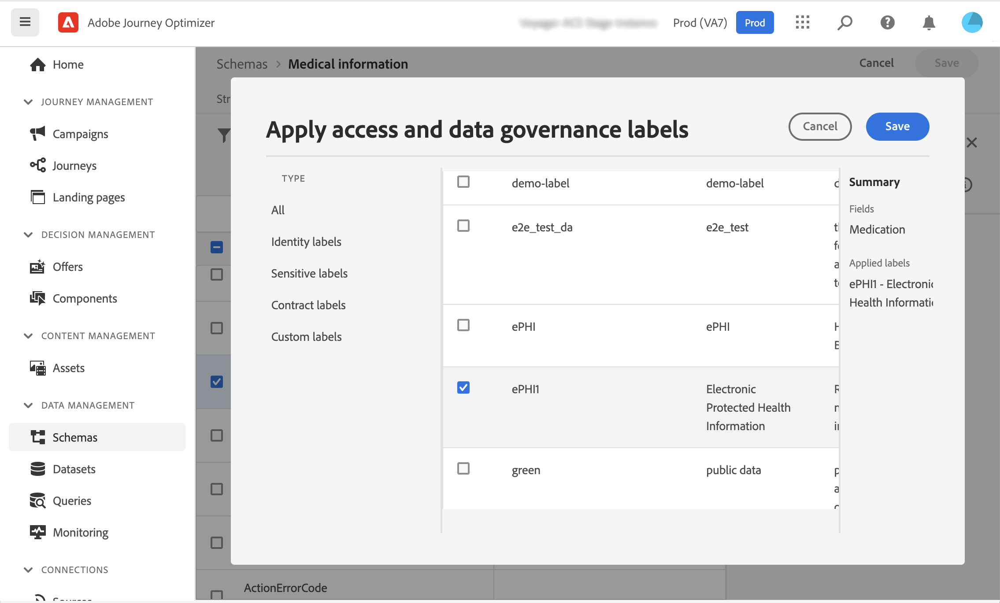

# Datagovernance {#restrict-fields}

>[!IMPORTANT]
>
>Het gebruik van de Etikettering en de Handhaving van het Gebruik van Gegevens (DULE) is momenteel beperkt tot geselecteerde klanten, en zal aan alle milieu&#39;s in een toekomstige versie worden opgesteld.

Met zijn beheerskader voor etikettering en handhaving van gegevensgebruik (DULE) kan Journey Optimizer nu het Adobe Experience Platform-beleid voor governance gebruiken om te voorkomen dat gevoelige velden via aangepaste acties naar systemen van derden worden geëxporteerd. Als het systeem een beperkt veld identificeert in de parameters voor aangepaste handelingen, wordt een fout weergegeven waardoor u de reis niet kunt publiceren.

Met Adobe Experience Platform kunt u labels toewijzen aan uw velden en marketingacties maken voor elk kanaal. Vervolgens definieert u een governancebeleid dat gekoppeld is aan een label en een marketingactie.

In Journey Optimizer kunt u dit beleid toepassen op aangepaste acties om te voorkomen dat bepaalde velden worden geëxporteerd naar systemen van derden.

Raadpleeg de documentatie van Adobe Experience Platform voor meer informatie over het gegevensbeheerkader en over het werken met labels en beleid:

* [ Overzicht van de dienst van het Beheer van Gegevens ](https://experienceleague.adobe.com/docs/experience-platform/data-governance/home.html)
* [ overzicht van de gebruiksetiketten van Gegevens ](https://experienceleague.adobe.com/docs/experience-platform/data-governance/labels/overview.html)
* [ het gebruiksbeleid van Gegevens ](https://experienceleague.adobe.com/docs/experience-platform/data-governance/policies/overview.html)

## Belangrijke opmerkingen {#important-notes}

* Gegevensbeheer is alleen van toepassing op aangepaste handelingen tijdens reizen. Campagne v7/v8 en acties voor Campaigns Standard worden niet ondersteund.
* Het beleid van goed bestuur is slechts van toepassing wanneer een (vereiste of extra) marketing actie op het niveau van de douaneactie wordt geplaatst.

## Beleid inzake governance definiëren {#governance-policies}

U kunt bestaande labels, marketingacties en beleid gebruiken. Hier zijn de belangrijkste configuratiestappen om nieuwe te creëren:

* Voeg een label toe en pas het toe op specifieke velden die u niet wilt exporteren naar systemen van derden, zoals het bloedtype van een persoon.
* Definieer een marketingactie voor elke aangepaste actie van derden die wordt gebruikt tijdens uw reizen.
* Maak een governancebeleid en koppel dit aan de label- en marketingactie.

Voor meer informatie over hoe te om beleid te beheren, verwijs naar deze [ documentatie ](https://experienceleague.adobe.com/docs/experience-platform/data-governance/policies/user-guide.html#consent-policy)

Laten we het voorbeeld nemen van het veld voor het bloedtype dat u als gevoelig moet labelen en dat u niet mag exporteren naar een derde. Hier volgen de verschillende stappen:

1. In het linkermenu, onder **Privacy**, klik **Beleid**.
1. Selecteer het **lusje van Etiketten** en klik **creeer etiket**.
   
1. Definieer een naam en een vriendelijke naam voor dit label. Bijvoorbeeld, _ePHI1_.
1. In het linkermenu, onder **het beheer van Gegevens**, klik **Schema&#39;s**, en klik **toepassen toegang en gegevens governance etiketten** knoop. Selecteer uw schema en gebied (bloedtype) en selecteer het eerder gecreeerde etiket, _ePHI1_ in ons voorbeeld.
   
1. Ga terug naar het **menu van Beleid**, selecteer de **Handeling van de Marketing** tabel en klik **creeer marketing actie**. We raden u aan één marketingactie te maken voor elke aangepaste actie van derden die wordt gebruikt tijdens uw reizen. Bijvoorbeeld, creeer a _Slack marketing actie_ die voor uw Slack douaneactie zal worden gebruikt.
   
1. Selecteer **doorbladeren** lusje, **creeer beleid** en selecteer **het beleid van het Beheer van Gegevens**. Selecteer uw etiket (_ePHI1_) en marketing actie (_Slack marketing actie_).
   

Wanneer u, in een reis zult gebruiken, zal uw Slack douaneactie die met de _Slack marketing actie_ wordt gevormd, zal het bijbehorende beleid leveraged zijn.

## Aangepaste actie configureren {#consent-custom-action}

In het linkermenu, onder **Beleid**, klik **Configuraties** en selecteer **Acties**. Open de aangepaste Slack. Wanneer u een aangepaste handeling configureert, kunnen twee velden worden gebruikt voor gegevensbeheer.

* Het **gebied van het Kanaal** staat u toe om het kanaal met betrekking tot deze douaneactie te selecteren: **E-mail**, **SMS**, of **Druk bericht**. Het zal het **Vereiste marketing actieterrein** met de standaard marketing actie voor het geselecteerde kanaal voorafgaan. Als u **andere** selecteert, zal geen marketing actie door gebrek worden bepaald. In ons voorbeeld, selecteren wij het kanaal **andere**.

* De **Vereiste marketing actie** staat u toe om de marketing actie met betrekking tot uw douaneactie te bepalen. Bijvoorbeeld, als u die douaneactie gebruikt om e-mails te verzenden gebruikend een derde, kunt u **e-mail selecteren richtend**. In ons voorbeeld, selecteren wij de _Slack marketing actie_. Het bestuursbeleid dat met die marketingactie verband houdt, wordt opgehaald en benut.

De andere stappen voor het vormen van een douaneactie zijn gedetailleerd in [ deze sectie ](../action/about-custom-action-configuration.md#consent-management).

## De reis maken {#consent-journey}

In het linkermenu, onder **beheer van de Reis**, klik **Reizen**. Maak uw reis en voeg uw aangepaste actie toe.  Wanneer u de aangepaste handeling tijdens een reis toevoegt, kunt u met verschillende opties gegevensbeheer beheren. Klik **tonen read-only gebieden** om alle parameters te tonen.

Het **Kanaal** en **Vereiste marketing actie**, die wanneer het vormen van de douaneactie wordt bepaald, wordt getoond bij de bovenkant van het scherm. U kunt deze velden niet wijzigen.

U kunt een **Extra marketing actie** bepalen om het type van douaneactie te plaatsen. Hierdoor kunt u het doel van de aangepaste handeling in deze reis definiëren. Naast de vereiste marketingactie, die doorgaans specifiek is voor een kanaal, kunt u een aanvullende marketingactie definiëren die specifiek is voor de aangepaste actie op deze specifieke reis. Bijvoorbeeld: een workout-communicatie, een nieuwsbrief, een fitness-communicatie, enz. Zowel de vereiste marketingactie als de aanvullende marketingactie zijn van toepassing.

In ons voorbeeld maken we geen gebruik van een extra marketingactie.

Als één van de gebieden geëtiketteerd _ePHI1_ (het bloedtypegebied in ons voorbeeld) in de actieparameters wordt ontdekt, wordt een fout getoond, verhinderend u de reis te publiceren.

De andere stappen voor het vormen van een douaneactie in een reis zijn gedetailleerd in [ deze sectie ](../building-journeys/using-custom-actions.md).