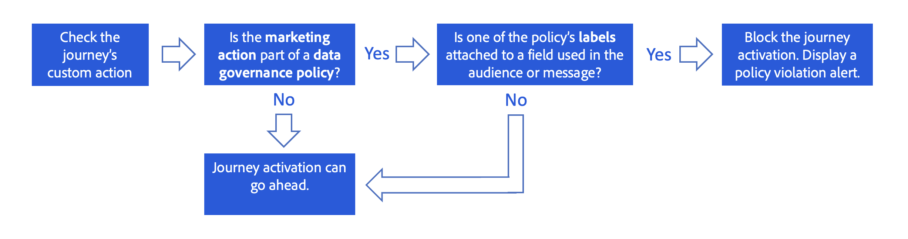

# Datagovernance {#restrict-fields}

>[!CONTEXTUALHELP]
>id="ajo_data_governance_policy_violation"
>title="Overtreding van beleid voor gegevensbeheer"
>abstract="Als het systeem een beperkt veld in een reis/campagne of een aangepaste handeling identificeert, wordt een fout weergegeven die voorkomt dat u deze publiceert. Gebruik het diagram van de gegevenslijn in deze dialoog om te begrijpen welke andere configuratieveranderingen moeten worden aangebracht alvorens u uw reis of campagne kunt activeren."

## Aan de slag met beleid voor gegevensbeheer {#gs}

Met zijn [ kader van de Etikettering en van het Gebruik van Gegevens van 0} (DULE), staat Adobe Experience Platform u toe om het beleid van het gegevensbeheer over uw kanalen te beheren en af te dwingen door ](https://experienceleague.adobe.com/docs/experience-platform/data-governance/home.html){target="_blank"} het etiketteren van uw gebieden **en het creëren van** marketing acties **voor elk kanaal.**

Zodra de etiketten en de marketing acties worden bepaald, kunt u **beleid van het gegevensbeheer** tot stand brengen dat deze twee elementen verbindt. U kunt bijvoorbeeld een beleid instellen dat een ePHI-label koppelt aan een marketingactie &quot;e-mailadressering&quot;, zodat velden met de naam &quot;ePHI&quot; niet worden gebruikt voor het personaliseren van e-mailberichten. [ Leer hoe te om het beleid van het gegevensbeheer te creëren ](#policy)

Nadat u het governancebeleid hebt gemaakt, kunt u de marketingacties toepassen op uw reizen/campagnes en reizen aangepaste acties.
[ Leer hoe te om marketing acties in Journey Optimizer toe te passen ](#apply-marketing-actions)

Wanneer het bouwen van een reis of een campagne, na het selecteren van een kanaalconfiguratie of het toevoegen van een douaneactie, verifieert het systeem of de marketing actie in de configuratie van het berichtkanaal of de douaneactie deel van een beleid van het gegevensbeheer uitmaakt. Als zo, controleren de systemen of om het even welke gebieden van het gerichte publiek of berichtverpersoonlijking door het beleid worden geëtiketteerd en beperkt. Als een dergelijk etiket wordt ontdekt, wordt het publiceren van de reis of de campagne geblokkeerd. [ Leer hoe te om het beleidsschending van het gegevensbeheer te ontdekken ](#violation)

## Labels en marketingacties maken {#labels-marketing-actions}

De eerste stap om het beleid van het gegevensbeheer af te dwingen is etiket te creëren en hen te verbinden aan gebieden waarvoor u gebruik, en marketing acties voor elk van uw kanalen wilt beperken.

1. In het linkermenu, onder **Privacy**, klik **Beleid**.

1. Selecteer het **lusje van Etiketten** en klik **creeer etiket**.

1. Geef een naam en een vriendelijke naam voor het label op. Bijvoorbeeld, _ePHI1_.

1. In het linkermenu, onder **het beheer van Gegevens**, klik **Schema&#39;s**, en klik **toepassen toegang en gegevens governance etiketten** knoop. Selecteer uw schema en gebied (bijvoorbeeld &quot;bloedtype&quot;) en selecteer het eerder gecreeerde etiket, _ePHI1_ in ons voorbeeld.

   

1. Ga terug naar het **menu van Beleid**, selecteer de **Handeling van de Marketing** tabel en klik **creeer marketing actie**. Wij adviseren dat u één marketing actie voor elk kanaal en elke derde douaneactie creeert die in uw reizen wordt gebruikt. Bijvoorbeeld, creeer a _Slack marketing actie_ die voor uw douaneactie van Slack zal worden gebruikt.

   

## Een beleid voor gegevensbeheer maken {#policy}

Nu labels en marketingacties zijn gemaakt, kunt u deze koppelen aan het beleid voor gegevensbeheer. Om dit te doen, selecteer **doorbladeren** lusje, **creeer beleid** en selecteer **het beleid van het Beheer van Gegevens**. Selecteer uw etiket (_ePHI1_) en marketing actie (_Slack marketing actie_).

Wanneer u, in een reis zult gebruiken, uw de douaneactie van Slack die met de _wordt gevormd Slack marketing actie_, zal het bijbehorende beleid leveraged zijn.

## Marketing-acties toepassen in Journey Optimizer {#apply-marketing-actions}

Als u het beleid voor gegevensbeheer wilt afdwingen in Journey Optimizer, moet u marketingacties toepassen op uw reizen, campagnes of aangepaste acties.

### marketingacties toepassen op reizen en campagnes {#journeys-campaigns}

Nadat u beleid hebt gecreeerd, moet u de relevante marketing acties op uw Journey Optimizer **kanaalconfiguraties** toepassen. Ga als volgt te werk om dit te doen:

1. Open het menu **[!UICONTROL Channels]** > **[!UICONTROL General settings]** > **[!UICONTROL Channel configurations]**.

1. Open een bestaande kanaalconfiguratie of maak een nieuwe.

1. Selecteer in het veld **[!UICONTROL Marketing action]** de marketingactie(s) die u aan de reizen/campagnes wilt koppelen met behulp van deze configuratie. Alle beleidsregels voor toestemming en gegevensbeheer in verband met de marketingactie worden benut om de voorkeuren van uw klanten en de beperkingen die zijn ingesteld voor gevoelige gebieden te respecteren. [Meer informatie](../action/consent.md#surface-marketing-actions)

   

1. Voltooi de instelling van de kanaalconfiguratie en sla deze op. [ leer hoe te de configuratie van het opstellingskanaal ](../configuration/channel-surfaces.md).

1. Wanneer het creëren van een bericht in uw reis of campagne, selecteer de relevante kanaalconfiguratie. Voltooi de configuratie van uw reis of campagne en sla deze op.

Voordat het systeem de reis of de campagne activeert, controleert het of de marketingactie in de geselecteerde kanaalconfiguratie deel uitmaakt van een beleid voor gegevensbeheer. Als zo, controleren de systemen of om het even welke gebieden van het gerichte publiek of berichtverpersoonlijking door het beleid worden geëtiketteerd en beperkt.

Als het systeem een beperkt veld identificeert, wordt een fout weergegeven waardoor u de reis of de campagne niet kunt publiceren. [ Leer hoe te om de schending van het governance beleid te ontdekken ](#violation)

{zoomable="yes"}

*de analysestappen van de schending van het Beleid voor reizen en campagnes*

### Marketing toepassen op aangepaste acties {#custom-actions}

>[!NOTE]
>
>Campagne v7/v8 en Campaign Standard-reizen worden niet ondersteund.

Neem het voorbeeld van het bloedtypeveld dat u wilt beperken van het exporteren naar een derde via aangepaste handelingen. Hiervoor moet u de marketingactie toepassen op uw aangepaste actie en vervolgens uw reis maken en er aangepaste actie aan toevoegen.

1. In het linkermenu, onder **Beleid**, klik **Configuraties** en selecteer **Acties**.

1. Open je aangepaste Slack-actie. Wanneer u een aangepaste handeling configureert, kunnen twee velden worden gebruikt voor gegevensbeheer.

   

   * Het **gebied van het Kanaal** staat u toe om het kanaal met betrekking tot deze douaneactie te selecteren. Het vult het **Vereiste marketing actieveld** met de standaard marketing actie voor het geselecteerde kanaal vooraf in. Als u **andere** selecteert, zal geen marketing actie door gebrek worden bepaald. In ons voorbeeld, selecteren wij het kanaal **andere**.

   * De **Vereiste marketing actie** staat u toe om de marketing actie met betrekking tot uw douaneactie te bepalen. Bijvoorbeeld, als u die douaneactie gebruikt om e-mails te verzenden gebruikend een derde, kunt u **e-mail selecteren richtend**. In ons voorbeeld, selecteren wij de _Slack marketing actie_. Het bestuursbeleid dat met die marketingactie verband houdt, wordt opgehaald en benut.

   De andere stappen voor het vormen van een douaneactie zijn gedetailleerd in [ deze sectie ](../action/about-custom-action-configuration.md#consent-management).

1. In het linkermenu, onder **beheer van de Reis**, klik **Reizen**.

1. Maak uw reis en voeg uw aangepaste actie toe. Wanneer u de aangepaste handeling tijdens een reis toevoegt, kunt u met verschillende opties gegevensbeheer beheren. Klik **tonen read-only gebieden** om alle parameters te tonen.

   

   * Het **Kanaal** en **Vereiste marketing actie**, die wanneer het vormen van de douaneactie wordt bepaald, wordt getoond bij de bovenkant van het scherm. U kunt deze velden niet wijzigen.

   * U kunt een **Extra marketing actie** bepalen om het type van douaneactie te plaatsen. Hierdoor kunt u het doel van de aangepaste handeling in deze reis definiëren. Naast de vereiste marketingactie, die doorgaans specifiek is voor een kanaal, kunt u een aanvullende marketingactie definiëren die specifiek is voor de aangepaste actie op deze specifieke reis. Bijvoorbeeld: een workout-communicatie, een nieuwsbrief, een fitness-communicatie, enz. Zowel de vereiste marketingactie als de aanvullende marketingactie zijn van toepassing. In ons voorbeeld maken we geen gebruik van een extra marketingactie.

Als één van de gebieden geëtiketteerd _ePHI1_ (het bloedtypegebied in ons voorbeeld) in de actieparameters wordt ontdekt, wordt een fout getoond, verhinderend u de reis te publiceren. [ Leer hoe te om de schending van het governance beleid te ontdekken ](#violation)

{zoomable="yes"}

*de analysestappen van de schending van het Beleid voor reizen douaneacties*

## Beleidsovertreding detecteren {#violation}

Als het systeem een beperkt veld in een reis/campagne of een aangepaste handeling identificeert, wordt een fout weergegeven die voorkomt dat u deze publiceert.

Fouten zijn zichtbaar via de knop **[!UICONTROL Alerts]** . Selecteer de fout om gedetailleerde informatie over de schending van het gegevensgovernancebeleid te tonen die gebeurde.

Deze dialoog wijst erop dat de huidige reis/campagneconfiguratie een bestaand beleid van het gegevensbeheer schendt. Gebruik het diagram van de gegevenslijn om te begrijpen welke andere configuratieveranderingen moeten worden aangebracht alvorens u uw reis of campagne kunt activeren.

De gedetailleerde informatie is beschikbaar in de [ documentatie van de de schending van het gegevensgebruiksbeleid ](https://experienceleague.adobe.com/en/docs/experience-platform/data-governance/enforcement/auto-enforcement#data-usage-violation){_blank}.
