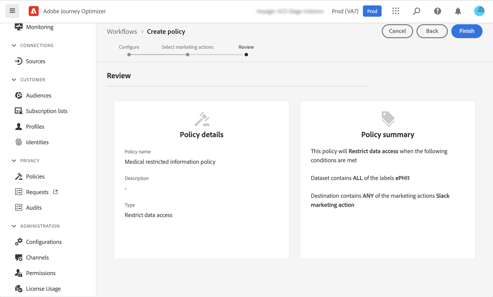

# Data Governance {#restrict-fields}

>[!IMPORTANT]
>
>Het gebruik van de Etikettering en de Handhaving van het Gebruik van Gegevens (DULE) is momenteel beperkt tot geselecteerde klanten, en zal aan alle milieu&#39;s in een toekomstige versie worden opgesteld.

Met zijn beheerskader voor etikettering en handhaving van gegevensgebruik (DULE) kan Journey Optimizer nu het Adobe Experience Platform-beleid voor governance gebruiken om te voorkomen dat gevoelige velden via aangepaste acties naar systemen van derden worden geëxporteerd. Als het systeem een beperkt veld identificeert in de parameters voor aangepaste handelingen, wordt een fout weergegeven waardoor u de reis niet kunt publiceren.

Met Adobe Experience Platform kunt u labels toewijzen aan uw velden en marketingacties maken voor elk kanaal. Vervolgens definieert u een governancebeleid dat gekoppeld is aan een label en een marketingactie.

In Journey Optimizer kunt u dit beleid toepassen op aangepaste acties om te voorkomen dat bepaalde velden worden geëxporteerd naar systemen van derden.

Raadpleeg de documentatie van Adobe Experience Platform voor meer informatie over het gegevensbeheerkader en over het werken met labels en beleid:

* [Overzicht van Data Governance Service](https://experienceleague.adobe.com/docs/experience-platform/data-governance/home.html)
* [Overzicht van labels voor gegevensgebruik](https://experienceleague.adobe.com/docs/experience-platform/data-governance/labels/overview.html?lang=en)
* [Beleid voor gegevensgebruik](https://experienceleague.adobe.com/docs/experience-platform/data-governance/policies/overview.html)

## Belangrijke opmerkingen {#important-notes}

* Gegevensbeheer is alleen van toepassing op aangepaste handelingen tijdens reizen. Campaign Classic- en Campaign Standard-acties worden niet ondersteund.
* Het beleid van goed bestuur is slechts van toepassing wanneer een (vereiste of extra) marketing actie op het niveau van de douaneactie wordt geplaatst.
* Kenmerken die deel uitmaken van een veldgroep die het uit-van-de-doos Schema van de Unie gebruikt, worden niet gesteund. Deze kenmerken worden verborgen in de interface. U moet een andere veldgroep maken met een ander schema.

## Beleid inzake governance definiëren {#governance-policies}

U kunt bestaande labels, marketingacties en beleid gebruiken. Hier zijn de belangrijkste configuratiestappen om nieuwe te creëren:

* Voeg een label toe en pas het toe op specifieke velden die u niet wilt exporteren naar systemen van derden, zoals het bloedtype van een persoon.
* Definieer een marketingactie voor elke aangepaste actie van derden die wordt gebruikt tijdens uw reizen.
* Maak een governancebeleid en koppel dit aan de label- en marketingactie.

Raadpleeg deze voor meer informatie over het beheren van beleidsregels [documentatie](https://experienceleague.adobe.com/docs/experience-platform/data-governance/policies/user-guide.html?lang=en#consent-policy)

Laten we het voorbeeld nemen van het veld voor het bloedtype dat u als gevoelig moet labelen en dat u niet mag exporteren naar een derde. Hier volgen de verschillende stappen:

1. In het linkermenu, onder **Privacy**, klikt u op **Beleid**.
   
1. Selecteer **Labels** en klik op **Label maken**.
   
1. Definieer een naam en een vriendelijke naam voor dit label. Bijvoorbeeld: _ePHI1_.
   
1. In het linkermenu, onder **Gegevensbeheer**, klikt u op **Schemas** en klik op de knop **Toegangs- en gegevensbeheerlabels toepassen** knop. Selecteer uw schema en veld (bloedtype) en selecteer het label dat u eerder hebt gemaakt. _ePHI1_ in ons voorbeeld.
   
1. Ga terug naar de **Beleid** selecteert u de **Handeling** en klik op **Marketing-actie maken**. We raden u aan één marketingactie te maken voor elke aangepaste actie van derden die wordt gebruikt tijdens uw reizen. Laten we bijvoorbeeld een _Slack-marketingactie_ die wordt gebruikt voor uw aangepaste Slack-actie.
   
1. Selecteer **Bladeren** tabblad, klikt u op **Beleid maken** en selecteert u **Beleid inzake gegevensbeheer**. Selecteer uw label (_ePHI1_) en marketingacties (_Slack-marketingactie_).
   

Wanneer u, in een reis zult gebruiken, uw Slack douaneactie die met wordt gevormd _Slack-marketingactie_, zal het bijbehorende beleid hefboomwerking hebben.

## Aangepaste actie configureren {#consent-custom-action}

In het linkermenu, onder **Beheer**, klikt u op **Configuraties** en selecteert u **Handelingen**. Open de aangepaste Slack-actie. Bij het configureren van een aangepaste handeling kunnen twee velden worden gebruikt voor gegevensbeheer.

* De **Kanaal** in het veld kunt u het kanaal selecteren dat betrekking heeft op deze aangepaste handeling: **E-mail**, **SMS**, of **Pushmelding**. De voorinstelling wordt **Vereiste marketingactie** veld met de standaardmarketingactie voor het geselecteerde kanaal. Als u **overige**, wordt standaard geen marketingactie gedefinieerd. In ons voorbeeld selecteren we het kanaal **overige**.

* De **Vereiste marketingactie** Hiermee kunt u de marketingactie definiëren die betrekking heeft op uw aangepaste handeling. Als u bijvoorbeeld die aangepaste handeling gebruikt om e-mailberichten te verzenden via een derde, kunt u **E-mailadres**. In ons voorbeeld selecteren wij _Slack-marketingactie_. Het bestuursbeleid dat met die marketingactie verband houdt, wordt opgehaald en benut.

De andere stappen voor het configureren van een aangepaste handeling worden beschreven in [deze sectie](../action/about-custom-action-configuration.md#consent-management).

## De reis maken {#consent-journey}

In het linkermenu, onder **Reisbeheer**, klikt u op **Reizen**. Maak uw reis en voeg uw aangepaste actie toe.  Wanneer u de aangepaste handeling tijdens een reis toevoegt, kunt u met verschillende opties gegevensbeheer beheren. Klik op de knop **Alleen-lezen velden tonen** om alle parameters weer te geven.

De **Kanaal** en **Vereiste marketingactie**, gedefinieerd tijdens het configureren van de aangepaste handeling, wordt boven in het scherm weergegeven. U kunt deze velden niet wijzigen.

U kunt een **Aanvullende marketingacties** om het type aangepaste handeling in te stellen. Hierdoor kunt u het doel van de aangepaste handeling in deze reis definiëren. Naast de vereiste marketingactie, die doorgaans specifiek is voor een kanaal, kunt u een aanvullende marketingactie definiëren die specifiek is voor de aangepaste actie op deze specifieke reis. Bijvoorbeeld: een workout-communicatie, een nieuwsbrief, een fitness-communicatie, enz. Zowel de vereiste marketingactie als de aanvullende marketingactie zijn van toepassing.

In ons voorbeeld gebruiken we geen aanvullende marketingactie.

Als een van de velden gelabeld is _ePHI1_ (het veld voor het bloedtype in ons voorbeeld) wordt gedetecteerd in de actieparameters, er wordt een fout weergegeven, zodat u de reis niet kunt publiceren.

De andere stappen voor het vormen van een douaneactie in een reis zijn gedetailleerd in [deze sectie](../building-journeys/using-custom-actions.md).
