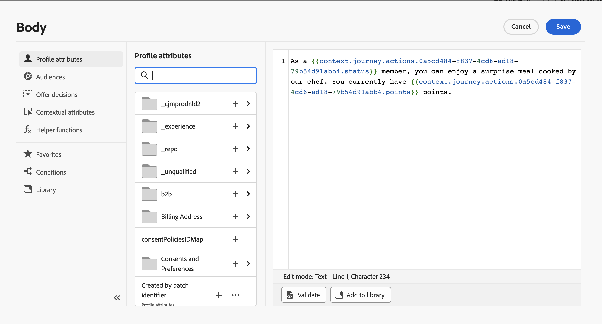

# Verbeteringen voor aangepaste acties

U kunt nu API vraagreacties in douaneacties gebruiken en uw reizen ordenen die op deze reacties worden gebaseerd.

Deze mogelijkheid was alleen beschikbaar bij het gebruik van gegevensbronnen. U kunt deze nu gebruiken met aangepaste handelingen.

>[!AVAILABILITY]
>
>Deze functie is momenteel beschikbaar als een persoonlijke bètaversie.

## De aangepaste handeling definiëren

Bij het definiëren van de aangepaste actie zijn twee verbeteringen beschikbaar gesteld: de toevoeging van de methode GET en het nieuwe veld voor de laadreactie. De andere opties en parameters blijven ongewijzigd. Zie [deze pagina](../action/about-custom-action-configuration.md).

### Eindpuntconfiguratie

De **URL-configuratie** de naam van de sectie is gewijzigd **Eindpuntconfiguratie**.

In de **Methode** vervolgkeuzelijst, kunt u nu selecteren **GET**.

{width="70%" align="left"}

### Payloads

De **Handelingsparameters** de naam van de sectie is gewijzigd **Payloads**. Er zijn twee velden beschikbaar:

* De **Verzoek** veld: dit veld is alleen beschikbaar voor aanroepmethoden van POSTEN en PUTTEN.
* De **Antwoord** veld : dit is de nieuwe mogelijkheid . Dit gebied zoals beschikbaar voor alle roepende methodes.

>[!NOTE]
> 
>Beide velden zijn optioneel.

{width="70%" align="left"}

1. Klik in het dialoogvenster **Antwoord** veld.

   {width="80%" align="left"}

1. Plak een voorbeeld van de lading die door de vraag is teruggekeerd. Controleer of de veldtypen correct zijn (tekenreeks, geheel getal, enz.).

   {width="80%" align="left"}

1. Klikken **Opslaan**.

Telkens wanneer de API wordt aangeroepen, haalt het systeem alle velden op die in het payloadvoorbeeld zijn opgenomen. U kunt op **Een nieuwe lading plakken** als u de huidige lading wilt veranderen.

Hier is een voorbeeld van een antwoordlading die tijdens de vraag aan de dienst van weer API wordt gevangen:

```
{
    "coord": {
        "lon": 2.3488,
        "lat": 48.8534
    },
    "weather": [
        {
            "id": 800,
            "main": "Clear",
            "description": "clear sky",
            "icon": "01d"
        }
    ],
    "base": "stations",
    "main": {
        "temp": 29.78,
        "feels_like": 29.78,
        "temp_min": 29.92,
        "temp_max": 30.43,
        "pressure": 1016,
        "humidity": 31
    },
    "visibility": 10000,
    "wind": {
        "speed": 5.66,
        "deg": 70
    },
    "clouds": {
        "all": 0
    },
    "dt": 1686066467,
    "sys": {
        "type": 1,
        "id": 6550,
        "country": "FR",
        "sunrise": 1686023350,
        "sunset": 1686080973
    },
    "timezone": 7200,
    "id": 2988507,
    "name": "Paris",
    "cod": 200
}
```

## Gebruikmaken van de respons op een reis

Voeg gewoon de aangepaste handeling toe aan een reis. U kunt de ladingsgebieden van de reactie in voorwaarden, andere acties en berichtverpersoonlijking dan gebruiken.

### Voorwaarden en acties

U kunt bijvoorbeeld een voorwaarde toevoegen om de windsnelheid te controleren. Wanneer de persoon de surfshop binnenkomt, kunt u een duw sturen als het weer te vaag is.


In de voorwaarde moet u de geavanceerde editor gebruiken om de velden voor actierespons te gebruiken, onder de **Context** knooppunt.


U kunt ook gebruikmaken van de **jo_status** code om een nieuw pad te maken in het geval van een fout.


>[!WARNING]
>
>Alleen nieuw gemaakte aangepaste handelingen bevatten dit veld uit de doos. Als u deze wilt gebruiken met een bestaande aangepaste handeling, moet u de handeling bijwerken. U kunt bijvoorbeeld de beschrijving bijwerken en opslaan.

Hier volgen de mogelijke waarden voor dit veld:

* http-statuscode: bijvoorbeeld **http_200** of **http_400**
* time-outfout: **timedout**
* Fout bij toewijzen: **afgetopt**
* interne fout: **internalError**

Zie voor meer informatie over reisactiviteiten [deze sectie](../building-journeys/about-journey-activities.md).

### Berichtenpersonalisatie

U kunt uw berichten personaliseren gebruikend de reactiegebieden. In ons voorbeeld, in het dupbericht, personaliseren wij de inhoud gebruikend de snelheidswaarde.



>[!NOTE]
>
>De oproep wordt slechts eenmaal per profiel uitgevoerd op een bepaalde reis. De veelvoudige berichten aan het zelfde profiel zullen geen nieuwe vraag teweegbrengen.

Voor meer informatie over berichtverpersoonlijking, zie [deze sectie](../personalization/personalize.md).

## Expressiesyntaxis

Hier volgt de syntaxis:

```json
#@action{myAction.myField} 
```

Hier volgen enkele voorbeelden:

```json
// action response field
@action{<action name>.<path to the field>}
@action{OpenWeatherMap.main.temp}
```

```json
// action response field
@action{<action name>.<path to the field>, defaultValue: <default value expression>}
@action{OpenWeatherMap.main.temp, defaultValue: 273.15}
@action{OpenWeatherMap.main.temp, defaultValue: @{myEvent.temperature}} 
```

Zie voor meer informatie over veldverwijzingen [deze sectie](../building-journeys/expression/field-references.md).
