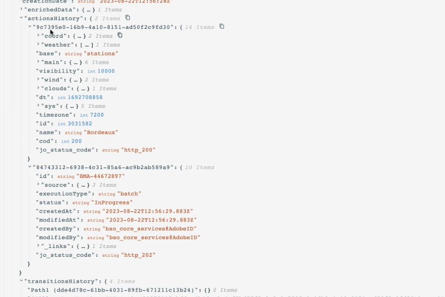

# API-aanroepreacties gebruiken in aangepaste handelingen {#custom-action-enhancements}

U kunt API vraagreacties in douaneacties gebruiken en uw reizen organiseren die op deze reacties worden gebaseerd.

<!--
You can now leverage API call responses in custom actions and orchestrate your journeys based on these responses.

This capability was previously only available when using data sources. You can now use it with custom actions. 
-->

## Belangrijke opmerkingen{#custom-action-enhancements-notes}

<!--
* Custom actions should only be used with private or internal endpoints, and used with an appropriate capping or throttling limit. See [this page](../configuration/external-systems.md). 
-->

* Scalaire arrays worden ondersteund bij een payload als reactie:

  ```
  "dummyScalarArray": [
  "val1",
  "val2"
  ]
  ```

* Heterogene arrays worden niet ondersteund bij een payload als reactie:

  ```
  "dummyRandomArray": [
  20,
  "aafw",
  false
  ]
  ```

<!--
## Best practices{#custom-action-enhancements-best-practices}

A capping limit of 5000 calls/s is defined for all custom actions. This limit has been set based on customers usage, to protect external endpoints targeted by custom actions. You need to take this into account in your audience-based journeys by defining an appropriate reading rate (5000 profiles/s when custom actions are used). If needed, you can override this setting by defining a greater capping or throttling limit through our Capping/Throttling APIs. See [this page](../configuration/external-systems.md).

You should not target public endpoints with custom actions for various reasons:

* Without proper capping or throttling, there is a risk of sending too many calls to a public endpoint that may not support such volume.
* Profile data can be sent through custom actions, so targeting a public endpoint could lead to inadvertently sharing personal information externally.
* You have no control on the data being returned by public endpoints. If an endpoint changes its API or starts sending incorrect information, those will be made available in communications sent, with potential negative impacts.
-->

<!--
## Define the custom action {#define-custom-action}

When defining the custom action, two enhancements have been made available: the addition of the GET method and the new payload response field. The other options and parameters are unchanged. See [this page](../action/about-custom-action-configuration.md).

### Endpoint configuration {#endpoint-configuration}

The **URL configuration** section has been renamed **Endpoint configuration**.

In the **Method** drop-down, you can now select **GET**.

{width="70%" align="left"}

### Payloads {#payloads-new}

The **Action parameters** section has been renamed **Payloads**. Two fields are available:

* The **Request** field: this field is only available for POST and PUT calling methods.
* The **Response** field: this is the new capability. This field as available for all calling methods.

>[!NOTE]
> 
>Both these fields are optional.

{width="70%" align="left"}
-->

## Aangepaste actie configureren {#config-response}

1. Maak de aangepaste handeling. Zie [deze pagina](../action/about-custom-action-configuration.md).

1. Klik binnen het **gebied van de Reactie**.

   {width="80%" align="left"}

1. Plak een voorbeeld van de lading die door de vraag is teruggekeerd. Controleer of de veldtypen correct zijn (tekenreeks, geheel getal, enz.). Hier is een voorbeeld van antwoordlading die tijdens de vraag wordt gevangen. Ons lokale eindpunt verzendt het aantal loyaliteitspunten en de status van een profiel.

   ```
   {
   "customerID" : "xY12hye",    
   "status":"gold",
   "points": 1290 }
   ```

   {width="80%" align="left"}

   Telkens wanneer de API wordt aangeroepen, haalt het systeem alle velden op die in het payload-voorbeeld zijn opgenomen.

1. Laten wij ook CustomerID als vraagparameter toevoegen.

   {width="80%" align="left"}

1. Klik **sparen**.

## De respons in een reis benutten {#response-in-journey}

Voeg gewoon de aangepaste handeling toe aan een reis. U kunt de ladingsgebieden van de reactie in voorwaarden, andere acties en berichtverpersoonlijking dan gebruiken.

U kunt bijvoorbeeld een voorwaarde toevoegen om het aantal loyaliteitspunten te controleren. Wanneer de persoon het restaurant ingaat, verzendt uw lokale eindpunt een vraag met de loyaliteitsinformatie van het profiel. U kunt een push verzenden als het profiel een gouden klant is. En als een fout in de vraag wordt ontdekt, verzend een douaneactie om uw systeembeheerder op de hoogte te brengen.


1. Voeg uw gebeurtenis en de aangepaste handeling Loyalty toe die u eerder hebt gemaakt.

1. Wijs in de aangepaste actie Loyalty de queryparameter voor de klant-id toe aan de profiel-id. Controle de optie **voegt een alternatieve weg in het geval van een onderbreking of een fout** toe.

   

1. In de eerste tak, voeg een voorwaarde toe en gebruik de geavanceerde redacteur aan hefboomwerking de gebieden van de actierespons, onder de **knoop van de Context**.

   

1. Voeg vervolgens uw pushbericht toe en pas uw bericht aan met de responsvelden. In ons voorbeeld, personaliseren wij de inhoud gebruikend het aantal loyaliteitspunten en de klantenstatus. De gebieden van de actierespons zijn beschikbaar onder **Contextuele attributen** > **Journey Orchestration** > **Acties**.

   

   >[!NOTE]
   >
   >Elk profiel dat de douaneactie ingaat zal een vraag teweegbrengen. Zelfs als de reactie altijd het zelfde is, zal de Reizen nog één vraag per profiel uitvoeren.

1. In de onderbreking en foutentak, voeg een voorwaarde en hefboomwerking het ingebouwde {**gebied 0} jo_status_code toe.** In ons voorbeeld gebruiken we de
   **http_400** foutentype. Zie [deze sectie](#error-status).

   ```
   @action{ActionLoyalty.jo_status_code} == "http_400"
   ```

   

1. Voeg een aangepaste actie toe die naar uw organisatie wordt verzonden.

   

## Logboeken van testmodi {#test-mode-logs}

Via de testmodus hebt u toegang tot statuslogboeken die gerelateerd zijn aan aangepaste actieantwoorden. Als u douaneacties met reacties in uw reis hebt bepaald, zult u een **actionsHistory** sectie op die logboeken zien die de nuttige lading tonen door het externe eindpunt (als reactie van die douaneactie) is teruggekeerd. Dit kan zeer nuttig in termen van het zuiveren zijn.



## Foutstatus {#error-status}

Het {**gebied 0} jo_status_code is altijd beschikbaar zelfs wanneer geen antwoordlading wordt bepaald.**

Hier volgen de mogelijke waarden voor dit veld:

* http statuscode: http_`<HTTP API call returned code>`, bijvoorbeeld http_200 of http_400
* timeout fout: **timedout**
* capping fout: **gemapt**
* interne fout: **internalError**

Een actieaanroep wordt als fout beschouwd wanneer de geretourneerde http-code groter is dan 2xx of wanneer een fout optreedt. De reis stroomt naar de specifieke onderbreking of foutentak in dergelijke gevallen.

>[!WARNING]
>
>Slechts omvatten de pas gecreëerde douaneacties het {**gebied 0} jo_status_code uit-van-de-doos.** Als u deze wilt gebruiken met een bestaande aangepaste handeling, moet u de handeling bijwerken. U kunt bijvoorbeeld de beschrijving bijwerken en opslaan.

## Expressiesyntaxis {#exp-syntax}

Hier volgt de syntaxis:

```json
#@action{myAction.myField} 
```

Hier volgen enkele voorbeelden:

```json
 // action response field
 @action{<action name>.<path to the field>}
 @action{ActionLoyalty.status}
```

```json
 // action response field
 @action{<action name>.<path to the field>, defaultValue: <default value expression>}
 @action{ActionLoyalty.points, defaultValue: 0}
 @action{ActionLoyalty.points, defaultValue: @event{myEvent.newPoints}}
```

Tijdens het manipuleren van verzamelingen in een aangepaste actie-reactie kunt u erop vertrouwen dat `currentActionField` toegang heeft tot het huidige item:

```json
count(
@action{MyAction.MyCollection.all(
currentActionField.description == "abc"
)}
)
```

### Aangepaste actierespons gebruiken in native kanalen {#response-in-channels}

U kunt geneste arrays doorlopen via een aangepaste actie in native kanalen (zoals e-mail, push of SMS) met de syntaxis Handlebars. Dit is nuttig wanneer u berichtinhoud met dynamische gegevens van externe systemen moet personaliseren.

Bijvoorbeeld, als uw douaneactie de volgende reactie van een extern systeem terugkeert:

```json
{    
    "id": "84632848268632",    
    "responses": [
        { "productIDs": [1111,2222,3333] },
        { "productIDs": [4444,5555,6666] },
        { "productIDs": [7777,8888,9999] }
    ]
}
```

U kunt de array `responses` en de geneste array `productIDs` doorlopen in een native kanaal (bijvoorbeeld in een e-mail) zoals:

```handlebars
{{#each context.journey.actions.<yourcustomaction>.responses as |res|}}

  {{#each res.productIDs as |productID|}}
    <li>{{productID}}</li>
  {{/each}}

{{/each}}
```

Vervang `<yourcustomaction>` door de werkelijke naam van de aangepaste handeling zoals deze tijdens de rit is geconfigureerd.

## Aanvullende bronnen

Raadpleeg deze pagina’s voor meer informatie:

* [&#x200B; verwijzingen van het Gebied &#x200B;](../building-journeys/expression/field-references.md).
* [Functies voor het beheer van verzamelingen](../building-journeys/expression/collection-management-functions.md)
