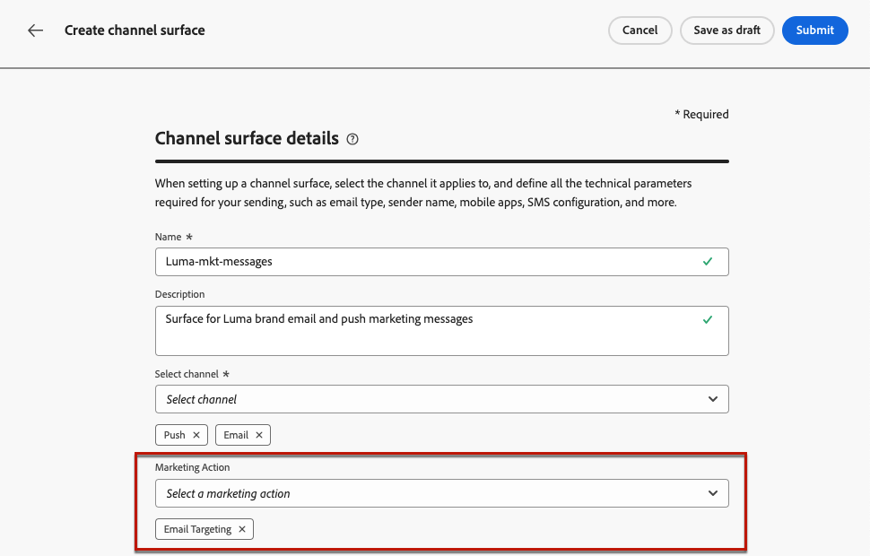

# Werken met toestemmingsbeleid {#consent-management}

Uw gegevens zijn mogelijk onderworpen aan gebruiksbeperkingen die zijn gedefinieerd door uw organisatie of door wettelijke voorschriften. Het is daarom belangrijk ervoor te zorgen dat uw gegevensbewerkingen in Journey Optimizer voldoen aan de [beleid voor gegevensgebruik](https://experienceleague.adobe.com/docs/experience-platform/data-governance/policies/overview.html){target="_blank"}. These policies are Adobe Experience Platform rules defining which [marketing actions](https://experienceleague.adobe.com/docs/experience-platform/data-governance/policies/overview.html#marketing-actions){target="_blank"} u mag gegevens bewerken.

Eén type beleid voor gegevensgebruik is beschikbaar **toestemmingsbeleid**. Met deze services kunt u eenvoudig marketingbeleid toepassen en afdwingen om de voorkeuren voor machtigingen van uw klanten te respecteren. [Meer informatie over beleidshandhaving](https://experienceleague.adobe.com/docs/experience-platform/data-governance/enforcement/auto-enforcement.html){target="_blank"}

>[!IMPORTANT]
>
>Beleid voor toestemming is momenteel alleen beschikbaar voor organisaties die de Adobe hebben aangeschaft **Gezondheidsschild** of **Privacy- en beveiligingsschild** add-on aanbiedingen.

U kunt bijvoorbeeld [beleid voor instemming maken](https://experienceleague.adobe.com/docs/experience-platform/data-governance/policies/user-guide.html#consent-policy){target="_blank"} in Experience Platform om klanten uit te sluiten die niet hebben ingestemd met het ontvangen van e-mail-, push- of SMS-berichten.

* Voor de inheemse uitgaande kanalen (E-mail, Duw, SMS, Directe post), is de logica als volgt:

   * Als een profiel ervoor heeft gekozen geen communicatie van u te ontvangen, wordt het corresponderende profiel standaard uitgesloten van volgende leveringen.

   * Als u over de Adobe beschikt **Gezondheidsschild** of **Privacy- en beveiligingsschild**, kunt u een beleid van de douanetoestemming tot stand brengen dat de standaardlogica met voeten treedt. U kunt bijvoorbeeld een beleid definiëren waarmee alleen e-mailberichten worden verzonden naar alle personen die zich hebben aangemeld. Bij gebrek aan een douanebeleid, is het standaardbeleid van toepassing.

  Om een douanebeleid toe te passen, moet u een marketing actie in dat beleid bepalen en het associëren aan een kanaaloppervlakte. [Meer informatie](#surface-marketing-actions)

Op het niveau van de reis, kunt u toestemmingsbeleid op uw douaneacties toepassen:

* Wanneer **een aangepaste handeling configureren** kunt u een kanaal- en marketingactie definiëren. [Meer informatie](#consent-custom-action)
* Wanneer u het gereedschap **aangepaste actie op reis**, kunt u een extra marketingactie definiëren. [Meer informatie](#consent-journey)

## Gebruik bevestigingsbeleid via kanaaloppervlakken {#surface-marketing-actions}

In [!DNL Journey Optimizer], wordt de toestemming door het Experience Platform afgehandeld [Goedkeuringsschema](https://experienceleague.adobe.com/docs/experience-platform/xdm/field-groups/profile/consents.html){target="_blank"}. By default, the value for the consent field is empty and treated as consent to receive your communications. You can modify this default value while onboarding to one of the possible values listed [here](https://experienceleague.adobe.com/docs/experience-platform/xdm/data-types/consents.html#choice-values){target="_blank"}.

Om de waarde van het toestemmingsgebied te wijzigen, kunt u een beleid van de douanetoestemming tot stand brengen waarin u een marketing actie en de voorwaarden bepaalt waaronder die actie wordt uitgevoerd. [Meer informatie over marketingacties](https://experienceleague.adobe.com/docs/experience-platform/data-governance/policies/overview.html#marketing-actions){target="_blank"}

Als u bijvoorbeeld een toestemmingsbeleid wilt maken om alleen profielen te kiezen die hebben ingestemd met het ontvangen van e-mailberichten, volgt u de onderstaande stappen.

1. Zorg ervoor dat uw organisatie de Adobe heeft aangeschaft **Gezondheidsschild** of **Privacy- en beveiligingsschild** add-on aanbiedingen. [Meer informatie](https://experienceleague.adobe.com/docs/events/customer-data-management-voices-recordings/governance/healthcare-shield.html){target="_blank"}

1. In Adobe Experience Platform maakt u een aangepast beleid (op basis van de **[!UICONTROL Privacy]** > **[!UICONTROL Policies]** ). [Meer informatie](https://experienceleague.adobe.com/docs/experience-platform/data-governance/policies/user-guide.html#create-policy){target="_blank"}

   <!---->

1. Kies de optie **[!UICONTROL Consent policy]** type en vorm als volgt een voorwaarde. [Leer hoe te om toestemmingsbeleid te vormen](https://experienceleague.adobe.com/docs/experience-platform/data-governance/policies/user-guide.html#consent-policy){target="_blank"}

   1. Onder de **[!UICONTROL If]** selecteert u de **[!UICONTROL Email Targeting]** standaard marketing actie.

      <!---->

      >[!NOTE]
      >
      >De belangrijkste marketingacties die door Adobe buiten de box worden geleverd, worden vermeld in [deze tabel](https://experienceleague.adobe.com/docs/experience-platform/data-governance/policies/overview.html?lang=en#core-actions){target="_blank"}. The steps to create a custom marketing action are listed in [this section](https://experienceleague.adobe.com/docs/experience-platform/data-governance/policies/user-guide.html#create-marketing-action){target="_blank"}.

   1. Selecteer wat er gebeurt wanneer de marketingactie van toepassing is. In dit voorbeeld selecteert u **[!UICONTROL Email Marketing Consent]**.

   

1. Opslaan en [enable](https://experienceleague.adobe.com/docs/experience-platform/data-governance/policies/user-guide.html#enable){target="_blank"} dit beleid.

1. Maak in Journey Optimizer een e-mailoppervlak. [Meer informatie](../configuration/channel-surfaces.md#create-channel-surface)

1. Selecteer in de details van het e-mailoppervlak de optie **[!UICONTROL Email Targeting]** marketingactie.

   

Alle toestemmingsbeleid verbonden aan die marketing actie wordt automatisch leveraged om de voorkeur van uw klanten te respecteren.

Daarom in dit voorbeeld: [email](../email/create-email.md) als u dat oppervlak gebruikt in een campagne of een reis, wordt alleen naar de profielen gestuurd die ermee hebben ingestemd e-mails van u te ontvangen. Profielen die geen toestemming hebben gegeven om e-mailberichten te ontvangen, worden uitgesloten.

## Gebruikmaken van beleid voor toestemming via aangepaste handelingen {#journey-custom-actions}

### Belangrijke opmerkingen {#important-notes}

In Journey Optimizer kan toestemming ook worden gebruikt voor aangepaste acties. Als u het met de ingebouwde berichtmogelijkheden wilt gebruiken, moet u een voorwaardenactiviteit gebruiken om klanten in uw reis te filtreren.

Met toestemmingsbeheer worden twee reisactiviteiten geanalyseerd:

* Leespubliek: er wordt rekening gehouden met het opgehaalde publiek.
* Aangepaste actie: bij het beheer van de toestemming wordt rekening gehouden met de gebruikte kenmerken ([actieparameters](../action/about-custom-action-configuration.md#define-the-message-parameters)) en de vastgestelde marketingactie(s) (vereiste marketingactie en aanvullende marketingactie).
* Kenmerken die deel uitmaken van een veldgroep die het uit-van-de-doos Schema van de Unie gebruikt, worden niet gesteund. Deze kenmerken worden verborgen in de interface. U moet een andere veldgroep maken met een ander schema.
* Het beleid voor toestemming is alleen van toepassing wanneer een (vereiste of aanvullende) marketingactie is ingesteld op het niveau van de aangepaste actie.

Alle andere activiteiten die tijdens een reis worden gebruikt, worden niet in aanmerking genomen. Als u uw reis met een kwalificatie van het Publiek begint, wordt het publiek niet in aanmerking genomen.

Als tijdens een reis een profiel door een toestemmingsbeleid in een douaneactie wordt uitgesloten, wordt het bericht niet naar hem verzonden, maar hij gaat door met de reis. Het profiel gaat niet naar de time-out en het foutpad wanneer een voorwaarde wordt gebruikt.

Voordat u het beleid vernieuwt in een aangepaste handeling die op een reis wordt geplaatst, moet u ervoor zorgen dat er geen fouten optreden tijdens de reis.

<!--
There are two types of latency regarding the use of consent policies:

* **User latency**: the delay from the time a profile changes a consent settings to the moment it is applied in Experience Platform. This can take up to 48h. 
* **Consent policy latency**: the delay from the time a consent policy is created or updated to the moment it is applied. This can take up to 6 hours
-->

### De aangepaste handeling configureren {#consent-custom-action}

>[!CONTEXTUALHELP]
>id="ajo_consent_required_marketing_action"
>title="Een vereiste marketingactie definiëren"
>abstract="Met de marketingactie Vereist kunt u de marketingactie definiëren die betrekking heeft op uw aangepaste actie. Als u bijvoorbeeld die aangepaste handeling gebruikt om e-mailberichten te verzenden, kunt u de optie E-mailadres selecteren. Bij gebruik tijdens een reis worden alle toestemmingsbeleid dat met die marketingactie verband houdt, opgehaald en benut. Dit kan niet worden gewijzigd op het canvas."

Wanneer het vormen van een douaneactie, kunnen twee gebieden voor toestemmingsbeheer worden gebruikt.

De **Kanaal** in het veld kunt u het kanaal selecteren dat betrekking heeft op deze aangepaste handeling: **E-mail**, **SMS**, of **Pushmelding**. De voorinstelling is **Vereiste marketingactie** veld met de standaardmarketingactie voor het geselecteerde kanaal. Als u **overige**, wordt er standaard geen marketingactie gedefinieerd.

De **Vereiste marketingactie** Hiermee kunt u de marketingactie definiëren die betrekking heeft op uw aangepaste handeling. Als u bijvoorbeeld die aangepaste handeling gebruikt om e-mailberichten te verzenden, kunt u **E-mailadres**. Bij gebruik tijdens een reis worden alle toestemmingsbeleid dat met die marketingactie verband houdt, opgehaald en benut. Er is een standaardmarketingactie geselecteerd, maar u kunt op de pijl-omlaag klikken om alle beschikbare marketingacties in de lijst te selecteren.

Voor bepaalde soorten belangrijke mededelingen, bijvoorbeeld een transactiebericht wordt verzonden om het wachtwoord van de cliënt terug te stellen die, kunt u geen toestemmingsbeleid willen toepassen. Vervolgens selecteert u **Geen** in de **Vereiste marketingactie** veld.

De andere stappen voor het configureren van een aangepaste handeling worden beschreven in [deze sectie](../action/about-custom-action-configuration.md#consent-management).

### Journey samenstellen {#consent-journey}

>[!CONTEXTUALHELP]
>id="ajo_consent_required_marketing_action_canvas"
>title="Vereiste marketingactie"
>abstract="Een vereiste marketingactie wordt gedefinieerd tijdens het maken van een aangepaste handeling. Deze vereiste marketingactie kan niet uit de actie worden verwijderd of gewijzigd."

>[!CONTEXTUALHELP]
>id="ajo_consent_additional_marketing_action_canvas"
>title="Aanvullende marketingacties"
>abstract="Voeg nog een marketingactie toe naast de vereiste actie. Het beleid van de toestemming met betrekking tot beide marketing acties zal worden afgedwongen."

>[!CONTEXTUALHELP]
>id="ajo_consent_refresh_policies_canvas"
>title="Beleid voor visualisatie van toestemmingen dat tijdens runtime wordt toegepast"
>abstract="Handelingen voor het in de handel brengen zorgen voor een toestemmingsbeleid waarin handelingsparameters en afzonderlijke waarden voor profieltoestemming worden gecombineerd om gebruikers uit te filteren. Haal de nieuwste definitie van dit beleid op door op de knop voor vernieuwen te klikken."

Wanneer u de aangepaste handeling tijdens een reis toevoegt, kunt u de toestemming op verschillende manieren beheren. Klik op de knop **Alleen-lezen velden tonen** alle parameters weergeven.

De **Kanaal** en **Vereiste marketingactie**, gedefinieerd tijdens het configureren van de aangepaste handeling, wordt boven in het scherm weergegeven. U kunt deze velden niet wijzigen.

U kunt een **Aanvullende marketingacties** om het type aangepaste handeling in te stellen. Hierdoor kunt u het doel van de aangepaste handeling in deze reis definiëren. Naast de vereiste marketingactie, die doorgaans specifiek is voor een kanaal, kunt u een aanvullende marketingactie definiëren die specifiek is voor de aangepaste actie op deze specifieke reis. Bijvoorbeeld: een workout-communicatie, een nieuwsbrief, een fitness-communicatie, enz. Zowel de vereiste marketingactie als de aanvullende marketingactie zijn van toepassing.

Klik op de knop **Beleid vernieuwen** onder aan het scherm om de lijst met beleidsregels bij te werken en te controleren die in aanmerking zijn genomen voor deze aangepaste handeling. Dit is uitsluitend bedoeld voor informatiedoeleinden, terwijl een reis wordt gemaakt. Bij live reizen wordt het beleid voor toestemming elke zes uur automatisch opgehaald en bijgewerkt.

<!--
The following data is taken into account for consent:

* marketing actions and additional marketing actions defined in the custom action
* action parameters defined in the custom action, see this [section](../action/about-custom-action-configuration.md#define-the-message-parameters) 
* attributes used as criteria in a segment when the journey starts with a Read segment, see this [section](../building-journeys/read-audience.md) 

>[!NOTE]
>
>Please note that there can be a latency when updating the list of policies applied, refer to this [this section](../action/consent.md#important-notes).
-->

De andere stappen voor het vormen van een douaneactie in een reis zijn gedetailleerd in [deze sectie](../building-journeys/using-custom-actions.md).
