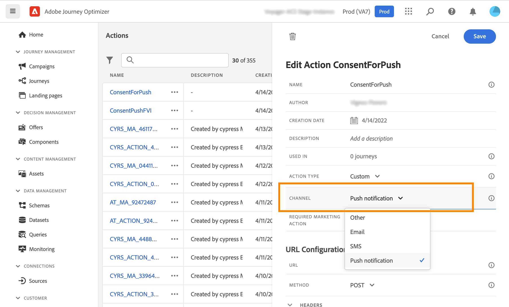

# Werken met toestemmingsbeleid {#consent-management}

Uw gegevens zijn mogelijk onderworpen aan gebruiksbeperkingen die zijn gedefinieerd door uw organisatie of door wettelijke voorschriften. Het is daarom belangrijk om ervoor te zorgen dat uw gegevensverrichtingen binnen Journey Optimizer met [&#x200B; beleid van het gegevensgebruik &#x200B;](https://experienceleague.adobe.com/docs/experience-platform/data-governance/policies/overview.html){target="_blank"} volgzaam zijn. Dit beleid is Adobe Experience Platform-regels die bepalen welke marketingacties u mag uitvoeren op gegevens.

Als een profiel ervoor heeft gekozen geen communicatie van u te ontvangen, wordt het corresponderende profiel standaard uitgesloten van volgende leveringen. U kunt a **toestemmingsbeleid** tot stand brengen dat deze standaardlogica met voeten treedt. U kunt bijvoorbeeld een toestemmingsbeleid in Experience Platform maken om klanten uit te sluiten die niet hebben ingestemd met het ontvangen van communicatie voor een bepaald kanaal. Bij gebrek aan een douanebeleid, is het standaardbeleid van toepassing.

>[!IMPORTANT]
>
>Het toestemmingsbeleid is momenteel slechts beschikbaar voor organisaties die het 3&rbrace; toe:voegen-op dienstenaanbod van het Schild van de Gezondheidszorg van Adobe **of** of **Privacy en van het Schild van de Veiligheid &lbrace;hebben gekocht.**

De belangrijkste stappen voor de toepassing van het toestemmingsbeleid zijn:

1. In Adobe Experience Platform een toestemmingsbeleid maken met een bijbehorende marketingactie. [&#x200B; leer hoe te om een toestemmingsbeleid tot stand te brengen &#x200B;](https://experienceleague.adobe.com/docs/experience-platform/data-governance/policies/user-guide.html#consent-policy){target="_blank"}

2. Pas toestemmingsbeleid in Adobe Journey Optimizer toe gebruikend kanaalconfiguraties of reis douaneacties.

   * Creeer een kanaalconfiguratie met een bijbehorende marketing actie. Wanneer het creëren van een mededeling gebruikend de kanaalconfiguratie, zal het de marketing actie erven die is geassocieerd en het overeenkomstige toestemmingsbeleid toepassen dat in Adobe Experience Platform wordt bepaald. [&#x200B; leer hoe te hefboomwerking toestemmingsbeleid door kanaalconfiguraties &#x200B;](#surface-marketing-actions)

   * Op reisniveau kunt u:

      * Koppel een kanaal en een marketingactie aan een aangepaste handeling wanneer u deze configureert. [&#x200B; Leer hoe te hefboomwerking toestemmingsbeleid wanneer het vormen van een douaneactie &#x200B;](#consent-custom-action)
      * Definieer een extra marketingactie wanneer u een aangepaste actie voor een rit toevoegt. [&#x200B; Leer hoe te hefboomwerking toestemmingsbeleid wanneer het toevoegen van een douaneactie in een reis &#x200B;](#consent-journey)

## Gebruikt toestemmingsbeleid door kanaalconfiguraties {#surface-marketing-actions}

In [!DNL Journey Optimizer], wordt de toestemming behandeld door het schema van de Experience Platform [&#x200B; Toestemming &#x200B;](https://experienceleague.adobe.com/docs/experience-platform/xdm/field-groups/profile/consents.html){target="_blank"}. Standaard is de waarde voor het veld voor toestemming leeg en wordt deze behandeld als toestemming voor het ontvangen van uw communicatie. U kunt deze standaardwaarde wijzigen terwijl het aan een van de mogelijke hier vermelde waarden [&#x200B; &#x200B;](https://experienceleague.adobe.com/docs/experience-platform/xdm/data-types/consents.html#choice-values){target="_blank"}.

Om de waarde van het toestemmingsgebied te wijzigen, kunt u een beleid van de douanetoestemming tot stand brengen waarin u een marketing actie en de voorwaarden bepaalt waaronder die actie wordt uitgevoerd. [&#x200B; leer meer over marketing acties &#x200B;](https://experienceleague.adobe.com/docs/experience-platform/data-governance/policies/overview.html#marketing-actions){target="_blank"}

Als u bijvoorbeeld een toestemmingsbeleid wilt maken om alleen profielen te kiezen die hebben ingestemd met het ontvangen van e-mailberichten, volgt u de onderstaande stappen.

1. Zorg ervoor uw organisatie het 3&rbrace; toe:voegen-op dienstenaanbod van het Schild van de Gezondheidszorg van Adobe **of** Privacy en van het Schild van de Veiligheid &lbrace;heeft gekocht. **&#x200B;**&#x200B;[Meer informatie](https://experienceleague.adobe.com/docs/events/customer-data-management-voices-recordings/governance/healthcare-shield.html){target="_blank"}

1. Maak in Adobe Experience Platform een aangepast beleid (via het menu **[!UICONTROL Privacy]** > **[!UICONTROL Policies]** ). [&#x200B; leer hoe &#x200B;](https://experienceleague.adobe.com/docs/experience-platform/data-governance/policies/user-guide.html#create-policy){target="_blank"}

   <!---->

1. Kies het type **[!UICONTROL Consent policy]** en configureer een voorwaarde als volgt. [&#x200B; leer hoe te om toestemmingsbeleid te vormen &#x200B;](https://experienceleague.adobe.com/docs/experience-platform/data-governance/policies/user-guide.html#consent-policy){target="_blank"}

   1. Selecteer onder de sectie **[!UICONTROL If]** de standaardmarketingactie van **[!UICONTROL Email Targeting]** .

      <!---->

      >[!NOTE]
      >
      >De kern marketing acties die uit-van-de-doos door Adobe worden verstrekt zijn vermeld in [&#x200B; deze lijst &#x200B;](https://experienceleague.adobe.com/docs/experience-platform/data-governance/policies/overview.html?lang=en#core-actions){target="_blank"}. De stappen om een douanemarketing actie tot stand te brengen zijn vermeld in [&#x200B; deze sectie &#x200B;](https://experienceleague.adobe.com/docs/experience-platform/data-governance/policies/user-guide.html#create-marketing-action){target="_blank"}.

   1. Selecteer wat er gebeurt wanneer de marketingactie van toepassing is. Selecteer in dit voorbeeld **[!UICONTROL Email Marketing Consent]** .

   

1. Sparen en [&#x200B; laat &#x200B;](https://experienceleague.adobe.com/docs/experience-platform/data-governance/policies/user-guide.html#enable){target="_blank"} dit beleid toe.

1. Maak in Journey Optimizer een configuratie voor een e-mailkanaal. [&#x200B; leer hoe &#x200B;](../configuration/channel-surfaces.md#create-channel-surface)

1. Selecteer de marketingactie **[!UICONTROL Email Targeting]** in de configuratiedetails voor e-mail.

   

Alle toestemmingsbeleid verbonden aan die marketing actie wordt automatisch leveraged om de voorkeur van uw klanten te respecteren.

Daarom in dit voorbeeld, wordt om het even welke [&#x200B; e-mail &#x200B;](../email/create-email.md) die die configuratie in een campagne of een reis gebruiken slechts verzonden naar de profielen die toestemming hebben gegeven om e-mail van u te ontvangen. Profielen die geen toestemming hebben gegeven om e-mailberichten te ontvangen, worden uitgesloten.

## Gebruikmaken van beleid voor toestemming via aangepaste handelingen {#journey-custom-actions}

### Belangrijke opmerkingen {#important-notes}

In Journey Optimizer kan toestemming ook worden gebruikt voor aangepaste acties. Als u het met de ingebouwde berichtmogelijkheden wilt gebruiken, moet u een voorwaardenactiviteit gebruiken om klanten in uw reis te filtreren.

Met toestemmingsbeheer worden twee reisactiviteiten geanalyseerd:

* Leespubliek: er wordt rekening gehouden met het opgehaalde publiek.
* De actie van de douane: het toestemmingsbeheer neemt de gebruikte attributen ([&#x200B; actieparameters &#x200B;](../action/about-custom-action-configuration.md#define-the-message-parameters)) evenals de marketing actie(s) die (vereiste marketing actie en extra marketing actie) wordt bepaald in aanmerking.
* Kenmerken die deel uitmaken van een veldgroep die het uit-van-de-doos Schema van de Unie gebruikt, worden niet gesteund. Deze kenmerken worden verborgen in de interface. U moet een andere veldgroep maken met een ander schema.
* Het beleid voor toestemming is alleen van toepassing wanneer een (vereiste of aanvullende) marketingactie is ingesteld op het niveau van de aangepaste actie.

Alle andere activiteiten die tijdens een reis worden gebruikt, worden niet in aanmerking genomen. Als u uw reis met een kwalificatie van het Publiek begint, wordt het publiek niet in aanmerking genomen.

Als tijdens een reis een profiel door een toestemmingsbeleid in een douaneactie wordt uitgesloten, wordt het bericht niet naar hem verzonden, maar hij gaat door met de reis. Het profiel gaat niet naar de time-out en het foutpad wanneer een voorwaarde wordt gebruikt.

Voordat u het beleid vernieuwt in een aangepaste handeling die op een reis wordt geplaatst, moet u ervoor zorgen dat er geen fouten optreden tijdens de reis.

<!--
There are two types of latency regarding the use of consent policies:

* **User latency**: the delay from the time a profile changes a consent settings to the moment it is applied in Experience Platform. This can take up to 48h. 
* **Consent policy latency**: the delay from the time a consent policy is created or updated to the moment it is applied. This can take up to 6 hours
-->

### Gebruikt toestemmingsbeleid wanneer het vormen van een douaneactie{#consent-custom-action}

Wanneer het vormen van een douaneactie, kunnen twee gebieden voor toestemmingsbeheer worden gebruikt.

Het **gebied van het Kanaal** staat u toe om het kanaal met betrekking tot deze douaneactie te selecteren. Het vult het **Vereiste marketing actieveld** met de standaard marketing actie voor het geselecteerde kanaal vooraf in. Als u **andere** selecteert, wordt geen marketing actie bepaald door gebrek.

De **Vereiste marketing actie** staat u toe om de marketing actie met betrekking tot uw douaneactie te bepalen. Bijvoorbeeld, als u die douaneactie gebruikt om e-mail te verzenden, kunt u **e-mail selecteren richtend**. Bij gebruik tijdens een reis worden alle toestemmingsbeleid dat met die marketingactie verband houdt, opgehaald en benut. Er is een standaardmarketingactie geselecteerd, maar u kunt op de pijl-omlaag klikken om alle beschikbare marketingacties in de lijst te selecteren.

Voor bepaalde soorten belangrijke mededelingen, bijvoorbeeld een transactiebericht wordt verzonden om het wachtwoord van de cliënt terug te stellen die, kunt u geen toestemmingsbeleid willen toepassen. U zult dan **niets** op het **Vereiste marketing actie** gebied selecteren.

De andere stappen voor het vormen van een douaneactie zijn gedetailleerd in [&#x200B; deze sectie &#x200B;](../action/about-custom-action-configuration.md#consent-management).

### Gebruikt toestemmingsbeleid wanneer het toevoegen van een douaneactie in een reis {#consent-journey}

Wanneer u de aangepaste handeling tijdens een reis toevoegt, kunt u de toestemming op verschillende manieren beheren. Klik **tonen read-only gebieden** om alle parameters te tonen.

Het **Kanaal** en **Vereiste marketing actie**, die wanneer het vormen van de douaneactie wordt bepaald, wordt getoond bij de bovenkant van het scherm. U kunt deze velden niet wijzigen.

U kunt een **Extra marketing actie** bepalen om het type van douaneactie te plaatsen. Hierdoor kunt u het doel van de aangepaste handeling in deze reis definiëren. Naast de vereiste marketingactie, die doorgaans specifiek is voor een kanaal, kunt u een aanvullende marketingactie definiëren die specifiek is voor de aangepaste actie op deze specifieke reis. Bijvoorbeeld: een workout-communicatie, een nieuwsbrief, een fitness-communicatie, enz. Zowel de vereiste marketingactie als de aanvullende marketingactie zijn van toepassing.

Klik **verfrissen beleid** knoop, bij de bodem van het scherm, om de lijst van beleid bij te werken en te controleren dat in overweging wordt genomen voor deze douaneactie. Dit is uitsluitend bedoeld voor informatiedoeleinden, terwijl een reis wordt gemaakt. Bij live reizen wordt het beleid voor toestemming elke zes uur automatisch opgehaald en bijgewerkt.

<!--
The following data is taken into account for consent:

* marketing actions and additional marketing actions defined in the custom action
* action parameters defined in the custom action, see this [section](../action/about-custom-action-configuration.md#define-the-message-parameters) 
* attributes used as criteria in a segment when the journey starts with a Read segment, see this [section](../building-journeys/read-audience.md) 

>[!NOTE]
>
>Please note that there can be a latency when updating the list of policies applied, refer to this [this section](../action/consent.md#important-notes).
-->

De andere stappen voor het vormen van een douaneactie in een reis zijn gedetailleerd in [&#x200B; deze sectie &#x200B;](../building-journeys/using-custom-actions.md).
