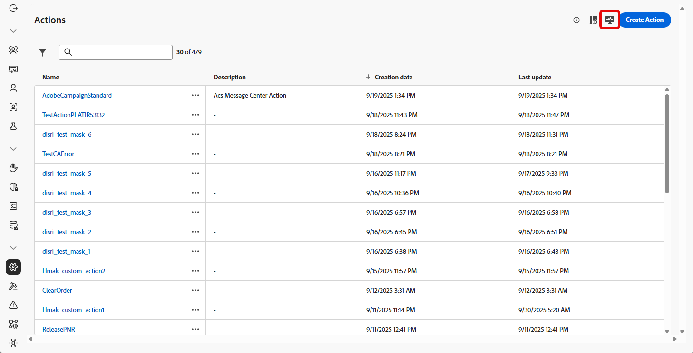
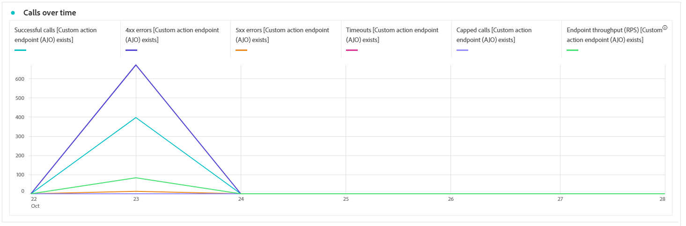

# Aangepaste acties controleren {#reporting}

>[!CONTEXTUALHELP]
>id="ajo_campaigns_custom_actions_monitor"
>title="Aangepaste acties controleren"
>abstract="Met de rapportpagina van **[!UICONTROL Custom action]** kunt u de prestaties en betrouwbaarheid van API-aanroepen bijhouden die uw reizen naar systemen van derden maken."

>[!AVAILABILITY]
>
>Rapportage voor aangepaste acties is momenteel alleen beschikbaar voor een set organisaties (beperkte beschikbaarheid).

Met de rapportpagina van **[!UICONTROL Custom action]** kunt u de betrouwbaarheid en prestaties controleren van API-aanroepen die tijdens uw reizen naar systemen van derden zijn gemaakt. Deze rapporten helpen u snel integratiekwesties, latentieknelpunten, of het vertragen/het begrenzen identificeren die levering kunnen beïnvloeden.

De pagina met de rapportage van de aangepaste actie werkt net als andere All-time rapporten in Journey Optimizer. Voor details op dashboardfunctionaliteit, verwijs naar [&#x200B; deze documentatie &#x200B;](../reports/report-cja-manage.md).

Als u de **[!UICONTROL Custom action]** -rapportpagina wilt openen, klikt u op  vanaf de **[!UICONTROL Actions]** -startpagina.

➡️ [&#x200B; Leer meer op hoe te om u de acties van de Douane te vormen &#x200B;](../action/about-custom-action-configuration.md)

## KPI&#39;s {#kpis}

De **[!UICONTROL Custom action]** Belangrijkste Indicatoren van Prestaties (KPIs) dienen als gecentraliseerd dashboard, dat een geconsolideerde mening van de operationele gezondheid en de betrouwbaarheid van uw vraag van de douaneactie verstrekt. Met deze maatstaven kunt u de prestaties evalueren, knelpunten identificeren en zorgen voor stabiele integratie met externe systemen.

+++ Meer informatie over KPI&#39;s voor aangepaste handelingen

* **[!UICONTROL Successful calls]**: Het totale aantal HTTP-aanroepen dat een geldige reactie zonder fout heeft geretourneerd.

* **[!UICONTROL 4xx/5xx errors]**: Aantal mislukte aanroepen als gevolg van client-side (4xx) of server-side (5xx) fouten, die configuratiekwesties of eindpuntfouten benadrukken.

* **[!UICONTROL Timeouts]**: Aantal aanroepen dat is mislukt omdat ze de maximale responstijd overschrijden. Dit helpt problemen met de latentie of prestaties van het oppervlak met externe eindpunten.

* **[!UICONTROL Capped calls]**: Het aantal aanroepen dat is geblokkeerd vanwege plafondbeperkingen, zodat downstreamsystemen niet worden overbelast.

* **[!UICONTROL Average RPS]**: aantal aanvragen per seconde dat door de aangepaste handeling over het geselecteerde tijdbereik wordt verwerkt.

+++

## Oproepen overuren {#calls}

De **[!UICONTROL Calls overtime]** grafiek toont de HTTP vraagKPI trend over de tijdspanne die voor het rapport wordt geselecteerd. De korreligheid van de tijdreeks is afhankelijk van het geselecteerde tijdbereik. Bijvoorbeeld:

* Voor een 7 dagrapport, zal elk gegevenspunt KPIs voor één dag tonen.
* Als u een tijdbereik van 1 dag selecteert, worden de KPI&#39;s per uur weergegeven in de grafiek.
* Als u een tijdbereik van 1 uur selecteert, worden in de grafiek de PKI&#39;s per minuut weergegeven.

➡️[&#x200B; zie de sectie KPIs voor een beschrijving van de metriek van de vraag van HTTP &#x200B;](#kpis)

## Uitsplitsing naar oproep {#breakdown}

De **[!UICONTROL Calls breakdown]** lijst verstrekt een hiërarchische verdeling van de metriek van de vraag van HTTP, van de algemene metriek per eindpunt op het hoogste niveau aan de metriek per Actie van de Douane die elk eindpunt tot de reizen gebruikt die op hen op het bodemniveau baseren.

➡️[&#x200B; zie de sectie KPIs voor een beschrijving van de metriek van de vraag van HTTP &#x200B;](#kpis)

