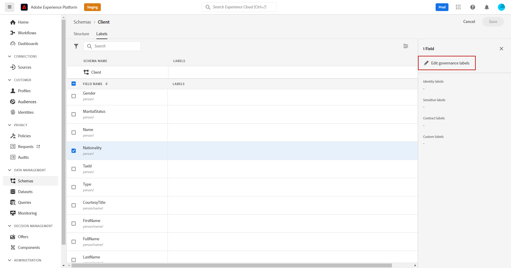

# Toegangsbeheer op basis van kenmerken {#attribute-based-access}

Het op attribuut-gebaseerde toegangsbeheervermogen staat u toe om toestemmingen te bepalen om gegevenstoegang voor specifieke teams of groepen gebruikers te beheren. Het doel is gevoelige digitale activa te beschermen tegen ongeoorloofde gebruikers en zo persoonsgegevens verder te beschermen.

Gebruik het op attribuut-gebaseerde toegangsbeheer in Adobe Journey Optimizer om gegevens te beschermen en specifieke toegang tot specifieke gebiedselementen met inbegrip van de schema&#39;s van de Gegevens van de Ervaring te verlenen het Model (XDM), de attributen van het Profiel, en publiek.

Voor een meer gedetailleerde lijst van de terminologie die met op attribuut-gebaseerde toegangscontrole wordt gebruikt, verwijs naar [&#x200B; documentatie van Adobe Experience Platform &#x200B;](https://experienceleague.adobe.com/docs/experience-platform/access-control/abac/overview.html?lang=nl-NL){target="_blank"}.

In dit voorbeeld, wordt een etiket toegevoegd aan het **het schemagebied van de Nationaliteit** om onbevoegde gebruikers te beperken van het gebruiken van het. Voer de volgende stappen uit om dit te laten werken:

1. Maak een nieuwe **[!UICONTROL Role]** en wijs deze met de bijbehorende **[!UICONTROL Label]** toe zodat gebruikers het schemaveld kunnen openen en gebruiken.

1. Wijs a **[!UICONTROL Label]** aan het **Nationaliteit** schemagebied in Adobe Experience Platform toe.

1. Gebruik **[!UICONTROL Schema field]** in Adobe Journey Optimizer.

**[!UICONTROL Roles]** , **[!UICONTROL Policies]** en **[!UICONTROL Products]** kunnen ook worden benaderd met de op kenmerken gebaseerde API voor toegangsbeheer. Voor meer informatie, verwijs naar deze [&#x200B; documentatie &#x200B;](https://experienceleague.adobe.com/docs/experience-platform/access-control/abac/abac-api/overview.html?lang=nl-NL){target="_blank"}.

## Een rol maken en labels toewijzen {#assign-role}

>[!IMPORTANT]
>
>&#x200B;>Maak een beleid voordat u machtigingen voor een rol beheert. Voor meer informatie, verwijs naar [&#x200B; documentatie van Adobe Experience Platform &#x200B;](https://experienceleague.adobe.com/docs/experience-platform/access-control/abac/permissions-ui/policies.html?lang=nl-NL){target="_blank"}.

**[!UICONTROL Roles]** is een reeks gebruikers die dezelfde machtigingen, labels en sandboxen binnen uw organisatie hebben. Elke gebruiker die tot een **[!UICONTROL Role]** behoort, heeft recht op de Adobe-apps en -services in het product. U kunt ook uw eigen **[!UICONTROL Roles]** maken om de toegang van gebruikers tot bepaalde functies of objecten in de interface te verfijnen.

Om geselecteerde gebruikers toegang tot het **gebied van de Nationaliteit** geëtiketteerd C2 te verlenen, creeer een nieuwe **[!UICONTROL Role]** met een specifieke reeks gebruikers en geef hen het etiket C2, toestaand hen om de **Nationaliteit** details in a **[!UICONTROL Journey]** te gebruiken.

1. Selecteer in het product [!DNL Permissions] de optie **[!UICONTROL Role]** in het menu van het linkerdeelvenster en klik op **[!UICONTROL Create role]** . U kunt ook **[!UICONTROL Label]** toevoegen aan ingebouwde rollen.

   

1. Voeg hier een **[!UICONTROL Name]** en **[!UICONTROL Description]** toe aan uw nieuwe **[!UICONTROL Role]** . Dit is een demografische beperking voor de rol.

1. Selecteer in de vervolgkeuzelijst de **[!UICONTROL Sandbox]** .

   

1. Klik in het menu **[!UICONTROL Resources]** op **[!UICONTROL Adobe Experience Platform]** om de verschillende mogelijkheden te openen. Hier selecteren we **[!UICONTROL Journeys]** .

   

1. Selecteer in de vervolgkeuzelijst de **[!UICONTROL Permissions]** die aan de geselecteerde functie, zoals **[!UICONTROL View journeys]** of **[!UICONTROL Publish journeys]** , is gekoppeld.

   

1. Nadat u het zojuist gemaakte bestand hebt opgeslagen **[!UICONTROL Role]** , klikt u op **[!UICONTROL Properties]** om de toegang tot uw rol verder te configureren.

   

1. Klik op het tabblad **[!UICONTROL Users]** op **[!UICONTROL Add users]**.

   

1. Selecteer op het tabblad **[!UICONTROL Labels]** de optie **[!UICONTROL Add label]**.

   

1. Selecteer **[!UICONTROL Labels]** u aan uw rol wilt toevoegen en **[!UICONTROL Save]** klikken. Voor dit voorbeeld, verstrek het etiket C2 voor gebruikers om tot het eerder beperkte gebied van het schema toegang te hebben.

   

De gebruikers in de **Beperkte rol demografische** rol hebben nu toegang tot de C2-geëtiketteerde voorwerpen.

## Labels toewijzen aan een object in Adobe Experience Platform {#assign-label}

>[!WARNING]
>
>Het onjuiste etiketgebruik kan toegang voor mensen breken en beleidsschendingen teweegbrengen.

**[!UICONTROL Labels]** kan worden gebruikt om specifieke eigenschapgebieden toe te wijzen gebruikend op attributen-gebaseerd toegangsbeheer. In dit voorbeeld, is de toegang tot het **gebied van de Nationaliteit** beperkt. Dit veld is alleen toegankelijk voor gebruikers met de bijbehorende **[!UICONTROL Label]** die aan hun **[!UICONTROL Role]** zijn toegewezen.

U kunt ook **[!UICONTROL Label]** toevoegen aan **[!UICONTROL Schema]** , **[!UICONTROL Datasets]** en **[!UICONTROL Audiences]** .

1. Maak uw **[!UICONTROL Schema]** . Voor meer informatie, verwijs naar [&#x200B; deze documentatie &#x200B;](https://experienceleague.adobe.com/docs/experience-platform/xdm/schema/composition.html?lang=nl-NL){target="_blank"}.

   

1. In onlangs gecreeerd **[!UICONTROL Schema]**, voegen wij eerst de **[!UICONTROL Demographic details]** gebiedsgroep toe die het **gebied van de Nationaliteit** bevat.

   

1. Van het **[!UICONTROL Labels]** lusje, controleer de beperkte gebiedsnaam, hier **Nationaliteit**. Selecteer vervolgens **[!UICONTROL Edit governance labels]** in het menu van het rechterdeelvenster.

    uit

1. Selecteer de corresponderende **[!UICONTROL Label]**, in dit geval de C2 - Gegevens kunnen niet naar een derde worden geëxporteerd. Voor de gedetailleerde lijst van beschikbare etiketten, verwijs naar [&#x200B; deze pagina &#x200B;](https://experienceleague.adobe.com/docs/experience-platform/data-governance/labels/reference.html?lang=nl-NL#contract-labels){target="_blank"}.

   

1. Pas het schema indien nodig verder aan en schakel het in. Voor gedetailleerde stappen op hoe te om uw schema toe te laten, verwijs naar deze [&#x200B; pagina &#x200B;](https://experienceleague.adobe.com/docs/experience-platform/xdm/ui/resources/schemas.html?lang=nl-NL#profile){target="_blank"}.

Het gebied van uw schema zal nu slechts zichtbaar en bruikbaar door gebruikers zijn die deel van een rol die met het C2 etiket wordt geplaatst. Door a **[!UICONTROL Label]** op uw **[!UICONTROL Field name]** toe te passen, zal **[!UICONTROL Label]** automatisch op het **gebied van de Nationaliteit** in elk gecreeerd schema van toepassing zijn.

## Benoemde objecten openen in Adobe Journey Optimizer {#attribute-access-ajo}

Na het etiketteren van de **het gebiedsnaam van de Nationaliteit** in een nieuw schema en een rol, kan het effect van deze beperking in Adobe Journey Optimizer worden waargenomen. In dit voorbeeld:

* Gebruiker X, met toegang tot voorwerpen geëtiketteerd C2, leidt tot een reis met een voorwaarde gericht op beperkte **[!UICONTROL Field name]**.
* Gebruiker Y, zonder toegang tot voorwerpen geëtiketteerd C2, probeert om de reis te publiceren.

1. Configureer de **[!UICONTROL Data source]** vanuit Adobe Journey Optimizer met uw nieuwe schema.

   

1. Voeg een nieuwe **[!UICONTROL Field group]** van de nieuwe **[!UICONTROL Schema]** toe aan de ingebouwde **[!UICONTROL Data source]** . U kunt ook een nieuwe externe **[!UICONTROL data source]** en gekoppelde **[!UICONTROL Field groups]** maken.

    toe

1. Na het selecteren van de eerder gemaakte **[!UICONTROL Schema]** klikt u op **[!UICONTROL Edit]** in de categorie **[!UICONTROL Fields]** .

   

1. Selecteer de **[!UICONTROL Field name]** die u als doel wilt instellen. Hier selecteren wij het beperkte **gebied van de Nationaliteit**.

   

1. Maak een reis die een e-mail stuurt naar gebruikers met een specifieke nationaliteit. Voeg een **[!UICONTROL Event]** en een **[!UICONTROL Condition]** toe.

   

1. Selecteer het beperkte **gebied van de Nationaliteit** beginnen uw uitdrukking te bouwen.

   

1. Bewerk uw **[!UICONTROL Condition]** om een specifieke bevolking met het beperkte **gebied van de Nationaliteit** te richten.

   

1. Pas uw reis waar nodig aan, hier voegen we een **[!UICONTROL Email]** actie toe.

    toe

Als Gebruiker Y, zonder toegang tot etiket C2 voorwerpen, deze reis met het beperkte gebied moet toegang hebben:

* Gebruiker Y kan de beperkte veldnaam niet gebruiken omdat deze niet zichtbaar is.
* Gebruiker Y kan de expressie niet bewerken met de beperkte veldnaam in de geavanceerde modus. De volgende fout wordt weergegeven: `The expression is invalid. Field is no longer available or you do not have enough permission to see it`.
* Gebruiker Y kan de expressie verwijderen.
* Gebruiker Y kan de reis niet testen.
* Gebruiker Y kan de reis niet publiceren.