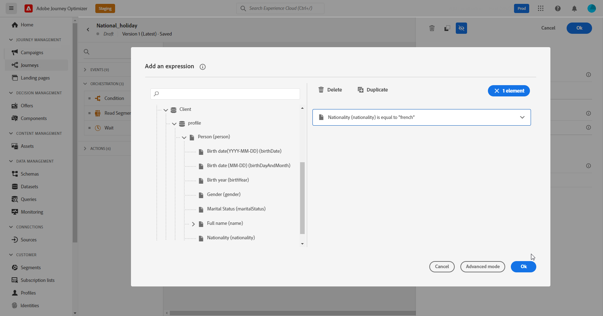

# Op kenmerken gebaseerd toegangsbeheer {#attribute-based-access}

>[!IMPORTANT]
>
>Het gebruik van op attributen-gebaseerde toegangsbeheer is momenteel beperkt tot geselecteerde klanten, en zal aan alle milieu&#39;s in een toekomstige versie worden opgesteld.

Op attributen-gebaseerde toegangsbeheer (ABAC) laat u toestemmingen bepalen om gegevenstoegang voor specifieke teams of groepen gebruikers te beheren. Het doel is gevoelige digitale activa te beschermen tegen ongeoorloofde gebruikers, zodat persoonsgegevens verder kunnen worden beschermd.

In Adobe Journey Optimizer, staat ABAC u toe om gegevens te beschermen en specifieke toegang te verlenen tot specifieke gebiedselementen met inbegrip van de schema&#39;s van de Gegevens van de Ervaring van het Model (XDM), de attributen van het Profiel, en segmenten.

Voor een meer gedetailleerde lijst van de gebruikte terminologie met ABAC, verwijs naar [Adobe Experience Platform-documentatie](https://experienceleague.adobe.com/docs/experience-platform/access-control/abac/overview.html).

In dit voorbeeld willen we een label toevoegen aan de **Nationaliteit** schemaveld om te voorkomen dat onbevoegde gebruikers het gebruiken. Dit werkt alleen als u de volgende stappen uitvoert:

1. Een nieuwe  **[!UICONTROL Role]** en wijst het toe met de overeenkomstige  **[!UICONTROL Label]** voor gebruikers om tot het schemagebied toegang te hebben en te kunnen gebruiken.

1. Een  **[!UICONTROL Label]** aan de **Nationaliteit** schemaveld in Adobe Experience Platform.

1. Gebruik de  **[!UICONTROL Schema field]** in Adobe Journey Optimizer.

Let op: **[!UICONTROL Roles]**, **[!UICONTROL Policies]** en **[!UICONTROL Products]** U kunt ook toegang krijgen tot de API voor toegangsbeheer op basis van kenmerken. Raadpleeg de volgende secties voor meer informatie [documentatie](https://experienceleague.adobe.com/docs/experience-platform/access-control/abac/abac-api/overview.html).

## Een rol maken en labels toewijzen {#assign-role}

>[!IMPORTANT]
>
>Voordat u machtigingen voor een rol beheert, moet u eerst een beleid maken. Raadpleeg voor meer informatie hierover [Adobe Experience Platform-documentatie](https://experienceleague.adobe.com/docs/experience-platform/access-control/abac/permissions-ui/policies.html).

**[!UICONTROL Roles]** Dit zijn een reeks gebruikers die dezelfde machtigingen, labels en sandboxen binnen uw organisatie hebben. Elke gebruiker die tot een **[!UICONTROL Role]** heeft recht op de Adobe-apps en -services in het product.
U kunt ook uw eigen **[!UICONTROL Roles]** als u de toegang van uw gebruikers tot bepaalde functies of objecten in de interface wilt verfijnen.

We willen geselecteerde gebruikers nu toegang geven tot de **Nationaliteit** veld, met het label C2. Daartoe moeten we een nieuwe **[!UICONTROL Role]** met een specifieke reeks gebruikers en hun het label C2 geven waarmee zij de **Nationaliteit** details in een **[!UICONTROL Journey]**.

1. Van de [!DNL Permissions] product, selecteer **[!UICONTROL Role]** in het menu van het linkerdeelvenster en klik op **[!UICONTROL Create role]**. U kunt ook toevoegen **[!UICONTROL Label]** naar ingebouwde rollen.

   

1. Voeg een **[!UICONTROL Name]** en **[!UICONTROL Description]** aan uw nieuwe **[!UICONTROL Role]**, hier: Beperkte rol demografisch.

1. Selecteer in de vervolgkeuzelijst de optie **[!UICONTROL Sandbox]**.

   

1. Van de **[!UICONTROL Resources]** menu, klikt u op **[!UICONTROL Adobe Experience Platform]** om de verschillende mogelijkheden te openen. Hier selecteren we **[!UICONTROL Journeys]**.

   

1. Selecteer in de vervolgkeuzelijst de optie **[!UICONTROL Permissions]** gekoppeld aan de geselecteerde functie, zoals **[!UICONTROL View journeys]** of **[!UICONTROL Publish journeys]**.

   

1. Nadat u de zojuist gemaakte **[!UICONTROL Role]**, klikt u op **[!UICONTROL Properties]** om toegang tot uw rol verder te vormen.

   

1. Klik op het tabblad **[!UICONTROL Users]** op **[!UICONTROL Add users]**.

   

1. Selecteer op het tabblad **[!UICONTROL Labels]** de optie **[!UICONTROL Add label]**.

   

1. Selecteer **[!UICONTROL Labels]** u wilt toevoegen aan uw rol en klik **[!UICONTROL Save]**. Voor dit voorbeeld, verlenen wij het etiket C2 voor gebruikers om toegang tot het eerder beperkte gebied van het schema te hebben.

   

De gebruikers in de **Beperkte rol demografische** De rol heeft nu toegang tot de C2 geëtiketteerde voorwerpen.

## Labels toewijzen aan een object in Adobe Experience Platform {#assign-label}

>[!WARNING]
>
>Onjuist labelgebruik kan de toegang tot personen verbreken en beleidsovertredingen veroorzaken.

**[!UICONTROL Labels]** kan worden gebruikt om specifieke eigenschapgebieden toe te wijzen gebruikend op Attributen-Gebaseerd toegangsbeheer.
In dit voorbeeld willen wij de toegang tot **Nationaliteit** veld. Dit veld is alleen toegankelijk voor gebruikers met de bijbehorende **[!UICONTROL Label]** hun  **[!UICONTROL Role]**.

U kunt ook toevoegen  **[!UICONTROL Label]** tot  **[!UICONTROL Schema]**,  **[!UICONTROL Datasets]** en  **[!UICONTROL Segments]**.

1. Maak uw **[!UICONTROL Schema]**. Raadpleeg voor meer informatie hierover [deze documentatie](https://experienceleague.adobe.com/docs/experience-platform/xdm/schema/composition.html?lang=en).

   

1. In het nieuwe **[!UICONTROL Schema]**, voegen wij eerst de **[!UICONTROL Demographic details]** veldgroep die de **Nationaliteit** veld.

   

1. Van de **[!UICONTROL Labels]** tab, controleer hier de beperkte veldnaam **Nationaliteit**. Selecteer vervolgens in het menu van het rechterdeelvenster de optie **[!UICONTROL Edit governance labels]**.

   

1. Selecteer de bijbehorende **[!UICONTROL Label]** In dit geval kan de C2 - Gegevens niet worden geëxporteerd naar een derde. Voor de gedetailleerde lijst van beschikbare etiketten, verwijs naar [deze pagina](https://experienceleague.adobe.com/docs/experience-platform/data-governance/labels/reference.html#contract-labels).

   

1. Pas verder uw schema aan als nodig dan laat het toe. Voor de gedetailleerde stappen op hoe te om uw schema toe te laten, verwijs naar dit [page](https://experienceleague.adobe.com/docs/experience-platform/xdm/ui/resources/schemas.html#profile).

Het veld van uw schema is nu alleen zichtbaar en kan nu alleen worden gebruikt door gebruikers die deel uitmaken van een rolset met het label C2.
Door een **[!UICONTROL Label]** aan uw **[!UICONTROL Field name]**, merkt op dat de **[!UICONTROL Label]** wordt automatisch toegepast op de **Nationaliteit** in elk gemaakt schema.

## Benoemde objecten openen in Adobe Journey Optimizer {#attribute-access-ajo}

Na het etiketteren van onze **Nationaliteit** veldnaam in een nieuw schema en onze nieuwe rol, we zien nu de impact van deze beperking in Adobe Journey Optimizer.
Voor ons voorbeeld zal een eerste gebruiker X met toegang tot voorwerpen geëtiketteerd C2 een Weg met een voorwaarde creëren die zich richt beperkt **[!UICONTROL Field name]**. Een tweede gebruiker Y zonder toegang tot voorwerpen geëtiketteerd C2 zal dan de Reis moeten publiceren.

1. Vanuit Adobe Journey Optimizer moet u eerst de **[!UICONTROL Data source]** met uw nieuwe schema.

   

1. Een nieuwe toevoegen **[!UICONTROL Field group]** van uw nieuwe **[!UICONTROL Schema]** op de ingebouwde **[!UICONTROL Data source]**. U kunt ook een nieuwe externe **[!UICONTROLDgegevensbron]** en bijbehorende **[!UICONTROL Field groups]**.

   

1. Na het selecteren van uw eerder gemaakte **[!UICONTROL Schema]**, klikt u op **[!UICONTROL Edit]** van de **[!UICONTROL Fields]** categorie.

   

1. Selecteer **[!UICONTROL Field name]** wilt u richten. Hier selecteren we de beperkte **Nationaliteit** veld.

   

1. Maak vervolgens een Reis die een e-mail stuurt naar gebruikers met een specifieke nationaliteit. Een **[!UICONTROL Event]** dan een **[!UICONTROL Condition]**.

   

1. Beperkt selecteren **Nationaliteit** veld om uw expressie op te bouwen.

   

1. Bewerk uw **[!UICONTROL Condition]** om zich te richten op een specifieke populatie met beperkte **Nationaliteit** veld.

   

1. Pas uw reis waar nodig aan, hier voegen we een **[!UICONTROL Email]** handeling.

   

Als de Gebruiker Y zonder toegang tot etiket C2 voorwerpen tot deze reis met dit beperkte gebied moet toegang hebben:

* Gebruiker Y kan de beperkte veldnaam niet gebruiken omdat deze niet zichtbaar is.

* Gebruiker Y kan de uitdrukking niet bewerken met de beperkte veldnaam in de modus Geavanceerd. De volgende fout verschijnt `The expression is invalid. Field is no longer available or you don't have enough permission to see it`.

* Gebruiker Y kan de uitdrukking verwijderen.

* Gebruiker Y kan de Reis niet testen.

* Gebruiker Y kan de Reis niet publiceren.
