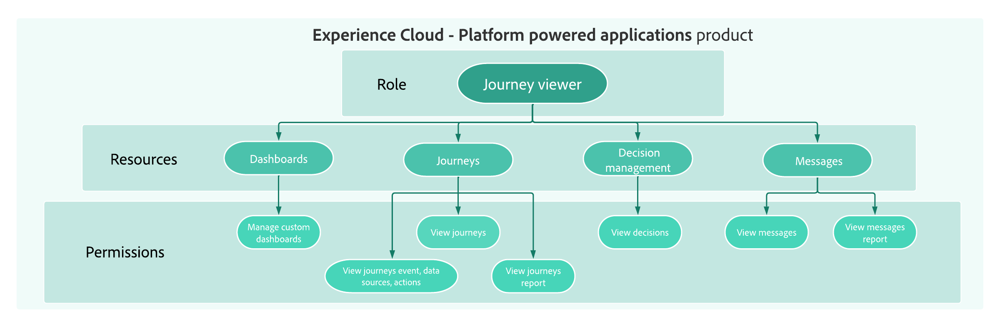

# Aan de slag met gebruikersbeheer {#permissions-overview}

Met [!DNL Journey Optimizer] kunt u de machtigingen definiëren en beheren die aan verschillende gebruikers zijn toegewezen. Machtigingen zijn een reeks rechten en beperkingen die toegang tot functies en mogelijkheden in producten toestaan of weigeren.

➡️ [ Leer meer over toegangsbeheer in Adobe Journey Optimizer in deze video ](#video)

Gebruikersbeheer in [!DNL Journey Optimizer] is gebaseerd op drie concepten:

* **[!UICONTROL Role]**: Een reeks eenheidsrechten waarmee gebruikers toegang hebben tot bepaalde functies of objecten in de interface. Verwijs naar [ uit-van-de-doos rollen ](ootb-product-profiles.md) sectie.

* **[!UICONTROL Permissions]**: eenheidrechten waarmee u de machtigingen kunt definiëren die aan **[!UICONTROL Roles]** zijn toegewezen. Elke machtiging wordt verzameld onder bronnen, bijvoorbeeld Reis of Aanbiedingen, die de verschillende functies of objecten in [!DNL Journey Optimizer] vertegenwoordigen. Verwijs naar de [ niveaus van de Toestemming ](high-low-permissions.md) sectie.

* **[!UICONTROL Sandbox]**: virtuele sandboxen die instanties verdelen in afzonderlijke, geïsoleerde virtuele omgevingen. Verwijs naar [ Gebruikend zandbakken ](sandboxes.md).

<!--
## How-to video{#video}

Learn more about access control system and custom proles in Adobe Journey Optimizer. Learn how to manage roles and permissions and how to add and manage users.

>[!VIDEO](https://video.tv.adobe.com/v/333998?quality=12)
-->