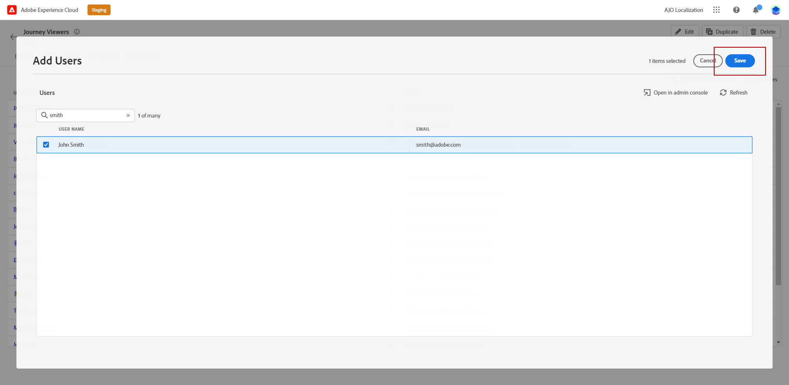

# Gebruikers en rollen beheren {#manage-permissions}

**[!UICONTROL Roles]** verwijst naar een verzameling gebruikers die dezelfde machtigingen en sandboxen delen. Deze rollen staan u toe om toegang en toestemmingen voor verschillende groepen gebruikers binnen uw organisatie gemakkelijk te beheren.

Met het [!DNL Journey Optimizer] -product kunt u kiezen uit een reeks vooraf bestaande **[!UICONTROL Roles]** -componenten, elk met verschillende machtigingsniveaus, die u aan uw gebruikers kunt toewijzen. Voor meer informatie over beschikbare **[!UICONTROL Roles]**, verwijs naar deze [&#x200B; pagina &#x200B;](ootb-product-profiles.md).

Wanneer een gebruiker tot een **[!UICONTROL Role]** behoort, krijgt hij toegang tot de Adobe-apps en -services in het product.

Als de reeds bestaande rollen niet aan de specifieke behoeften van uw organisatie voldoen, kunt u douane **[!UICONTROL Roles]** ook tot stand brengen om toegang tot bepaalde functionaliteit of voorwerpen in de interface te verfijnen. Op deze manier zorgt u ervoor dat elke gebruiker alleen toegang heeft tot de bronnen en gereedschappen die nodig zijn om zijn taken efficiënt uit te voeren.

>[!IMPORTANT]
>
>Stappen en procedures die hieronder worden beschreven, kunnen alleen worden uitgevoerd door een **[!UICONTROL Product]** - of **[!UICONTROL System]** -beheerder.

## Rollen toewijzen {#assigning-role}

U kunt een uit-van-de-doos of douane **[!UICONTROL Role]** aan uw gebruikers toewijzen.

De lijst van alle uit-van-de-doos rollen met toegewezen toestemmingen is beschikbaar in [&#x200B; ingebouwde rollen &#x200B;](ootb-product-profiles.md) sectie.

Een **[!UICONTROL Role]** toewijzen:

1. Als u een rol wilt toewijzen aan een gebruiker in het [!DNL Permissions] -product, navigeert u naar het tabblad **[!UICONTROL Roles]** en selecteert u de gewenste rol.

   

1. Klik op het tabblad **[!UICONTROL Users]** op **[!UICONTROL Add user]**.

   

1. Typ de naam of het e-mailadres van de gebruiker of selecteer de gebruiker in de lijst en klik op **[!UICONTROL Save]** .

   Als de gebruiker niet eerder in [!DNL Admin Console] werd gecreeerd, verwijs naar [&#x200B; gebruikersdocumentatie &#x200B;](https://experienceleague.adobe.com/docs/experience-platform/access-control/ui/users.html?lang=nl-NL){target="_blank"} toevoegen.

   

Uw gebruiker ontvangt een e-mail die hen aan uw geval opnieuw richt.

Voor meer informatie over gebruikersbeheer, verwijs naar de [&#x200B; documentatie van het Toegangsbeheer &#x200B;](https://experienceleague.adobe.com/docs/experience-platform/access-control/home.html?lang=nl-NL){target="_blank"}.

Wanneer u de instantie opent, ziet uw gebruiker een specifieke weergave afhankelijk van de toegewezen machtigingen in de **[!UICONTROL Role]** . Als de gebruiker niet de juiste toegang tot een eigenschap heeft, verschijnt het volgende bericht:

`You do not have permission to access this feature. Permission needed: XX.`

## Een bestaande rol bewerken {#edit-product-profile}

Voor ingebouwde of aangepaste **[!UICONTROL Roles]** kunt u op elk gewenst moment machtigingen toevoegen of verwijderen.

In het onderstaande voorbeeld willen we **[!UICONTROL Permissions]** toevoegen met betrekking tot de **[!UICONTROL Journeys]** -bron voor gebruikers die zijn toegewezen aan de Journey-viewer **[!UICONTROL Role]** . De gebruikers kunnen dan reizen publiceren.

>[!IMPORTANT]
>
>Wijzigingen in een ingebouwde of aangepaste rol zijn van invloed op alle gebruikers die aan die rol zijn toegewezen.

1. Als u een rol in het [!DNL Permissions] -product wilt bewerken, navigeert u naar het tabblad **[!UICONTROL Roles]** en selecteert u de gewenste rol, hier in de Journey-viewer **[!UICONTROL Role]** .
   

1. Klik op het dashboard van **[!UICONTROL Role]** **[!UICONTROL Edit]** .

   

1. In het menu **[!UICONTROL Resources]** wordt de lijst met bronnen weergegeven die van toepassing zijn op het **[!UICONTROL Experience Cloud - Platform powered applications]** -product. Sleep bronnen om machtigingen toe te wijzen.

   In de vervolgkeuzelijst met **[!UICONTROL Journeys]** bronnen kiezen we hier de publicatietraject **[!UICONTROL Permission]** .

   

1. Klik, indien nodig, onder **[!UICONTROL Included Permission Items]** op het X-pictogram om machtigingen of bronnen uit uw rol te verwijderen.

1. Klik op **[!UICONTROL Save]** als u klaar bent.

Indien nodig kunt u ook een nieuwe rol maken met specifieke machtigingen.

## Een nieuwe rol maken {#create-product-profile}

Met [!DNL Journey Optimizer] kunt u uw eigen **[!UICONTROL Roles]** maken en een set machtigingen en sandboxen aan uw gebruikers toewijzen. Met **[!UICONTROL Roles]** kunt u toegang tot bepaalde functies of objecten in de interface autoriseren of weigeren.

Raadpleeg de [Adobe Experience Platform-documentatie](https://experienceleague.adobe.com/docs/experience-platform/sandbox/ui/user-guide.html?lang=nl-NL){target="_blank"} voor informatie over het maken en beheren van sandboxen.

In dit voorbeeld, creëren wij een rol genoemd **Reis read-only**, waar wij read-only rechten op de eigenschap van de Reis verlenen. Gebruikers kunnen alleen reizen openen en bekijken en hebben geen toegang tot andere functies, zoals **[!DNL Decision management]** in [!DNL Journey Optimizer] .

Om onze **Reizen read-only** **[!UICONTROL Role]** te creëren:

1. Als u een rol wilt toewijzen aan een gebruiker in het [!DNL Permissions] -product, navigeert u naar de tab **[!UICONTROL Roles]** en klikt u op **[!UICONTROL Create role]** .

   

1. Voeg een **[!UICONTROL Name]** en **[!UICONTROL Description]** voor uw nieuwe **[!UICONTROL Role]** toe. Klik vervolgens op **[!UICONTROL Confirm]** .

   

1. Kies in de vervolgkeuzelijst met bronnen van **[!UICONTROL Sandbox]** welke sandbox(s) u wilt toewijzen aan uw **[!UICONTROL Role]** . [&#x200B; leer meer over zandbakken &#x200B;](sandboxes.md).

   

1. Maak een keuze uit de verschillende bronnen, zoals **[!DNL Journeys]** , **[!DNL Segments]** of **[!DNL Decision management]** die beschikbaar zijn in [!DNL Journey Optimizer] .

   Hier selecteren we de **[!UICONTROL Journeys]** -bron.

   

1. Selecteer in de vervolgkeuzelijst **[!UICONTROL Journeys]** de machtigingen die u wilt toewijzen aan uw **[!UICONTROL Role]** .

   Hier selecteren we **[!DNL View journeys]** , **[!DNL View journeys report]** en **[!DNL View journeys event, data sources, actions]** .

   

1. Klik op **[!UICONTROL Save]** als u klaar bent.

Uw **[!UICONTROL Role]** wordt nu gecreeerd en gevormd. U moet deze nu aan gebruikers toewijzen.

Voor meer informatie over rolverwezenlijking en beheer, verwijs naar de [&#x200B; documentatie van Adobe Admin Console &#x200B;](https://experienceleague.adobe.com/docs/experience-platform/access-control/abac/permissions-ui/roles.html?lang=nl-NL){target="_blank"}.
