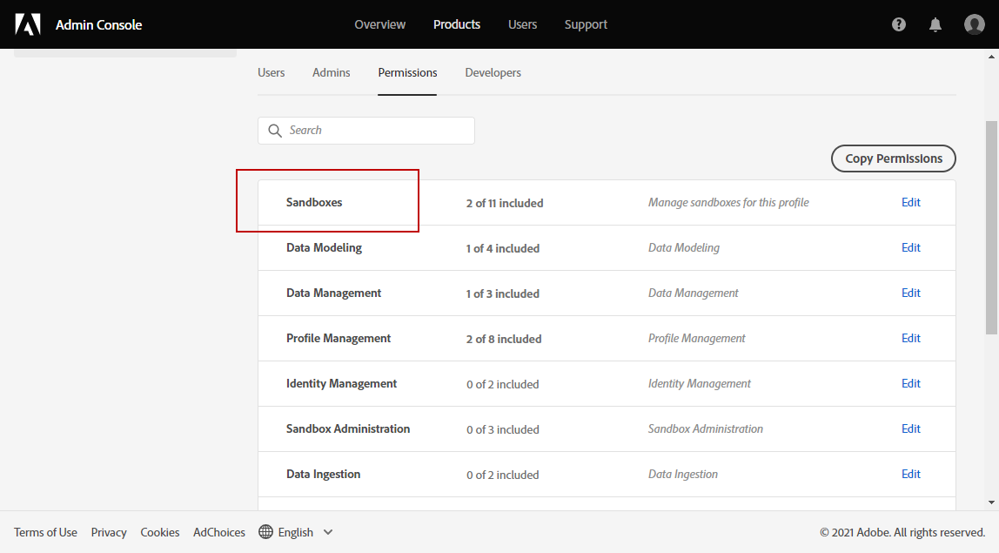

# Sandboxbeheer {#sandboxes}

## Sandboxen gebruiken {#using-sandbox}

In [!DNL Journey Optimizer] kunt u uw instantie partitioneren in afzonderlijke virtuele omgevingen, sandboxen genoemd.
Sandboxen worden toegewezen via productprofielen in de Admin Console. [Leer hoe u sandboxen toewijst](permissions.md#create-product-profile).

[!DNL Journey Optimizer] weerspiegelt Adobe Experience Platform-sandboxen die voor een bepaalde organisatie zijn gemaakt.
U kunt Adobe Experience Platform-sandboxen maken of herstellen vanuit uw Adobe Experience Platform-instantie. [Meer informatie in de gebruikershandleiding voor de sandbox](https://experienceleague.adobe.com/docs/experience-platform/sandbox/ui/user-guide.html){target=&quot;_blank&quot;}.

U vindt de schakelfunctie voor sandboxen linksboven in het scherm. Als u van sandbox wilt wisselen, klikt u op de momenteel actieve sandbox in de schakelfunctie en selecteert u een andere sandbox in de vervolgkeuzelijst.

➡️ [Ontdek deze functie in video](#video)

## Sandboxen toewijzen {#assign-sandboxes}

>[!IMPORTANT]
>
> Sandboxbeheer kan alleen worden uitgevoerd door een **[!UICONTROL Product]** of **[!UICONTROL System]** beheerder. Raadpleeg voor meer informatie hierover de [Documentatie voor beheerconsole](https://helpx.adobe.com/enterprise/admin-guide.html/enterprise/using/admin-roles.ug.html){target=&quot;_blank&quot;}.

U kunt desgewenst verschillende sandboxen toewijzen **[!UICONTROL Product profiles]**.

Sandboxen toewijzen:

1. In de [!DNL Admin Console]van de **[!UICONTROL Products]** selecteert u de **[!UICONTROL Adobe Experience Platform Apps]** product.

1. Selecteer een **[!UICONTROL Product profile]**.

   

1. Selecteer het tabblad **[!UICONTROL Permissions]**. 

1. Selecteer **[!UICONTROL Sandboxes]** capaciteit.

   

1. Klik onder **[!UICONTROL Available Permissions Items]** op het pluspictogram (+) om sandboxen aan uw profiel toe te wijzen. [Meer informatie over sandboxen](https://experienceleague.adobe.com/docs/experience-platform/sandbox/home.html){target=&quot;_blank&quot;}.

   

1. Indien nodig, onder **[!UICONTROL Included Permission Items]**, klikt u op het X-pictogram naast het verwijderen van sandboxen die toegang hebben tot uw **[!UICONTROL Product profile]**.

   

1. Klik op **[!UICONTROL Save]**.

## Toegang tot inhoud {#content-access}

Als u de toegankelijkheid van uw inhoud wilt configureren, moet u een gedeelde inhoudsmap toewijzen aan elk van uw sandboxen. U kunt uw gedeelde map maken en configureren in het dialoogvenster **[!UICONTROL Storage]** weergegeven in het dialoogvenster [!DNL Admin Console] voor beheerders. Als u toegang hebt tot [!DNL Admin Console] als systeembeheerder, kunt u gedeelde omslagen tot stand brengen en afgevaardigden met verschillend toegangsniveau toevoegen aan uw gedeelde omslagen.

Houd er rekening mee dat voor synchronisatie van uw inhoud met de juiste sandbox dezelfde syntaxis moet worden gebruikt als de sandbox, bijvoorbeeld als de sandbox ontwikkeling wordt genoemd, moet uw gedeelde map dezelfde naam hebben.

[Leer hoe u gedeelde mappen kunt beheren](https://helpx.adobe.com/enterprise/admin-guide.html/enterprise/using/manage-adobe-storage.ug.html){target=&quot;_blank&quot;}.

## Hoe kan ik-video{#video}

Begrijp wat sandboxen zijn en hoe u onderscheid kunt maken tussen ontwikkelings- en productiesandboxen. Leer hoe u sandboxen kunt maken, herstellen en verwijderen.

>[!VIDEO](https://video.tv.adobe.com/v/334355?quality=12)
