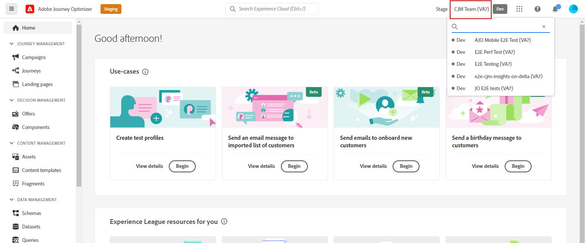

# Sandboxen gebruiken en toewijzen {#sandboxes}

## Sandboxen gebruiken {#using-sandbox}

Met [!DNL Journey Optimizer] kunt u uw instantie opdelen in afzonderlijke virtuele omgevingen, sandboxen genoemd. Sandboxen worden toegewezen via rollen in Machtigingen. [&#x200B; Leer hoe te om zandbakken &#x200B;](permissions.md#create-product-profile) toe te wijzen.

[!DNL Journey Optimizer] geeft Adobe Experience Platform-sandboxen weer die voor een bepaalde organisatie zijn gemaakt. U kunt Adobe Experience Platform-sandboxen maken of herstellen vanuit uw Adobe Experience Platform-instantie. [&#x200B; leer meer in de zandbakgebruikersgids &#x200B;](https://experienceleague.adobe.com/docs/experience-platform/sandbox/ui/user-guide.html){target="_blank"}.

U kunt het besturingselement voor de sandbox-switch rechtsboven in het scherm vinden, naast de naam van uw organisatie. Als u van sandbox wilt wisselen, klikt u op de momenteel actieve sandbox in de schakelfunctie en selecteert u een andere sandbox in de vervolgkeuzelijst.

➡️ [&#x200B; Leer meer over zandbakken in deze video &#x200B;](#video)

## Sandboxen toewijzen {#assign-sandboxes}

>[!IMPORTANT]
>
> Sandboxbeheer kan alleen worden uitgevoerd door een **[!UICONTROL Product]** - of **[!UICONTROL System]** -beheerder.

U kunt verschillende sandboxen toewijzen aan een externe of aangepaste sandbox **[!UICONTROL Roles]** .

Sandboxen toewijzen:

1. Selecteer in [!DNL Permissions] op de tab **[!UICONTROL Roles]** een **[!UICONTROL Role]** .

   

1. Klik op **[!UICONTROL Edit]**.

1. Selecteer in de vervolgkeuzelijst met bronnen van **[!UICONTROL Sandboxes]** de sandbox die aan uw rol wordt toegewezen.

   

1. Klik indien nodig op het X-pictogram naast het pictogram om de toegang tot de sandbox uit de **[!UICONTROL Role]** te verwijderen.

   

1. Klik op **[!UICONTROL Save]**.

## Toegang tot inhoud {#content-access}

Als u de toegankelijkheid van inhoud wilt configureren, wijst u een gedeelde inhoudsmap toe aan elk van uw sandboxen. U kunt gedeelde mappen maken en configureren op het tabblad **[!UICONTROL Storage]** dat wordt weergegeven in het dialoogvenster [!DNL Admin Console] voor beheerders. Als u als systeembeheerder toegang tot [!DNL Admin Console] hebt, kunt u gedeelde omslagen tot stand brengen en afgevaardigden met verschillende toegangsniveaus aan uw gedeelde omslagen toevoegen.

Houd er rekening mee dat als de inhoud met de juiste sandbox moet worden gesynchroniseerd, deze dezelfde syntaxis moet hebben als de sandbox. Als uw sandbox bijvoorbeeld &#39;development&#39; wordt genoemd, moet uw gedeelde map dezelfde naam hebben.

[&#x200B; Leer hoe te om gedeelde omslagen &#x200B;](https://helpx.adobe.com/enterprise/admin-guide.html/enterprise/using/manage-adobe-storage.ug.html){target="_blank"} te beheren.

## Hoe kan ik-video{#video}

Begrijp wat sandboxen zijn en hoe u onderscheid kunt maken tussen ontwikkelings- en productiesandboxen. Leer hoe u sandboxen kunt maken, herstellen en verwijderen.

>[!VIDEO](https://video.tv.adobe.com/v/334355?quality=12)