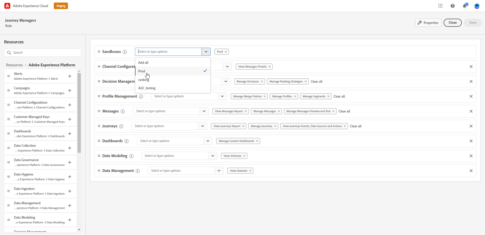

# Sandboxbeheer {#sandboxes}

## Sandboxen gebruiken {#using-sandbox}

In [!DNL Journey Optimizer] kunt u uw instantie partitioneren in afzonderlijke virtuele omgevingen, sandboxen genoemd.
Sandboxen worden toegewezen via rollen in Machtigingen. [ Leer hoe te om zandbakken ](permissions.md#create-product-profile) toe te wijzen.

[!DNL Journey Optimizer] geeft Adobe Experience Platform-sandboxen weer die voor een bepaalde organisatie zijn gemaakt.
U kunt Adobe Experience Platform-sandboxen maken of herstellen vanuit uw Adobe Experience Platform-instantie. [ leer meer in de zandbakgebruikersgids ](https://experienceleague.adobe.com/docs/experience-platform/sandbox/ui/user-guide.html){target="_blank"}.

U kunt het besturingselement voor de sandboxswitch rechtsboven in het scherm vinden naast de naam van uw organisatie. Als u van sandbox wilt wisselen, klikt u op de momenteel actieve sandbox in de schakelfunctie en selecteert u een andere sandbox in de vervolgkeuzelijst.

➡️ [ Leer meer over zandbakken in deze video ](#video)

## Sandboxen toewijzen {#assign-sandboxes}

>[!IMPORTANT]
>
> Sandboxbeheer kan alleen worden uitgevoerd door een **[!UICONTROL Product]** - of **[!UICONTROL System]** -beheerder.

U kunt verschillende sandboxen toewijzen aan een externe of aangepaste sandbox **[!UICONTROL Roles]** .

Sandboxen toewijzen:

1. Selecteer in [!DNL Permissions] op de tab **[!UICONTROL Roles]** een **[!UICONTROL Role]** .

   

1. Klik op **[!UICONTROL Edit]**.

1. Selecteer in de vervolgkeuzelijst met bronnen van **[!UICONTROL Sandboxes]** de sandbox die aan uw rol wordt toegewezen.

   

1. Klik indien nodig op het X-pictogram naast het verwijderen van de toegang tot uw **[!UICONTROL Role]** -sandboxen.

   

1. Klik op **[!UICONTROL Save]**.

## Toegang tot inhoud {#content-access}

Als u de toegankelijkheid van uw inhoud wilt configureren, moet u een gedeelde inhoudsmap toewijzen aan elk van uw sandboxen. U kunt de gedeelde map maken en configureren op het tabblad **[!UICONTROL Storage]** dat wordt weergegeven in het dialoogvenster [!DNL Admin Console] voor beheerders. Als u als systeembeheerder toegang hebt tot [!DNL Admin Console] , kunt u gedeelde mappen maken en afgevaardigden met een ander toegangsniveau toevoegen aan uw gedeelde mappen.

Houd er rekening mee dat voor synchronisatie van uw inhoud met de juiste sandbox dezelfde syntaxis moet worden gebruikt als de sandbox, bijvoorbeeld als de sandbox ontwikkeling wordt genoemd, moet uw gedeelde map dezelfde naam hebben.

[ Leer hoe te om gedeelde omslagen ](https://helpx.adobe.com/enterprise/admin-guide.html/enterprise/using/manage-adobe-storage.ug.html){target="_blank"} te beheren.

## Hoe kan ik-video{#video}

Begrijp wat sandboxen zijn en hoe u onderscheid kunt maken tussen ontwikkelings- en productiesandboxen. Leer hoe u sandboxen kunt maken, herstellen en verwijderen.

>[!VIDEO](https://video.tv.adobe.com/v/334355?quality=12)