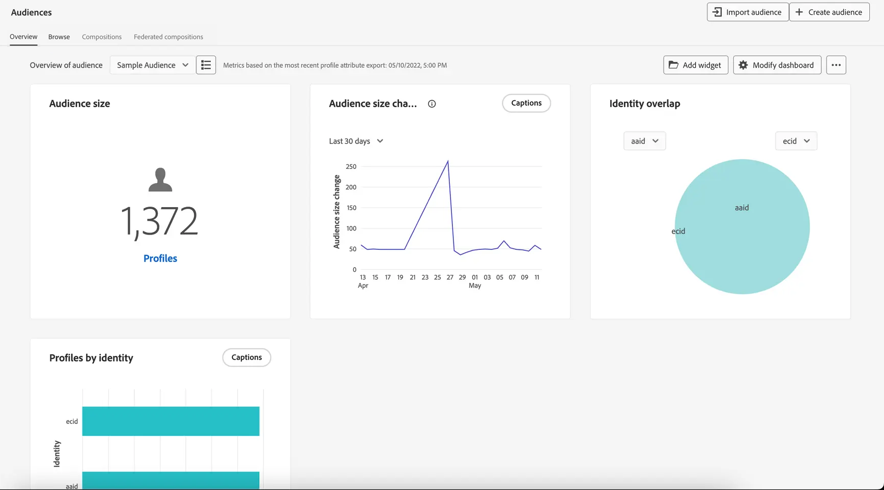

# Aan de slag met het publiek {#about-segments}

>[!CONTEXTUALHELP]
>id="ajo_campaigns_content_experiment_segment"
>title="Doelgroep"
>abstract="Met Adobe Experience Platform kunt u eenvoudig segmentdefinities maken door gebruik te maken van realtime klantprofielgegevens. Zo kunt u doelgroepen maken die de unieke gedragingen en voorkeuren van uw klanten vastleggen."

>[!CONTEXTUALHELP]
>id="ajo_campaigns_audience"
>title="Selecteer het campagnepubliek"
>abstract="In deze lijst worden alle beschikbare Adobe Experience Platform-soorten publiek weergegeven. Selecteer het publiek voor uw campagne. Het bericht dat in de campagne wordt gevormd zal naar alle individuen worden verzonden die tot het geselecteerde publiek behoren. [&#x200B; leer meer over publiek &#x200B;](../audience/about-audiences.md)"

Soorten publiek zijn verzamelingen van mensen met een vergelijkbaar gedrag en/of vergelijkbare kenmerken. Ze worden centraal geconfigureerd en onderhouden op Adobe Experience Platform met behulp van de Adobe Experience Platform Segmentation Service en zijn gemakkelijk toegankelijk binnen Journey Optimizer om te worden geactiveerd tijdens uw reizen en campagnes.

Adobe Journey Optimizer biedt robuuste hulpmiddelen voor het maken, beheren en verrijken van doelgroepen om marketinginspanningen te verbeteren. In combinatie met Adobe Real-Time Customer Data Platform kunt u in Journey Optimizer lagen in het publiek opnemen voor complexere segmentatie en kunt u in twee richtingen soorten publiek delen met andere Adobe Experience Cloud-oplossingen.

Naarmate gegevensstromen in real time of batchuploads plaatsvinden, worden gegevenssets bijgewerkt en verplaatst Journey Optimizer personen dynamisch in en uit het publiek en reizen in real-time.

>[!BEGINSHADEBOX]

Deze documentatie biedt informatie over het werken met het publiek in [!DNL Adobe Journey Optimizer] . Gedetailleerde informatie over de portal Publiek en het publiek is beschikbaar in de documentatie van de Adobe Experience Platform Segmentation-service. Raadpleeg de volgende secties voor meer informatie:

* {de gids van de Dienst UI van de Segmentatie 0} [&#128279;](https://experienceleague.adobe.com/en/docs/experience-platform/segmentation/ui/overview){target="_blank"}

* [&#x200B; de Dienst van de Segmentatie - Veelgestelde Vragen &#x200B;](https://experienceleague.adobe.com/en/docs/experience-platform/segmentation/faq){target="_blank"}

>[!ENDSHADEBOX]

## Naar publiek bladeren {#browse}

Soorten publiek zijn beschikbaar in het menu **[!UICONTROL Customer]** > **[!UICONTROL Audiences]** .

Een dashboard toont visueel overlappingen tussen belangrijke doelgroepen en ondersteunt het verkennen van waardevolle publiekstrends. Bijvoorbeeld, kunnen de veranderingen van de publieksgrootte over een bepaalde tijdspanne of plotselinge pieken in publiek gebeurtenissen of acties benadrukken die een publiek aan krimpen of veroorzaken om te groeien, zoals een succesvolle aanbieding.

Via het Poortpubliek van het publiek kunt u eenvoudig het publiek beheren, zoeken en verkennen met gestandaardiseerde labels, beheerbesturingselementen, doorzoekbare mappen en tags.

Voor meer informatie over hoe te met publiek in het Portaal van het Publiek te werken, verwijs naar de [&#x200B; documentatie van de Dienst van de Segmentatie van Adobe Experience Platform &#x200B;](https://experienceleague.adobe.com/docs/experience-platform/segmentation/home.html){target="_blank"}.

## Typen soorten publiek {#types}

Soorten publiek kan op verschillende manieren worden gegenereerd:

* **de definities van het Segment**: Creeer een nieuwe publieksdefinitie gebruikend de Dienst van de Segmentatie van Adobe Experience Platform. Het publiek wordt geproduceerd van segmentdefinities en op verschillende tijden afhankelijk van hun evaluatietype verfrist:

   * Streaming segmentatie: publiek wordt in real-time bijgewerkt naarmate nieuwe gegevens stromen, zodat de relevantie op basis van gebruikersactiviteit ononderbroken blijft.
   * Batchsegmentatie: het publiek wordt elke 24 uur vernieuwd en legt een momentopname van profielen vast met een vast interval. Bij gebruik tijdens reizen kunnen pas gekwalificeerde segmentleden verschijnen tot de volgende momentopname. [&#x200B; Leer meer over timing &#x200B;](../building-journeys/audience-qualification-events.md#timing-segment-membership).
   * Edge-segmentatie: publiek wordt direct aan de rand geëvalueerd, zodat u in real-time kunt personaliseren.

  [&#x200B; leer hoe te om segmentdefinities te bouwen &#x200B;](creating-a-segment-definition.md)

* **Douane uploadt**: Invoer een publiek gebruikend een Csv- dossier. [&#x200B; leer hoe te om tot Douane te leiden uploadt publiek &#x200B;](custom-upload.md)

* **compositie van het publiek**: Creeer een samenstellingswerkschema om bestaand publiek in een visueel canvas te combineren en acties zoals rang toe te passen, te verdelen, samen te voegen om nieuw publiek tot stand te brengen. [&#x200B; Leer hoe te met publiekssamenstelling &#x200B;](get-started-audience-orchestration.md) te werken

* **Federated Audience Composition**: De datasets van de federatie direct van uw bestaand gegevenspakhuis om het publiek en de attributen van Adobe Experience Platform allen in één systeem te bouwen en te verrijken. [&#x200B; Leer hoe te met de Federatieve Samenstelling van het Publiek &#x200B;](federated-audience-composition.md) te werken.

## Doelpubliek in reizen en campagnes {#target-audiences}

Zodra uw publiek klaar is, kunt u hen selecteren wanneer het bouwen van reizen of het creëren van campagnes, toelatend u om de juiste mensen op het juiste ogenblik met relevante berichten te bereiken. [&#x200B; Leer meer over de activering van het Publiek in Journey Optimizer &#x200B;](target-audiences.md).

## Hoe kan ik-video {#video}

Meer informatie over uniforme klantprofielen en soorten publiek in Journey Optimizer.

>[!VIDEO](https://video.tv.adobe.com/v/3432671?quality=12)
