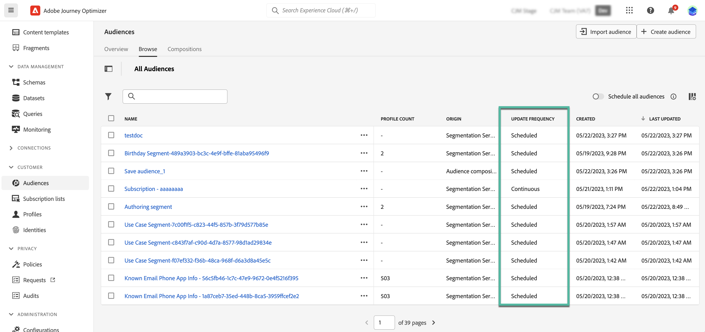

# Aan de slag met Adobe Experience Platform-publiek {#about-segments}

>[!CONTEXTUALHELP]
>id="ajo_campaigns_content_experiment_segment"
>title="Doelgroep"
>abstract="Met Adobe Experience Platform kunt u eenvoudig segmentdefinities maken door gebruik te maken van realtime klantprofielgegevens. Zo kunt u doelgroepen maken die de unieke gedragingen en voorkeuren van uw klanten vastleggen."

>[!CONTEXTUALHELP]
>id="ajo_campaigns_audience"
>title="Selecteer het campagnepubliek"
>abstract="In deze lijst worden alle beschikbare Adobe Experience Platform-soorten publiek weergegeven. Selecteer het publiek voor uw campagne. Het bericht dat in de campagne wordt gevormd zal naar alle individuen worden verzonden die tot het geselecteerde publiek behoren. [Meer informatie over publiek](../audience/about-audiences.md)"

Een publiek is een groep personen die vergelijkbare gedragingen en/of kenmerken delen. Meer informatie over het publiek in de [Adobe Experience Platform Segmentation Service-documentatie](https://experienceleague.adobe.com/docs/experience-platform/segmentation/home.html){target="_blank"}.

[!DNL Journey Optimizer] biedt u de mogelijkheid om Adobe Experience Platform-publiek rechtstreeks te maken vanuit de **[!UICONTROL Audiences]** en gebruikt u deze voor reizen of campagnes.

Soorten publiek kan op verschillende manieren worden gegenereerd:

* **Segmentdefinities**: Maak een nieuwe publieksdefinitie met Adobe Experience Platform Segmentation Service. [Leer hoe te om segmentdefinities te bouwen](creating-a-segment-definition.md)
* **CSV-bestand importeren**: Importeer een publiek met een CSV-bestand. Meer informatie over het importeren van soorten publiek in Adobe Experience Platform [Documentatie voor segmentatieservice](https://experienceleague.adobe.com/docs/experience-platform/segmentation/ui/overview.html#import-audience){target="_blank"}.
* **Samenstelling publiek**: Maak een compositieworkflow om bestaande Adobe Experience Platform-soorten publiek te combineren tot een visueel canvas en gebruik verschillende activiteiten (splitsen, uitsluiten...) om een nieuw publiek te maken. [Aan de slag met publiekscompositie](get-started-audience-orchestration.md)

## Doelpubliek in [!DNL Journey Optimizer] {#segments-in-journey-optimizer}

U kunt in campagnes selecteren en reizen om het even welk publiek dat gebruikend segmentdefinities, CSV dossier invoert of samenstellingswerkschema&#39;s wordt geproduceerd.

>[!AVAILABILITY]
>
>Het gebruik van soorten publiek en kenmerken van publiek compositie en aangepast uploadpubliek (CSV-bestand) is momenteel niet beschikbaar voor gebruik met Healthcare Shield of Privacy and Security Shield. [Meer informatie over het gebruik van verrijkingskenmerken voor doelgroepen in Journey Optimizer](../audience/about-audiences.md#enrichment)

U kunt het publiek benutten in **[!DNL Journey Optimizer]** op verschillende manieren:

* Kies een publiek voor een **campagne**, waarbij het bericht wordt verzonden naar alle personen die tot het geselecteerde publiek behoren. [Leer hoe u het publiek van een campagne definieert](../campaigns/create-campaign.md#define-the-audience-audience).

* Een **Lees publiek** Orchestratie-activiteit op een reis om ervoor te zorgen dat alle individuen in het publiek de reis betreden en de berichten ontvangen inbegrepen in uw reis.

  Laten we zeggen dat je een &quot;zilveren klant&quot; publiek hebt. Met deze activiteit, kunt u alle zilveren klanten een reis maken en hen een reeks gepersonaliseerde berichten verzenden. [Leer hoe te om een Gelezen publieksactiviteit te vormen](../building-journeys/read-audience.md#configuring-segment-trigger-activity).

* Gebruik de **kwalificatie publiek** gebeurtenisactiviteit op een reis om ervoor te zorgen dat individuen de reis betreden of vooruit gaan op basis van de toegang tot en het vertrek van Adobe Experience Platform-gebruikers.

  U kunt bijvoorbeeld alle nieuwe zilverklanten een reis laten maken en hun berichten sturen. Raadpleeg voor meer informatie over het gebruik van deze activiteit [Leer hoe te om een de kwalificatieactiviteit van het Publiek te vormen](../building-journeys/audience-qualification-events.md).

* Gebruik de **Voorwaarde** activiteit op een reis om voorwaarden op te bouwen die op het lidmaatschap van het publiek worden gebaseerd. [Meer informatie over het gebruik van soorten publiek in omstandigheden](../building-journeys/condition-activity.md#using-a-segment).

## Verrijkingskenmerken van soorten publiek gebruiken in Journey Optimizer {#enrichment}

Wanneer het richten van een publiek dat gebruikend samenstellingswerkschema&#39;s wordt geproduceerd, kunt u verrijkingsattributen van deze publiek gebruiken om uw reis te bouwen en uw berichten te personaliseren.

* Maak meerdere paden op een reis op basis van regels die de verrijkingskenmerken van het doelpubliek benutten. Als u dit wilt doen, richt u de doelgroep op met een [Lees publiek](../building-journeys/read-audience.md) activiteit creeert dan regels in [Voorwaarde](../building-journeys/condition-activity.md) activiteit op basis van de verrijkingskenmerken van het publiek .

  {zoomable=&quot;yes&quot;}

* Pas uw berichten tijdens reizen of campagnes aan door verrijkingskenmerken van het beoogde publiek toe te voegen in de Expression Editor. [Leer hoe u met de Expressieeditor werkt](../personalization/personalization-build-expressions.md)

  {zoomable=&quot;yes&quot;}

## Methoden voor de evaluatie van het publiek {#evaluation-method-in-journey-optimizer}

In Adobe Journey Optimizer wordt het publiek gegenereerd op basis van segmentdefinities aan de hand van een van de drie onderstaande evaluatiemethoden.

+++ Streaming segmentering

De profiellijst voor het publiek wordt bijgewerkt in real time aangezien de nieuwe gegevens in het systeem stromen.

Streaming segmentatie is een doorlopend proces voor gegevensselectie dat uw publiek bijwerkt als reactie op gebruikersactiviteit. Zodra een segmentdefinitie is gebouwd en het resulterende publiek is bewaard, wordt de segmentdefinitie toegepast op inkomende gegevens aan Journey Optimizer. Dit betekent dat individuen worden toegevoegd of uit het publiek verwijderd aangezien hun profielgegevens veranderen, ervoor zorgen dat uw doelpubliek altijd relevant is. [Meer informatie](https://experienceleague.adobe.com/docs/experience-platform/segmentation/ui/streaming-segmentation.html){target="_blank"}

>[!NOTE]
>
>Zorg ervoor dat u de juiste gebeurtenissen gebruikt als criteria voor streamingsegmentatie. [Meer informatie](#streaming-segmentation-events-guardrails)

+++

+++ Batchsegmentatie

De profiellijst voor het publiek wordt om de 24 uur geëvalueerd.

De segmentatie van de partij is een alternatief aan het stromen segmentatie die alle profielgegevens in één keer door segmentdefinities verwerkt. Zo maakt u een momentopname van het publiek die u kunt opslaan en exporteren voor gebruik. Nochtans, in tegenstelling tot het stromen segmentatie, werkt de partijsegmentatie niet onophoudelijk de publiekslijst in real time bij, en de nieuwe gegevens die binnen na het partijproces komen zullen niet in het publiek tot het volgende partijproces worden weerspiegeld. [Meer informatie](https://experienceleague.adobe.com/docs/experience-platform/segmentation/home.html#batch){target="_blank"}

+++

+++ Randsegmentatie

Randsegmentatie is de mogelijkheid om segmenten in Adobe Experience Platform ogenblikkelijk te evalueren [op de rand](https://experienceleague.adobe.com/docs/experience-platform/edge/home.html){target="_blank"}, enabling same-page and next-page personalization use cases. Currently only select query types can be evaluated with edge segmentation. [Learn more](https://experienceleague.adobe.com/docs/experience-platform/segmentation/ui/edge-segmentation.html#query-types){target="_blank"}

+++

Als u weet welke evaluatiemethode u wilt gebruiken, selecteer het gebruikend de drop-down lijst. U kunt ook op het pictogram van de bladerpictogrammap met een vergrootglas klikken om een lijst met de beschikbare evaluatiemethoden voor segmentdefinitie weer te geven. [Meer informatie](https://experienceleague.adobe.com/docs/experience-platform/segmentation/ui/segment-builder.html#segment-properties){target="_blank"}

<!--The determination between batch segmentation and streaming segmentation is made by the system for each audience, based on the complexity and the cost of evaluating the segment definition rule. You can view the evaluation method for each audience in the **[!UICONTROL Evaluation method]** column of the audience list.
    

>[!NOTE]
>
>If the **[!UICONTROL Evaluation method]** column does not display, you  need to add it using configuration button on the top right of the list.-->

Nadat u een publiek voor het eerst hebt gedefinieerd, worden profielen toegevoegd aan het publiek wanneer deze in aanmerking komen.

Het ondersteunen van het publiek op basis van eerdere gegevens kan 24 uur in beslag nemen. Nadat het publiek is teruggevuld, wordt het publiek voortdurend bijgewerkt en is altijd klaar om zich te richten.

### Gebeurtenisgebruik met streaming segmentatie {#streaming-segmentation-events-guardrails}

Streaming segmentatie is handig voor realtime personalisatie met gebruik van hoge waarden. Het is echter belangrijk dat u het recht kiest [gebeurtenissen](https://experienceleague.adobe.com/docs/experience-platform/segmentation/ui/segment-builder.html#events){target="_blank"} als segmenteringscriteria te gebruiken.

Voor het streamen van segmentatie zijn optimale prestaties dus beter geen gebruik te maken van de volgende gebeurtenissen:

* **Bericht geopend** Interactietype, gebeurtenis

  Wanneer het opbouwen van uw publiek, gebruik van **Bericht geopend** interactiegebeurtenissen werden onbetrouwbaar omdat ze geen werkelijke indicatoren van gebruikersactiviteit zijn en de segmentatieprestaties negatief kunnen beïnvloeden. Meer weten waarom in dit [Blogbericht Adobe](https://blog.adobe.com/en/publish/2021/06/24/what-apples-mail-privacy-protection-means-for-email-marketers){target="_blank"}.

  Daarom beveelt de Adobe aan geen gebruik te maken van **Bericht geopend** interactiegebeurtenissen met streaming segmentatie. In plaats daarvan, gebruik echte user-activity signalen zoals kliks, aankopen, of baken gegevens.

* **Bericht verzonden** Feedbackstatus, gebeurtenis

  De **Bericht verzonden** feedbackgebeurtenis wordt vaak gebruikt voor frequentie- of suppressiecontroles voordat een e-mail wordt verzonden. Adobe beveelt aan dit te vermijden omdat dit de prestaties onder druk zet en het systeem kan aantasten.

  Daarom voor frequentie of suppression logica, gebruiks bedrijfsregels eerder dan **Bericht verzonden** feedbackgebeurtenissen. Merk op dat de dagelijkse frequentiecijfers voor individuele profielen binnenkort beschikbaar zullen zijn, als aanvulling op de bestaande maandelijkse wachttijden voor bedrijfsregels.

>[!NOTE]
>
>U kunt **Bericht geopend** en **Bericht verzonden** gebeurtenissen in batchsegmentatie zonder prestatieproblemen.
