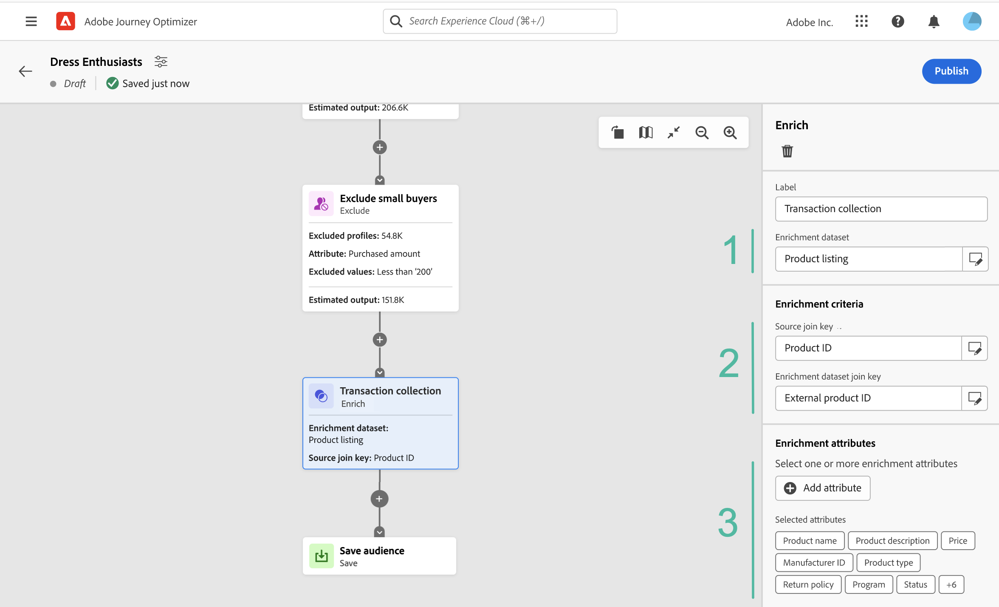

# Werken met het compositicanvas {#composition-canvas}

>[!BEGINSHADEBOX]

Deze documentatie bevat gedetailleerde informatie over het werken met de compositie van het publiek in Adobe Journey Optimizer. Als u Adobe Journey Optimizer niet gebruikt, [klik hier](https://experienceleague.adobe.com/docs/experience-platform/segmentation/ui/audience-composition.html)

>[!ENDSHADEBOX]

De samenstelling van het publiek verstrekt een visueel canvas dat u toestaat om publiek tot stand te brengen en diverse activiteiten (gespleten, verrijkt, enz.) te gebruiken.

U kunt als volgt een publiek op het canvas samenstellen:

1. [Uw beginpubliek(en) definiëren](#starting-audience)
1. [Voeg een of meerdere activiteiten toe](#action-activities)
1. [De resultaten opslaan in een nieuw publiek](#save)

## Selecteer het beginpubliek {#starting-audience}

De eerste stap om een samenstelling tot stand te brengen moet één of veelvoudige bestaande publiek als basis van uw samenstelling selecteren.

1. Selecteer **[!UICONTROL Audience]** Geef vervolgens een label voor de activiteit op.

1. Kies het publiek dat u als doel wilt instellen:

   * Klik op de knop **[!UICONTROL Add audience]** knop om een of meer bestaande doelgroepen te selecteren;
   * Klik op de knop **[!UICONTROL Build rule]** om een nieuwe publieksdefinitie tot stand te brengen gebruikend [Segmenteringsservice](https://experienceleague.adobe.com/docs/experience-platform/segmentation/ui/overview.html).

   

1. Als er meerdere soorten publiek zijn geselecteerd, geeft u op hoe de profielen van deze soorten publiek moeten worden samengevoegd:

* **[!UICONTROL Union]**: alle profielen van het geselecteerde publiek omvatten,
* **[!UICONTROL Intersection]**: profielen opnemen die alle geselecteerde doelgroepen gemeen hebben;
* **[!UICONTROL Exclude overlap]**: bevatten profielen die alleen bij een van de doelgroepen horen. Profielen die bij meer dan één publiek horen, worden niet opgenomen.

In dit voorbeeld willen we ons richten op alle profielen die tot het goud- en zilverpubliek behoren.

Nadat het publiek is geselecteerd, wordt het geschatte aantal profielen onder aan de activiteit weergegeven.

## Activiteiten toevoegen {#action-activities}

Voeg activiteiten toe nadat u het beginpubliek hebt geselecteerd om de selectie te verfijnen.

Om dit te doen, klik + knoop op de samenstellingsweg dan selecteren de gewenste activiteit. Het juiste paneel opent, toestaand u om de onlangs toegevoegde activiteit te vormen.

Beschikbare activiteiten zijn:

* [Publiek](#audience): aanvullende profielen opnemen die tot een of meer bestaande doelgroepen behoren;
* [Uitsluiten](#exclude): profielen uitsluiten die tot een bestaand publiek behoren of profielen uitsluiten die op specifieke kenmerken zijn gebaseerd;
* [Verrijken](#enrich): verrijken uw publiek met extra kenmerken die afkomstig zijn uit Adobe Experience Platform-gegevenssets.
* [Rang](#rank): rangschikt profielen die op een specifiek attribuut worden gebaseerd, specificeer het aantal profielen om te houden en hen in uw samenstelling te omvatten;
* [Splitsen](#split): verdeel uw samenstelling in veelvoudige wegen die op willekeurige percentages of op attributen worden gebaseerd.

U kunt maximaal **[!UICONTROL Audience]** en **[!UICONTROL Exclude]** activiteiten die nodig zijn in uw compositie. Er kan echter geen aanvullende activiteit worden toegevoegd na **[!UICONTROL Rank]** en **[!UICONTROL Split]** activiteiten.

U kunt een activiteit uit het canvas op elk ogenblik verwijderen door de schrappingsknoop in de juiste ruit te klikken.  Als de activiteit die u wilt schrappen een ouder van andere activiteiten in de samenstelling is, toont een berichtvertoningen, toestaand u om te specificeren als u de geselecteerde activiteit slechts, of al zijn kindactiviteiten wilt schrappen.

### Poortactiviteit {#audience}

>[!CONTEXTUALHELP]
>id="ajo_ao_audience"
>title="Poortactiviteit"
>abstract="Met de activiteit van het publiek kunt u in uw compositie aanvullende profielen opnemen die tot een bestaand publiek behoren."

>[!CONTEXTUALHELP]
>id="ajo_ao_merge_types"
>title="Typen samenvoegen"
>abstract="Geef op hoe de profielen van het geselecteerde publiek moeten worden samengevoegd."

De **[!UICONTROL Audience]** Met activiteiten kunt u in uw compositie aanvullende profielen opnemen die tot een bestaand publiek behoren.

De configuratie van deze activiteit is identiek aan het begin [Poortactiviteit](#starting-audience).

### Exclusief activiteit {#exclude}

>[!CONTEXTUALHELP]
>id="ajo_ao_exclude_type"
>title="Type uitsluiten"
>abstract="Met het publiekstype Niet opnemen kunt u profielen uitsluiten die tot een bestaand publiek behoren. Met de optie Uitsluiten met behulp van het kenmerktype kunt u profielen uitsluiten op basis van een specifiek kenmerk."

>[!CONTEXTUALHELP]
>id="ajo_ao_exclude"
>title="Exclusief activiteit"
>abstract="Met de activiteit Uitsluiten kunt u profielen uitsluiten van uw compositie door een bestaand publiek te selecteren of een regel te gebruiken."

De **[!UICONTROL Exclude]** Met activiteit kunt u profielen uitsluiten van uw compositie. Er zijn twee soorten uitsluitingen beschikbaar:

* **[!UICONTROL Exclude Audience]**: Profielen uitsluiten die bij een bestaand publiek horen.

  Klik op de knop **[!UICONTROL Add audience]** selecteert u vervolgens het publiek dat u wilt uitsluiten.

  

* **[!UICONTROL Exclude using attribute]**: Profielen uitsluiten die zijn gebaseerd op een specifiek kenmerk.

  Selecteer het kenmerk dat u wilt opzoeken en geef de waarde op die u wilt uitsluiten. In dit voorbeeld sluiten we compositieprofielen uit waarvan het adres in Japan ligt.

  

### Verrijken {#enrich}

>[!CONTEXTUALHELP]
>id="ajo_ao_enrich"
>title="Verrijken van activiteit"
>abstract="Gebruik de Verrijken activiteit om uw publiek met extra attributen te verrijken die uit de datasets van Adobe Experience Platform komen. U kunt bijvoorbeeld informatie met betrekking tot het aangekochte product toevoegen, zoals de naam, de prijs of de fabrikant-id, en deze informatie gebruiken om de leveringen die naar het publiek worden verzonden, aan te passen."

>[!CONTEXTUALHELP]
>id="ajo_ao_enrich_dataset"
>title="Verrijkingsgegevens"
>abstract="Selecteer de verrijkingsdataset die de gegevens bevat die u aan het publiek wilt associëren."

>[!CONTEXTUALHELP]
>id="ajo_ao_enrich_criteria"
>title="Verrijkingscriteria"
>abstract="Selecteer de velden die u wilt gebruiken als combinatietoets tussen de brondataset, d.w.z. het publiek, en de verrijkingsdataset."

>[!CONTEXTUALHELP]
>id="ajo_ao_enrich_attributes"
>title="Verrijkingskenmerken"
>abstract="Selecteer een of meerdere kenmerken in de verrijkingsgegevensset die u aan het publiek wilt koppelen. Zodra de samenstelling wordt gepubliceerd, worden deze attributen geassocieerd aan het publiek en kunnen in campagnes van Journey Optimizer worden gebruikt om leveringen te personaliseren."

De **[!UICONTROL Enrich]** Met deze activiteit kunt u uw publiek verrijken met extra kenmerken die afkomstig zijn uit Adobe Experience Platform-gegevenssets. U kunt bijvoorbeeld informatie met betrekking tot het aangekochte product toevoegen, zoals de naam, de prijs of de fabrikant-id, en deze informatie gebruiken om de leveringen die naar het publiek worden verzonden, aan te passen.

Houd rekening met de volgende beperkingen wanneer u werkt met de **[!UICONTROL Enrich]** activiteit:

* **Gegevenssets** voor verrijking moet het recordtype zijn (in tegenstelling tot het gebeurtenistype), en zij kunnen geen systeemdataset zijn, noch voor profiel worden gemerkt. Ze moeten kleiner zijn dan 1 GB.
* **Verrijking ondersteunt een 1:1-verbinding**. Dit betekent dat als de verbindingssleutels meer dan één gelijke op de verrijkingsdataset hebben, het systeem één van de gelijken kiest en gebruikt die voor 1:1 zich aansluit.
* **Soorten publiek kan worden geactiveerd in RTCDP-doelen**, maar hun eventuele verrijkingskenmerken kunnen dat niet.

Voer de volgende stappen uit om de activiteit te configureren:

1. Selecteer **[!UICONTROL Enrichment dataset]** met de gegevens die u aan het publiek wilt koppelen.

1. In de **[!UICONTROL Enrichment criteria]** selecteert u de velden die u wilt gebruiken als combinatietoets tussen de brondataset, d.w.z. het publiek, en de verrijkingsdataset. In dit voorbeeld gebruiken we de id van het aangeschafte product als verzoeningssleutel.

1. Klik op de knop **[!UICONTROL Add atttributes]** dan selecteert de knoop één of veelvoudige attributen van de verrijkingsdataset aan vennoot aan het publiek.

   

Zodra de samenstelling wordt gepubliceerd, worden de geselecteerde attributen geassocieerd aan het publiek en kunnen in campagnes worden gebruikt om leveringen te personaliseren.

### Leesactiviteit {#rank}

>[!CONTEXTUALHELP]
>id="ajo_ao_ranking"
>title="Leesactiviteit"
>abstract="De activiteit van de Rang staat u toe om profielen te rangschikken die op een specifiek attribuut worden gebaseerd en hen te omvatten in uw samenstelling. Neem bijvoorbeeld de 50 profielen op met de grootste hoeveelheid loyaliteitspunten."

>[!CONTEXTUALHELP]
>id="ajo_ao_rank_profilelimit_text"
>title="Profiellimiet toevoegen"
>abstract="Schakel deze optie in om een maximumaantal profielen op te geven dat u in de compositie wilt opnemen."

De **[!UICONTROL Rank]** De activiteit staat u toe om profielen te rangschikken die op een specifiek attribuut worden gebaseerd en hen te omvatten in uw samenstelling. U kunt bijvoorbeeld de 50 profielen met de grootste hoeveelheid loyaliteitspunten opnemen.

1. Selecteer het kenmerk dat u wilt opzoeken en geef een rangschikking op (oplopend of aflopend).

   >[!NOTE]
   >
   >U kunt kenmerken selecteren met de volgende gegevenstypen: integer, numbers, short <!--(other?)-->

1. Schakelen tussen **[!UICONTROL Add profile limit]** en geeft u een maximumaantal profielen op dat u in de compositie wilt opnemen.

   

### Gesplitste activiteit {#split}

<!-- [!CONTEXTUALHELP]
>id="ajo_ao_control_group_text"
>title="Control Group"
>abstract="Use control groups to isolate a portion of the profiles. This allows you to measure the impact of a marketing activity and make a comparison with the behavior of the rest of the population."-->

>[!CONTEXTUALHELP]
>id="ajo_ao_split"
>title="Gesplitste activiteit"
>abstract="Met de activiteit Splitsen kunt u de compositie opsplitsen in meerdere paden. Wanneer u de compositie publiceert, wordt voor elk pad één publiek opgeslagen in Adobe Experience Platform."

>[!CONTEXTUALHELP]
>id="ajo_ao_split_type"
>title="Tekst splitsen"
>abstract="Met het gesplitste percentage kunt u profielen op willekeurige wijze splitsen in meerdere paden. Met het splitsingstype Kenmerk kunt u profielen splitsen op basis van een specifiek kenmerk."

>[!CONTEXTUALHELP]
>id="ajo_ao_split_otherprofiles_text"
>title="Andere profielen"
>abstract="Schakel deze optie in of uit om een extra pad te maken met de resterende profielen die niet overeenkomen met een van de voorwaarden die in de andere paden zijn opgegeven."

De **[!UICONTROL Split]** Met activiteit kunt u de compositie opsplitsen in meerdere paden.

Deze bewerking voegt automatisch een **[!UICONTROL Save]** activiteit aan het einde van elk pad. Wanneer u de compositie publiceert, wordt voor elk pad één publiek opgeslagen in Adobe Experience Platform.

Er zijn twee soorten splitsingsbewerkingen beschikbaar:

* **[!UICONTROL Percent split]**: willekeurig gesplitste profielen in twee of meer paden. U kunt de profielen bijvoorbeeld opsplitsen in twee afzonderlijke paden van elk 50%. <!--and add an additional path for control group.-->

  

* **[!UICONTROL Attribute split]**: gesplitste profielen op basis van een specifiek kenmerk. In dit voorbeeld splitsen we profielen op basis van voorkeuren voor kamertype.

  

  >[!NOTE]
  >
  >De **[!UICONTROL Other profiles]** kunt u een extra pad maken met de resterende profielen die niet overeenkomen met een van de voorwaarden die in de andere paden zijn opgegeven.

## Uw publiek opslaan {#save}

Configureer het resulterende publiek dat in Adobe Experience Platform wordt opgeslagen.

Selecteer hiervoor de optie **[!UICONTROL Save audience]** aan het einde van elk pad geeft u vervolgens de naam op van het nieuwe publiek dat u wilt maken.

Zodra uw samenstelling klaar is, kunt u het publiceren. [Leer hoe u composities maakt](create-compositions.md)
