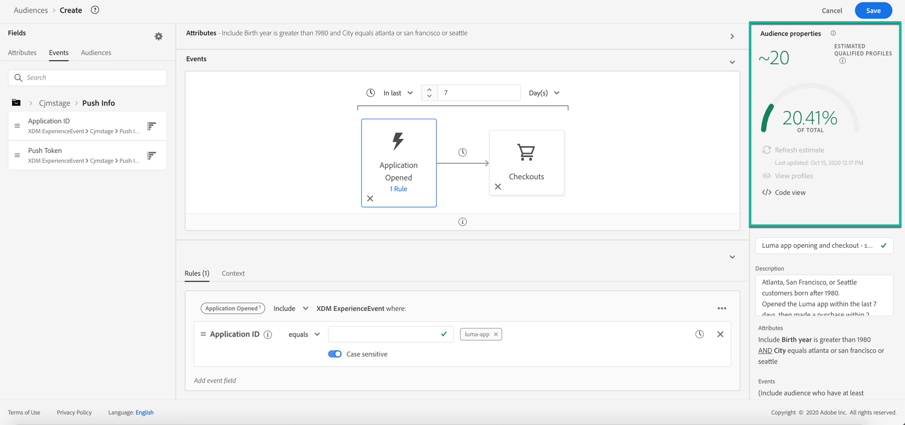
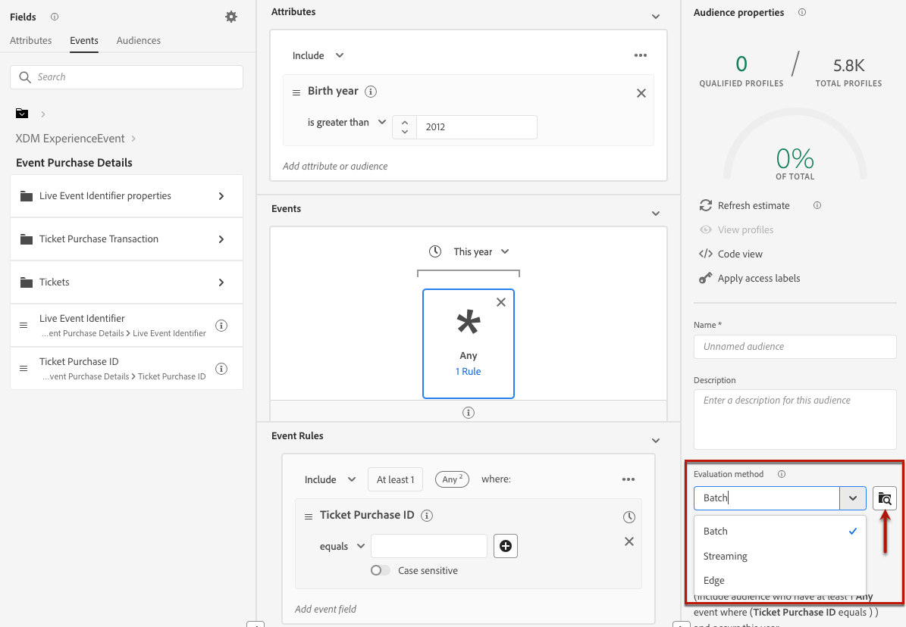

# Segmentdefinities samenstellen {#build-segments}

>[!CONTEXTUALHELP]
>id="ajo_ao_create_rule"
>title="Een regel maken"
>abstract="Met de methode voor het maken van buildregels kunt u een nieuwe publieksdefinitie maken met Adobe Experience Platform Segmentation Service."

## Een segmentdefinitie maken {#create}

In dit voorbeeld, bouwt u een publiek om alle klanten te richten die in Atlanta, San Francisco, of Seattle wonen en na 1980 worden geboren. Al deze klanten moeten een aankoop hebben gedaan binnen de laatste 7 dagen.

➡️ [&#x200B; Leer hoe te om publiek in deze video tot stand te brengen &#x200B;](#video-segment)

1. Klik in het menu **[!UICONTROL Audiences]** op de knop **[!UICONTROL Create audience]** en selecteer **[!UICONTROL Build rule]** .

   

   In het scherm voor segmentdefinitie kunt u alle vereiste velden configureren om uw publiek te definiëren. Leer hoe te om publiek in de [&#x200B; documentatie van de Dienst van de Segmentatie &#x200B;](https://experienceleague.adobe.com/nl/docs/experience-platform/segmentation/methods/overview){target="_blank"} te vormen.

   

1. Geef in het deelvenster **[!UICONTROL Audience properties]** een naam en een beschrijving (optioneel) voor de doelgroep op.

   

1. Sleep de gewenste velden vanuit het linkerdeelvenster naar de werkruimte in het midden en configureer ze op basis van uw behoeften.

   De basisbouwstenen van segmentdefinities zijn **attributen** en **gebeurtenissen**. Daarnaast kunnen de kenmerken en gebeurtenissen in bestaande doelgroepen worden gebruikt als componenten voor nieuwe definities. [&#x200B; leer meer in de de dienstdocumentatie van de Segmentatie &#x200B;](https://experienceleague.adobe.com/nl/docs/experience-platform/segmentation/ui/segment-builder#building-blocks){target="_blank"}

   >[!NOTE]
   >
   >Merk op dat de gebieden beschikbaar in de linkerruit afhankelijk van variëren hoe **XDM Individuele Profiel** en **XDM ExperienceEvent** schema&#39;s voor uw organisatie zijn gevormd.  Leer meer in de [&#x200B; documentatie van de Gegevens van de Ervaring Model (XDM) &#x200B;](https://experienceleague.adobe.com/docs/experience-platform/xdm/home.html?lang=nl){target="_blank"}.

   

   In dit voorbeeld, moeten wij op **Attributen** en **Gebeurtenissen** gebieden vertrouwen om het publiek te bouwen:

   * **Attributen**: profielen die in Atlanta, San Francisco of Seattle na 1980 worden geboren.

     

   * **Gebeurtenissen**: profielen die een aankoop binnen de laatste 7 dagen maakten.

     

1. Terwijl u nieuwe velden toevoegt en configureert in de werkruimte, wordt het deelvenster **[!UICONTROL Audience Properties]** automatisch bijgewerkt met informatie over de geschatte profielen die bij het publiek horen.

   

1. Klik op **[!UICONTROL Save]** als het publiek klaar is. Deze wordt weergegeven in de lijst met Adobe Experience Platform-doelgroepen. Er is een zoekbalk beschikbaar waarmee u een bepaald publiek in de lijst kunt zoeken.

Het publiek is nu klaar voor gebruik tijdens uw reizen. Raadpleeg [deze sectie](../audience/about-audiences.md) voor meer informatie.

## Methoden voor de evaluatie van het publiek {#evaluation-method-in-journey-optimizer}

In Adobe Journey Optimizer wordt het publiek gegenereerd op basis van segmentdefinities aan de hand van een van de drie onderstaande evaluatiemethoden.

+++ Streaming segmentering

De profiellijst voor het publiek wordt bijgewerkt in real time aangezien de nieuwe gegevens in het systeem stromen.

Streaming segmentatie is een doorlopend proces voor gegevensselectie dat uw publiek bijwerkt als reactie op gebruikersactiviteit. Zodra een segmentdefinitie is gebouwd en het resulterende publiek is bewaard, wordt de segmentdefinitie toegepast op inkomende gegevens aan Journey Optimizer. Dit betekent dat individuen worden toegevoegd of uit het publiek verwijderd aangezien hun profielgegevens veranderen, ervoor zorgen dat uw doelpubliek altijd relevant is. [&#x200B; leer meer in de documentatie van Adobe Experience Platform &#x200B;](https://experienceleague.adobe.com/docs/experience-platform/segmentation/ui/streaming-segmentation.html?lang=nl-NL){target="_blank"}.

>[!IMPORTANT]
>
>Vanaf 1 November, 2024, steunt het stromen segmentatie niet meer het gebruik van **verzendt** en **open** gebeurtenissen van Journey Optimizer het volgen en terugkoppelt datasets.
>
>* Deze wijziging geldt voor alle sandboxen en organisaties van klanten.
>* Dit heeft alleen invloed op verzendings- en open gebeurtenissen: klikken en andere volggebeurtenissen blijven beschikbaar voor streamingsegmentatie.
>* Deze wijziging is alleen van toepassing op streamingsegmentatie. Verstuur en open gebeurtenissen kunnen nog in partijsegmenten worden gebruikt, maar als inbegrepen in een het stromen segment, worden zij geëvalueerd op een partijmanier. Bovendien worden uitsluitingsgebeurtenissen en stuit-/vertragingsgebeurtenissen als gevolg van verzendgebeurtenissen ook beïnvloed door deze wijziging.
>* Het bijhouden van gegevensverzameling wordt niet beïnvloed. Gebeurtenissen verzenden en openen worden op de gebruikelijke wijze verzameld.
>* Deze wijziging heeft geen invloed op de reacties op reizen.

+++

+++ Batchsegmentatie

De profiellijst voor het publiek wordt om de 24 uur geëvalueerd.

De segmentatie van de partij verwerkt alle profielgegevens in één keer door segmentdefinities, die tot een momentopname van het publiek leiden dat voor gebruik kan worden bewaard en worden uitgevoerd. In tegenstelling tot het stromen segmenteren, werkt de partijsegmentatie niet ononderbroken de publiekslijst in real time bij. De nieuwe gegevens die binnen na het partijproces komen worden niet weerspiegeld in het publiek tot het volgende partijproces. Pogingen om een onmiddellijke update te forceren hebben geen voorrang op de dagelijkse cyclus. Voor directe incrementele updates kunt u streaming- of segmentatieopties op aanvraag gebruiken.

Voor meer details, verwijs naar de [&#x200B; documentatie van de Dienst van de Segmentatie van Adobe Experience Platform &#x200B;](https://experienceleague.adobe.com/docs/experience-platform/segmentation/home.html?lang=nl-NL#batch){target="_blank"}

+++

+++ Edge-segmentatie

De segmentatie van Edge is de capaciteit om segmenten in Adobe Experience Platform onmiddellijk [&#x200B; op de rand &#x200B;](https://experienceleague.adobe.com/docs/experience-platform/edge/home.html?lang=nl-NL){target="_blank"} te evalueren, toelatend zelfde-pagina en volgende-pagina het gebruikscase van de verpersoonlijking. Momenteel kunnen alleen bepaalde querytypen worden geëvalueerd met randsegmentatie. Voor meer details, verwijs naar de [&#x200B; documentatie van de Dienst van de Segmentatie van Adobe Experience Platform &#x200B;](https://experienceleague.adobe.com/docs/experience-platform/segmentation/ui/edge-segmentation.html?lang=nl-NL#query-types){target="_blank"}

+++

Als u de evaluatiemethode kent u wilt gebruiken, selecteer het gebruikend de drop-down lijst. U kunt ook op het pictogram van de bladerpictogrammap met een vergrootglas klikken om een lijst met de beschikbare evaluatiemethoden voor segmentdefinitie weer te geven. Voor meer details, verwijs naar de [&#x200B; documentatie van de Dienst van de Segmentatie van Adobe Experience Platform &#x200B;](https://experienceleague.adobe.com/docs/experience-platform/segmentation/ui/segment-builder.html?lang=nl-NL#segment-properties){target="_blank"}.

<!--The determination between batch segmentation and streaming segmentation is made by the system for each audience, based on the complexity and the cost of evaluating the segment definition rule. You can view the evaluation method for each audience in the **[!UICONTROL Evaluation method]** column of the audience list.
    

>[!NOTE]
>
>If the **[!UICONTROL Evaluation method]** column does not display, you  need to add it using configuration button on the top right of the list.-->

Nadat u een publiek voor het eerst hebt gedefinieerd, worden profielen toegevoegd aan het publiek wanneer deze in aanmerking komen. Het ondersteunen van het publiek op basis van eerdere gegevens kan 24 uur in beslag nemen. Nadat het publiek is teruggevuld, wordt het publiek voortdurend bijgewerkt en is altijd klaar om zich te richten.

## Flexibele publieksevaluatie {#flexible}

Met het Adobe Experience Platform Audience Portal kunt u een segmentatietaak uitvoeren voor een geselecteerd publiek, zodat u altijd over de meest actuele publieksgegevens beschikt voordat u deze doelt op Journey Optimizer-reizen en -campagnes.

Met flexibele publieksevaluatie kunt u:

1. Maak een nieuw segment op basis van de meest recente gegevens.
1. Evalueer het publiek in real time om nauwkeurigheid te verzekeren. Om dit te doen, kies de soorten publiek u &quot;evalueert publiek&quot;evalueert en wilt selecteren, op voorwaarde dat zij aan specifieke criteria (b.v., op mensen-gebaseerd, de oorsprong van de Dienst van de Segmentatie) voldoen.
1. Gebruik het geëvalueerde publiek in Adobe Journey Optimizer campagnes of reizen voor nauwkeurige gericht richten.

U kunt maximaal 20 soorten publiek tegelijk evalueren en niet-subsidiabele doelgroepen worden automatisch uitgesloten. Voor meer details, zie de [&#x200B; documentatie van de Dienst van de Segmentatie van Adobe Experience Platform &#x200B;](https://experienceleague.adobe.com/nl/docs/experience-platform/segmentation/ui/audience-portal#flexible-audience-evaluation).

## Hoe kan ik-video{#video-segment}

Begrijp hoe Journey Optimizer regels gebruikt om publiek te produceren, en hoe te om attributen, gebeurtenissen, en bestaand publiek te gebruiken om een publiek tot stand te brengen.

>[!VIDEO](https://video.tv.adobe.com/v/3425020?quality=12)
