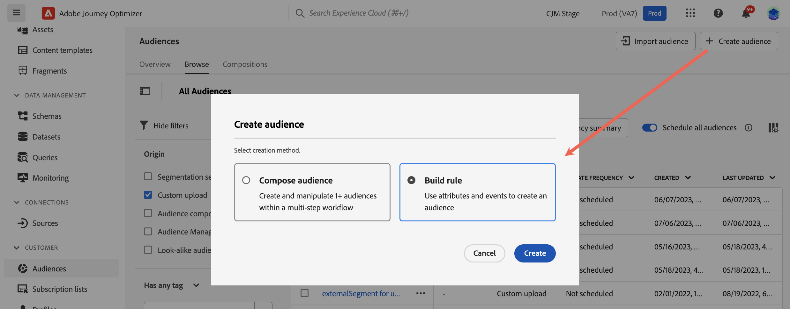
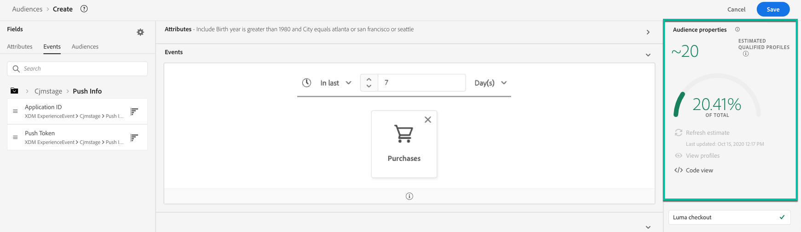

# Segmentdefinities samenstellen {#build-segments}

>[!CONTEXTUALHELP]
>id="ajo_ao_create_rule"
>title="Een regel maken"
>abstract="Met de methode voor het maken van buildregels kunt u een nieuwe publieksdefinitie maken met Adobe Experience Platform Segmentation Service."

In dit voorbeeld bouwen we een publiek dat gericht is op alle klanten die in Atlanta, San Francisco of Seattle wonen en na 1980 geboren zijn. Al deze klanten hadden de toepassing Luma in de laatste 7 dagen moeten openen en vervolgens binnen 2 uur na het openen van de toepassing een aankoop moeten doen.

➡️ [Leer hoe u in deze video een publiek kunt maken](#video-segment)

1. Van de **[!UICONTROL Audiences]** klikt u op de knop **[!UICONTROL Create audience]** en selecteert u **[!UICONTROL Build rule]**.

   

   In het scherm voor segmentdefinitie kunt u alle vereiste velden configureren om uw publiek te definiëren. Leer hoe te om publiek in te vormen in [Documentatie voor segmentatieservice](https://experienceleague.adobe.com/docs/experience-platform/segmentation/ui/overview.html){target="_blank"}.

   

1. In de **[!UICONTROL Audience properties]** Geef een naam en een beschrijving (optioneel) voor de doelgroep op.

   

1. Sleep de gewenste velden vanuit het linkerdeelvenster naar de werkruimte in het midden en configureer ze op basis van uw behoeften.

   >[!NOTE]
   >
   >De velden in het linkervenster zijn afhankelijk van de manier waarop de **Afzonderlijk XDM-profiel** en **XDM ExperienceEvent** De schema&#39;s zijn gevormd voor uw organisatie.  Meer informatie in het dialoogvenster [XDM-documentatie (Experience Data Model)](https://experienceleague.adobe.com/docs/experience-platform/xdm/home.html?lang=nl){target="_blank"}.

   

   In dit voorbeeld moeten we erop vertrouwen **Attributen** en **Gebeurtenissen** velden voor het opbouwen van het publiek:

   * **Attributen** Betreft: Profielen in Atlanta, San Francisco of Seattle geboren na 1980

     

   * **Gebeurtenissen**: profielen die de toepassing Luma in de laatste 7 dagen hebben geopend en die vervolgens binnen 2 uur na het openen van de toepassing een aankoop hebben gedaan.

     

     >[!NOTE]
     >
     >Adobe raadt u aan geen gebeurtenissen met streaming segmentatie te gebruiken en te verzenden. In plaats daarvan, gebruik echte user-activity signalen zoals kliks, aankopen, of baken gegevens. Voor frequentie of suppression logica, gebruik bedrijfsregels eerder dan verzendt gebeurtenissen. [Meer informatie](about-audiences.md#open-and-send-event-guardrails)

1. Terwijl u nieuwe velden toevoegt en configureert in de werkruimte, worden de **[!UICONTROL Audience Properties]** wordt automatisch bijgewerkt met informatie over de geschatte profielen die bij het publiek horen.

   

1. Als het publiek klaar is, klikt u op **[!UICONTROL Save]**. Deze wordt weergegeven in de lijst met Adobe Experience Platform-doelgroepen. Er is een zoekbalk beschikbaar waarmee u een bepaald publiek in de lijst kunt zoeken.

Het publiek kan nu worden gebruikt voor uw reizen. Raadpleeg [deze sectie](../audience/about-audiences.md) voor meer informatie.

## Hoe kan ik-video{#video-segment}

Begrijp hoe Journey Optimizer regels gebruikt om publiek te produceren en te leren hoe te om attributen, gebeurtenissen, en bestaand publiek te gebruiken om een publiek tot stand te brengen.

>[!VIDEO](https://video.tv.adobe.com/v/3425020?quality=12)
