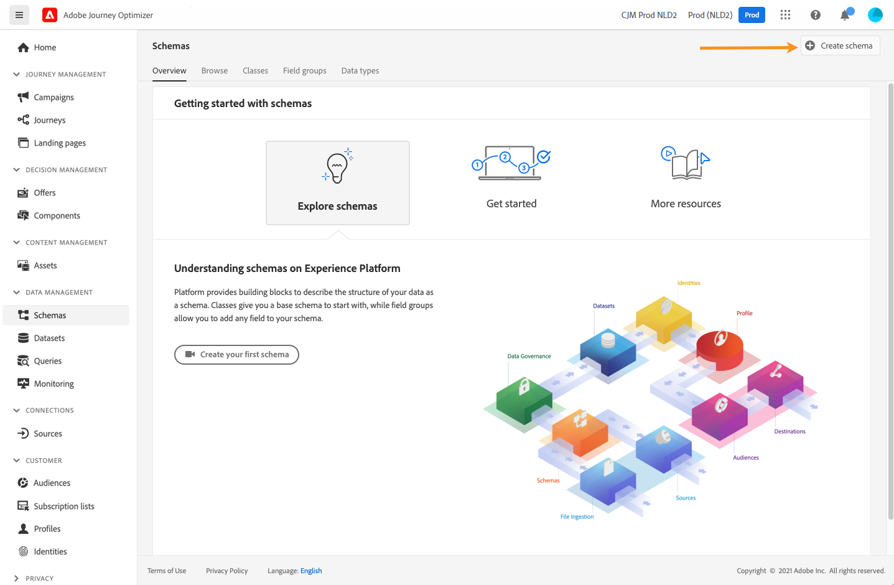
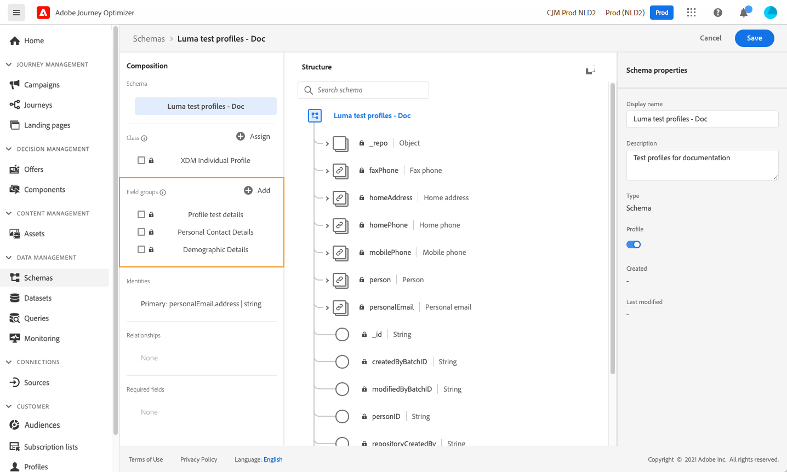
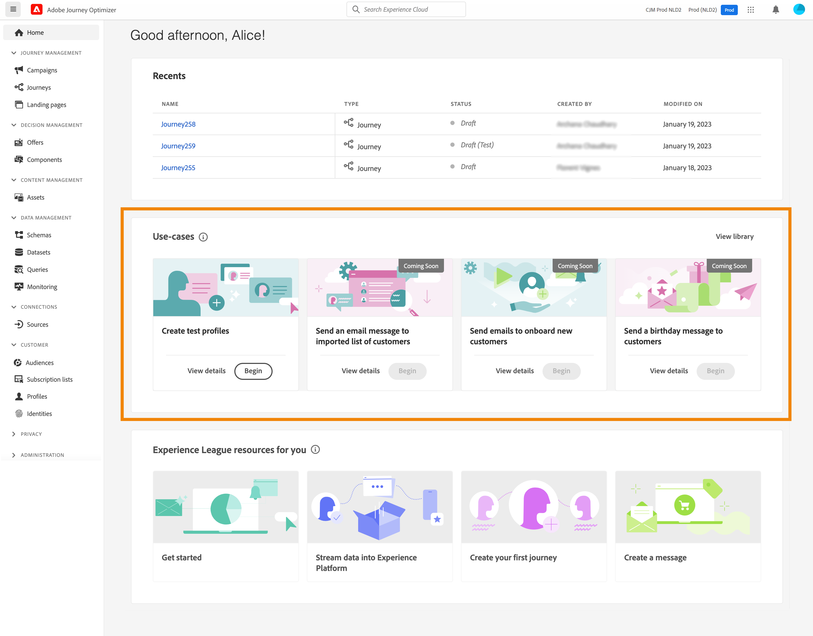
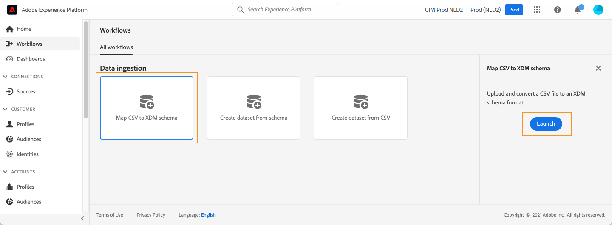

# Testprofielen maken {#create-test-profiles}

De profielen van de test worden vereist wanneer het gebruiken van de [&#x200B; testwijze &#x200B;](../building-journeys/testing-the-journey.md) in een reis, en aan [&#x200B; voorproef en test uw inhoud &#x200B;](../content-management/preview-test.md).

>[!NOTE]
>
>In [!DNL Journey Optimizer] kunt u verschillende varianten van de inhoud testen door een voorbeeld van de inhoud te bekijken en proefdrukken te verzenden met behulp van voorbeeldinvoergegevens die vanuit een CSV- of JSON-bestand zijn geüpload of handmatig zijn toegevoegd. [&#x200B; Leer hoe te om uw inhoud te testen gebruikend de gegevens van de steekproefinput &#x200B;](../test-approve/simulate-sample-input.md)

U kunt testprofielen tot stand brengen door [&#x200B; een Csv- dossier &#x200B;](#create-test-profiles-csv) te uploaden of [&#x200B; API vraag &#x200B;](#create-test-profiles-api) te gebruiken. [!DNL Adobe Journey Optimizer] verstrekt ook een specifiek [&#x200B; in-product gebruiksgeval &#x200B;](#use-case-1) om de verwezenlijking van het testprofiel te vergemakkelijken.

U kunt een JSON-bestand uploaden naar een bestaande gegevensset. Voor meer informatie, verwijs naar de [&#x200B; documentatie van de Ingestie van Gegevens &#x200B;](https://experienceleague.adobe.com/docs/experience-platform/ingestion/tutorials/ingest-batch-data.html#add-data-to-dataset){target="_blank"}.

Het maken van een testprofiel lijkt op het maken van gewone profielen in [!DNL Adobe Experience Platform] . Voor meer informatie, verwijs naar de [&#x200B; documentatie van het Profiel van de Klant in real time &#x200B;](https://experienceleague.adobe.com/docs/experience-platform/profile/home.html?lang=nl){target="_blank"}.

➡️ [&#x200B; Leer hoe te om testprofielen in deze video tot stand te brengen &#x200B;](#video)

## Vereisten {#test-profile-prerequisites}

Als u profielen wilt maken, moet u eerst een schema en een gegevensset maken in Adobe [!DNL Journey Optimizer] .

### Een schema maken

Om **tot een schema** te leiden, volg deze stappen:

1. Klik in de menusectie GEGEVENSBEHEER op **[!UICONTROL Schemas]** en selecteer de knop **[!UICONTROL Create schema]** .

   

1. Selecteer **[!UICONTROL Standard]** als de optie voor het maken van het schema.
1. Selecteer een schematype, bijvoorbeeld **Individueel Profiel**, en klik **daarna**.
   
1. Ga een naam voor uw schema in en klik **Afwerking**.
   
1. In de **sectie van de Groepen van het Gebied**, op de linkerzijde, voegt de klik **&#x200B;**&#x200B;toe en selecteert de aangewezen gebiedsgroepen. Zorg ervoor u de **de testdetails van het Profiel** gebiedsgroep toevoegt.
   
Klik eenmaal op **[!UICONTROL Add field groups]** : de lijst met veldgroepen wordt weergegeven in het overzichtsscherm van het schema.
   

   >[!NOTE]
   >
   >Klik op de naam van het schema om de eigenschappen ervan bij te werken.

1. Klik in de lijst met velden op het veld dat u als primaire identiteit wilt definiëren.
   
1. Controleer in het deelvenster **[!UICONTROL Field properties]** rechts de opties **[!UICONTROL Identity]** en **[!UICONTROL Primary Identity]** en selecteer een naamruimte. Als u wilt dat de primaire identiteit een e-mailadres is, kiest u de naamruimte **[!UICONTROL Email]** . Klik op **[!UICONTROL Apply]**.
   
1. Selecteer het schema en schakel de optie **[!UICONTROL Profile]** in het deelvenster **[!UICONTROL Schema properties]** in.
   
1. Klik **sparen**.

>[!NOTE]
>
>Voor meer informatie over schemaverwezenlijking, verwijs naar de [&#x200B; documentatie XDM &#x200B;](https://experienceleague.adobe.com/docs/experience-platform/xdm/ui/resources/schemas.html#prerequisites){target="_blank"}.

### Een gegevensset maken

Dan moet u **tot de dataset** leiden waarin de profielen zullen worden ingevoerd. Voer de volgende stappen uit:

1. Blader naar **[!UICONTROL Datasets]** en klik op **[!UICONTROL Create dataset]** .
   
1. Kies **[!UICONTROL Create dataset from schema]** .
   
1. Selecteer het eerder gemaakte schema en klik op **[!UICONTROL Next]** .
   
1. Kies een naam en klik op **[!UICONTROL Finish]** .
   
1. Schakel de optie **[!UICONTROL Profile]** in.
   

>[!NOTE]
>
> Voor meer informatie over datasetverwezenlijking, verwijs naar de [&#x200B; documentatie van de Dienst van de Catalogus &#x200B;](https://experienceleague.adobe.com/docs/experience-platform/catalog/datasets/user-guide.html#getting-started){target="_blank"}.

## Gebruiksscenario in het product{#use-case-1}

Vanaf de startpagina van [!DNL Adobe Journey Optimizer] kunt u de testprofielen gebruiken in het product. Met dit gebruiksgeval kunt u testprofielen maken die worden gebruikt voor het testen van reizen voordat ze worden gepubliceerd.



Klik op de knop **[!UICONTROL Begin]** om het hoofdlettergebruik te starten.

De volgende informatie is vereist:

1. **Identiteit namespace**: [&#x200B; identiteit namespace &#x200B;](../audience/get-started-identity.md) wordt gebruikt om de testprofielen uniek te identificeren die. Bijvoorbeeld, als e-mail wordt gebruikt om de testprofielen te identificeren, zou de identiteit namespace **E-mail** moeten worden geselecteerd. Als het unieke herkenningsteken het telefoonaantal is, dan zou de identiteit namespace **Telefoon** moeten worden geselecteerd.

2. **CSV dossier**: Een komma gescheiden dossier dat de lijst van te creëren testprofielen bevat. De gebruikscase verwacht een vooraf gedefinieerde indeling voor het CSV-bestand dat de lijst met testprofielen bevat die moet worden gemaakt. Elke rij in het bestand moet de volgende velden in de juiste volgorde bevatten:

   1. **Identiteitskaart van de Persoon**: Unieke herkenningsteken van het testprofiel. De waarden van dit veld moeten de naamruimte weerspiegelen die is geselecteerd. (Als voorbeeld, als **Telefoon** voor identiteit namespace wordt geselecteerd, dan zouden de waarden van dit gebied telefoonaantallen moeten zijn. Op dezelfde manier als **E-mail** wordt geselecteerd, dan zouden de waarden van dit gebied e-mail moeten zijn)
   1. **E-mailadres**: Het e-mailadres van het profiel van de test. (Het **Identiteitskaart van de Persoon** gebied en het **E-mailAdres** gebied konden de zelfde waarden potentieel bevatten als **E-mail** als identiteit namespace wordt geselecteerd)
   1. **Voornaam**: De voornaam van het profiel van de test.
   1. **Familienaam**: De achternaam van het profiel van de test.
   1. **Stad**: De stad van het profiel van de test van verblijf
   1. **Land**: Het profielland van de test van woonplaats
   1. **Geslacht**: Het profielgeslacht van de test. De beschikbare waarden zijn **man**, **vrouwelijk** en **niet_gespecificeerd**

Nadat u de naamruimte van de identiteit hebt geselecteerd en het CSV-bestand hebt opgegeven op basis van de bovenstaande indeling, selecteert u de knop **[!UICONTROL Run]** rechtsboven. Het kan enkele minuten duren voordat de gebruiksaanwijzing is voltooid. Zodra het gebruik is voltooid en de testprofielen zijn gemaakt, wordt een melding verzonden om de gebruiker op de hoogte te stellen.
>[!NOTE]
>
>Testprofielen kunnen bestaande profielen overschrijven. Controleer voordat u het gebruiksscenario uitvoert of het CSV-bestand alleen testprofielen bevat en of het wordt uitgevoerd met de juiste sandbox.

<!-- Removed as asked in DOCAC-13605 AJO Test Profiles Using a Journey should be removed
## Turn a profile into a test profile{#turning-profile-into-test}

You can turn an existing profile into a test profile: you can update profiles attributes in the same way as when you create a profile. 

A simple way to do this is by using an **[!UICONTROL Update Profile]** action activity in a journey and change the **testProfile** boolean field from false to true.

Your journey will be composed of a **[!UICONTROL Read Audience]** and an **[!UICONTROL Update Profile]** activity. You first need to create an audience targeting the profiles you want to turn into test profiles. 

>[!NOTE]
>
> Since you will be updating the **testProfile** field, the chosen profiles must include this field. The related schema must have the **Profile test details** field group. See [this section](../audience/creating-test-profiles.md#create-test-profiles).

1. Browse to **Audiences**, then **Create audience**, in the top right.
     
1. Define a name for your audience and build the audience: choose the field(s) and value(s) to target the profiles you want.
     
1. Click **Save** and check that the profiles are correctly targeted by the audience.
     

    >[!NOTE]
    >
    > Audience calculation can take some time. Learn more about audiences in [this section](../audience/about-audiences.md).

1. Now create a new journey and start with a **[!UICONTROL Read Audience]** orchestration activity.
1. Choose the previously created audience and the namespace that your profiles use.
    
1. Add an **[!UICONTROL Update Profile]** action activity. 
1. Select the schema, the **testProfiles** field, the dataset and set the value to **True**. To perform this, in the **[!UICONTROL VALUE]** field, click the **Pen** icon on the right, select **[!UICONTROL Advanced mode]** and enter **true**.
    
1. Click **[!UICONTROL Publish]**.
1. In the **[!UICONTROL Audiences]** section, check that the profiles have been correctly updated.
    

    >[!NOTE]
    >
    > For more information on the **[!UICONTROL Update Profile]** activity, refer to [this section](../building-journeys/update-profiles.md).
-->

## Een testprofiel maken met een CSV-bestand{#create-test-profiles-csv}

In [!DNL Adobe Experience Platform] kunt u profielen maken door een CSV-bestand met de verschillende profielvelden te uploaden naar uw gegevensset. Dit is de eenvoudigste methode.

1. Maak een eenvoudig CSV-bestand met behulp van een spreadsheetsoftware.
1. Voeg één kolom toe voor elk vereist veld. Voeg het primaire identiteitsveld (&quot;personID&quot; in het bovenstaande voorbeeld) en het veld &quot;testProfile&quot; toe op &quot;true&quot;.
   
1. Voeg één regel per profiel toe en vul de waarden voor elk veld in.
   
1. Sla het werkblad op als een CSV-bestand. Controleer of komma&#39;s als scheidingstekens worden gebruikt.
1. Blader naar [!DNL Adobe Experience Platform] **Werkschema&#39;s**.
   
1. Kies **CSV van de Kaart aan XDM schema**, dan klik **Lancering**.
   
1. Selecteer de dataset u de profielen in wilt invoeren. Klik **daarna**.
   
1. Klik **kiezen dossiers** en selecteer uw csv- dossier. Wanneer het dossier wordt geupload, klik **daarna**.
   
1. Wijs de bronCSV gebieden aan de schemagebieden in kaart, dan klik **Afwerking**.
   
1. Het importeren van de gegevens begint. De status zal zich van **Verwerking** aan **Succes** bewegen. Klik **dataset van de Voorproef**, in het hoogste recht.
   
1. Controleer of de testprofielen correct zijn toegevoegd.
   

Uw testprofielen worden toegevoegd en kunnen nu worden gebruikt bij het testen van een reis. Zie [deze sectie](../building-journeys/testing-the-journey.md).

>[!NOTE]
>
>Voor meer informatie over csv de invoer, verwijs naar de [&#x200B; documentatie van de Ingestie van Gegevens &#x200B;](https://experienceleague.adobe.com/docs/experience-platform/ingestion/tutorials/map-a-csv-file.html#tutorials){target="_blank"}.

## Testprofielen maken met behulp van API-aanroepen{#create-test-profiles-api}

U kunt testprofielen ook maken via API-aanroepen. Leer meer in [[!DNL Adobe Experience Platform]  documentatie &#x200B;](https://experienceleague.adobe.com/docs/experience-platform/profile/home.html?lang=nl){target="_blank"}.

U moet een profielschema gebruiken dat de het gebiedsgroep van &quot;de testdetails van het Profiel&quot;bevat. De markering testProfile maakt deel uit van deze veldgroep.
Wanneer u een profiel maakt, moet u de waarde testProfile = true doorgeven.

U kunt een bestaand profiel ook bijwerken en de markering testProfile wijzigen in &quot;true&quot;.

Hier volgt een voorbeeld van een API-aanroep om een testprofiel te maken:

```bash
curl -X POST \
'https://dcs.adobedc.net/collection/xxxxxxxxxxxxxx' \
-H 'Cache-Control: no-cache' \
-H 'Content-Type: application/json' \
-H 'Postman-Token: xxxxx' \
-H 'cache-control: no-cache' \
-H 'x-api-key: xxxxx' \
-H 'x-gw-ims-org-id: xxxxx' \
-d '{
"header": {
"msgType": "xdmEntityCreate",
"msgId": "xxxxx",
"msgVersion": "xxxxx",
"xactionid":"xxxxx",
"datasetId": "xxxxx",
"imsOrgId": "xxxxx",
"source": {
"name": "Postman"
},
"schemaRef": {
"id": "https://example.adobe.com/mobile/schemas/xxxxx",
"contentType": "application/vnd.adobe.xed-full+json;version=1"
}
},
"body": {
"xdmMeta": {
"schemaRef": {
"contentType": "application/vnd.adobe.xed-full+json;version=1"
}
},
"xdmEntity": {
"_id": "xxxxx",
"_mobile":{
"ECID": "xxxxx"
},
"testProfile":true
}
}
}'
```

## Hoe kan ik-video {#video}

Leer hoe u testprofielen maakt.

>[!VIDEO](https://video.tv.adobe.com/v/334236?quality=12)
