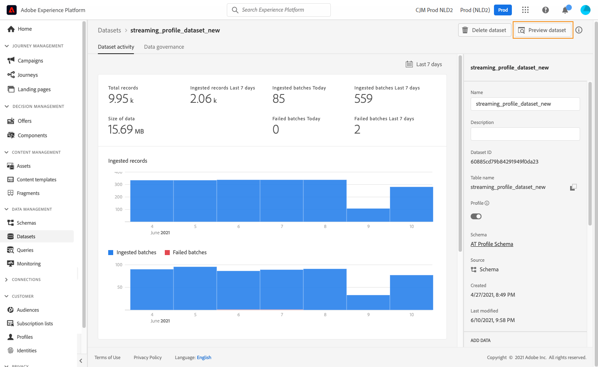

# Testprofielen maken {#create-test-profiles}

De profielen van de test worden vereist wanneer het gebruiken van de [&#x200B; testwijze &#x200B;](../building-journeys/testing-the-journey.md) in een reis, en aan [&#x200B; voorproef en test uw inhoud &#x200B;](../content-management/preview-test.md).


>[!NOTE]
>
>In [!DNL Journey optimizer] kunt u verschillende varianten van de inhoud testen door een voorbeeld van de inhoud te bekijken en proefdrukken te verzenden met behulp van voorbeeldinvoergegevens die vanuit een CSV- of JSON-bestand zijn geüpload of handmatig zijn toegevoegd. [&#x200B; Leer hoe te om uw inhoud te testen gebruikend de gegevens van de steekproefinput &#x200B;](../test-approve/simulate-sample-input.md)

U kunt testprofielen op verschillende manieren maken. Op de volgende pagina vindt u details:

* Draai een [&#x200B; bestaand profiel &#x200B;](#turning-profile-into-test) in een testprofiel

* Creeer testprofielen door a [&#x200B; CSV dossier &#x200B;](#create-test-profiles-csv) te uploaden of [&#x200B; API vraag &#x200B;](#create-test-profiles-api) te gebruiken.

  Adobe Journey Optimizer verstrekt ook een specifiek [&#x200B; in-product gebruiksgeval &#x200B;](#use-case-1) om de verwezenlijking van het testprofiel te vergemakkelijken.

U kunt een JSON-bestand uploaden naar een bestaande gegevensset. Voor meer informatie, verwijs naar de [&#x200B; documentatie van de Ingestie van Gegevens &#x200B;](https://experienceleague.adobe.com/docs/experience-platform/ingestion/tutorials/ingest-batch-data.html?lang=nl-NL#add-data-to-dataset){target="_blank"}.

Het maken van een testprofiel lijkt op het maken van gewone profielen in Adobe Experience Platform. Voor meer informatie, verwijs naar de [&#x200B; documentatie van het Profiel van de Klant in real time &#x200B;](https://experienceleague.adobe.com/docs/experience-platform/profile/home.html?lang=nl){target="_blank"}.

➡️ [&#x200B; Leer hoe te om testprofielen in deze video tot stand te brengen &#x200B;](#video)

## Vereisten {#test-profile-prerequisites}

Als u profielen wilt maken, moet u eerst een schema en een gegevensset maken in Adobe [!DNL Journey Optimizer] .

### Een schema maken

Om **tot een schema** te leiden, volg deze stappen:

1. Klik in de menusectie GEGEVENSBEHEER op **[!UICONTROL Schemas]** .
   
1. Klik **[!UICONTROL Create schema]**, in het hoogste recht, selecteer een schematype, bijvoorbeeld **Individueel Profiel** en klik **daarna**.
   
1. Ga een naam voor uw schema in en klik **Afwerking**.
   
1. In de **sectie van de Groepen van het Gebied**, op de linkerzijde, voegt de klik **&#x200B;**&#x200B;toe en selecteert de aangewezen gebiedsgroepen. Zorg ervoor u de **de testdetails van het Profiel** gebiedsgroep toevoegt.
   
Klik eenmaal op **[!UICONTROL Add field groups]** : de lijst met veldgroepen wordt weergegeven in het overzichtsscherm van het schema.
   

   >[!NOTE]
   >
   >Klik op de naam van het schema om de eigenschappen ervan bij te werken.

1. Klik in de lijst met velden op het veld dat u als primaire identiteit wilt definiëren.
   
1. Controleer in het deelvenster **[!UICONTROL Field properties]** rechts de opties **[!UICONTROL Identity]** en **[!UICONTROL Primary Identity]** en selecteer een naamruimte. Als u wilt dat de primaire identiteit een e-mailadres is, kiest u de naamruimte **[!UICONTROL Email]** . Klik op **[!UICONTROL Apply]**.
   
1. Selecteer het schema en schakel de optie **[!UICONTROL Profile]** in het deelvenster **[!UICONTROL Schema properties]** in.
   
1. Klik **sparen**.

>[!NOTE]
>
>Voor meer informatie over schemaverwezenlijking, verwijs naar de [&#x200B; documentatie XDM &#x200B;](https://experienceleague.adobe.com/docs/experience-platform/xdm/ui/resources/schemas.html?lang=nl-NL#prerequisites){target="_blank"}.

### Een gegevensset maken

Dan moet u **tot de dataset** leiden waarin de profielen zullen worden ingevoerd. Voer de volgende stappen uit:

1. Blader naar **[!UICONTROL Datasets]** en klik op **[!UICONTROL Create dataset]** .
   
1. Kies **[!UICONTROL Create dataset from schema]** .
   
1. Selecteer het eerder gemaakte schema en klik op **[!UICONTROL Next]** .
   
1. Kies een naam en klik op **[!UICONTROL Finish]** .
   
1. Schakel de optie **[!UICONTROL Profile]** in.
   

>[!NOTE]
>
> Voor meer informatie over datasetverwezenlijking, verwijs naar de [&#x200B; documentatie van de Dienst van de Catalogus &#x200B;](https://experienceleague.adobe.com/docs/experience-platform/catalog/datasets/user-guide.html?lang=nl-NL#getting-started){target="_blank"}.

## Gebruiksscenario in het product{#use-case-1}

Op de homepage van Adobe Journey Optimizer kunt u de testprofielen gebruiken in het product. Met dit gebruiksgeval kunt u testprofielen maken die worden gebruikt voor het testen van reizen voordat ze worden gepubliceerd.


Klik op de knop **[!UICONTROL Begin]** om het hoofdlettergebruik te starten.

De volgende informatie is vereist:

1. **Identiteit namespace**: [&#x200B; identiteit namespace &#x200B;](../audience/get-started-identity.md) wordt gebruikt om de testprofielen uniek te identificeren die. Bijvoorbeeld, als e-mail wordt gebruikt om de testprofielen te identificeren, zou de identiteit namespace **E-mail** moeten worden geselecteerd. Als het unieke herkenningsteken het telefoonaantal is, dan zou de identiteit namespace **Telefoon** moeten worden geselecteerd.

2. **CSV dossier**: Een komma gescheiden dossier dat de lijst van te creëren testprofielen bevat. De gebruikscase verwacht een vooraf gedefinieerde indeling voor het CSV-bestand dat de lijst met testprofielen bevat die moet worden gemaakt. Elke rij in het bestand moet de volgende velden in de juiste volgorde bevatten:

   1. **Identiteitskaart van de Persoon**: Unieke herkenningsteken van het testprofiel. De waarden van dit veld moeten de naamruimte weerspiegelen die is geselecteerd. (Als voorbeeld, als **Telefoon** voor identiteit namespace wordt geselecteerd, dan zouden de waarden van dit gebied telefoonaantallen moeten zijn. Op dezelfde manier als **E-mail** wordt geselecteerd, dan zouden de waarden van dit gebied e-mail moeten zijn)
   1. **E-mailadres**: Het e-mailadres van het profiel van de test. (Het **Identiteitskaart van de Persoon** gebied en het **E-mailAdres** gebied konden de zelfde waarden potentieel bevatten als **E-mail** als identiteit namespace wordt geselecteerd)
   1. **Voornaam**: De voornaam van het profiel van de test.
   1. **Familienaam**: De achternaam van het profiel van de test.
   1. **Stad**: De stad van het profiel van de test van verblijf
   1. **Land**: Het profielland van de test van woonplaats
   1. **Geslacht**: Het profielgeslacht van de test. De beschikbare waarden zijn **man**, **vrouwelijk** en **niet_gespecificeerd**

Nadat u de naamruimte van de identiteit hebt geselecteerd en het CSV-bestand hebt opgegeven op basis van de bovenstaande indeling, selecteert u de knop **[!UICONTROL Run]** rechtsboven. Het kan enkele minuten duren voordat de gebruiksaanwijzing is voltooid. Zodra het gebruik is voltooid en de testprofielen zijn gemaakt, wordt een melding verzonden om de gebruiker op de hoogte te stellen.

>[!NOTE]
>
>Testprofielen kunnen bestaande profielen overschrijven. Controleer voordat u het gebruiksscenario uitvoert of het CSV-bestand alleen testprofielen bevat en of het wordt uitgevoerd met de juiste sandbox.

## Een profiel omzetten in een testprofiel{#turning-profile-into-test}

U kunt een bestaand profiel omzetten in een testprofiel: u kunt profielkenmerken op dezelfde manier bijwerken als wanneer u een profiel maakt.

Een eenvoudige manier om dit te doen is door een **[!UICONTROL Update Profile]** actieactiviteit in een reis te gebruiken en het **testProfile** booleaanse gebied van vals in waar te veranderen.

Uw reis bestaat uit een **[!UICONTROL Read Audience]** - en een **[!UICONTROL Update Profile]** -activiteit. Eerst moet u een publiek maken dat zich richt op de profielen die u wilt omzetten in testprofielen.

>[!NOTE]
>
> Aangezien u het **testProfile** gebied zult bijwerken, moeten de gekozen profielen dit gebied omvatten. Het verwante schema moet de **de testdetails van het Profiel** gebiedsgroep hebben. Zie [deze sectie](../audience/creating-test-profiles.md#test-profiles-prerequisites).

1. Blader naar **Soorten publiek**, dan **creeer publiek**, in het hoogste recht.
   
1. Definieer een naam voor de doelgroep en stel de doelgroep samen: kies een of meer velden en waarden voor de gewenste profielen.
   
1. Klik **sparen** en controleer dat de profielen correct door het publiek worden gericht.
   

   >[!NOTE]
   >
   > De berekening van het publiek kan wat tijd vergen. Leer meer over publiek in [&#x200B; deze sectie &#x200B;](../audience/about-audiences.md).

1. Maak nu een nieuwe reis en begin met een **[!UICONTROL Read Audience]** orkestactiviteit.
1. Kies het eerder gemaakte publiek en de naamruimte die uw profielen gebruiken.
   
1. Voeg een handeling **[!UICONTROL Update Profile]** toe.
1. Selecteer het schema, het **testProfiles** gebied, de dataset en de reeks de waarde aan **Waar**. Om dit, op het **[!UICONTROL VALUE]** gebied uit te voeren, klik het **pictogram van de Pen** op het recht, selecteer **[!UICONTROL Advanced mode]** en ga **waar** in.
   
1. Klik op **[!UICONTROL Publish]**.
1. Controleer in de sectie **[!UICONTROL Audiences]** of de profielen correct zijn bijgewerkt.
   

   >[!NOTE]
   >
   > Voor meer informatie over de **[!UICONTROL Update Profile]** activiteit, verwijs naar [&#x200B; deze sectie &#x200B;](../building-journeys/update-profiles.md).

## Een testprofiel maken met een CSV-bestand{#create-test-profiles-csv}

In Adobe Experience Platform kunt u profielen maken door een CSV-bestand met de verschillende profielvelden te uploaden naar uw gegevensset. Dit is de eenvoudigste methode.

1. Maak een eenvoudig CSV-bestand met behulp van een spreadsheetsoftware.
1. Voeg één kolom toe voor elk nodig veld. Voeg het primaire identiteitsveld (&quot;personID&quot; in het bovenstaande voorbeeld) en het veld &quot;testProfile&quot; toe op &quot;true&quot;.
   
1. Voeg één regel per profiel toe en vul de waarden voor elk veld in.
   
1. Sla het werkblad op als een CSV-bestand. Controleer of komma&#39;s als scheidingstekens worden gebruikt.
1. Blader naar Adobe Experience Platform **Werkschema&#39;s**.
   
1. Kies **CSV van de Kaart aan XDM schema**, dan klik **Lancering**.
   
1. Selecteer de dataset u de profielen in wilt invoeren. Klik **daarna**.
   
1. Klik **kiezen dossiers** en selecteer uw csv- dossier. Wanneer het dossier wordt geupload, klik **daarna**.
   
1. Wijs de bronCSV gebieden aan de schemagebieden in kaart, dan klik **Afwerking**.
   
1. Het importeren van de gegevens begint. De status zal zich van **Verwerking** aan **Succes** bewegen. Klik **dataset van de Voorproef**, in het hoogste recht.
   
1. Controleer of de testprofielen correct zijn toegevoegd.
   

Uw testprofielen worden toegevoegd en kunnen nu worden gebruikt bij het testen van een reis. Zie [deze sectie](../building-journeys/testing-the-journey.md).


>[!NOTE]
>
>Voor meer informatie over csv de invoer, verwijs naar de [&#x200B; documentatie van de Ingestie van Gegevens &#x200B;](https://experienceleague.adobe.com/docs/experience-platform/ingestion/tutorials/map-a-csv-file.html?lang=nl-NL#tutorials){target="_blank"}.
>


## Testprofielen maken met behulp van API-aanroepen{#create-test-profiles-api}

U kunt testprofielen ook maken via API-aanroepen. Leer meer in [&#x200B; documentatie van Adobe Experience Platform &#x200B;](https://experienceleague.adobe.com/docs/experience-platform/profile/home.html?lang=nl){target="_blank"}.

U moet een profielschema gebruiken dat de het gebiedsgroep van &quot;de testdetails van het Profiel&quot;bevat. De markering testProfile maakt deel uit van deze veldgroep.
Wanneer u een profiel maakt, moet u de waarde testProfile = true doorgeven.

U kunt een bestaand profiel ook bijwerken en de markering testProfile wijzigen in &quot;true&quot;.

Hier volgt een voorbeeld van een API-aanroep om een testprofiel te maken:

```
curl -X POST \
'https://dcs.adobedc.net/collection/xxxxxxxxxxxxxx' \
-H 'Cache-Control: no-cache' \
-H 'Content-Type: application/json' \
-H 'Postman-Token: xxxxx' \
-H 'cache-control: no-cache' \
-H 'x-api-key: xxxxx' \
-H 'x-gw-ims-org-id: xxxxx' \
-d '{
"header": {
"msgType": "xdmEntityCreate",
"msgId": "xxxxx",
"msgVersion": "xxxxx",
"xactionid":"xxxxx",
"datasetId": "xxxxx",
"imsOrgId": "xxxxx",
"source": {
"name": "Postman"
},
"schemaRef": {
"id": "https://example.adobe.com/mobile/schemas/xxxxx",
"contentType": "application/vnd.adobe.xed-full+json;version=1"
}
},
"body": {
"xdmMeta": {
"schemaRef": {
"contentType": "application/vnd.adobe.xed-full+json;version=1"
}
},
"xdmEntity": {
"_id": "xxxxx",
"_mobile":{
"ECID": "xxxxx"
},
"testProfile":true
}
}
}'
```

## Hoe kan ik-video {#video}

Leer hoe u testprofielen maakt.

>[!VIDEO](https://video.tv.adobe.com/v/334236?quality=12)
