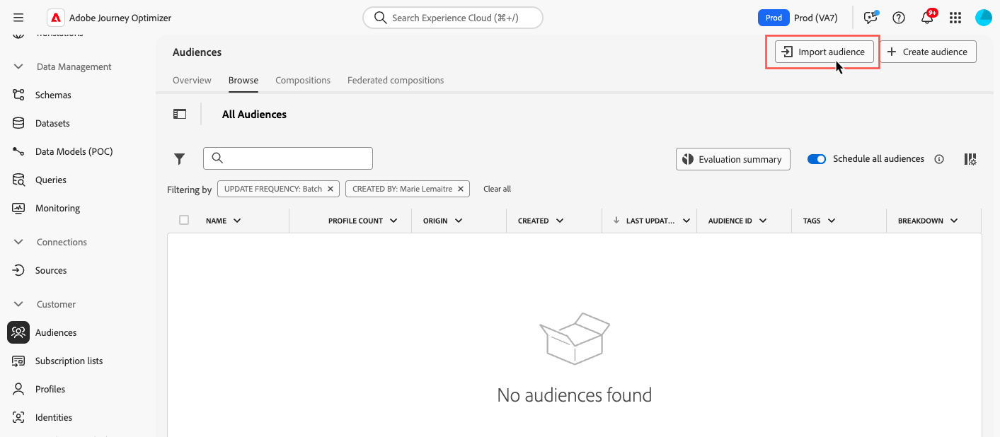

# Aangepast uploaden {#custom-upload}

Met Adobe Experience Platform Audience Portal kunt u een publiek importeren met een CSV-bestand.

Tijdens het aangepaste uploadproces geeft u het CSV-kenmerk op dat u wilt gebruiken als de identiteit en de profielidentiteit waarnaar het verwijst. Hiermee wordt een koppeling tot stand gebracht tussen de publieksgegevens en het profiel. Als het CSV-bestand een identiteitswaarde bevat die niet wordt gevonden in het profiel, wordt een nieuw profiel met die identiteitswaarde gemaakt.

>[!NOTE]
>
>Als &#39;Incrementeel lezen&#39; tijdens een terugkerende rit is ingeschakeld voor een aangepast uploadpubliek, worden profielen alleen bij de eerste terugkerende actie opgehaald, omdat deze doelgroepen vast zijn.

De gedetailleerde informatie over hoe te om publiek in te voeren is beschikbaar in de documentatie van de Dienst van de Segmentatie van Adobe Experience Platform [&#x200B; &#x200B;](https://experienceleague.adobe.com/en/docs/experience-platform/segmentation/ui/audience-portal#import-audience){target="_blank"}.

Leer hoe u een publiek in CSV-indeling in video kunt uploaden:

>[!VIDEO](https://video.tv.adobe.com/v/3421714?quality=12)
