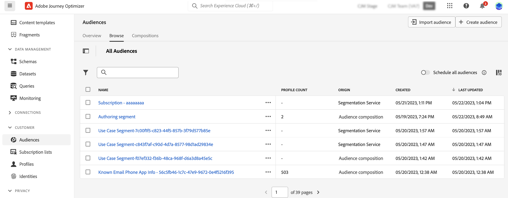

# Aan de slag met publiekscompositie {#get-start-audience-composition}

>[!CONTEXTUALHELP]
>id="ajo_ao_create_composition"
>title="Een compositie maken"
>abstract="Een compositieworkflow maken om bestaande Adobe Experience Platform-doelgroepen te combineren tot een visueel canvas en verschillende activiteiten (splitsen, uitsluiten...) gebruiken om nieuwe doelgroepen te maken."

>[!CONTEXTUALHELP]
>id="ajo_ao_publish"
>title="Uw publiek publiceren"
>abstract="Publiceer uw compositie om het resulterende publiek of de doelgroepen op te slaan in Adobe Experience Platform."

>[!CONTEXTUALHELP]
>id="ajo_ao_audience"
>title="Poortactiviteit"
>abstract="Met de activiteit van het publiek kunt u in uw compositie aanvullende profielen opnemen die tot een bestaand publiek behoren."

>[!CONTEXTUALHELP]
>id="ajo_ao_merge_types"
>title="Typen samenvoegen"
>abstract="Geef op hoe de profielen van het geselecteerde publiek moeten worden samengevoegd."

>[!CONTEXTUALHELP]
>id="ajo_ao_exclude_type"
>title="Type uitsluiten"
>abstract="Met het publiekstype Niet opnemen kunt u profielen uitsluiten die tot een bestaand publiek behoren. Met de optie Uitsluiten met behulp van het kenmerktype kunt u profielen uitsluiten op basis van een specifiek kenmerk."

>[!CONTEXTUALHELP]
>id="ajo_ao_exclude"
>title="Exclusief activiteit"
>abstract="Met de activiteit Uitsluiten kunt u profielen uitsluiten van uw compositie door een bestaand publiek te selecteren of een regel te gebruiken."

>[!CONTEXTUALHELP]
>id="ajo_ao_enrich"
>title="Verrijken van activiteit"
>abstract="Gebruik de Verrijken activiteit om uw publiek met extra attributen te verrijken die uit de datasets van Adobe Experience Platform komen. U kunt bijvoorbeeld informatie met betrekking tot het aangekochte product toevoegen, zoals de naam, de prijs of de fabrikant-id, en deze informatie gebruiken om de leveringen die naar het publiek worden verzonden, aan te passen."

>[!CONTEXTUALHELP]
>id="ajo_ao_enrich_dataset"
>title="Verrijkingsgegevens"
>abstract="Selecteer de verrijkingsdataset die de gegevens bevat die u aan het publiek wilt associëren."

>[!CONTEXTUALHELP]
>id="ajo_ao_enrich_criteria"
>title="Verrijkingscriteria"
>abstract="Selecteer de velden die u wilt gebruiken als combinatietoets tussen de brondataset, d.w.z. het publiek, en de verrijkingsdataset."

>[!CONTEXTUALHELP]
>id="ajo_ao_enrich_attributes"
>title="Verrijkingskenmerken"
>abstract="Selecteer een of meerdere kenmerken in de verrijkingsgegevensset die u aan het publiek wilt koppelen. Zodra de samenstelling wordt gepubliceerd, worden deze attributen geassocieerd aan het publiek en kunnen in campagnes van Journey Optimizer worden gebruikt om leveringen te personaliseren."

>[!CONTEXTUALHELP]
>id="ajo_ao_ranking"
>title="Leesactiviteit"
>abstract="De activiteit van de Rang staat u toe om profielen te rangschikken die op een specifiek attribuut worden gebaseerd en hen te omvatten in uw samenstelling. Neem bijvoorbeeld de 50 profielen op met de grootste hoeveelheid loyaliteitspunten."

>[!CONTEXTUALHELP]
>id="ajo_ao_rank_profilelimit_text"
>title="Profiellimiet toevoegen"
>abstract="Schakel deze optie in om een maximumaantal profielen op te geven dat u in de compositie wilt opnemen."

<!-- [!CONTEXTUALHELP]
>id="ajo_ao_control_group_text"
>title="Control Group"
>abstract="Use control groups to isolate a portion of the profiles. This allows you to measure the impact of a marketing activity and make a comparison with the behavior of the rest of the population."-->

>[!CONTEXTUALHELP]
>id="ajo_ao_split"
>title="Gesplitste activiteit"
>abstract="Met de activiteit Splitsen kunt u de compositie in meerdere paden verdelen. Wanneer u de compositie publiceert, wordt voor elk pad één publiek opgeslagen in Adobe Experience Platform."

>[!CONTEXTUALHELP]
>id="ajo_ao_split_type"
>title="Tekst splitsen"
>abstract="Met het gesplitste percentage kunt u profielen op willekeurige wijze splitsen in meerdere paden. Met het splitsingstype Kenmerk kunt u profielen splitsen op basis van een specifiek kenmerk."

>[!CONTEXTUALHELP]
>id="ajo_ao_split_otherprofiles_text"
>title="Andere profielen"
>abstract="Schakel deze optie in of uit om een extra pad te maken met de resterende profielen die niet overeenkomen met een van de voorwaarden die in de andere paden zijn opgegeven."

>[!BEGINSHADEBOX]

Deze documentatie verstrekt gedetailleerde informatie over hoe te met publiekssamenstelling binnen Adobe Journey Optimizer te werken. Als u een slechts klant in real time van het Profiel van de Klant bent en Adobe Journey Optimizer niet gebruikt, [&#x200B; klik hier &#x200B;](https://experienceleague.adobe.com/docs/experience-platform/segmentation/ui/audience-composition.html?lang=nl-NL){target="_blank"}.

>[!ENDSHADEBOX]

De samenstelling van het publiek staat u toe om **samenstellingswerkschema&#39;s** tot stand te brengen, waar u het bestaande publiek van Adobe Experience Platform in een visueel canvas kunt combineren en hefboomwerking diverse activiteiten (verdeeld, uitsluiten...) om nieuw publiek tot stand te brengen.

Zodra gedaan, wordt het **resulterende publiek** bewaard terug in Adobe Experience Platform samen met bestaand publiek en kan hefboomwerking in de campagnes en de reizen van Journey Optimizer aan doelklanten zijn. Leer hoe u doelgroepen kunt maken in Journey Optimizer

>[!IMPORTANT]
>
>* Het gebruik van soorten publiek en kenmerken van de samenstelling van het publiek is momenteel niet beschikbaar voor gebruik met het gezondheidsschild of het privacyschild.
>
>* De attributen van de verrijking zijn nog niet geïntegreerd met de dienst van de beleidshandhaving. Daarom worden labels voor gegevensgebruik die u toepast op uw verrijkingskenmerken, niet afgedwongen in Journey Optimizer-campagnes of -reizen.

De compositie van het publiek is toegankelijk via het menu Adobe Journey Optimizer **[!UICONTROL Audiences]** :

* Het tabblad **[!UICONTROL Overview]** bevat een speciaal dashboard met belangrijke meetgegevens die betrekking hebben op de publieksgegevens van uw organisatie. Meer leren, verwijs naar [&#x200B; de gids van de Dashboards van Adobe Experience Platform &#x200B;](https://experienceleague.adobe.com/docs/experience-platform/dashboards/guides/segments.html?lang=nl-NL).

* Op het tabblad **[!UICONTROL Browse]** worden alle bestaande soorten publiek weergegeven die in Adobe Experience Platform zijn opgeslagen.

* Op het tabblad **[!UICONTROL Compositions]** kunt u samenstellingsworkflows maken waarin u het publiek kunt combineren en rangschikken om nieuwe te maken.

## Een compositieworkflow maken {#create}

Ga als volgt te werk om een compositieworkflow te maken:

1. Open het menu **[!UICONTROL Audiences]** en selecteer **[!UICONTROL Create Audience]** .

1. Selecteer **[!UICONTROL Compose Audience]**.

   

1. Het compositicanvas wordt weergegeven met twee standaardactiviteiten:

   * **[!UICONTROL Audience]**: het beginpunt van de compositie. Met deze activiteit kunt u een of meer soorten publiek selecteren als basis voor uw workflow.

   * **[!UICONTROL Save]**: de laatste stap van uw compositie. Met deze activiteit kunt u het resultaat van uw workflow opslaan in een nieuw publiek.

1. Open de compositieeigenschappen om een titel en een beschrijving op te geven.

   Als er geen titel in de eigenschappen is gedefinieerd, wordt het label van de compositie ingesteld op &quot;Compositie&quot;, gevolgd door de aanmaakdatum en -tijd.

   

1. Configureer uw compositie door zoveel activiteiten toe te voegen als nodig zijn tussen de **[!UICONTROL Audience]** - en **[!UICONTROL Save]** -activiteiten. Voor meer informatie over hoe te om een samenstelling tot stand te brengen, verwijs naar de [&#x200B; de compositiedocumentatie van het publiek &#x200B;](https://experienceleague.adobe.com/nl/docs/experience-platform/segmentation/ui/audience-composition).

   

1. Als uw compositie gereed is, klikt u op de knop **[!UICONTROL Publish]** om de compositie te publiceren en het resulterende publiek op te slaan in Adobe Experience Platform.

   >[!IMPORTANT]
   >
   >U kunt maximaal 10 composities publiceren in een bepaalde sandbox. Als u deze drempel hebt bereikt, moet u een samenstelling schrappen om ruimte vrij te maken en nieuwe te publiceren.

   Als er tijdens het publiceren een fout optreedt, worden waarschuwingen weergegeven met informatie over hoe u het probleem kunt oplossen.

   

1. De compositie wordt gepubliceerd. Het resulterende publiek wordt opgeslagen in Adobe Experience Platform en is klaar om op Journey Optimizer te worden gericht. [&#x200B; leer hoe te om publiek in Journey Optimizer te richten &#x200B;](../audience/about-audiences.md#segments-in-journey-optimizer)

>[!NOTE]
>
>Het publiek van **publiekssamenstelling** wordt dagelijks uitgevoerd, zodat kunt u tot 24 uren moeten wachten om hen in Journey Optimizer te gebruiken. De verrijkte attributen in het publiek van de publiekssamenstelling zijn zo vers zoals de laatste samenstellingslooppas, die tot 24 uren in het verleden kan zijn.

## Toegang tot composities {#access}

Alle gemaakte composities zijn toegankelijk via het tabblad **[!UICONTROL Compositions]** . U kunt een bestaande compositie op elk gewenst moment dupliceren of verwijderen met de knop voor weglatingen in de lijst.

Composities kunnen meerdere statussen hebben:

* **[!UICONTROL Draft]** : de compositie is in uitvoering en is niet gepubliceerd.
* **[!UICONTROL Published]** : de compositie is gepubliceerd, het resulterende publiek is opgeslagen en is beschikbaar voor gebruik.

>[!NOTE]
>
>De compositie van het publiek is momenteel niet geïntegreerd met de functie voor het opnieuw instellen van de sandbox. Voordat u een sandbox-reset start, moet u de composities handmatig verwijderen om ervoor te zorgen dat de bijbehorende publieksgegevens op de juiste wijze worden opgeschoond. De gedetailleerde informatie is beschikbaar in de documentatie van de zandbak van Adobe Experience Platform [&#x200B; &#x200B;](https://experienceleague.adobe.com/docs/experience-platform/sandbox/ui/user-guide.html?lang=nl-NL#delete-audience-compositions)
