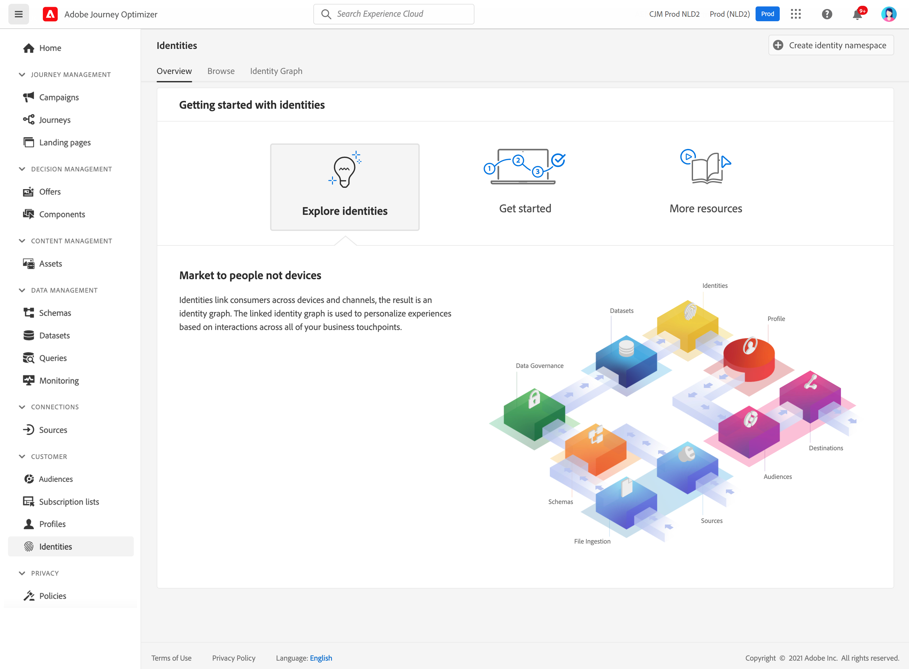

# Aan de slag met identiteiten {#identities-gs}

Een identiteit is gegevens die uniek zijn voor een entiteit, doorgaans een echt object, zoals een individuele persoon, een hardwareapparaat of een webbrowser. Een volledig gekwalificeerde identiteit bestaat uit twee elementen:

* De **identiteit namespace** dient als indicator van de context waarop een identiteit betrekking heeft.
* De **identiteitswaarde** is een koord dat een entiteit vertegenwoordigt.

Neem bijvoorbeeld het telefoonnummer 555-555-1234. In dit geval, is het koord &quot;555-555-1234&quot;een **identiteitswaarde**, die in een &quot;Telefoon&quot;**identiteit zou kunnen worden gecategoriseerd namespace**.

Het **menu van Identiteiten** in [!DNL Adobe Journey Optimizer] staat gebruikers toe om door de diverse herkenningstekens efficiënt te doorbladeren die omhoog de klanten in hun gegevensbestand maken.

Het verstrekt een **Grafiek van de Identiteit**, die een kaart van verhoudingen tussen verschillende identiteiten voor een bepaalde klant is. Deze grafiek biedt een visuele weergave van de manier waarop een klant met een merk werkt via verschillende kanalen. Alle grafieken van de klantenidentiteit worden collectief beheerd en door de Dienst van de Identiteit van Adobe Experience Platform in antwoord op klantenactiviteit bijgewerkt.

De gedetailleerde informatie bij het werken met identiteiten is beschikbaar in de [&#x200B; documentatie van de Dienst van de Identiteit &#x200B;](https://experienceleague.adobe.com/docs/experience-platform/identity/home.html?lang=nl){target="_blank"}.