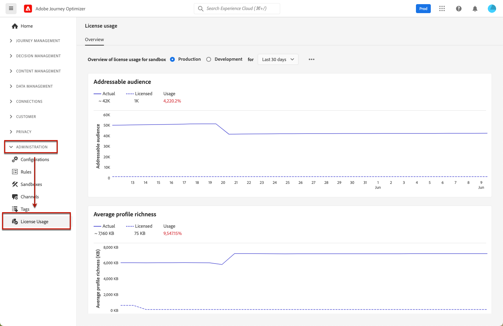

# Het gebruiksdashboard voor licenties {#license-usage}

Het [!DNL Adobe Journey Optimizer] [ gebruikersinterface ](../start/user-interface.md) verstrekt een dashboard dat belangrijke informatie over het de vergunningsgebruik van uw organisatie toont, zoals die tijdens een dagelijkse momentopname wordt gevangen.

Ga naar **[!UICONTROL Administration]** > **[!UICONTROL License Usage]** om dit dashboard te openen. Hierdoor wordt het tabblad **[!UICONTROL Overview]** geopend, waarin het dashboard wordt weergegeven.

>[!NOTE]
>
>Om het dashboard te bekijken, moet u de [&#128279;](https://experienceleague.adobe.com/docs/experience-platform/dashboards/permissions.html?lang=nl-NL#available-permissions){target="_blank"} toestemming hebben van het Gebruik Dashboard van het Gebruik van de Vergunning van 0&rbrace; Mening.

Voor [!DNL Adobe Journey Optimizer], staat het dashboard u toe om het aantal **toe te laten Profielen** te controleren. Een aanspreekbaar profiel is een record met informatie die een individu vertegenwoordigt en wordt opgeslagen in de profielservice. Deze records zijn profielen die u in de afgelopen 12 maanden hebt proberen te gebruiken voor het schrijven, beslissen, leveren, experimenteren of orchestreren van Journey Optimizer.

Meer informatie vindt u in de documentatie van Adobe Experience Platform:

* [ het dashboard van het gebruiksdashboard van de Vergunning ](https://experienceleague.adobe.com/docs/experience-platform/dashboards/guides/license-usage.html?lang=nl-NL){target="_blank"}
* [ het onderzoeken van het dashboard van het vergunningsgebruik ](https://experienceleague.adobe.com/docs/experience-platform/dashboards/guides/license-usage.html?lang=nl-NL#exploring-the-license-usage-dashboard){target="_blank"}
* [ Beschikbare metriek ](https://experienceleague.adobe.com/docs/experience-platform/dashboards/guides/license-usage.html?lang=nl-NL#available-metrics){target="_blank"}
