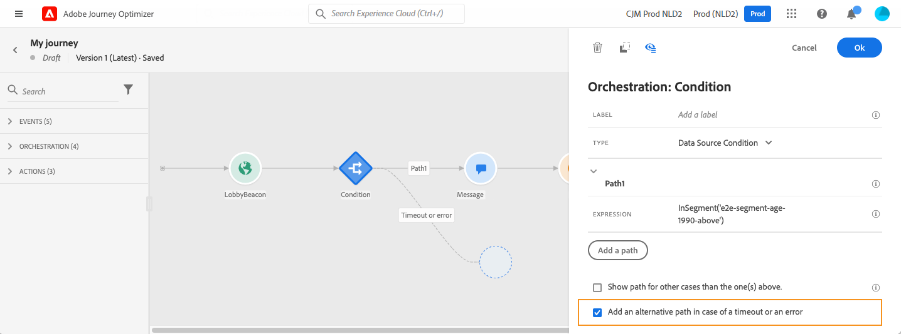

# Informatie over reisactiviteiten {#about-journey-activities}

Combineer de verschillende actie-, orkestratie- en gebeurtenisactiviteiten om uw kanaaloverschrijdende scenario’s met meerdere stappen te maken.

## Gebeurtenisactiviteiten {#event-activities}

De gebeurtenissen die door de technische gebruiker worden gevormd (zie [deze pagina](../event/about-events.md)) worden allen getoond in de eerste categorie van het palet, op de linkerkant van het scherm. De volgende activiteiten zijn beschikbaar:

* [Algemene gebeurtenissen](../building-journeys/general-events.md)
* [Reactie](../building-journeys/reaction-events.md)
* [Segmentkwalificatie](../building-journeys/segment-qualification-events.md)

Begin de reis door een gebeurtenisactiviteit te slepen en neer te zetten. U kunt er ook op dubbelklikken.

## Orkestratieactiviteiten {#orchestration-activities}

In het palet zijn aan de linkerkant van het scherm de volgende orkestactiviteiten beschikbaar:

* [Voorwaarde](../building-journeys/condition-activity.md)
* [Einde](../building-journeys/end-activity.md)
* [Wachten](../building-journeys/wait-activity.md)
* [Segment lezen](../building-journeys/read-segment.md)

## Actieactiviteiten {#action-activities}

In het palet, links op het scherm, onder **[!UICONTROL Events]** en **[!UICONTROL Orchestration]**, vindt u de categorie **[!UICONTROL Actions]**. De volgende activiteiten zijn beschikbaar:

* [Bericht](../building-journeys/journeys-message.md)
* [Aangepaste acties](../building-journeys/using-custom-actions.md)
* [Springen](../building-journeys/jump.md)

Deze activiteiten staan voor de verschillende beschikbare communicatiekanalen. U kunt ze combineren om een scenario voor meerdere kanalen te maken.

Als u douaneacties hebt gevormd, zullen zij hier (zie [deze pagina](../building-journeys/using-custom-actions.md)) verschijnen.

## Best practices {#best-practices}

Met de meeste activiteiten kunt u een **[!UICONTROL Label]** definiëren. Hiermee voegt u een achtervoegsel toe aan de naam die onder uw activiteit op het canvas wordt weergegeven. Dit is handig als u dezelfde activiteit meerdere keren gebruikt en u deze gemakkelijker wilt identificeren. Het zal ook het zuiveren in het geval van fouten gemakkelijker maken en het zal rapporten gemakkelijker te lezen maken. U kunt ook een optionele **[!UICONTROL Description]** toevoegen.

Wanneer er een fout in een actie of een voorwaarde optreedt, eindigt de journey van een individu. De enige manier om door te gaan is het selectievakje **[!UICONTROL Add an alternative path in case of a timeout or an error]** in te schakelen. Zie [deze sectie](../building-journeys/using-the-journey-designer.md#paths).

