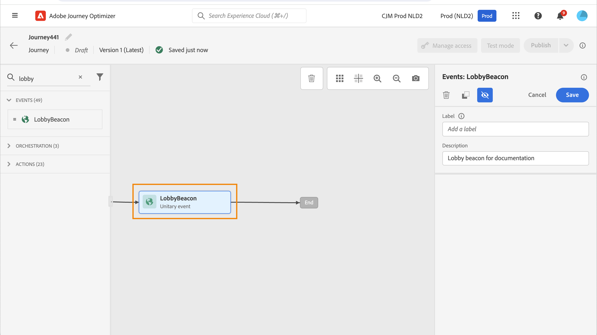
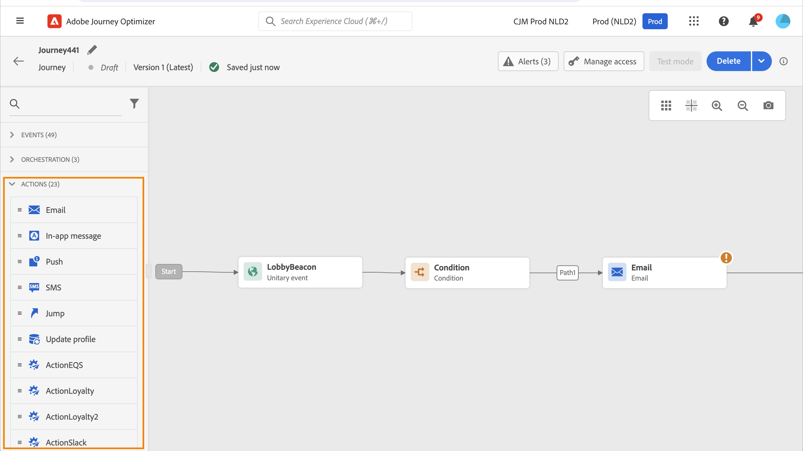

# Aan de slag met reisactiviteiten {#about-journey-activities}

Combineer de verschillende gebeurtenis-, organisatie- en actieactiviteiten om uw meerstapsscenario&#39;s voor meerdere kanalen te maken.

## Gebeurtenisactiviteiten {#event-activities}

Persoonlijke reizen worden veroorzaakt door gebeurtenissen, zoals een online aankoop. Als een profiel eenmaal een reis binnengaat, worden deze als individu doorlopen en bewegen geen twee personen zich met dezelfde snelheid of langs hetzelfde pad. Wanneer u uw reis met een gebeurtenis begint, teweegbrengt de reis teweeg wanneer de gebeurtenis wordt ontvangen. Elke persoon op de reis volgt dan, individueel, de volgende stappen die in uw reis worden bepaald.

De gebeurtenissen die door de technische gebruiker worden gevormd (zie [ deze pagina ](../event/about-events.md)) worden allen getoond in de eerste categorie van het palet, op de linkerkant van het scherm. De volgende gebeurtenisactiviteiten zijn beschikbaar:

* [Algemene gebeurtenissen](../building-journeys/general-events.md)
* [Reactie](../building-journeys/reaction-events.md)
* [Poortkwalificatie](../building-journeys/audience-qualification-events.md)

U start de reis door een gebeurtenisactiviteit te slepen en neer te zetten. U kunt er ook op dubbelklikken.

## Orchestratie {#orchestration-activities}

Orchestratieactiviteiten zijn verschillende omstandigheden die helpen de volgende stap in de reis te bepalen. Deze voorwaarden kunnen omvatten of de persoon een open steungeval heeft, het weer dat op zijn huidige plaats wordt voorspeld, of zij een aankoop voltooiden, of of zij 10.000 loyaliteitspunten bereikt.

In het palet zijn aan de linkerkant van het scherm de volgende orkestactiviteiten beschikbaar:

<!--* [Optimize](optimize.md)-->
* [Publiek lezen](read-audience.md)
* [Wachten](wait-activity.md)
* [Inhoudsbeslissing](content-decision.md)
* [Opzoeken gegevensset](dataset-lookup.md)

## Actieactiviteiten {#action-activities}

Handelingen zijn wat u wilt doen als gevolg van een of andere trigger, zoals het verzenden van een bericht. Het is het stukje van de reis dat de klant ervaart.

In het palet, links op het scherm, onder **[!UICONTROL Events]** en **[!UICONTROL Orchestration]** , kunt u de categorie **[!UICONTROL Actions]** vinden. De volgende activiteiten zijn beschikbaar:

* [Ingebouwde kanaalhandelingen](../building-journeys/journeys-message.md)
* [Aangepaste acties](../building-journeys/using-custom-actions.md)
* [Springen](../building-journeys/jump.md)

Deze activiteiten staan voor de verschillende beschikbare communicatiekanalen. U kunt ze combineren om een scenario voor meerdere kanalen te maken.

U kunt ook specifieke acties instellen om berichten te verzenden:

* Als u berichten verzendt met een systeem van derden, kunt u een specifieke aangepaste handeling maken. [Meer informatie](../action/action.md)

* Raadpleeg de volgende secties als u werkt met Campagne en Journey Optimizer:

   * [[!DNL Journey Optimizer] en Campagne v7/v8](../action/acc-action.md)
   * [[!DNL Journey Optimizer] en Campaign Standard](../action/acs-action.md)
   * [[!DNL Journey Optimizer] en Marketo Engage](../action/marketo-engage.md)

## Best practices {#best-practices}

### Een label toevoegen

Met de meeste activiteiten kunt u een **[!UICONTROL Label]** definiëren. Hiermee voegt u een achtervoegsel toe aan de naam die onder uw activiteit op het canvas wordt weergegeven. Dit is handig als u dezelfde activiteit meerdere keren gebruikt en u deze gemakkelijker wilt identificeren. Het maakt het zuiveren ook gemakkelijker in het geval van fouten en maakt rapporten gemakkelijker te lezen. U kunt ook een optionele **[!UICONTROL Description]** toevoegen.

>[!NOTE]
>
>Voor bepaalde activiteiten is de id ook zichtbaar in het deelvenster. Deze id kan worden gebruikt in rapportage als een stabielere sleutel dan het label, dat kan veranderen.

### Geavanceerde parameters beheren {#advanced-parameters}

De meeste activiteiten geven een aantal geavanceerde en/of technische parameters weer die u niet kunt wijzigen.

Verberg deze parameters voor een betere leesbaarheid met de knop **[!UICONTROL Hide read-only fields]** boven in het rechterdeelvenster.

In bepaalde situaties kunt u de waarden van deze parameters voor specifiek gebruik overschrijven. Als u een waarde wilt afdwingen, klikt u op het pictogram **[!UICONTROL Enable parameter override]** rechts van het veld. [Meer informatie](../configuration/primary-email-addresses.md#journey-parameters)

>[!NOTE]
>
>Klik op de knop **[!UICONTROL Show read-only fields]** als de geavanceerde parameters verborgen zijn
>
>{width=60%}

### Een alternatief pad toevoegen

Wanneer er een fout in een actie of een voorwaarde optreedt, eindigt de journey van een individu. De enige manier om door te gaan is het selectievakje **[!UICONTROL Add an alternative path in case of a timeout or an error]** in te schakelen. Zie [deze sectie](../building-journeys/using-the-journey-designer.md#paths).

 toe

## Problemen oplossen {#troubleshooting}

Controleer voordat u uw journey gaat testen en publiceren of alle activiteiten correct zijn geconfigureerd. U kunt geen tests of publicaties uitvoeren als het systeem nog steeds fouten detecteert.

Leer hoe te om fouten in activiteiten en in de reis [ op deze pagina ](troubleshooting.md) problemen op te lossen.
