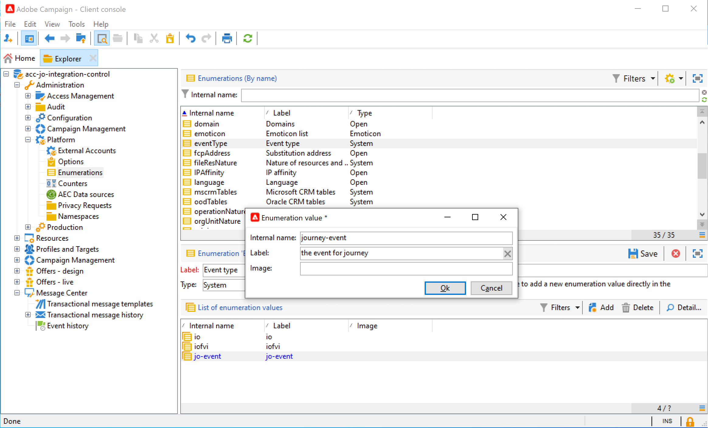

# Een bericht verzenden met Campagne v7/v8 {#campaign-v7-v8-use-case}

In deze handige case worden alle stappen beschreven die vereist zijn om een e-mail te verzenden via de integratie met Adobe Campaign v7 en Adobe Campaign v8.

>[!NOTE]
>
>Als u deze integratie wilt gebruiken, hebt u Campaign v7/v8 build 9125 of hoger nodig.

Maak eerst een transactionele e-mailsjabloon in Campagne. Maak vervolgens in Journey Optimizer de gebeurtenis, handeling en ontwerp de reis.

Raadpleeg de volgende pagina&#39;s voor meer informatie over de integratie van campagnes:

* [Campagne maken](../action/acc-action.md)
* [ Gebruikend de actie in een reis ](../building-journeys/using-adobe-campaign-v7-v8.md).

**Adobe Campaign**

Voor deze integratie moet uw Campagne-instantie zijn ingericht. De eigenschap van het Overseinen van de Transactie moet worden gevormd.

1. Meld u aan bij de besturingsinstantie Campagne.

1. Onder **Beleid** > **Platform** > **Opsommingen**, selecteer het **type van Gebeurtenis** (eventType) opsomming. Maak een nieuw gebeurtenistype (&quot;reis-gebeurtenis&quot;, in ons voorbeeld). Gebruik de interne naam van het gebeurtenistype wanneer u het JSON-bestand later schrijft.

   

1. Maak de verbinding met de instantie los en maak opnieuw verbinding zodat het ontwerp van kracht wordt.

1. Onder **Centrum van het Bericht** > **Transactionele berichtmalplaatjes**, creeer een nieuw e-mailmalplaatje dat op het eerder gecreeerde gebeurtenistype wordt gebaseerd.

   

1. Ontwerp uw sjabloon. In dit voorbeeld wordt personalisatie toegepast op de voornaam en het ordernummer van het profiel. De voornaam staat in de Adobe Experience Platform-gegevensbron en het ordernummer is een veld van de Journey Optimizer-gebeurtenis. Zorg ervoor dat u de juiste veldnamen gebruikt in Campagne.

   

1. Publiceer uw transactiesjabloon.

   

1. Schrijf de JSON-lading die overeenkomt met de sjabloon.

```
{
     "channel": "email",
     "eventType": "journey-event",
     "email": "Email address",
     "ctx": {
          "firstName": "First name", "purchaseOrderNumber": "Purchase order number"
     }
}
```

* Voor het kanaal moet u &quot;email&quot; typen.
* Voor eventType gebruikt u de interne naam van het gebeurtenistype dat u eerder hebt gemaakt.
* Het e-mailadres is een variabele, dus u kunt elk label typen.
* Onder ctx, zijn de verpersoonlijkingsgebieden ook variabelen.

**Journey Optimizer**

1. Maak een gebeurtenis. Neem het veld &quot;purchaseOrderNumber&quot; op.

   

1. Maak een actie in Journey Optimizer die overeenkomt met uw campagnemplate. In het **type van Actie** drop-down, uitgezochte **Adobe Campaign Classic**.

   

1. Klik het **gebied van de Lading** en kleef JSON vroeger gecreeerd.

   

1. Voor het e-mailadres en de twee verpersoonlijkingsgebieden, veranderings **Constante** aan **Variabele**.

   

1. Maak nu een nieuwe reis en begin met de gebeurtenis die eerder is gemaakt.

   

1. Voeg de handeling toe en wijs elk veld toe aan het juiste veld in Journey Optimizer.

   

1. Test je reis.

   

1. U kunt nu uw reis publiceren.
