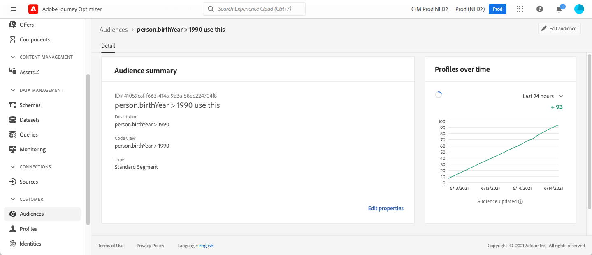

# Gebeurtenissen in verband met de kwalificatie van het publiek {#segment-qualification}

>[!CONTEXTUALHELP]
>id="ajo_journey_event_segment_qualification"
>title="kwalificatiegebeurtenissen voor het publiek"
>abstract="Met deze activiteit kunt u luisteren naar de inzendingen en uitgangen van profielen in Adobe Experience Platform-kijkers om ervoor te zorgen dat individuen op reis gaan of vooruit gaan."

## Informatie over publiekskwalificatiegebeurtenissen{#about-segment-qualification}

Met deze activiteit kunt u luisteren naar de inzendingen en uitgangen van profielen in Adobe Experience Platform-kijkers om ervoor te zorgen dat individuen op reis gaan of vooruit gaan. Voor meer informatie over publieksverwezenlijking, verwijs naar deze [ sectie ](../audience/about-audiences.md).

Laten we zeggen dat je een &quot;zilveren klant&quot; publiek hebt. Met deze activiteit, kunt u alle nieuwe zilveren klanten een reis maken en hen een reeks gepersonaliseerde berichten verzenden.

Dit type gebeurtenis kan als eerste stap of later in de reis worden geplaatst.

➡️ [Ontdek deze functie in video](#video)

>[!CAUTION]
>
>Alvorens te beginnen om een kwalificatie van het Publiek te vormen, [ lees de Grafieken en Beperkingen ](#audience-qualification-guardrails).

## De activiteit configureren {#configure-segment-qualification}

Voer de volgende stappen uit om de **[!UICONTROL Audience Qualification]** -activiteit te configureren:

1. Ontvouw de categorie **[!UICONTROL Events]** en zet een **[!UICONTROL Audience Qualification]** -activiteit neer op uw canvas.

   

1. Voeg een **[!UICONTROL Label]** toe aan de activiteit. Deze stap is optioneel.

1. Klik in het veld **[!UICONTROL Audience]** en selecteer het publiek dat u wilt gebruiken.

   >[!NOTE]
   >
   >U kunt de kolommen aanpassen die in de lijst worden weergegeven en ze sorteren.

   

   Nadat het publiek is toegevoegd, kunt u met de knop **[!UICONTROL Copy]** de naam en de id van het publiek kopiëren:

   `{"name":"Loyalty membership","id":"8597c5dc-70e3-4b05-8fb9-7e938f5c07a3"}`

   

1. Kies in het veld **[!UICONTROL Behaviour]** of u wilt luisteren naar de publieksinvoer, het afsluit of beide.

   >[!NOTE]
   >
   >**[!UICONTROL Enter]** en **[!UICONTROL Exit]** beantwoorden aan **gerealiseerde** en **Uitgegeven** status van de publieksparticipatie van Adobe Experience Platform. Voor meer op hoe te om een publiek te evalueren, verwijs naar de [ documentatie van de Dienst van de Segmentatie ](https://experienceleague.adobe.com/docs/experience-platform/segmentation/tutorials/evaluate-a-segment.html#interpret-segment-results){target="_blank"}.

1. Selecteer een naamruimte. Dit is alleen nodig als de gebeurtenis als eerste stap van de reis wordt geplaatst. Het veld wordt standaard voorgevuld met de laatst gebruikte naamruimte.

   >[!NOTE]
   >
   >U kunt alleen een naamruimte selecteren die is gebaseerd op personen. Als u een namespace voor een raadplegingslijst (bijvoorbeeld: ProductID namespace voor een raadpleging van het Product) hebt bepaald, zal het niet in **Namespace** dropdown lijst beschikbaar zijn.

   

De nuttige lading bevat de volgende contextinformatie, die u in voorwaarden en acties kunt gebruiken:

* het gedrag (ingang, uitgang)
* het tijdstempel van de kwalificatie
* de publieks-id

Wanneer u de expressie-editor gebruikt in een voorwaarde of handeling die volgt op een **[!UICONTROL Audience Qualification]** -activiteit, hebt u toegang tot het **[!UICONTROL AudienceQualification]** -knooppunt. U kunt kiezen tussen **[!UICONTROL Last qualification time]** en **[!UICONTROL status]** (Enter of exit).

Zie [ de activiteit van de Voorwaarde ](../building-journeys/condition-activity.md#about_condition).

Een nieuwe reis die een **gebeurtenis van de Kwalificatie van het Publiek** omvat wordt operationeel tien minuten nadat u het publiceert. Dit tijdinterval beantwoordt aan het geheime voorgeheugen verfrist interval van de specifieke dienst. Daarom moet u tien minuten wachten voordat u deze reis gebruikt.

## Best practices {#best-practices-segments}

Met de **[!UICONTROL Audience Qualification]** -activiteit kunnen personen die gekwalificeerd of gediskwalificeerd zijn voor een Adobe Experience Platform-publiek direct worden toegelaten tot reizen.

De ontvangstsnelheid van deze informatie is hoog. Metingen laten een snelheid zien van 10.000 gebeurtenissen die per seconde worden ontvangen. Als gevolg daarvan, zorg ervoor u begrijpt hoe de pieken van ingang kunnen gebeuren, hoe te om hen te vermijden, en hoe te om uw reis voor hen klaar te maken. Leer meer over de tarieven van de reisverwerking en productielimieten in [ deze sectie ](entry-management.md#journey-processing-rate).

### Batchpubliek {#batch-speed-segment-qualification}

Wanneer het gebruiken van de Kwalificatie van het Publiek voor een partijpubliek, merk op dat een piek van ingang op het tijdstip van de dagelijkse berekening voorkomt. De grootte van de piek is afhankelijk van het aantal personen dat het publiek dagelijks binnenkomt (of verlaat).

Als het batchpubliek bovendien pas wordt gecreëerd en onmiddellijk wordt gebruikt in een reis, kan de eerste batch van de berekening ertoe leiden dat een zeer groot aantal personen de reis betreden.

### Gestroomd publiek {#streamed-speed-segment-qualification}

Wanneer het gebruiken van de Kwalificatie van het Publiek voor gestroomd publiek, is er minder risico van grote pieken van ingangen/uitgangen toe te schrijven aan de ononderbroken evaluatie van het publiek. Nochtans, als de publieksdefinitie tot een groot volume van klanten leidt die gelijktijdig kwalificeren, zou een piek nog kunnen voorkomen.

Vermijd het gebruik van open en verzend gebeurtenissen met streaming segmentatie. In plaats daarvan, gebruik echte user-activity signalen zoals kliks, aankopen, of baken gegevens. Voor frequentie of suppression logica, gebruik bedrijfsregels eerder dan verzendt gebeurtenissen. [Meer informatie](../audience/about-audiences.md)

Voor meer informatie bij het stromen segmentatie, verwijs naar [ documentatie van Adobe Experience Platform ](https://experienceleague.adobe.com/en/docs/experience-platform/segmentation/methods/streaming-segmentation){target="_blank"}.

### Overbelasting voorkomen {#overloads-speed-segment-qualification}

Hier volgen enkele aanbevolen procedures om overbelastingsystemen te vermijden die tijdens reizen worden gebruikt (gegevensbronnen, aangepaste acties, kanaalactiviteiten):

* Gebruik een batchpubliek niet direct na het maken ervan in een **[!UICONTROL Audience Qualification]** -activiteit. Hierdoor wordt de eerste rekenpiek vermeden. Er verschijnt een gele waarschuwing op het canvas als u een publiek wilt gebruiken dat nog nooit is berekend.

  

* Plaats een plafondregel voor gegevensbronnen en handelingen die tijdens reizen worden gebruikt om overbelasting te voorkomen. Leer meer in [ documentatie van Journey Orchestration ](https://experienceleague.adobe.com/docs/journeys/using/working-with-apis/capping.html){target="_blank"}. De bijschilderregel hoeft niet opnieuw te worden uitgevoerd. Als u het opnieuw moet proberen, gebruikt u een alternatief pad in de reis door het vakje **[!UICONTROL Add an alternative path in case of a timeout or an error]** in voorwaarden of handelingen in te schakelen.

* Voordat u het publiek in een productiereis gaat gebruiken, moet u het aantal personen dat dagelijks voor dit publiek in aanmerking komt, evalueren. Controleer hiertoe het menu **[!UICONTROL Audience]** , open het publiek en bekijk de grafiek van **[!UICONTROL Profiles over time]** .

  

Leer meer over de grenzen van het ingangstarief en productie in [ deze sectie ](entry-management.md#profile-entrance-rate).

## Afvoerkanalen en beperkingen {#audience-qualification-guardrails}

Volg de instructies en aanbevelingen hieronder om de reizen van de Kwalificatie van het publiek te bouwen. Zie ook [ beste praktijken van de Kwalificatie van het publiek ](#best-practices-segments).

* De reizen van de Kwalificatie van het publiek worden hoofdzakelijk ontworpen om met het stromen publiek te werken. Deze combinatie garandeert een betere real-time ervaring. Het wordt sterk geadviseerd om **het stromen publiek** in de activiteit van de Kwalificatie van het Publiek te gebruiken.

  Nochtans, als u partij op ingestitie-gebaseerde attributen in uw het stromen publiek of een partijpubliek voor een reis van de Kwalificatie van het Publiek wilt gebruiken, overweeg de tijdspanwijdte voor publieksevaluatie/activering. Een partijpubliek of het stromen publiek die batch-ingegane attributen gebruiken wordt klaar voor gebruik in de **activiteit van de Kwalificatie van het publiek ongeveer** 2 uren **na de voltooiing van uw segmentatietaak.** Deze taak wordt één keer per dag uitgevoerd op het tijdstip dat door de beheerder van de Adobe-organisatie is gedefinieerd.

* Het publiek van Adobe Experience Platform wordt berekend of eens per dag (**partij** publiek) of in real time (voor **gestroomde** publiek, gebruikend de Hoge optie van het Publiek van de Frequentie van Adobe Experience Platform).

   * Als het geselecteerde publiek wordt gestreamd, kunnen individuen die tot dit publiek behoren de reis in real time betreden.
   * Als het publiek een batch is, kunnen mensen die net voor dit publiek zijn gekwalificeerd de reis invoeren wanneer de publieksberekening op Adobe Experience Platform wordt uitgevoerd.

  Als beste praktijken, gebruik het stromen publiek in de activiteit van de Kwalificatie van het publiek van het a ****. Voor de gevallen van het partijgebruik, gelieve te gebruiken a **[gelezen publiek](read-audience.md)** activiteit.

  >[!NOTE]
  >
  >Vanwege het batchkarakter van publiek dat is gemaakt met gebruik van compositieworkflows en aangepaste uploads, kunnen deze doelgroepen niet worden gericht op een activiteit die onder &quot;Audience Qualification&quot; valt. Alleen publiek dat is gemaakt met behulp van segmentdefinities kan in deze activiteit worden gebruikt.

* De groepen van het de gebeurtenisgebied van de ervaring kunnen niet in ritten worden gebruikt die met a **Gelezen Publiek**, a **de Kwalificatie van het Publiek** of a **BedrijfsGebeurtenis** activiteit beginnen.

* Wanneer het gebruiken van de Kwalificatie van het publiek **activiteit van het 0} {in een reis, kan die activiteit tot 10 minuten duren om actief te zijn en aan profielen te luisteren die of het publiek ingaan weggaan.**

>[!CAUTION]
>
>[ Grafieken voor gegevens en segmentatie van het Profiel van de Klant in real time ](https://experienceleague.adobe.com/docs/experience-platform/profile/guardrails.html){target="_blank"} zijn ook op Adobe Journey Optimizer van toepassing.

## Hoe kan ik-video {#video}

Begrijp de toepasselijke gebruiksgevallen voor reizen van de Kwalificatie van het Publiek in deze video. Leer hoe u een reis maakt met de kwalificatie &#39;Audience Qualification&#39; en welke best practices u kunt toepassen.

>[!VIDEO](https://video.tv.adobe.com/v/3425028?quality=12)
