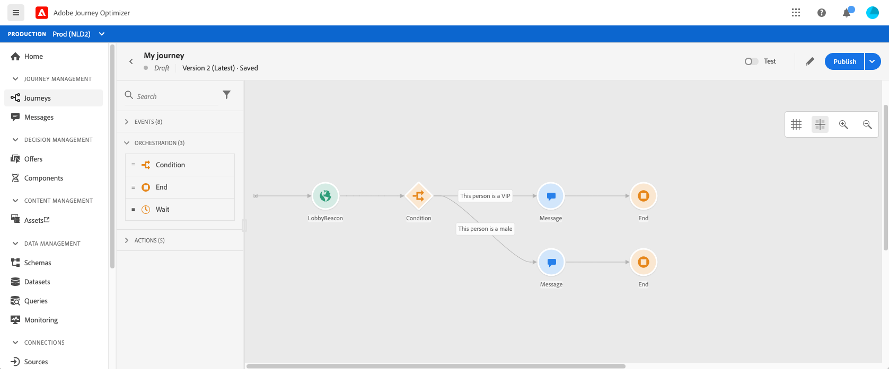
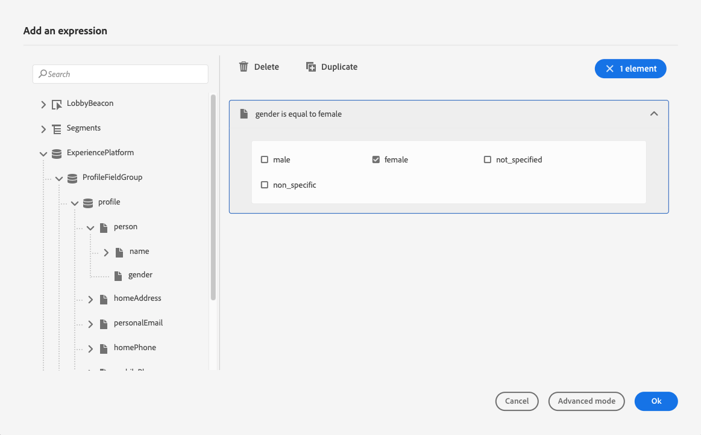
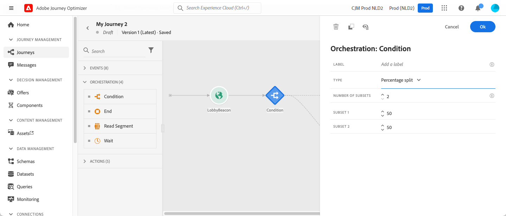

# Voorwaardeactiviteit{#section_e2n_pft_dgb}

Er zijn vier soorten voorwaarden beschikbaar:

* [Gegevensbronvoorwaarde](#data_source_condition)
* [Tijdvoorwaarde](#time_condition)
* [Percentage splitsing](#percentage_split)
* [Datumvoorwaarde](#date_condition)

## Informatie over de Condition-activiteit {#about_condition}

Wanneer u verschillende voorwaarden in een reis gebruikt, kunt u labels voor elk van deze voorwaarden definiëren om ze gemakkelijker te kunnen identificeren.

Klikken **[!UICONTROL Add a path]** als u meerdere voorwaarden wilt definiëren. Voor elke voorwaarde wordt een nieuw pad toegevoegd in het canvas na de activiteit.

Merk op dat het ontwerp van de reizen functionele gevolgen heeft. Wanneer meerdere paden na een voorwaarde worden gedefinieerd, wordt alleen het eerste in aanmerking komende pad uitgevoerd. Dit betekent dat u de prioritering van paden kunt wijzigen door deze boven of onder elkaar te plaatsen.

Laten we bijvoorbeeld het voorbeeld nemen van de voorwaarde &#39;De persoon is een VIP&#39; van een eerste pad en de voorwaarde &#39;De persoon is een man&#39; van een tweede pad. Als een persoon die aan beide voorwaarden voldoet (een man die een VIP is) deze stap doorstaat, wordt het eerste pad gekozen, zelfs als deze persoon ook in aanmerking komt voor het tweede pad, omdat het eerste pad &quot;boven&quot; is. Verplaats uw activiteiten in een andere verticale volgorde om deze prioriteit te wijzigen.

U kunt een ander pad maken voor publiek dat niet in aanmerking komt voor de gedefinieerde voorwaarden door te controleren **[!UICONTROL Show path for other cases than the one(s) above]**. Deze optie is niet beschikbaar in gesplitste omstandigheden. Zie [Percentage splitsing](#percentage_split).

In de eenvoudige modus kunt u eenvoudige query&#39;s uitvoeren op basis van een combinatie van velden. Alle beschikbare velden worden links op het scherm weergegeven. Sleep velden naar de hoofdzone. Als u de verschillende elementen wilt combineren, koppelt u ze aan elkaar om verschillende groepen en/of groepsniveaus te maken. Vervolgens kiest u een logische operator om elementen op hetzelfde niveau te combineren:

* EN: een doorsnede van twee criteria. Alleen de elementen die aan alle criteria voldoen, worden in aanmerking genomen.
* OF: een unie van twee criteria . Elementen die ten minste aan een van de twee criteria voldoen, worden in aanmerking genomen.

Als u de [Adobe Experience Platform Segmentation Service](https://experienceleague.adobe.com/docs/experience-platform/segmentation/home.html){target=&quot;_blank&quot;} om uw segmenten te maken, kunt u deze gebruiken in uw reisomstandigheden. Zie [Segmenten in omstandigheden gebruiken](../building-journeys/condition-activity.md#using-a-segment).

>[!NOTE]
>
>U kunt geen vragen op tijdreeksen (bijvoorbeeld een lijst van aankopen, voorbij klikken op berichten) met de eenvoudige redacteur uitvoeren. Hiervoor moet u de geavanceerde editor gebruiken. Zie [Adobe Journey Orchestration-documentatie](expression/expressionadvanced.md).

Wanneer er een fout in een actie of een voorwaarde optreedt, eindigt de journey van een individu. De enige manier om door te gaan is het selectievakje **[!UICONTROL Add an alternative path in case of a timeout or an error]** in te schakelen. Zie [deze sectie](../building-journeys/using-the-journey-designer.md#paths).

In de eenvoudige redacteur, zult u ook de categorie van de Eigenschappen van de Reis, onder de gebeurtenis en gegevensbroncategorieën vinden. Deze categorie bevat technische velden die verband houden met de reis voor een bepaald profiel. Dit is de informatie die door het systeem wordt opgehaald uit rechtstreekse reizen, zoals de reis-id of de specifieke fouten die zijn aangetroffen. Zie voor meer informatie [Adobe Journey Orchestration-documentatie](expression/journey-properties.md)

## Gegevensbronvoorwaarde {#data_source_condition}

Hierdoor kunt u een voorwaarde definiëren op basis van velden uit de gegevensbronnen of de gebeurtenissen die eerder in de reis zijn geplaatst. Ga voor meer informatie over het gebruik van de expressieeditor naar [Adobe Journey Orchestration-documentatie](expression/expressionadvanced.md). Met de geavanceerde expressieeditor kunt u geavanceerdere voorwaarden instellen voor het manipuleren van verzamelingen of het gebruik van gegevensbronnen waarvoor parameters moeten worden doorgegeven. Zie [deze pagina](../datasource/external-data-sources.md).

## Tijdvoorwaarde{#time_condition}

Hierdoor kunt u verschillende handelingen uitvoeren op basis van het uur van de dag en/of de dag van de week. U kunt bijvoorbeeld besluiten SMS-berichten overdag en &#39;s nachts tijdens weekdagen te verzenden.

>[!NOTE]
>
>De tijdzone is niet langer specifiek voor een bepaalde aandoening en wordt nu op het niveau van de reis gedefinieerd in de reiseigenschappen. Zie [deze pagina](../building-journeys/timezone-management.md).

## Percentage splitsing {#percentage_split}

Met deze optie kunt u het publiek willekeurig opsplitsen om een andere actie voor elke groep te definiëren. Definieer het aantal splitsingen en de verdeling voor elk pad. De gesplitste berekening is statistisch, aangezien het systeem niet kan voorspellen hoeveel mensen in deze activiteit van de reis zullen stromen. Als gevolg hiervan heeft de splitsing een zeer lage foutmarge. Deze functie is gebaseerd op een willekeurig Java-mechanisme (zie deze [page](https://docs.oracle.com/javase/7/docs/api/java/util/Random.html)).

In de testmodus wordt bij het bereiken van een splitsing altijd de bovenste vertakking gekozen. U kunt de positie van de gesplitste vertakkingen opnieuw ordenen als u wilt dat de test een ander pad kiest. Zie [deze pagina](../building-journeys/testing-the-journey.md)

>[!NOTE]
>
>Er is geen knop om een pad toe te voegen in de splitsingsvoorwaarde voor percentages. Het aantal paden is afhankelijk van het aantal splitsingen. In gesplitste omstandigheden kunt u geen pad toevoegen voor andere gevallen omdat dit niet kan gebeuren. Mensen gaan altijd in een van de gesplitste paden.

## Datumvoorwaarde {#date_condition}

Hierdoor kunt u een andere stroom definiëren op basis van de datum. Bijvoorbeeld, als de persoon de stap tijdens de &quot;verkoop&quot;periode ingaat, zult u hen een specifiek bericht verzenden. De rest van het jaar zal je nog een bericht sturen.

>[!NOTE]
>
>De tijdzone is niet langer specifiek voor een bepaalde aandoening en wordt nu op het niveau van de reis gedefinieerd in de reiseigenschappen. Zie [deze pagina](../building-journeys/timezone-management.md).

<!--
## Profile cap {#profile_cap}

Use this condition type to set a maximum number of profiles for a journey path. When this limit is reached, the selected profiles take a second path.

You can use this condition type to ramp up the volume of your deliveries. For example, you might have recently moved to another email service provider, IP address, or email domain or subdomain. Using this feature, you can establish your reputation as a sender and avoid that your deliveries be blocked or moved to the spam folder of the recipients' mailbox. Learn more with this [use case](ramp-up-deliveries-uc.md).

The default cap is 1000. You must set an integer value that is greater than or equal to 1.

The counter applies only to the selected journey version. By default, the counter is reset to zero after 180 days. After a reset, the selected profiles take the first path again until the counter limit is reached. You can gradually increase this limit up to the total number of your subscribers. After your IP has warmed up, you can remove this condition.

The first path always has priority over the second path, even if you move the second path above the first path on the journey canvas.

-->

## Segmenten gebruiken in voorwaarden {#using-a-segment}

Deze sectie verklaart hoe te om een segment in een reisvoorwaarde te gebruiken. Voor meer op segmenten en hoe te om hen te bouwen, verwijs naar [deze sectie](../segment/about-segments.md).

Voer de volgende stappen uit om een segment te gebruiken in een reisvoorwaarde:

1. Een reis openen en een **[!UICONTROL Condition]** en kiest u de **Voorwaarde gegevensbron**.
   

1. Klikken **[!UICONTROL Add a path]** voor elk extra pad dat nodig is. Klik voor elk pad op de knop **[!UICONTROL Expression]** veld.

   

1. Links vouwen **[!UICONTROL Segments]** knooppunt. Sleep het segment dat u voor de voorwaarde wilt gebruiken en zet het neer. De standaardwaarde voor het segment is true.

   

   >[!NOTE]
   >
   >Let erop dat alleen de personen met de **Gerealiseerd** en **Bestaande** de deelnamestatistieken van segmenten worden beschouwd als leden van het segment . Raadpleeg voor meer informatie over het evalueren van een segment de [Documentatie voor segmentatieservice](https://experienceleague.adobe.com/docs/experience-platform/segmentation/tutorials/evaluate-a-segment.html#interpret-segment-results){target=&quot;_blank&quot;}.
