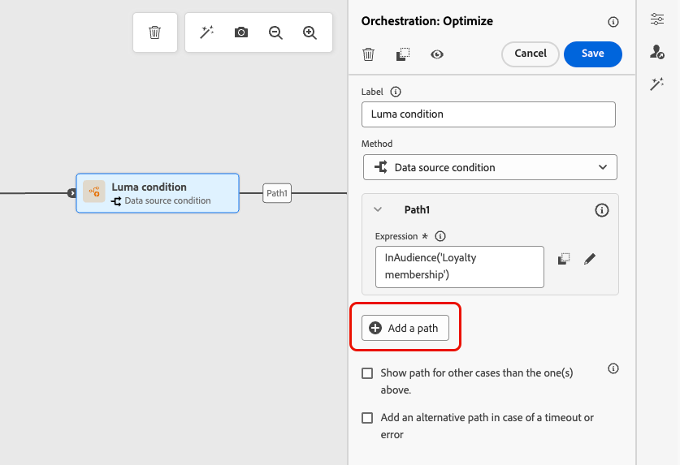
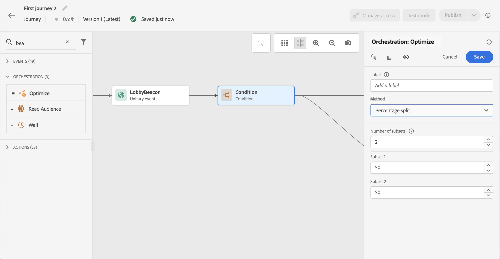

# Voorwaarden {#conditions}

>[!CONTEXTUALHELP]
>id="ajo_journey_conditions"
>title="Voorwaarden"
>abstract="De voorwaarden laten u bepalen hoe de individuen door uw reis door het creëren van veelvoudige wegen die op specifieke criteria worden gebaseerd. U kunt ook een ander pad configureren voor het afhandelen van time-outs of fouten, zodat u over een naadloze ervaring beschikt."

Met **voorwaarden** kunt u bepalen hoe de individuen door uw reis door veelvoudige wegen te creëren die op specifieke criteria worden gebaseerd. U kunt ook een ander pad configureren voor het afhandelen van time-outs of fouten, zodat u over een naadloze ervaring beschikt.

>[!AVAILABILITY]
>
>Deze voorwaarden zijn beschikbaar door **optimaliseer** activiteit, die op bestelling in Beperkte Beschikbaarheid kan worden betreden. Neem contact op met uw Adobe-vertegenwoordiger voor toegang.
>
>Als u geen toegang tot deze capaciteit hebt, kunt u de erfenis [ activiteit van de Voorwaarde ](condition-activity.md) nog gebruiken.

## Een voorwaarde toevoegen {#add-condition-activity}

Volg onderstaande stappen om een voorwaarde aan uw reis toe te voegen.

1. Zet de **[!UICONTROL Optimize]** -activiteit neer in het canvas van de reis. [Meer informatie](optimize.md)

1. Voeg een optioneel label toe om de activiteit in de logboeken van de rapportage- en testmodus te identificeren.

1. Selecteer een voorwaarde in de vervolgkeuzelijst **[!UICONTROL Method]** .

   {width=80%}

   De volgende soorten voorwaarden zijn beschikbaar:

   * [ de bronvoorwaarde van Gegevens ](#data_source_condition)
   * [ voorwaarde van de Tijd ](#time_condition)
   * [ Splitsing van het Percentage ](#percentage_split)
   * [Datumvoorwaarde](#date_condition)
   * [Profiel uiteinde](#profile_cap)
   * U kunt ook een publiek gebruiken in een reisconditie. [Meer informatie](#using-a-segment)

## Voorwaardelijke paden beheren {#condition_paths}

>[!CONTEXTUALHELP]
>id="ajo_journey_expression_simple2"
>title="Informatie over de editor voor eenvoudige expressies"
>abstract="In de modus Eenvoudige expressieeditor kunt u eenvoudige query&#39;s uitvoeren op basis van een combinatie van velden. Alle beschikbare velden worden links op het scherm weergegeven. Sleep velden naar de hoofdzone. Als u de verschillende elementen wilt combineren, koppelt u ze aan elkaar om verschillende groepen en/of groepsniveaus te maken. Vervolgens kunt u een logische operator selecteren om elementen op hetzelfde niveau te combineren."

Wanneer u verschillende voorwaarden in een reis gebruikt, kunt u labels voor elk van deze voorwaarden definiëren om ze gemakkelijker te kunnen identificeren.

Klik op **[!UICONTROL Add a path]** als u meerdere voorwaarden wilt definiëren. Voor elke voorwaarde wordt een nieuw pad toegevoegd in het canvas na de activiteit.

{width=80%}

Merk op dat het ontwerp van de ritten functionele gevolgen heeft. Wanneer meerdere paden na een voorwaarde worden gedefinieerd, wordt alleen het eerste in aanmerking komende pad uitgevoerd. Dit betekent dat u de prioritering van paden kunt wijzigen door deze boven of onder elkaar te plaatsen.

Laten we het voorbeeld nemen van de voorwaarde &#39;De persoon is een VIP&#39; van een eerste pad en de voorwaarde &#39;De persoon is een man&#39; van een tweede pad. Als een persoon die aan beide voorwaarden voldoet (een mannetje dat een VIP is) deze stap doorgeeft, wordt het eerste pad gekozen, zelfs als deze persoon ook in aanmerking komt voor het tweede pad, omdat het eerste pad &quot;boven&quot; is. Verplaats uw activiteiten in een andere verticale volgorde om deze prioriteit te wijzigen.

Met de optie **[!UICONTROL Show path for other cases than the one(s) above]** kunt u een ander pad maken voor soorten publiek die niet in aanmerking komen voor de gedefinieerde voorwaarden.

>[!NOTE]
>
>Deze optie is niet beschikbaar in gesplitste omstandigheden. [Meer informatie](#percentage_split)

In de eenvoudige modus kunt u eenvoudige query&#39;s uitvoeren op basis van een combinatie van velden. Alle beschikbare velden worden links op het scherm weergegeven. Sleep velden naar de hoofdzone. Als u de verschillende elementen wilt combineren, koppelt u ze aan elkaar om verschillende groepen en/of groepsniveaus te maken. Vervolgens kiest u een logische operator om elementen op hetzelfde niveau te combineren:

* **EN** - een doorsnede van twee criteria. Alleen de elementen die aan alle criteria voldoen, worden in aanmerking genomen.
* **OF** - een vereniging van twee criteria. Elementen die ten minste aan een van de twee criteria voldoen, worden in aanmerking genomen.

{width=80%}

Als u de [ Dienst van de Segmentatie van Adobe Experience Platform ](https://experienceleague.adobe.com/docs/experience-platform/segmentation/home.html){target="_blank"} gebruikt om uw publiek tot stand te brengen, kunt u hefboomwerking hen in uw reisvoorwaarden. Verwijs naar [ Gebruikend publiek in voorwaarden ](../building-journeys/condition-activity.md#using-a-segment).

>[!NOTE]
>
>U kunt geen vragen op tijdreeksen (bijvoorbeeld een lijst van aankopen, voorbij klikken op berichten) met de eenvoudige redacteur uitvoeren. Hiervoor moet u de geavanceerde editor gebruiken. Zie [deze pagina](expression/expressionadvanced.md).

Wanneer er een fout in een actie of een voorwaarde optreedt, eindigt de journey van een individu. De enige manier om door te gaan is het selectievakje **[!UICONTROL Add an alternative path in case of a timeout or an error]** in te schakelen. [Meer informatie](../building-journeys/using-the-journey-designer.md#paths)

In de eenvoudige redacteur, zult u ook de categorie van de Eigenschappen van de Reis, onder de gebeurtenis en gegevensbroncategorieën vinden. Deze categorie bevat technische velden die verband houden met de reis voor een bepaald profiel. Dit is de informatie die door het systeem wordt opgehaald uit rechtstreekse reizen, zoals de reis-id of de specifieke fouten die zijn aangetroffen. [Meer informatie](expression/journey-properties.md)

## Gegevensbronvoorwaarde {#data_source_condition}

Gebruik een **[!UICONTROL Data source condition]** om een voorwaarde te definiëren die is gebaseerd op velden uit de gegevensbronnen of de gebeurtenissen die eerder in de rit zijn geplaatst. Dit type voorwaarde wordt bepaald met de uitdrukkingsredacteur. [ Leer hoe te om de uitdrukkingsredacteur ](expression/expressionadvanced.md) te gebruiken

Als u zich bijvoorbeeld richt op een publiek met verrijkingskenmerken die zijn gegenereerd met een compositieworkflow of een aangepaste upload (CSV-bestand), kunt u deze verrijkingskenmerken gebruiken om uw voorwaarde te maken.

Met de geavanceerde expressieeditor kunt u geavanceerdere voorwaarden instellen voor het manipuleren van verzamelingen of het gebruik van gegevensbronnen waarvoor parameters moeten worden doorgegeven. [Meer informatie](../datasource/external-data-sources.md)

{width=80%}

## Datumvoorwaarde {#date_condition}

Hierdoor kunt u een andere stroom definiëren op basis van de datum. Bijvoorbeeld, als de persoon de stap tijdens de &quot;verkoop&quot;periode ingaat, zult u hen een specifiek bericht verzenden. De rest van het jaar zal je nog een bericht sturen.

>[!NOTE]
>
>De tijdzone is niet langer specifiek voor een bepaalde aandoening en wordt nu op het niveau van de reis gedefinieerd in de reiseigenschappen. [Meer informatie](../building-journeys/timezone-management.md)

## Percentage splitsing {#percentage_split}

Met deze optie kunt u het publiek willekeurig opsplitsen om een andere actie voor elke groep te definiëren. Geef het aantal splitsingen en de verdeling voor elk pad op. De gesplitste berekening is statistisch, aangezien het systeem niet kan voorspellen hoeveel mensen in deze activiteit van de reis zullen stromen. Als gevolg hiervan heeft de splitsing een zeer lage foutmarge. Deze functie is gebaseerd op het willekeurige mechanisme van a [ Java ](https://docs.oracle.com/javase/7/docs/api/java/util/Random.html){target="_blank"}.

In de testmodus wordt bij het bereiken van een splitsing altijd de bovenste vertakking gekozen. U kunt de positie van de gesplitste vertakkingen opnieuw ordenen als u wilt dat de test een ander pad kiest. [Meer informatie](../building-journeys/testing-the-journey.md)

>[!NOTE]
>
>Er is geen knop om een pad toe te voegen in de splitsingsvoorwaarde voor percentages. Het aantal paden is afhankelijk van het aantal splitsingen. In gesplitste omstandigheden kunt u geen pad toevoegen voor andere gevallen omdat dit niet kan gebeuren. Mensen gaan altijd in een van de gesplitste paden.

## Tijdconditie {#time_condition}

Gebruik een **[!UICONTROL Time condition]** om verschillende handelingen uit te voeren op basis van het uur van de dag en/of de dag van de week. U kunt bijvoorbeeld kiezen om pushberichten overdag en e-mailberichten &#39;s nachts tijdens weekdagen te verzenden.

>[!NOTE]
>
>* De tijdzone is niet specifiek voor een conditie en wordt op het niveau van de reis gedefinieerd in de reiseigenschappen. [Meer informatie](../building-journeys/timezone-management.md)
>
>* Door gebrek, wordt **[!UICONTROL Time condition]** geplaatst door uur, van 00 :00 aan 12 :00.

Er zijn drie filteropties beschikbaar:

* **Uren** - staat u toe om een voorwaarde te vestigen die op de tijd van de dag wordt gebaseerd. Vervolgens definieert u de begin- en eindtijd. De individuen zullen de weg slechts tijdens de bepaalde uurwaaier ingaan.
* **Dag van de week** - staat u toe aan opstelling een voorwaarde die op de dag van de week wordt gebaseerd. Vervolgens selecteert u welke dagen personen het pad moeten invoeren.
* **Dag van de week en uur** - deze optie combineert de eerste twee opties.

## Profiel uiteinde {#profile_cap}

Gebruik dit voorwaardetype om een maximumaantal profielen voor een wegweg te plaatsen. Wanneer deze limiet is bereikt, hebben de invoerprofielen een ander pad. Dit zorgt ervoor dat uw reizen nooit de vastgestelde grens zullen overschrijden.

>[!NOTE]
>
>We raden u aan een hoogwaardig profielbovengrens te definiëren. De precisie en de waarschijnlijkheid dat een populatie het exacte maximumaantal zal bereiken neemt alleen toe naarmate de limiet toeneemt. Bij kleine getallen (bijvoorbeeld een bovengrens van 50) komen de getallen niet altijd overeen, omdat de limiet mogelijk niet wordt bereikt voordat de profielen een ander pad kiezen.

<!--You can use this condition type to ramp up the volume of your deliveries. See this [use case](ramp-up-deliveries-uc.md).-->

De standaard-uiteinde is 1.000.

De teller geldt alleen voor de geselecteerde reisversie. De teller wordt teruggezet aan nul wanneer de reis wordt gedupliceerd of wanneer een nieuwe versie wordt gecreeerd. Na het opnieuw instellen nemen de ingevoerde profielen het nominale pad opnieuw tot de tellerlimiet is bereikt.

Wanneer de profieldop op een terugkerende reis wordt bepaald, stelt de teller na elke herhaling niet terug.

Het nominale pad heeft altijd voorrang op het alternatieve pad, zelfs als u het alternatieve pad boven het nominale pad op het canvas verplaatst.

Voor het vervoer van levende dieren zijn er de drempelwaarden die in aanmerking moeten worden genomen om de grenswaarde te bereiken:

* Bij een dop van meer dan 10.000 moet het aantal afzonderlijke profielen dat moet worden geïnjecteerd ten minste 1,3 maal de dop bedragen.
* Voor een dop onder 10.000 moet het aantal afzonderlijke te injecteren profielen 1000 plus de dop zijn.

In de testmodus wordt geen rekening gehouden met de profielbegrenzing.

## Gebruik publiek in omstandigheden {#using-a-segment}

In deze sectie wordt uitgelegd hoe u een publiek kunt gebruiken in een reisconditie. Voor meer op publiek en hoe te om hen te bouwen, verwijs naar [ deze sectie ](../audience/about-audiences.md).

Voer de volgende stappen uit om een publiek in een reisvoorwaarde te gebruiken:

1. Open een rit, zet een **[!UICONTROL Optimize]** activiteit neer en kies **[!UICONTROL Data source condition]**.

   

1. Klik op **[!UICONTROL Add a path]** voor elk extra pad dat nodig is. Klik voor elk pad op het veld **[!UICONTROL Expression]** .

1. Ontgrendel **[!UICONTROL Audiences]** node aan de linkerkant. Sleep het publiek dat u voor de voorwaarde wilt gebruiken en zet het neer. Standaard is de voorwaarde voor het publiek waar.

   {width=80%}

   >[!NOTE]
   >
   >Merk op dat slechts de individuen met de **Realized** status van de publieksparticipatie als leden van het publiek zullen worden beschouwd. Voor meer op hoe te om een publiek te evalueren, verwijs naar de [ documentatie van de Dienst van de Segmentatie ](https://experienceleague.adobe.com/docs/experience-platform/segmentation/tutorials/evaluate-a-segment.html#interpret-segment-results){target="_blank"}.
