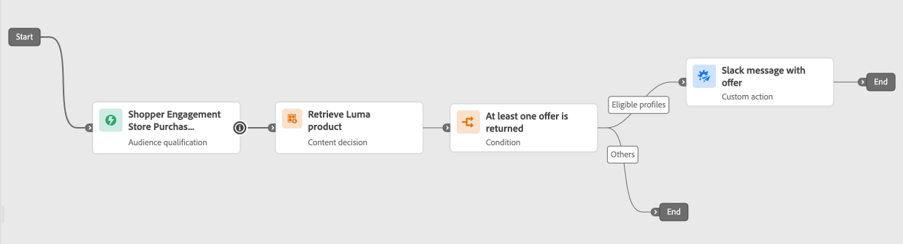

# Beslissingsactiviteit inhoud {#content-decision}

[!DNL Journey Optimizer] staat u toe om aanbiedingen in uw reizen door de specifieke **inhoud besluit** activiteit in het wegcanvas te omvatten. U kunt andere activiteiten (zoals [ douaneacties ](../action/about-custom-action-configuration.md)) aan uw reizen dan toevoegen om uw publiek met deze gepersonaliseerde aanbiedingen te richten.

>[!NOTE]
>
>De output van een activiteit van de inhoudsbeslissing kan niet in inheemse kanaalactiviteiten worden gebruikt.

Aan hefboomwerking dit vermogen, creeer een reis waar u de activiteit van het a [ inhoudsbesluit ](#add-content-decision-activity) toevoegt om de aanbiedingen te bepalen u aan de in aanmerking komende profielen wilt voorstellen.

Vervolgens kunt u de uitvoer van de besluitvormingsactiviteit voor de inhoud gebruiken in:

* a [ voorwaardenactiviteit ](#add-condition-activity), om profielen aan specifieke wegen te bewegen die op de teruggewonnen aanbiedingen worden gebaseerd;

* a [ douaneactie ](#add-custom-action), waar u die aanbiedingen naar externe systemen kunt verzenden.

## Een handeling voor een inhoudsbesluit configureren {#add-content-decision-activity}

Met behulp van de activiteit voor het nemen van beslissingen over inhoud kunt u een beslissingsbeleid definiëren waarmee u de beste items kunt kiezen uit [!DNL Journey Optimizer] -beslissingen en deze aan het juiste publiek kunt leveren.

<!--Their goal is to select the best offers for each profile, while the campaign/journey authoring allows you to indicate how the selected decision items should be presented, including which item attributes to be included in the message.-->

Voer de onderstaande stappen uit om de **[!UICONTROL Content decision]** -activiteit te configureren.

1. Ontvouw de categorie **[!UICONTROL Orchestration]** en zet een **[!UICONTROL Content decision]** -activiteit neer op uw canvas.

   {width=100%} toe

1. Voeg desgewenst een label en beschrijving aan de activiteit toe.

1. Klik op **[!UICONTROL Add decision policy]**. [ Leer meer over besluitvormingsbeleid ](../experience-decisioning/create-decision.md)

   >[!NOTE]
   >
   >Beslissingstoestemmingen zijn nodig aan auteur een besluitvormingsbeleid. [Meer informatie](../experience-decisioning/gs-experience-decisioning.md#steps)

1. Selecteer het aantal objecten dat je wilt retourneren. Als u bijvoorbeeld 2 selecteert, worden de beste twee in aanmerking komende aanbiedingen weergegeven. Klik op **[!UICONTROL Next]**.

1. Selecteer in de sectie **[!UICONTROL Strategy sequence]** de beslissingsitems en/of de selectiestrategieën die u wilt presenteren bij het beslissingsbeleid. [Meer informatie](../experience-decisioning/create-decision.md#create-decision)

1. Orden de evaluatievolgorde naar wens.

   Wanneer u meerdere beslissingsitems en/of strategieën toevoegt, worden deze in volgorde geëvalueerd, aangegeven met getallen links van elk object of elke groep objecten. Als u de standaardvolgorde wilt wijzigen, kunt u de objecten en/of groepen slepen en neerzetten om ze naar wens opnieuw te rangschikken. [Meer informatie](../experience-decisioning/create-decision.md#create-decision)

1. (optioneel) Voeg een fallback-aanbieding toe. [Meer informatie](../experience-decisioning/create-decision.md#create-decision)

1. Controleer en sla uw beslissingsbeleid op.

   {width=70%}<!--reshoot or change screen-->

U bent nu klaar om de output van deze inhoud beslissingsactiviteit in uw reis te gebruiken.

## Afbeeldingen en beperkingen {#guardrails}

**Toegelaten beleid**

* Het duurt maximaal 48 uur om het goedkeuringsbeleid bij te werken. Als in een besluitvormingsbeleid wordt verwezen naar een kenmerk dat is gekoppeld aan een onlangs bijgewerkt beleid voor toestemming, worden de wijzigingen niet onmiddellijk toegepast.

* Op dezelfde manier als nieuwe profielattributen die aan een toestemmingsbeleid onderworpen zijn aan een besluitvormingsbeleid worden toegevoegd, zullen zij bruikbaar zijn, maar het toestemmingsbeleid verbonden aan hen zal niet worden afgedwongen tot de vertraging is overgegaan.

* Beleid met toestemming is alleen beschikbaar voor organisaties met de invoegtoepassing Adobe Healthcare Shield of Privacy and Security Shield.

## De uitvoer van de activiteit voor het nemen van beslissingen over inhoud gebruiken {#use-content-decision-output}

De output van een inhoudbesluit kan in veelvoudige reisactiviteiten worden gebruikt. Bijvoorbeeld, kunt u de activiteit van de a [ voorwaarde ](#add-condition-activity) gebruiken om profielen naar specifieke takken van uw reis te bewegen, die op het aantal aanbiedingen wordt gebaseerd voor hen worden teruggewonnen.

U kunt a [ douaneactie ](#add-custom-action) aan uw reis ook toevoegen om de aanbiedingen van de activiteit van het inhoudsbesluit aan een extern systeem te delen.

### In een bepaalde toestand {#add-condition-activity}

Als u de uitvoer van een besluitvormingsactiviteit met betrekking tot inhoud wilt benutten, kunt u een voorwaarde aan uw reis toevoegen, waarbij u expressies definieert om profielen naar specifieke paden te verplaatsen aan de hand van gegevens uit deze aanbiedingen. Voer de onderstaande stappen uit.

1. Laat vanuit de categorie **[!UICONTROL Orchestration]** een **[!UICONTROL Condition]** -activiteit op uw canvas rusten. [Meer informatie](condition-activity.md#add-condition-activity)

1. (optioneel) Wijzig de naam van een meer relevant label in **[!UICONTROL Path1]** , dat overeenkomt met de eerste expressie die u definieert.

1. Klik voor dit eerste pad in het veld **[!UICONTROL Expression]** of gebruik het pictogram Bewerken om een expressie toe te voegen.

   {width=80%} uit

1. In het pop-up venster dat opent, schakelaar aan **[!UICONTROL Advanced mode]** om de [ geavanceerde uitdrukkingsredacteur ](expression/expressionadvanced.md) te gebruiken.

   >[!CAUTION]
   >
   >De uitvoer van een beslissingsknooppunt voor inhoud is alleen beschikbaar in de **[!UICONTROL Advanced mode]** .

1. Ontvouw de **[!UICONTROL Context]** knoop en navigeer aan uw besluitvormingsbeleid om alle attributen te tonen beschikbaar in het [ catalogusschema van aanbiedingen ](../experience-decisioning/catalogs.md#access-catalog-schema).

    uit

   >[!NOTE]
   >
   >Om het even welk beperkt die etiket op een attribuut wordt bepaald kan in een beleidsschending voor DULE of toestemming resulteren. Dit is op de gebeurtenissen van de reiservaring van toepassing die in een besluitvormingsregel en op [ worden gebruikt aanbiedt schema ](../experience-decisioning/catalogs.md#access-catalog-schema). Leer meer over het beleid van het gegevensbeheer in [ deze sectie ](../action/action-privacy.md).

1. Om te controleren als om het even welke aanbieding voor de profielen is teruggekeerd die de reis ingaan, gebruik de [ listSize ](functions/list-functions.md#listSize) functie met de volgende syntaxis: `listSize(@decision{ContentdecisionName.items})>0`

   >[!NOTE]
   >
   >In dit voorbeeld is `Name` het label van de inhoudsbeslissing die u aan uw reis hebt toegevoegd.

    toe

1. Klik op **[!UICONTROL Ok]**.

1. Voeg desgewenst meer paden toe om andere voorwaarden te definiëren.

   U kunt ook een ander pad maken voor profielen die niet aan de eerste voorwaarde voldoen door **[!UICONTROL Show path for other cases than the one(s) above]** te controleren. <!--These profiles will then exit the journey if no other activity is added in that path.-->

1. Sla de voorwaardenactiviteit op.

### In een aangepaste handeling {#add-custom-action}

Als u de uitvoer van een besluitvormingsactiviteit met betrekking tot inhoud wilt benutten, kunt u een aangepaste handeling aan uw reis toevoegen, waarin u de aanbiedingen deelt die u aan een extern systeem hebt gedefinieerd. Voer de onderstaande stappen uit.

1. Voeg een aangepaste actie toe aan uw reis. [Meer informatie](../action/about-custom-action-configuration.md)

1. Voer een label in voor de handeling.

1. Selecteer in de sectie **[!UICONTROL Request parameters]** de parameter die u wilt toewijzen aan kenmerken van de aanbiedingen die zijn opgehaald.

   Klik in het bewerkbare tekstveld en selecteer een parameter die u wilt toewijzen aan kenmerken uit de aanbiedingen die zijn opgehaald.

    uit

1. Schakel over naar **[!UICONTROL Advanced mode]** in het pop-upvenster dat wordt geopend. In de [ geavanceerde uitdrukkingsredacteur ](expression/expressionadvanced.md), ontvouw de **[!UICONTROL Context]** knoop om alle punten van het besluitvormingsbeleid te tonen.

   >[!CAUTION]
   >
   >De uitvoer van een beslissingsknooppunt voor inhoud is alleen beschikbaar in de **[!UICONTROL Advanced mode]** .

1. Blader door het [ catalogusschema van aanbiedingen ](../experience-decisioning/catalogs.md#access-catalog-schema) gebruikend de `items` serie. Gebruik bijvoorbeeld de `itemName` van de eerste aanbieding die wordt opgehaald en de `itemName` van de tweede aanbieding die wordt opgehaald.

   

1. Klik op **[!UICONTROL Ok]** om uw expressie op te slaan.

1. **[!UICONTROL Save]** de aangepaste actieconfiguratie.

### Voorbeeld van begin tot einde {#use-case}

Hieronder ziet u het volledige voorbeeld van een reis waarbij een activiteit voor het nemen van beslissingen over inhoud wordt gecombineerd met een voorwaardenactiviteit en een aangepaste handeling, zoals hierboven beschreven.



<!--When all activities are properly configured and saved, [publish](publish-journey.md) your journey.-->

Zodra de reis [ ](publish-journey.md) wordt geactiveerd:

<!--* Profiles who enter the journey and are eligible for at least one offer are targeted by the custom action.

* If no offer is returned for a profile, they are excluded from the custom action.-->

1. Telkens als een profiel voor dat publiek kwalificeert, komt het op reis.

1. Via de activiteit voor het nemen van beslissingen over inhoud haalt [!DNL Journey Optimizer] de relevante aanbiedingen voor elk profiel op.

1. Alleen profielen waarvoor ten minste één aanbieding wordt opgehaald, worden doorgevoerd (via het pad &quot;In aanmerking komende profielen&quot;).

1. Als aan de voorwaarde wordt voldaan, worden de overeenkomstige voorstellen verzonden naar een extern systeem door de douaneactie.

## Gegevens in stap-gebeurtenissen verwijderen {#decisioning-step-events}

Wanneer een activiteit van de inhoudbeslissing in een reis wordt uitgevoerd, worden de beslissingsgegevens ter beschikking gesteld in de gebeurtenissen van de reisstap. Deze gegevens bevatten gedetailleerde informatie over de opgehaalde items en de manier waarop de beslissingen zijn genomen.

Voor elke activiteit van de inhoudsbeslissing, omvat de step gebeurtenis beslissingsgegevens op het hoogste niveau (zoals **exdRequestID** en **propositionEventType**), en een serie van **voorstellen**. Elk voorstel heeft een **identiteitskaart**, **scopeDetails** (met inbegrip van besluitvormingsleverancier, correlatie identiteitskaart, en besluitvormingsbeleid), en een **punten** serie. Elk item bevat:

* **identiteitskaart**: het unieke herkenningsteken van het punt
* **naam**: de naam van het punt
* **score**: de score die aan het punt wordt toegewezen
* **itemSelection**: gegevens verwant met hoe het besluit werd genomen en hoe het punt, met inbegrip van werd teruggewonnen:
   * **selectionDetail**: informatie over de gebruikte selectiestrategie
   * **rankingDetail**: informatie over het rangschikkende proces (strategie, algoritme, stap, verkeerstype)

**Voorbeeld van beslissingsgegevens in een stapgebeurtenis:**

```json
"decisioning": {
  "exdRequestID": "8079d2bb-a8b2-4ecf-b9e7-32923dd6ad4e",
  "propositions": [
    {
      "id": "f475cb21-0842-44da-b0eb-70766ba53464",
      "scopeDetails": {
        "decisionProvider": "EXD",
        "correlationID": "6940d1c46208f3c00dae2ab94f3cd31c601461b47bf6d29ff8af0d0806a9c204",
        "decisionPolicy": {
          "id": "b913f724-3747-447b-a51e-8a2f9178f0db"
        }
      },
      "items": [
        {
          "id": "dps:14c7468e7f6271ff8023748a1146d11f05f77b7fc1368081:1bebbf0b7e0f1374",
          "name": "My item name",
          "score": 0.93,
          "itemSelection": {
            "selectionDetail": {
              "strategyID": "dps:selection-strategy:1bebbfc9245cb35e",
              "strategyName": "My selection strategy",
              "selectionType": "selectionStrategy",
              "version": "latest"
            },
            "rankingDetail": {
              "strategyID": "4FyRZTmpjrbzuL7rX7gvmu",
              "algorithmID": "RANDOM",
              "step": "aiModel",
              "trafficType": "random"
            }
          }
        }
      ]
    }
  ],
  "propositionEventType": {
    "decision": 1
  }
}
```
