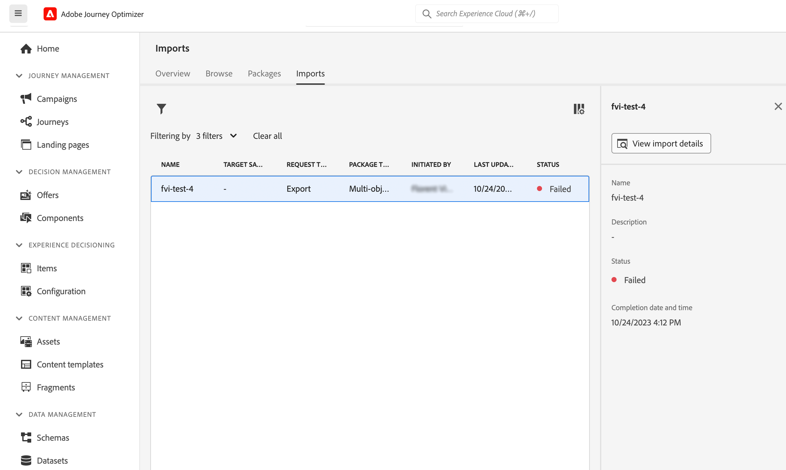

# Een journey naar een andere sandbox kopiëren {#copy-to-sandbox}

<!--
>[!CONTEXTUALHELP]
>id="ajo_journey_copy_main"
>title="Copy a journey to another sandbox"
>abstract="Journey Optimizer allows you to copy an entire journey from one sandbox to another. For example, you can copy a journey from the Stage sandbox environment to your Production sandbox. In addition to the Journey itself, Journey Optimizer also copies most of the objects the journey depends on."

>[!CONTEXTUALHELP]
>id="ajo_journey_copy_sandbox_details"
>title="Sandbox details"
>abstract="Select the destination sandbox you want to copy the journey to. Only sandboxes within your organization are available."

>[!CONTEXTUALHELP]
>id="ajo_journey_copy_object_details"
>title="Object details"
>abstract="This is the journey you are going to copy."

>[!CONTEXTUALHELP]
>id="ajo_journey_copy_dependent_objects"
>title="Dependent objects"
>abstract="This is the list of associated objects used in the journey. This list displays the name, the object type, as well as the internal Journey Optimizer ID."
-->

Met sandboxgereedschappen kunt u objecten kopiëren naar meerdere sandboxen door het exporteren en importeren van pakketten te benutten. Een pakket kan uit één object of uit meerdere objecten bestaan. Alle objecten die in een pakket zijn opgenomen, moeten afkomstig zijn uit dezelfde sandbox.

Op deze pagina wordt het gebruik-hoofdlettergebruik voor Sandbox-gereedschappen in de context van Journey Optimizer beschreven. Raadpleeg voor meer informatie over de functie zelf de [Documentatie Experience Platform](https://experienceleague.adobe.com/docs/experience-platform/sandbox/ui/sandbox-tooling.html).

>[!NOTE]
>
>Voor deze functie zijn de volgende machtigingen vereist: manage-sandbox (of view-sandbox) en manage-package.

## Aan de slag met sandboxgereedschappen{#sandbox-gs}

Met Journey Optimizer kunt u een volledige reis van de ene naar de andere sandbox kopiëren. U kunt bijvoorbeeld een traject kopiëren van de zandbakomgeving van het werkgebied naar de productiefandbox. Naast de reis zelf kopieert Journey Optimizer ook de meeste objecten die de reis afhangt van: publiek, schema&#39;s, evenementen en acties. Raadpleeg deze voor meer informatie over gekopieerde objecten [sectie](https://experienceleague.adobe.com/docs/experience-platform/sandbox/ui/sandbox-tooling.html#abobe-journey-optimizer-objects).

>[!CAUTION]
>
>We garanderen niet dat alle gekoppelde elementen naar de doelsandbox worden gekopieerd. We raden u ten zeerste aan een grondige controle uit te voeren voordat u de reis publiceert. Zo kunt u elk mogelijk ontbrekend object identificeren.

De gekopieerde objecten in de doelsandbox zijn uniek en er bestaat geen risico dat bestaande elementen worden overschreven. Zowel de reis als alle berichten binnen de reis worden in de ontwerpmodus overgenomen. Hierdoor kunt u een grondige validatie uitvoeren voordat deze wordt gepubliceerd in de doelsandbox. Het kopieerproces kopieert alleen de metagegevens over de reis en de objecten in die reis. Er worden geen profiel- of gegevenssetgegevens gekopieerd als onderdeel van dit proces.

Het kopieerproces wordt uitgevoerd via een pakketexport en importeren tussen de bron- en doelsandboxen. Hier volgen de algemene stappen voor het kopiëren van een reis van de ene naar de andere sandbox:

1. Voeg de reis als pakket in de bronzandbak toe.
1. Exporteer het pakket naar de doelsandbox.

## De reis toevoegen als een pakket{#export}

Als u een reis naar een andere sandbox wilt kopiëren, moet u eerst de rit als een pakket in de bronsandbox toevoegen. Voer de volgende stappen uit:

1. Klik in de menusectie JOURNEY MANAGEMENT op **[!UICONTROL Journeys]**. De lijst met reizen wordt weergegeven.

1. Zoek naar de reis u wilt kopiëren, klik **Meer handelingen** pictogram (de drie punten naast de naam van de rit) en klik op **Toevoegen aan pakket**.

   

   De **Toevoegen aan pakket** wordt weergegeven.

   

1. Kies of u de rit aan een bestaand pakket wilt toevoegen of een nieuw pakket wilt maken:

   * **Bestaand pakket**: selecteer het pakket in het keuzemenu.
   * **Een nieuw pakket maken**: typ de pakketnaam. U kunt ook een beschrijving toevoegen.

1. Klik in de sectie van het menu ADMINISTRATIE op **[!UICONTROL Sandboxes]**, selecteert u de **Pakketten** en klik op het pakket dat u wilt exporteren.

   

1. Selecteer de objecten die u wilt exporteren en klik op **Publiceren**

   

   Als de publicatie is mislukt, kunt u de logboeken controleren om de oorzaak van de fout te achterhalen. Open het pakket en klik op **Zie mislukte taken**, selecteert u de importtaak en klikt u op **Importdetails weergeven**.

   

## Het pakket exporteren naar de doelsandbox {#import}

Nadat het pakket is gepubliceerd, moet u het exporteren naar de doelsandbox.

1. Klik in de bronsandbox op de knop **[!UICONTROL Sandboxes]** , selecteert u de **Pakketten** en klikt u op het pictogram + naast het pakket dat u wilt exporteren.

   

1. Selecteer de **Doelsandbox** in het vervolgkeuzeveld en klik op **Volgende**. Alleen sandboxen binnen uw organisatie zijn beschikbaar.

   

1. Controleer de pakketobjecten en afhankelijkheden. Dit is de lijst van bijbehorende voorwerpen die in de reis worden gebruikt. In deze lijst worden de naam en het objecttype weergegeven. Voor elk object kunt u een nieuw object maken of een bestaand object in de doelsandbox gebruiken.

   

1. Klik op de knop **Voltooien** in de rechterbovenhoek om het pakket naar de doelsandbox te kopiëren. Het kopiëren is afhankelijk van de complexiteit van de reis en het aantal objecten dat moet worden gekopieerd.

1. Klik op de importtaak om het kopieerresultaat te bekijken:

   * Klikken **Geïmporteerde objecten weergeven** om elk gekopieerd object weer te geven.
   * Klikken **Importdetails weergeven** om de resultaten van het importeren voor elk object te controleren.

   

1. Open de doelsandbox en voer een grondige controle uit van alle gekopieerde objecten.
