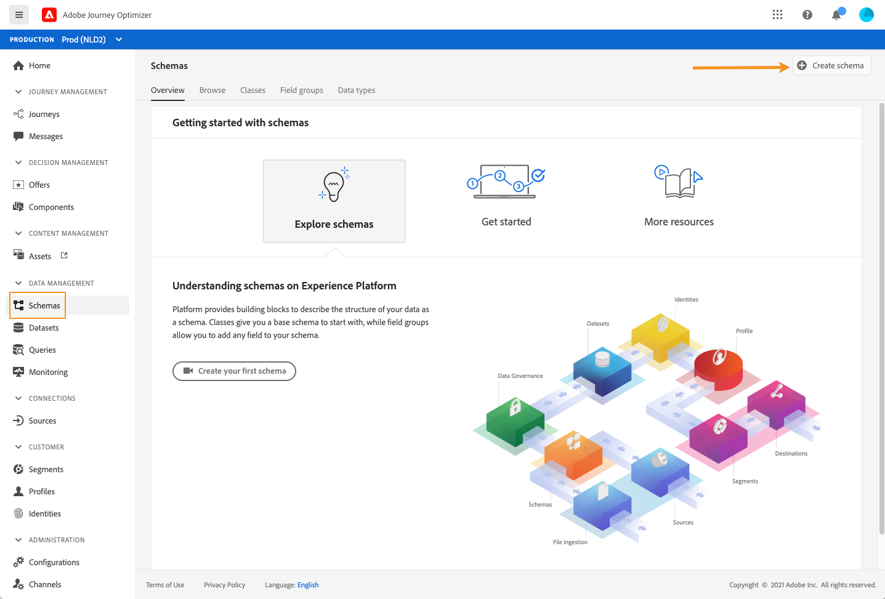
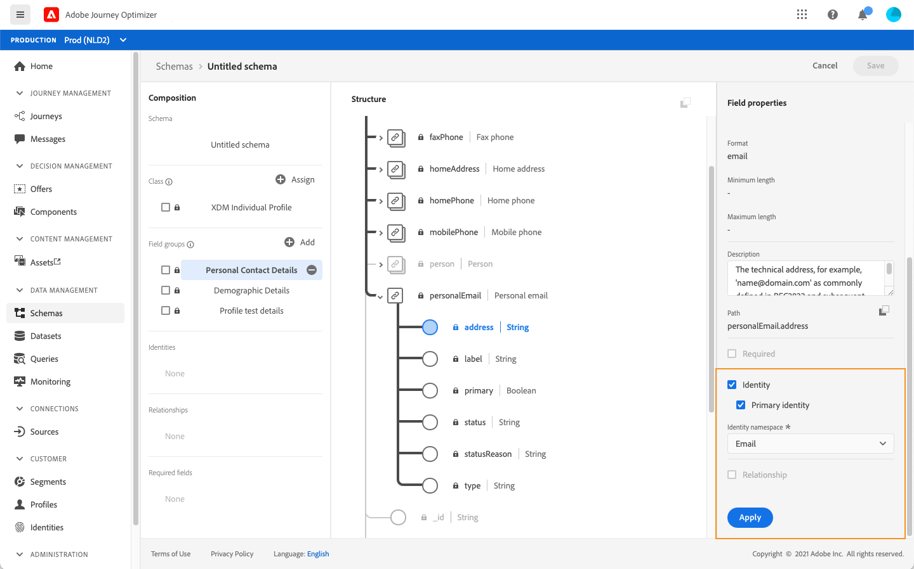
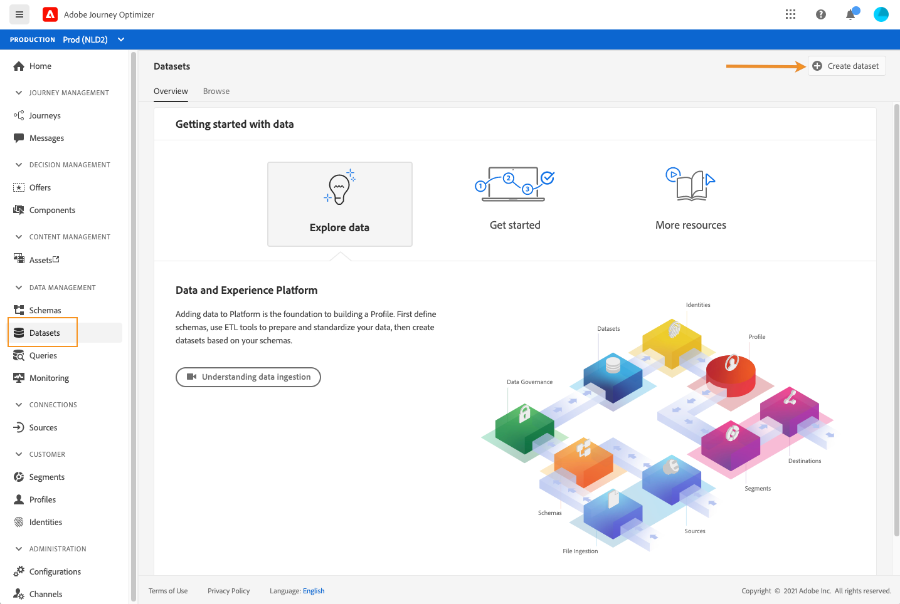
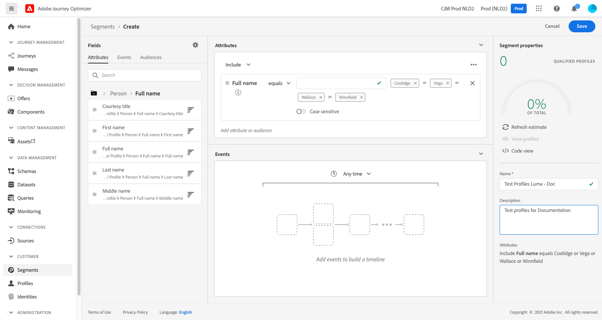

# Testprofielen maken {#create-test-profiles}

De profielen van de test worden vereist wanneer het gebruiken van de testwijze om te leren hoe te [testmodus](../building-journeys/testing-the-journey.md) op reis, en [uw berichten bekijken en testen](../messages/preview.md).

De beschikbare methoden voor het maken van testprofielen worden hieronder beschreven:

* U kunt een [bestaand profiel](#turning-profile-into-test) in een testprofiel

* U kunt een testprofiel maken door een [csv-bestand](#create-test-profiles-csv) of gebruiken [API-aanroepen](#create-test-profiles-api). Naast deze twee methoden wordt in Adobe Journey Optimizer een specifieke [geval van gebruik in producten](#use-case-1) om het maken van testprofielen te vergemakkelijken.

* U kunt ook een json-bestand in een gegevensset uploaden. Raadpleeg voor meer informatie de [Documentatie over gegevensinname](https://experienceleague.adobe.com/docs/experience-platform/ingestion/tutorials/ingest-batch-data.html#add-data-to-dataset){target=&quot;_blank&quot;}.

Het maken van een testprofiel lijkt op het maken van gewone profielen in Adobe Experience Platform. Raadpleeg voor meer informatie de [Documentatie van het profiel van de klant in realtime](https://experienceleague.adobe.com/docs/experience-platform/profile/home.html?lang=nl){target=&quot;_blank&quot;}.

## Vereisten {#test-profile-prerequisites}

Om profielen te kunnen tot stand brengen, moet u eerst een schema en een dataset in Adobe creëren [!DNL Journey Optimizer].

Eerst moet u **een schema maken**. Voer de volgende stappen uit:

1. Klik in de menusectie GEGEVENSBEHEER op **[!UICONTROL Schemas]**.
   
1. Klikken **[!UICONTROL Create schema]** selecteert u in de rechterbovenhoek een schematype, bijvoorbeeld **Afzonderlijk XDM-profiel**.
   
1. Selecteer de juiste veldgroepen. Zorg ervoor dat u de **Details van de profieltest** veldgroep.
   
Als u klaar bent, klikt u op **[!UICONTROL Add field groups]**: de lijst van gebiedsgroepen wordt getoond op het schema overzichtsscherm.
   

   >[!NOTE]
   >
   >* Klik op de naam van het schema om het te wijzigen en de eigenschappen ervan bij te werken.
   >
   >* Klik op de knop **[!UICONTROL Add]** in de sectie Veldgroepen om andere veldgroepen te selecteren die in het schema moeten worden toegevoegd


1. Klik in de lijst met velden op het veld dat u als primaire identiteit wilt definiëren.
   
1. In de **[!UICONTROL Field properties]** rechterdeelvenster, controleer het **[!UICONTROL Identity]** en **[!UICONTROL Primary Identity]** en selecteert u een naamruimte. Als u wilt dat de primaire identiteit een e-mailadres is, kiest u de optie **[!UICONTROL Email]** naamruimte. Klik op **[!UICONTROL Apply]**.
   
1. Selecteer het schema en schakel het **[!UICONTROL Profile]** in de **[!UICONTROL Schema properties]** venster.
   
1. Klikken **Opslaan**.

>[!NOTE]
>
>Raadpleeg voor meer informatie over het maken van schema&#39;s de [XDM-documentatie](https://experienceleague.adobe.com/docs/experience-platform/xdm/ui/resources/schemas.html#prerequisites){target=&quot;_blank&quot;}.

Vervolgens moet u **Maak de dataset** waarin de profielen worden geïmporteerd. Voer de volgende stappen uit:

1. Bladeren naar **[!UICONTROL Datasets]** en klik vervolgens op **[!UICONTROL Create dataset]**.
   
1. Kies **[!UICONTROL Create dataset from schema]**.
   
1. Selecteer het eerder gemaakte schema en klik op **[!UICONTROL Next]**.
   
1. Kies een naam en klik op **[!UICONTROL Finish]**.
   
1. De optie **[!UICONTROL Profile]** optie.
   

>[!NOTE]
>
> Voor meer informatie over de verwezenlijking van dataset, verwijs naar [Documentatie Catalog Service](https://experienceleague.adobe.com/docs/experience-platform/catalog/datasets/user-guide.html#getting-started){target=&quot;_blank&quot;}.

## Gebruiksscenario in het product{#use-case-1}

Op de homepage van Adobe Journey Optimizer kunt u de testprofielen gebruiken in het product. Met dit gebruiksgeval kunt u testprofielen maken die worden gebruikt voor het testen van reizen voordat ze worden gepubliceerd.


Klik op de knop **[!UICONTROL Begin]** om het gebruik te starten.

De volgende informatie is vereist:

1. **Naamruimte identiteit**: De [naamruimte identity](../start/get-started-identity.md) worden gebruikt om de testprofielen uniek te identificeren. Als e-mail bijvoorbeeld wordt gebruikt om de testprofielen te identificeren, wordt de naamruimte van de identiteit **E-mail** moet worden geselecteerd. Als het unieke herkenningsteken het telefoonaantal is, dan identiteit namespace **Telefoon** moet worden geselecteerd.

2. **CSV-bestand**: Een door komma&#39;s gescheiden bestand met de lijst testprofielen die moeten worden gemaakt. De gebruikscase verwacht een vooraf gedefinieerde indeling voor het CSV-bestand dat de lijst met testprofielen bevat die moet worden gemaakt. Elke rij in het bestand moet de volgende velden in de juiste volgorde bevatten:

   1. **Persoon-id**: Unieke identificatiecode van het testprofiel. De waarden van dit veld moeten de naamruimte weerspiegelen die is geselecteerd. (Als voorbeeld: als **Telefoon** is geselecteerd voor de naamruimte van de identiteit. De waarden van dit veld moeten telefoonnummers zijn. Op dezelfde manier als **E-mail** is geselecteerd, dan moeten de waarden van dit veld e-mails zijn)
   1. **E-mailadres**: E-mailadres testprofiel. (De **Persoon-id** en **E-mailadres** veld kan dezelfde waarden bevatten als **E-mail** is geselecteerd als naamruimte voor identiteit)
   1. **Voornaam**: Voornaam van testprofiel.
   1. **Achternaam**: Achternaam van testprofiel.
   1. **Plaats**: Testprofiel woonplaats
   1. **Land**: Testprofiel land van verblijf
   1. **Geslacht**: Geslacht testprofiel. Beschikbare waarden zijn **mannetje**, **vrouwelijk** en **niet_opgegeven**

Nadat u de naamruimte Identiteit hebt geselecteerd en het CSV-bestand hebt opgegeven op basis van de bovenstaande indeling, klikt u op **[!UICONTROL Run]** aan de rechterbovenhoek. Het kan enkele minuten duren voordat de gebruiksaanwijzing is voltooid. Zodra het gebruik is voltooid en de testprofielen zijn gemaakt, wordt een melding verzonden om de gebruiker op de hoogte te stellen.

>[!NOTE]
>
>Testprofielen kunnen bestaande profielen overschrijven. Controleer voordat u het gebruiksscenario uitvoert of het CSV-bestand alleen testprofielen bevat en of het wordt uitgevoerd met de juiste sandbox.

## Een profiel omzetten in een testprofiel{#turning-profile-into-test}

U kunt een bestaand profiel omzetten in een testprofiel: u kunt profielkenmerken op dezelfde manier bijwerken als wanneer u een profiel maakt.

Een eenvoudige manier om dit te doen is met behulp van een **[!UICONTROL Update Profile]** actieactiviteit in een reis en verander het testProfile booleaanse gebied van vals in waar.

Uw reis zal bestaan uit een **[!UICONTROL Read Segment]** en **[!UICONTROL Update Profile]** activiteit. Eerst moet u een segment maken dat zich richt op de profielen die u wilt omzetten in testprofielen.

>[!NOTE]
>
> Aangezien u de **testProfile** in de gekozen profielen moet dit veld worden opgenomen. Het gerelateerde schema moet de **Details van de profieltest** veldgroep. Zie [deze sectie](../building-journeys/creating-test-profiles.md#test-profiles-prerequisites).

1. Bladeren naar **Segmenten** vervolgens **Segment maken**, in de rechterbovenhoek.
   
1. Bepaal een naam voor uw segment en bouw het segment: Selecteer de velden en de waarden die u als doel wilt instellen.
   
1. Klikken **Opslaan** en controleer of de profielen correct door het segment worden gericht.
   

   >[!NOTE]
   >
   > Het berekenen van segmenten kan enige tijd in beslag nemen. Meer informatie over segmenten in [deze sectie](../segment/about-segments.md).

1. Maak nu een nieuwe reis en begin met een **[!UICONTROL Read Segment]** orkestactiviteit.
1. Kies het eerder gemaakte segment en de naamruimte die uw profielen gebruiken.
   
1. Een **[!UICONTROL Update Profile]** actieactiviteit.
1. Selecteer het schema, **testProfiles** veld, de gegevensset en de waarde instellen op **Waar**. Om dit uit te voeren, in **[!UICONTROL VALUE]** veld, klikt u op de knop **Pen** pictogram rechts, selecteert u **[!UICONTROL Advanced mode]** en betreden **true**.
   
1. Een **Einde** activiteit en klik **[!UICONTROL Publish]**.
1. In de **[!UICONTROL Segments]** controleren of de profielen correct zijn bijgewerkt.
   

   >[!NOTE]
   >
   > Voor meer informatie over de **[!UICONTROL Update Profile]** activiteit, zie [deze sectie](../building-journeys/update-profiles.md).

## Een testprofiel maken met een CSV-bestand{#create-test-profiles-csv}

In Adobe Experience Platform kunt u profielen maken door een CSV-bestand met de verschillende profielvelden te uploaden naar uw gegevensset. Dit is de eenvoudigste methode.

1. Maak een eenvoudig CSV-bestand met behulp van een spreadsheetsoftware.
1. Voeg één kolom toe voor elk nodig veld. Voeg het primaire identiteitsveld (&quot;personID&quot; in het bovenstaande voorbeeld) en het veld &quot;testProfile&quot; toe op &quot;true&quot;.
   
1. Voeg één regel per profiel toe en vul de waarden voor elk veld in.
   
1. Sla het werkblad op als een CSV-bestand. Controleer of komma&#39;s als scheidingstekens worden gebruikt.
1. Bladeren naar Adobe Experience Platform **Workflows**.
   
1. Kies **CSV toewijzen aan XDM-schema** en klik vervolgens op **Starten**.
   
1. Selecteer de dataset u de profielen in wilt invoeren. Klik op **Next**.
   
1. Klikken **Bestanden kiezen** en selecteert u het CSV-bestand. Wanneer het bestand is geüpload, klikt u op **Volgende**.
   
1. Wijs de bronCSV gebieden aan de schemagebieden toe, dan klik **Voltooien**.
   
1. Het importeren van de gegevens begint. De status verandert van **Verwerking** tot **Succes**. Klikken **Gegevensset voorvertoning**, in de rechterbovenhoek.
   
1. Controleer of de testprofielen correct zijn toegevoegd.
   

Uw testprofielen worden toegevoegd en kunnen nu worden gebruikt bij het testen van een reis. Zie [deze sectie](../building-journeys/testing-the-journey.md).
>[!NOTE]
>
> Raadpleeg voor meer informatie over CSV-import de [Documentatie over gegevensinname](https://experienceleague.adobe.com/docs/experience-platform/ingestion/tutorials/map-a-csv-file.html#tutorials){target=&quot;_blank&quot;}.

## Testprofielen maken met behulp van API-aanroepen{#create-test-profiles-api}

U kunt testprofielen ook maken via API-aanroepen. Meer informatie in [Adobe Experience Platform-documentatie](https://experienceleague.adobe.com/docs/experience-platform/profile/home.html){target=&quot;_blank&quot;}.

U moet een profielschema gebruiken dat de het gebiedsgroep van &quot;de testdetails van het Profiel&quot;bevat. De markering testProfile maakt deel uit van deze veldgroep.
Wanneer u een profiel maakt, moet u de waarde doorgeven: testProfile = true.

U kunt een bestaand profiel ook bijwerken en de markering testProfile wijzigen in &quot;true&quot;.

Hier volgt een voorbeeld van een API-aanroep om een testprofiel te maken:

```
curl -X POST \
'https://dcs.adobedc.net/collection/xxxxxxxxxxxxxx' \
-H 'Cache-Control: no-cache' \
-H 'Content-Type: application/json' \
-H 'Postman-Token: xxxxx' \
-H 'cache-control: no-cache' \
-H 'x-api-key: xxxxx' \
-H 'x-gw-ims-org-id: xxxxx' \
-d '{
"header": {
"msgType": "xdmEntityCreate",
"msgId": "xxxxx",
"msgVersion": "xxxxx",
"xactionid":"xxxxx",
"datasetId": "xxxxx",
"imsOrgId": "xxxxx",
"source": {
"name": "Postman"
},
"schemaRef": {
"id": "https://example.adobe.com/mobile/schemas/xxxxx",
"contentType": "application/vnd.adobe.xed-full+json;version=1"
}
},
"body": {
"xdmMeta": {
"schemaRef": {
"contentType": "application/vnd.adobe.xed-full+json;version=1"
}
},
"xdmEntity": {
"_id": "xxxxx",
"_mobile":{
"ECID": "xxxxx"
},
"testProfile":true
}
}
}'
```
