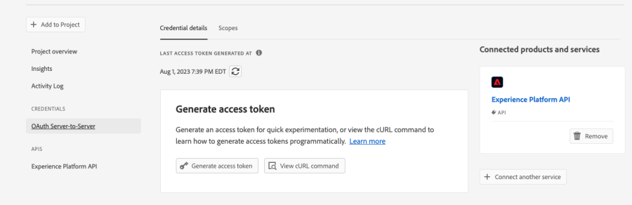
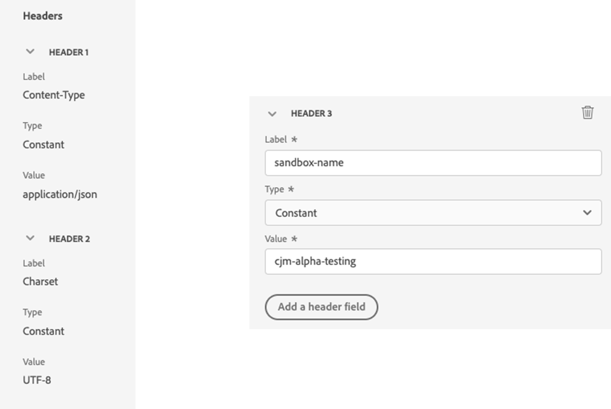
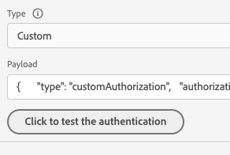

# Aangepaste acties gebruiken om gebeurtenissen voor reizen in Experience Platform te schrijven {#custom-action-aep}

Dit gebruiksgeval verklaart hoe te om douanegebeurtenissen in Adobe Experience Platform van Reizen te schrijven gebruikend de Acties van de Douane en Voor authentiek verklaarde vraag.

## Een ontwikkelaarsproject configureren {#custom-action-aep-IO}

1. Van Adobe Developer Console, klik **Project** en open uw IO project.

1. In de **sectie van Referenties**, klik **Server-aan-Server**.

   

1. Klik {het bevel van cURL van de Mening 0} **.**

   

1. Kopieer het cURL bevel en sla client_id, client_geheime, Grant_type en werkingsgebied op.

```
curl -X POST 'https://ims-na1.adobelogin.com/ims/token/v3' -H 'Content-Type: application/x-www-form-urlencoded' -d 'grant_type=client_credentials&client_id=1234&client_secret=5678&scope=openid,AdobeID,read_organizations,additional_info.projectedProductContext,session'
```

>[!CAUTION]
>
>Nadat u uw project op de Adobe Developer Console hebt gemaakt, moet u ontwikkelaars en API-toegangsbeheer de juiste machtigingen geven. Leer meer in de [ documentatie van Adobe Experience Platform ](https://experienceleague.adobe.com/en/docs/experience-platform/landing/platform-apis/api-authentication#grant-developer-and-api-access-control){target="_blank"}

## De bron configureren met HTTP API Inlet

1. Maak een eindpunt in Adobe Experience Platform om de gegevens van reizen te schrijven.

1. In Adobe Experience Platform, klik **Bronnen**, onder **Verbindingen** in het linkermenu. Onder **HTTP API**, klik **gegevens** toevoegen.

   

1. Selecteer **Nieuwe rekening** en laat authentificatie toe. Selecteer **verbind met Source**.

   

1. Selecteer **daarna** en de Dataset waar u de gegevens wilt schrijven. Klik **daarna** en **Afwerking**.

   

1. Open de nieuwe gegevensstroom. Kopieer de payload van het schema en sla deze op in uw notitiepad.

```
{
"header": {
"schemaRef": {
"id": "https://ns.adobe.com/<your_org>/schemas/<schema_id>",
"contentType": "application/vnd.adobe.xed-full+json;version=1.0"
},
"imsOrgId": "<org_id>",
"datasetId": "<dataset_id>",
"source": {
"name": "Custom Journey Events"
}
},
"body": {
"xdmMeta": {
"schemaRef": {
"id": "https://ns.adobe.com/<your_org>/schemas/<schema_id>",
"contentType": "application/vnd.adobe.xed-full+json;version=1.0"
}
},
"xdmEntity": {
"_id": "test1",
"<your_org>": {
"journeyVersionId": "",
"nodeId": "", "customer_Id":""
},
"eventMergeId": "",
"eventType": "",
"producedBy": "self",
"timestamp": "2018-11-12T20:20:39+00:00"
}
}
}
```

## Aangepaste actie configureren {#custom-action-config}

De actieconfiguratie van de douane is gedetailleerd op [ deze pagina ](../action/about-custom-action-configuration.md).

Voer voor dit voorbeeld de volgende stappen uit:

1. Open Adobe Journey Optimizer, en klik **Configuraties**, onder **Beleid** in het linkermenu. Onder **Acties**, klik **leiden** en klik **tot Actie**.

1. Stel de URL in en selecteer de methode Post.

   `https://dcs.adobedc.net/collection/<collection_id>?syncValidation=false`

1. Controleer of de headers (Content-Type, Charset, sandbox-name) zijn geconfigureerd.

   

### De verificatie instellen {#custom-action-aep-authentication}

1. Selecteer het **Type** als **Douane** met de volgende nuttige lading.

1. Plak client_gehec, client_id, scope en Grant_type (van de IO projectlading die vroeger wordt gebruikt).

   ```
   {
   "type": "customAuthorization",
   "authorizationType": "Bearer",
   "endpoint": "https://ims-na1.adobelogin.com/ims/token/v3",
   "method": "POST",
   "headers": {},
   "body": {
   "bodyType": "form",
   "bodyParams": {
   "grant_type": "client_credentials",
   "client_secret": "********",
   "client_id": "<client_id>",
   "scope": "openid,AdobeID,read_organizations,additional_info.projectedProductContext,session"
   }
   },
   "tokenInResponse": "json://access_token",
   "cacheDuration": {
   "duration": 28000,
   "timeUnit": "seconds"
   }
   }
   ```

1. Gebruik **klik om de authentificatie** knoop te testen om de verbinding te testen.

   

### De lading instellen {#custom-action-aep-payload}

1. In de **gebieden van het Verzoek** en **Reactie**, kleef de nuttige lading van de bronverbinding die vóór werd gebruikt.

   ```
   {
   "xdmMeta": {
   "schemaRef": {
   "id": "https://ns.adobe.com/<your_org>/schemas/<schema_id>",
   "contentType": "application/vnd.adobe.xed-full+json;version=1.0"
   }
   },
   "xdmEntity": {
   "_id": "/uri-reference",
   "<your_org>": {
   "journeyVersionId": "Sample value",
   "nodeId": "Sample value",
   "customer_Id":""
   },
   "eventMergeId": "Sample value",
   "eventType": "advertising.completes,
   "producedBy": "self",
   "timestamp": "2018-11-12T20:20:39+00:00"
   }
   }
   ```

1. Verander de Configuratie van het Gebied van **Constante** aan **Variabele** voor gebieden die dynamisch zullen worden bevolkt.

1. Sla de aangepaste handeling op.

## Reis

1. Tot slot gebruik deze douaneactie in een reis om de gebeurtenissen van de douanereis te schrijven.

1. Vul de Versie-id van de reis, Node-id, Node-naam en andere kenmerken volgens uw gebruikscase.

   
