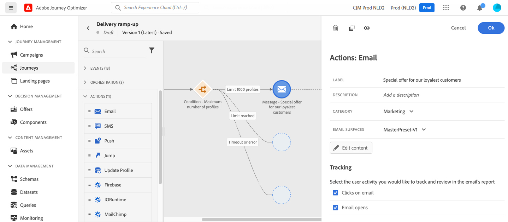

# Hoofdlettergebruik: een aangepaste handeling maken om gegevens naar [!DNL Adobe Experience Platform] te verzenden{#send-data-to-aep}

Als u onlangs naar een andere e-mailserviceprovider, een IP-adres of een e-maildomein of subdomein bent verhuisd, kunt u uw reputatie als afzender vaststellen. Anders kunnen leveringen worden geblokkeerd of naar de spammappen van de ontvangers worden verplaatst. Voor begeleiding, zie de [&#x200B; Gids van de Beste praktijken van de Levering Beste &#x200B;](https://experienceleague.adobe.com/docs/deliverability-learn/deliverability-best-practice-guide/additional-resources/generic-resources/increase-reputation-with-ip-warming.html?lang=nl-NL){target="_blank"}.

Om uw IP op te warmen, kunt u geleidelijk het aantal van uw leveringen opvoeren. Lees meer over [&#x200B; optimaliserend leverbaarheid in Journey Optimizer &#x200B;](../reports/deliverability.md).

Het doel van deze gebruikszaak is een reis te maken om uw e-mailleveringen op te voeren. Om deze reis te vormen, volg deze stappen:

1. Maak een reis. [Meer informatie](journey-gs.md).

1. Voeg een **[!UICONTROL Condition]** activiteit aan de reis toe. [Meer informatie](condition-activity.md).

1. Stel in de activiteitsinstellingen van **[!UICONTROL Condition]** het maximumaantal ontvangers in voor uw levering:

   1. Stel in de activiteitsinstellingen van **[!UICONTROL Condition]** het veld **[!UICONTROL Type]** in op **[!UICONTROL Profile cap]** . [Meer informatie](condition-activity.md#profile_cap).

   1. Stel het veld **[!UICONTROL Limit]** in op het maximum aantal ontvangers voor deze levering.

   

   U kunt deze limiet geleidelijk verhogen tot het totale aantal abonnees.

1. Voeg een handeling **[!UICONTROL Email]** toe aan het nominale pad na de handeling **[!UICONTROL Condition]** .

   

   Wanneer de reis loopt, wordt het bericht verzonden de het ingaan profielen, tot het maximumaantal profielen dat u hebt gespecificeerd. Wanneer deze limiet is bereikt, nemen de ingevoerde profielen het alternatieve pad aan.

1. Voltooi de reis met de activiteiten van uw keuze.

Nadat uw IP omhoog heeft verwarmd, kunt u deze voorwaarde verwijderen.
