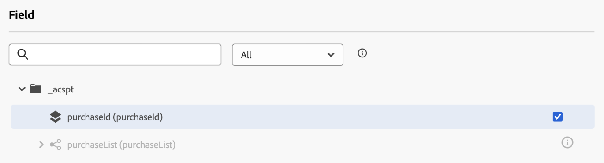

# [!DNL Adobe Experience Platform] -gegevens gebruiken tijdens reizen {#datalookup}

>[!CONTEXTUALHELP]
>id="ajo_journey_dataset_lookup"
>title="Opzoekactiviteit gegevensset"
>abstract="Met de **[!UICONTROL Dataset lookup]** -activiteit kunt u tijdens runtime dynamisch gegevens ophalen uit [!DNL Adobe Experience Platform] -recordgegevenssets. Door gebruik te maken van deze mogelijkheid hebt u toegang tot gegevens die mogelijk niet in het profiel of de lading van de gebeurtenis zijn opgeslagen, zodat uw klanteninteractie zowel relevant als tijdig is."

Met de **[!UICONTROL Dataset lookup]** -activiteit kunt u tijdens runtime dynamisch gegevens ophalen uit [!DNL Adobe Experience Platform] -recordgegevenssets. Door gebruik te maken van deze mogelijkheid hebt u toegang tot gegevens die mogelijk niet in het profiel of de lading van de gebeurtenis zijn opgeslagen, zodat uw klanteninteractie zowel relevant als tijdig is.

>[!AVAILABILITY]
>
>Deze functie is momenteel beschikbaar voor alle klanten als een beperkte beschikbaarheidsrelease.

Belangrijkste voordelen:

* **Echte - tijd verpersoonlijking**: De klantenervaringen van de spoorstaaf gebruikend verrijkte gegevens.
* **Dynamische besluitvorming**: De externe gegevens van het gebruik om reislogica en acties te drijven.
* **Verbeterde Toegang van gegevens**: Haal productmeta-gegevens, het tarief lijsten, of relationele gegevens terug verbonden aan specifieke sleutels.

## Meer lezen {#must-read}

Herzie deze vereisten alvorens u datasetraadplegingen vormt.

### Gegevensset inschakelen

De dataset moet voor raadpleging in [!DNL Adobe Experience Platform] worden toegelaten. De gedetailleerde informatie is beschikbaar in deze sectie: [&#x200B; gegevens van het 1&rbrace; Gebruik  [!DNL Adobe Experience Platform] .](../data/lookup-aep-data.md)

### Beperkingen en beperkingen

* Maximaal 10 opzoekactiviteiten voor gegevenssets per reis.
* Maximaal 20 geselecteerde velden.
* Maximaal 50 toetsen in de array met opzoeksleutels.
* De verrijkte gegevensgrootte is beperkt tot 10KB.

### Aanvullende prestatieoverwegingen

De volgende aanbevelingen zijn een leidraad om vertragingen in de leverbaarheid te voorkomen:

| Overwegingen | Aanbevolen limiet | Beschrijving |
| ------- | ------- | ------- |
| Kenmerken per opzoekopdracht | Maximaal 20 | Het aantal gegevensvelden dat per record wordt opgehaald in één opzoekactiviteit. |
| Opzoeken | Tot 5 per reis | Elke reis kan tot 5 afzonderlijke raadplegingsactiviteiten bevatten. Elke raadpleging kan een verschillende dataset richten. |

## Vorm de opzoekactiviteit van de Dataset {#configure}

Voer de volgende stappen uit om de **[!UICONTROL Dataset lookup]** -activiteit te configureren:

1. Ontgrendel de categorie **[!UICONTROL Orchestration]** en zet een **[!UICONTROL Dataset lookup]** -activiteit neer op uw canvas.

   ![[!DNL Adobe Experience Platform] activiteit van de datasetraadpleging in reis &#x200B;](assets/aep-data-activity.png)

1. Voeg een label en beschrijving toe.

1. Selecteer in het veld **[!UICONTROL Dataset]** de gegevensset met de benodigde kenmerken.

   >[!NOTE]
   >
   >Als de dataset u zoekt niet in de lijst toont, zorg ervoor u het voor raadpleging hebt toegelaten. Voor meer details, verwijs naar [&#x200B; &#x200B;](#must-read) sectie moet lezen.

1. Selecteer de specifieke gebieden u van de dataset wilt halen.

   * U kunt alleen bladknooppunten selecteren (velden op het laagste niveau van het schema). Het veld moet een primitieve waarde zijn (tekenreeks, getal, boolean, datum, enz.).

   * Lijsten (arrays) en kaarten (sleutelwaardeobjecten) kunnen niet worden geselecteerd.

   +++Voorbeeld

   

   +++

1. Kies in het veld **[!UICONTROL Lookup key(s)]** een verbindingssleutel die bestaat in zowel de kenmerken van het beslissingspunt als de gegevensset. Deze sleutel wordt gebruikt door het systeem om in de geselecteerde dataset te zoeken.

   * Toetsen kunnen expressies zijn die zijn afgeleid van de reiscontext, zoals SKU&#39;s, e-mailadressen of andere id&#39;s. Voorbeeld: `@profile.email` of `list(@event{purchase_event.products.sku})` .

   * Slechts **koorden** of **lijsten van koorden** worden gesteund.

   >[!IMPORTANT]
   >
   >U moet de raadplegingssleutel bepalen gebruikend **geavanceerde wijze**. Als u eenvoudige wijze gebruikt om de sleutel te plaatsen, zal de output van de de opzoekactiviteit van de dataset niet beschikbaar als contextattribuut in stroomafwaartse activiteiten zijn, en de `@datasetLookup{}` syntaxis zal met een &quot;niet gevonden&quot;fout van de raadpleging van de Dataset in voorwaardenactiviteiten ontbreken.

   +++Voorbeeld

   

   +++

## Verrijkte gegevens gebruiken tijdens de rit

De gegevens die door de **[!UICONTROL Dataset lookup]** -activiteit worden opgehaald, worden in de Journey-context opgeslagen als een array van objecten. Het is beschikbaar in de redacteur van de reisuitdrukking en verpersoonlijkingsredacteur, toelatend voorwaardelijke logica en gepersonaliseerd overseinen die op verrijkte gegevens worden gebaseerd.

* **Redacteur van de Uitdrukking van de Reis**:

  Open de editor van **[!UICONTROL Advanced mode]** en gebruik de syntaxis: `@datasetLookup{MyDatasetLookUpActivity1.entities}` . [&#x200B; Leer hoe te met de geavanceerde uitdrukkingsredacteur te werken &#x200B;](../building-journeys/expression/expressionadvanced.md)

* **Redacteur van Personalization**:

  Gebruik de syntaxis: `{{context.journey.datasetLookup.1482319411.entities}}`.

>[!NOTE]
>
>Verrijkte gegevens zijn van voorbijgaande aard en zijn alleen beschikbaar tijdens de uitvoering van de reis en bij de personalisatie van uitgaande activiteiten (e-mail, push, SMS, enz.)

## Voorbeelden van gebruiksgevallen

+++Filteren op basis van productcategorie

**Scenario**:Send een coupon aan gebruikers die meer dan $40 aan huisproducten uitgeven.

**de stroom van de Reis**:

1. **Gebeurtenis van de Aankoop**: Vang SKUs van de kar van de gebruiker.

1. **de opzoekactiviteit van 0&rbrace; Dataset:**

   * Gegevensset: `products-dataset` (SKU als primaire sleutel).
   * Opzoektoetsen: `list(@event{purchase_event.products.sku})`.
   * Te retourneren velden: `["SKU", "category", "price"]`.

1. **de activiteit van de Voorwaarde**:

   * Filter SKU&#39;s waarbij de categorie &quot;huishouden&quot; is.

     ```
     @event{purchase_event.products.all( in(currentEventField.sku, @datasetlookup{MyDatasetLookupActivity1.entities.all(currentDatasetLookupField.category == 'household').sku} ) )} 
     ```

   OF

   * De totale uitgaven voor huishoudelijke producten samenvoegen en vergelijken met de drempel van 40 dollar.

     ```
     sum(@event{purchase_event.products.all( in(currentEventField.sku, @datasetlookup{MyDatasetLookUpActivity1.entities.all(currentDatasetLookupField.category == 'household').sku} ) )}.price}, ',', true ) > 40
     ```

1. **Redacteur van Personalization**:

   Gebruik de verrijkte gegevens om de e-mailinhoud aan te passen:

   ```
   
   {{#each journey.datasetlookup.3709000.entities as |product|}}
   
   
   {{/each}}
   "Hi, thanks for spending " +  + " on household products. Here is your reward!"
   ```

+++

+++Personalization gebruikt externe loyaliteitsgegevens

**Scenario**: Identificeer welke e-mailrekening voor een profiel een Status van de Loyaliteit van Platinum heeft. In dit scenario, wordt de loyaliteitsrekening geassocieerd aan een e-mailidentiteitskaart en de loyaliteitsgegevens zijn niet beschikbaar in de standaard opslag van de profielraadpleging.

**de stroom van de Reis**:

1. **Trigger van de Gebeurtenis van het Profiel**: Leg e-mail IDs van het profiel of gebeurteniscontext vast.

1. **de activiteit van de Opzoeken van de Dataset van 0&rbrace;:**
   * Gegevensset: `loyalty-member-dataset` (e-mail als primaire sleutel).
   * Opzoektoetsen: `@profile.email`.
   * Te retourneren velden: `["email", "loyaltyTier"]`.

1. **de activiteit van de Voorwaarde**:

   Vertakken de reis die op de loyaliteitsrij wordt gebaseerd:

   ```
   @datasetLookup{MyDatasetLookUpActivity1.entity.loyaltyMember.loyaltyTier} == 'Platinum'
   ```

1. **Redacteur van Personalization**:

   Gebruik de verrijkte gegevens van de loyaliteitsrij om uitgaande mededeling te personaliseren:

   ```
   {{context.journey.datasetLookup.1482319411.entity.loyaltyMember.loyaltyTier}}
   ```

+++

## Problemen oplossen {#troubleshooting}

### Fout in &#39;Opzoeken van gegevensset niet gevonden&#39; in voorwaardenactiviteit {#troubleshooting-not-found}

**Symptom:** de `@datasetLookup{}` syntaxis in de geavanceerde uitdrukkingsredacteur van een voorwaardenactiviteit keert een &quot;gevonden de raadpleging van de Dataset niet&quot;fout terug, alhoewel de activiteit van de datasetraadpleging correct in de reis wordt gevormd.

**Oorzaak:** de raadplegingssleutel in de activiteit van de datasetraadpleging werd geplaatst gebruikend eenvoudige wijze. Wanneer de sleutel niet op geavanceerde wijze wordt bepaald, wordt de activiteitenoutput niet blootgesteld als contextattribuut in stroomafwaartse activiteiten.

**Repareren:** Open de activiteit van de datasetraadpleging, bepaal de plaats van het **[!UICONTROL Lookup key(s)]** gebied, en schakelaar aan **geavanceerde wijze** om de belangrijkste uitdrukking opnieuw te bepalen. Sla de activiteit op en publiceer de reis opnieuw.
