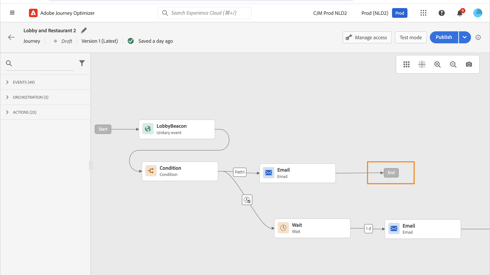
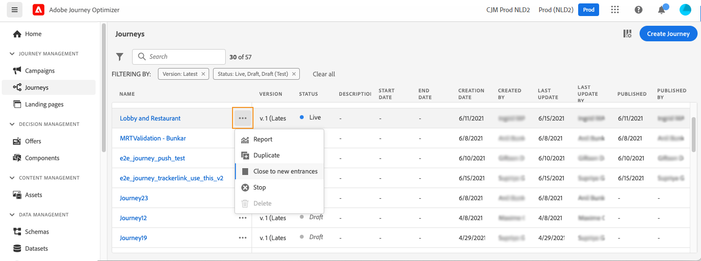

# Een reis beëindigen {#journey-ending}

Een reis kan voor een individu in twee specifieke contexten eindigen:

* Het individu bereikt bij de laatste activiteit van een weg, dan bewegingen aan de [ markering van het Eind ](#end-tag).
* Het individu bereikt bij a **Voorwaarde** activiteit (of a **wacht** activiteit met een voorwaarde) en past geen van de voorwaarden aan.

Het individu kan dan de reis opnieuw betreden als het is toegestaan om het vliegtuig binnen te komen. Zie [ deze pagina ](../building-journeys/journey-properties.md#entrance)

Om een live reis te beëindigen, adviseren wij dat u het sluit. De komst van nieuwe klanten op de reis zal dan worden geblokkeerd. Profielen die al op reis zijn gegaan, kunnen het tot het einde ervaren. Zie [ deze sectie ](#close-journey)

U kunt een reis alleen stoppen als zich een noodsituatie voordoet en alle verwerking onmiddellijk op een reis moet worden beëindigd. Personen die al een reis zijn binnengekomen, worden in de loop der tijd gestopt. Zie [ deze sectie ](../building-journeys/journey.md#stop-journey)

>[!IMPORTANT]
>
>U kunt niet a [ gesloten ](#close-journey) opnieuw beginnen of [ gestopt ](#stop-journey) reis.

## Tag Reiseinde {#end-tag}

Tijdens het ontwerpen van een rit wordt aan het einde van elk pad een eindtag weergegeven. Dit knooppunt kan niet door een gebruiker worden toegevoegd, kan niet worden verwijderd en alleen het label ervan kan worden gewijzigd. Het markeert het einde van elk pad van de reis. Als de reis verscheidene wegen heeft, adviseren wij dat u een etiket aan elk eind toevoegt om rapporten gemakkelijker te maken te lezen. Leer meer over [ reisrapporten ](../reports/live-report.md).

## Een reis sluiten {#close-journey}

Een reis kan om de volgende redenen worden gesloten:

* De reis wordt manueel gesloten via de [**[!UICONTROL Close to new entrances]**](#close-to-new-entrances) knoop.
* Een reis op basis van een segment met één opname die klaar is met de uitvoering en de wereldwijde time-out van 91 dagen heeft bereikt.
* Na het laatste optreden van een terugkerende, op het publiek gebaseerde reis.

Als u een reis handmatig sluit, weet u zeker dat klanten die de reis al hebben betreden, hun pad kunnen voltooien, maar dat nieuwe gebruikers de reis niet kunnen betreden. Wanneer een reis wordt gesloten (om een van de bovenstaande redenen), heeft deze de status **[!UICONTROL Closed]** . De reis houdt in dat nieuwe individuen de reis kunnen betreden. Profielen die al op reis zijn, kunnen de reis normaal afmaken. Na standaard globale onderbreking van 91 dagen, zal de reis aan de **Voltooide** status schakelen.

Na de **91 dag reis globale onderbreking**, leest de schakelaars van de publiekstraject aan de **beëindigde** status. Dit gedrag wordt slechts voor 91 dagen vastgesteld, aangezien alle informatie over profielen die de reis zijn binnengekomen, 91 dagen na hun binnenkomst wordt verwijderd. Personen die nog onderweg zijn, worden automatisch getroffen. Ze verlaten de reis na de 91-dagen onderbreking.  Leer meer over [ de reis globale onderbreking ](../building-journeys/journey-properties.md#global_timeout).

Een gesloten reisversie kan niet opnieuw worden gestart of verwijderd. U kunt er een nieuwe versie van maken of deze dupliceren. Alleen voltooide reizen kunnen worden verwijderd.

### Dicht bij nieuwe ingangen {#close-to-new-entrances}

Als u een rit wilt sluiten in de lijst met ritten, klikt u op de knop **[!UICONTROL Ellipsis]** rechts van de naam van de rit en selecteert u **[!UICONTROL Close to new entrances]** .

U kunt ook het volgende doen:

1. Klik in de lijst **[!UICONTROL Journeys]** op de rit die u wilt sluiten.
1. Klik rechtsboven op de pijl omlaag.

   

1. Klik op **[!UICONTROL Close to new entrances]** en bevestig dit in het dialoogvenster.

>[!TIP]
>
>Een één-ontsproten op segment-gebaseerde reis houdt de **Levende** status zelfs na het runnen eens. De profielen zullen niet opnieuw ingaan zodra voltooid, maar de reis blijft in **Levende** status tot de standaard globale onderbreking verloopt. U kunt het manueel sluiten vroeger gebruikend **dicht aan nieuwe ingangen** optie.

## Een reis stoppen {#stop-journey}

Als u de voortgang van alle mensen op de reis moet stoppen, kunt u deze stoppen. De time-out van de reis voor alle personen op de reis beëindigen. Als we echter een reis stoppen, moeten mensen die al een reis hebben afgelegd, in de loop van hun reis worden gestopt. De reis is in feite uitgeschakeld. Als u aan een reis wilt beëindigen, is de beste praktijk [ om het ](#close-journey) te sluiten.

Wanneer deze wordt gestopt, wordt de reisstatus ingesteld op **[!UICONTROL Stopped]** .

U kunt bijvoorbeeld een reis stoppen als een markeerder beseft dat de reis het verkeerde publiek aanvalt of dat een aangepaste actie die berichten moet leveren, niet correct werkt. Als u een reis wilt stoppen in de lijst met reizen, klikt u op de knop **[!UICONTROL Ellipsis]** rechts van de naam van de reis en selecteert u **[!UICONTROL Stop]** .

U kunt ook het volgende doen:

1. Klik in de lijst **[!UICONTROL Journeys]** op de rit die u wilt stoppen.
1. Klik rechtsboven op de pijl omlaag.

   

1. Klik op **[!UICONTROL Stop]** en bevestig dit in het dialoogvenster.
