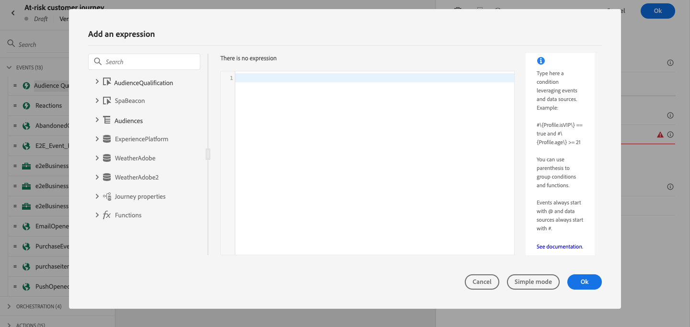
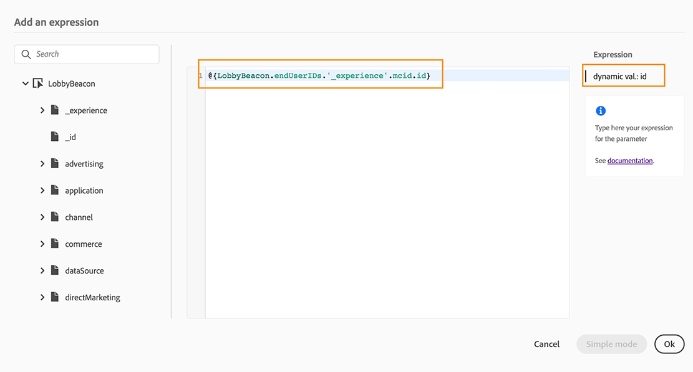

# Werken met de geavanceerde expressie-editor {#about-the-advanced-expression-editor}

>[!CONTEXTUALHELP]
>id="ajo_journey_expression_advanced"
>title="De geavanceerde expressie-editor"
>abstract="Gebruik de geavanceerde uitdrukkingsredacteur om geavanceerde uitdrukkingen in diverse schermen van de interface te bouwen. U kunt bijvoorbeeld expressies maken bij het configureren en gebruiken van reizen en bij het definiëren van een gegevensbronvoorwaarde."

Gebruik de Journey Geavanceerde uitdrukkingsredacteur om geavanceerde uitdrukkingen in diverse schermen van de interface te bouwen. U kunt bijvoorbeeld expressies maken bij het configureren en gebruiken van reizen en bij het definiëren van een gegevensbronvoorwaarde.

De editor is ook altijd beschikbaar wanneer u actieparameters moet definiëren waarvoor specifieke datamanipulaties nodig zijn. U kunt data gebruiken die afkomstig zijn van gebeurtenissen of aanvullende informatie die is opgehaald uit de databron. In een journey is de weergegeven lijst met gebeurtenisvelden contextafhankelijk en deze varieert op basis van de gebeurtenissen die tijdens de journey worden toegevoegd.

De geavanceerde expressie-editor biedt een reeks ingebouwde functies en operatoren waarmee u waarden kunt manipuleren en een expressie kunt definiëren die precies bij uw wensen past. Met de geavanceerde expressie-editor kunt u ook de waarden van de externe gegevensbronparameter definiëren, kaartvelden en verzamelingen bewerken.

>[!NOTE]
>
>De functies en de mogelijkheden beschikbaar in de Reis geavanceerde uitdrukkingsredacteur verschillen van degenen beschikbaar in de [&#x200B; verpersoonlijkingsredacteur &#x200B;](../../personalization/functions/functions.md).

## De geavanceerde expressie-editor openen {#accessing-the-advanced-expression-editor}

De geavanceerde expressie-editor kan worden gebruikt om:

* [Geavanceerde voorwaarden](../condition-activity.md#about_condition) te maken voor databronnen en gebeurtenisinformatie
* Aangepaste [wachtactiviteiten](../wait-activity.md#custom) te definiëren
* De toewijzing van actieparameters te definiëren

Indien mogelijk kunt u tussen de twee modi schakelen met de knop **[!UICONTROL Advanced mode]**/**[!UICONTROL Simple mode]**. De eenvoudige modus wordt [hier](../condition-activity.md#about_condition) beschreven.

>[!NOTE]
>
>* De voorwaarden kunnen in de eenvoudige of geavanceerde expressie-editor worden gedefinieerd. Ze retourneren altijd een booleaans type.
>
>* Actieparameters kunnen worden gedefinieerd door velden te selecteren of via de geavanceerde expressie-editor. Ze retourneren een specifiek datatype op basis van hun expressie.

U kunt de geavanceerde expressie-editor op verschillende manieren openen:

* Wanneer u een databronvoorwaarde maakt, kunt u de geavanceerde editor openen door te klikken op **[!UICONTROL Advanced mode]**.

  

* Wanneer u een aangepaste timer maakt, wordt de geavanceerde editor direct weergegeven.
* Wanneer u een actieparameter toewijst, klikt u op **[!UICONTROL Advanced mode]**.

## De interface detecteren {#discovering-the-interface}

In dit scherm kunt u uw expressie handmatig schrijven.

Links in het scherm worden de beschikbare velden en functies weergegeven:

* **[!UICONTROL Events]**: kies een van de velden die worden ontvangen van de binnenkomende gebeurtenis. De weergegeven lijst met gebeurtenisvelden is contextueel en varieert afhankelijk van de gebeurtenis(sen) die tijdens de reis zijn toegevoegd. [Meer informatie](../../event/about-events.md)

  >[!CAUTION]
  >
  >Het maken van expressies met behulp van ervaringsgebeurtenissen wordt niet ondersteund. De alternatieve benaderingen en beste praktijken voor het creëren van uitdrukkingen/logica met ervaringsgebeurtenissen worden van verwijzingen voorzien [&#x200B; hier &#x200B;](../../building-journeys/exp-event-lookup.md)

* **[!UICONTROL Audiences]**: als u een **[!UICONTROL Audience qualification]** -gebeurtenis hebt neergezet, kiest u het publiek dat u in de expressie wilt gebruiken. [Meer informatie](../condition-activity.md#using-a-segment)
* **[!UICONTROL Data Sources]**: kies een optie in de lijst met velden die beschikbaar zijn in de veldgroepen van uw gegevensbronnen. [Meer informatie](../../datasource/about-data-sources.md)
* **[!UICONTROL Journey properties]**: in deze sectie worden de technische velden voor een bepaald profiel gegroepeerd die betrekking hebben op de reis. [Meer informatie](journey-properties.md)
* **[!UICONTROL Functions]**: kies uit de lijst met ingebouwde functies die complexe filtering mogelijk maken. Functies zijn ingedeeld in categorieën. [Meer informatie](functions.md)

Een mechanisme voor automatisch aanvullen geeft contextafhankelijke suggesties weer.

Een mechanisme voor de syntaxisvalidatie controleert de integriteit van uw code. Fouten worden over de editor heen weergegeven.

>[!TIP]
>
>Wanneer u voorwaarden maakt in de geavanceerde expressieeditor, moet u ervoor zorgen dat de expressies geen verborgen of niet-afdrukbare tekens bevatten. Gebruik daarnaast expressies met één regel om fouten bij het parseren te voorkomen.

**Parameters vereist tijdens het samenstellen van voorwaarden met de geavanceerde expressie-editor**

Als u een gebied van een externe gegevensbron selecteert die een te roepen parameter vereisen (zie [&#x200B; deze pagina &#x200B;](../../datasource/external-data-sources.md)), verschijnt een nieuw lusje op het recht om u deze parameter te laten specificeren. De parameterwaarde kan afkomstig zijn van gebeurtenissen die zich op de reis of de Experience Platform-gegevensbron bevinden (en niet van andere externe gegevensbronnen). In een databron met betrekking tot weersomstandigheden is ‘city’ bijvoorbeeld een veelgebruikte parameter. Dit betekent dat u moet selecteren waar u deze parameter ‘city’ wilt ophalen. Functies kunnen ook op parameters worden toegepast om opmaakwijzigingen of samenvoegingen uit te voeren.

Als u bij complexere gebruiksscenario’s de parameters van de databron wilt opnemen in de hoofdexpressie, kunt u de waarden ervan definiëren met het trefwoord ‘params’. Zie [deze pagina](../expression/field-references.md).
