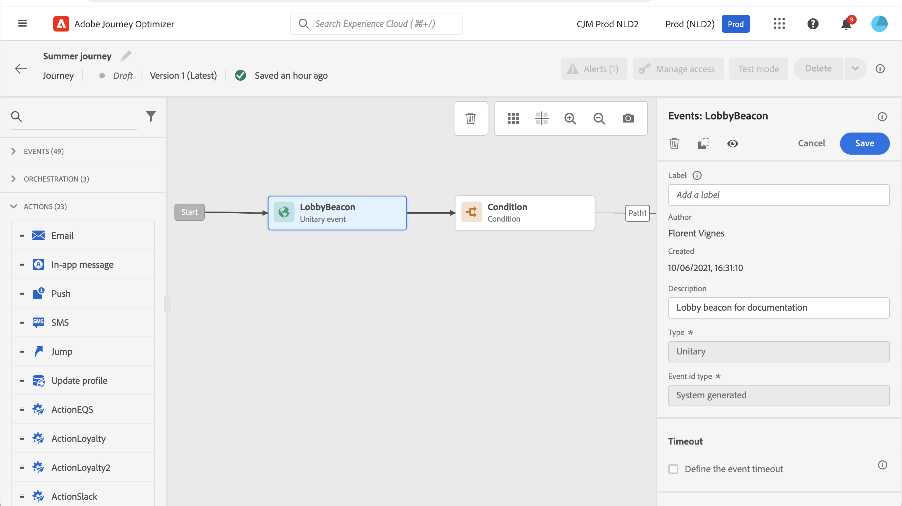

# Algemene gebeurtenissen {#general-events}

>[!CONTEXTUALHELP]
>id="ajo_journey_event_custom"
>title="Unitaire gebeurtenissen"
>abstract="Gebeurtenissen stellen u in staat om uw reizen tijdelijk te activeren en berichten in real-time te verzenden aan de persoon die de reis maakt. Voor dit type gebeurtenis kunt u alleen een label en een beschrijving toevoegen. De gebeurtenisconfiguratie wordt uitgevoerd door een gegevensingenieur en kan niet worden uitgegeven."

>[!CONTEXTUALHELP]
>id="ajo_journey_event_business_canvas"
>title="Zakelijke gebeurtenissen"
>abstract="Met deze gebeurtenissen kunt u een reis starten met een niet-profielgerelateerde gebeurtenis. Wanneer die gebeurtenis wordt geactiveerd, kunt u berichten verzenden naar een publiek met profielen. Voor dit type gebeurtenis kunt u alleen een label en een beschrijving toevoegen. De gebeurtenisconfiguratie wordt uitgevoerd door een technische gebruiker en kan niet worden uitgegeven."

Gebeurtenissen stellen u in staat om uw reizen tijdelijk te activeren en berichten in real-time te verzenden aan de persoon die de reis maakt.

Voor dit type gebeurtenis kunt u alleen een label en een beschrijving toevoegen. De rest van de configuratie kan niet worden bewerkt. Het werd uitgevoerd door de technische gebruiker. Zie [deze pagina](../event/about-events.md).

Leer meer over gebeurtenisproductie en tarieven van de reisverwerking in [&#x200B; deze sectie &#x200B;](entry-management.md#journey-processing-rate).

Wanneer u een bedrijfsgebeurtenis laat vallen, voegt het automatisch a **Gelezen activiteit van het publiek** toe. Voor meer informatie over bedrijfsgebeurtenissen, verwijs naar [&#x200B; deze sectie &#x200B;](../event/about-events.md)

## Luisteren naar gebeurtenissen tijdens een bepaald tijdstip {#events-specific-time}

Een gebeurtenisactiviteit die in de reis wordt geplaatst luistert voor onbepaalde tijd naar gebeurtenissen. Als u alleen tijdens een bepaalde tijd naar een gebeurtenis wilt luisteren, moet u een time-out voor de gebeurtenis configureren.

De reis zal dan aan de gebeurtenis tijdens de tijd luisteren die in de timeout wordt gespecificeerd. Als een gebeurtenis tijdens die periode wordt ontvangen, zal de persoon in de gebeurtenisweg stromen. Als niet, zal de klant of in de onderbrekingspad stromen als het wordt bepaald, of zal die reis voortzetten.

Als er geen time-outpad is gedefinieerd, fungeert de time-outinstelling als een wachtbewerking. Het profiel wordt dan gedurende een bepaalde periode gewacht. Dit kan worden gestopt als een gebeurtenis plaatsvindt vóór het einde van die wachttijd. Als u profielen van die reis na onderbreking wilt worden uitgesloten, zult u een onderbrekingspad moeten plaatsen.

Voer de volgende stappen uit om een time-out voor een gebeurtenis te configureren:

1. Activeer de optie **[!UICONTROL Define the event timeout]** vanuit de eigenschappen van de gebeurtenis.

1. Geef op hoeveel tijd de reis moet wachten op de gebeurtenis. De maximumduur is **90 dagen**.

1. Als er geen gebeurtenis wordt ontvangen binnen de opgegeven time-out, kunt u het beste de personen naar een time-outpad sturen. Schakel hiervoor de optie **[!UICONTROL Set a timeout path]** in. In dat geval gaat de reis door voor het individu zodra de time-out is bereikt. We raden u aan de optie **[!UICONTROL Set a timeout path]** altijd in te schakelen.

   

In dit voorbeeld stuurt de reis een eerste welkomstmail naar een klant nadat hij/zij de lobby is binnengekomen. Het verzendt dan een e-mail van de maaltijdkorting slechts als de klant het restaurant binnen de volgende dag ingaat. Daarom hebben we de restaurant-gebeurtenis geconfigureerd met een time-out van 1 dag:

* Als de restaurantgebeurtenis minder dan 1 dag na de welkomstmail wordt ontvangen, wordt de e-mail met maaltijdkorting verzonden.
* Als er de volgende dag geen restaurantgebeurtenis wordt ontvangen, loopt de persoon door het time-outpad.

Als u een time-out wilt configureren voor meerdere gebeurtenissen die zich na een **[!UICONTROL Wait]** -activiteit bevinden, moet u de time-out alleen configureren voor een van deze gebeurtenissen.

De gedefinieerde time-out is van toepassing op alle gebeurtenissen na de **[!UICONTROL Wait]** -activiteit:

* Als één gebeurtenis binnen de time-outduur wordt ontvangen, loopt de afzonderlijke gebeurtenis door naar het pad van de ontvangen gebeurtenis.
* Als er geen gebeurtenis wordt ontvangen binnen de tijdsduur van de time-out, loopt de afzonderlijke gebeurtenis door naar de time-outvertakking van de gebeurtenis waar de time-out is gedefinieerd.

