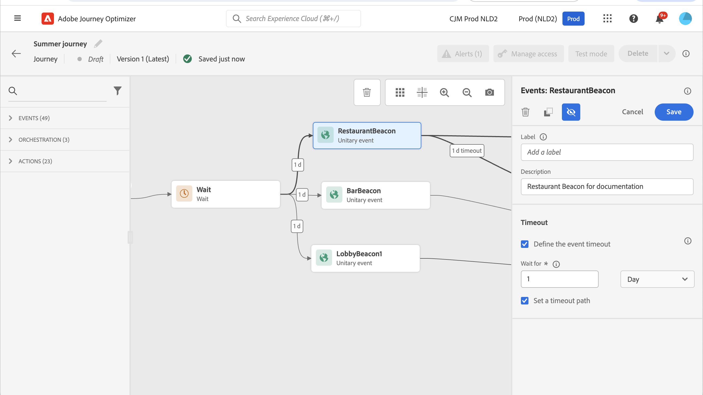

# Algemene gebeurtenissen {#general-events}

Voor dit type gebeurtenis kunt u alleen een label en een beschrijving toevoegen. The rest of the configuration cannot be edited. It was performed by the technical user. Zie [deze pagina](../event/about-events.md).

Wanneer u een bedrijfsgebeurtenis neerzet, wordt automatisch een **Segment lezen** activiteit. Voor meer informatie over bedrijfsgebeurtenissen, verwijs naar [deze sectie](../event/about-events.md)

## Luisteren naar gebeurtenissen tijdens een bepaald tijdstip {#events-specific-time}

Een gebeurtenisactiviteit die in de reis wordt geplaatst luistert voor onbepaalde tijd naar gebeurtenissen. Als u alleen tijdens een bepaalde tijd naar een gebeurtenis wilt luisteren, moet u een time-out voor de gebeurtenis configureren.

De reis zal dan aan de gebeurtenis tijdens de tijd luisteren die in de timeout wordt gespecificeerd. If an event is received during that period, the person will flow in the event path. Als niet, zal de klant of in een onderbrekingspad stromen, of hun reis beëindigen.

Voer de volgende stappen uit om een time-out voor een gebeurtenis te configureren:

1. De **[!UICONTROL Define the event timeout]** van de eigenschappen van de gebeurtenis.

1. Geef op hoeveel tijd de reis moet wachten op de gebeurtenis.

1. Als u de personen naar een time-outpad wilt sturen wanneer er geen gebeurtenis is ontvangen binnen de opgegeven time-out, schakelt u de optie **[!UICONTROL Set a timeout path]** optie. Als deze optie niet wordt ingeschakeld, eindigt de reis voor het individu zodra de time-out is bereikt.

   

In dit voorbeeld, verzendt de reis een eerste welkome duw naar een klant. It then sends a meal discount push only if the customer enters the restaurant within the next day. Daarom hebben we de restaurant-gebeurtenis geconfigureerd met een time-out van 1 dag:

* Als de restaurantgebeurtenis minder dan 1 dag na de welkomstpush wordt ontvangen, wordt de pushactiviteit voor de maaltijdkorting verzonden.
* Als er de volgende dag geen restaurantgebeurtenis wordt ontvangen, loopt de persoon door het time-outpad.

Merk op dat als u een onderbreking op veelvoudige gebeurtenissen wilt vormen die na a worden geplaatst **[!UICONTROL Wait]** activiteit, moet u de onderbreking op één van deze gebeurtenissen slechts vormen.

The timeout will apply to all the events positioned after the **[!UICONTROL Wait]** activity. If no event is received before the specified timeout, the individuals will flow into one single timeout path or will end their journey.

