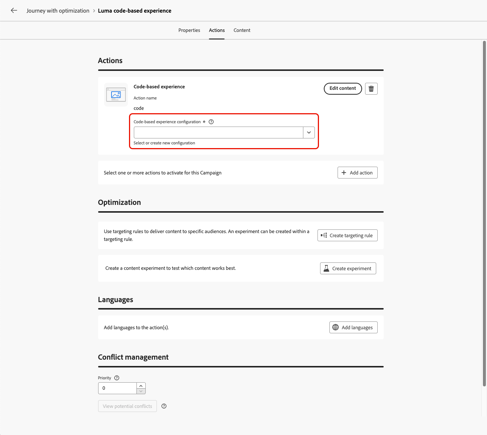

# De activiteit Handeling gebruiken {#add-a-message-in-a-journey}

>[!CONTEXTUALHELP]
>id="ajo_action_activity"
>title="Actie"
>abstract="De **activiteit van de Actie** laat u één enkele inheemse kanaalactie en veelvoudige binnenkomende activiteiten met de capaciteit vormen om optimalisering aan om het even welke ingebouwde kanaalactie toe te voegen."

[!DNL Journey Optimizer] komt met een nieuwe generische **actie** activiteit die toestaat om één enkele ingebouwde kanaalactie, en ook veelvoudige binnenkomende activiteiten te vormen.

De Actie-activiteit biedt:

* Een vereenvoudigde native actieconfiguratie binnen het reiscanvas.
* De capaciteit om multi-actie binnenkomende actiegroepen te creëren.
* De mogelijkheid om optimalisatie toe te voegen aan ingebouwde kanaalacties.

Om een ingebouwde kanaalactie aan uw reis toe te voegen, gebruik de **activiteit van de Actie**. Deze verenigde activiteit consolideert alle kanaalacties (E-mail, Duw, SMS, In-app, Web, Code-based ervaring, en de Kaart van de Inhoud) in één enkel activiteitstype, die de vorige individuele kanaalactiviteiten vervangen.

>[!IMPORTANT]
>
>Alle native kanalen die nu toegankelijk zijn via de activiteit Handeling, verouderde native kanaalactiviteiten zijn vervangen door de release van maart. Bestaande reizen die oudere handelingen bevatten, blijven functioneren zoals ze zijn: er is geen migratie vereist.

U kunt ook aangepaste handelingen instellen om uw berichten te verzenden in [!DNL Journey Optimizer] . [Meer informatie](#recommendation)

## Voeg een ingebouwde kanaalactie aan een reis toe  {#add-action}

Volg onderstaande stappen om een ingebouwde kanaalactie toe te voegen aan uw reis met behulp van de **[!UICONTROL Action]** -activiteit.

Voor meer informatie over de kanalen beschikbaar in reizen, verwijs naar de lijst in deze sectie: [&#x200B; Kanalen in reizen &amp; campagnes &#x200B;](../channels/gs-channels.md#channels).

1. Begin uw reis met een [&#x200B; Gebeurtenis &#x200B;](general-events.md) of a [&#x200B; gelezen activiteit van het publiek &#x200B;](read-audience.md).

1. Sleep vanuit de sectie **[!UICONTROL Actions]** van het palet een **[!UICONTROL Action]** -activiteit naar het canvas.

1. Selecteer de ingebouwde kanaalactiviteit u in uw reis wilt gebruiken.

   

1. Voeg een label toe aan de handeling en selecteer **[!UICONTROL Configure action]** .

   {width="80%"}

1. U wordt geleid aan het **[!UICONTROL Actions]** lusje van het de configuratiescherm van de reisactie.

   Selecteer de configuratie die u voor het geselecteerde kanaal wilt gebruiken.

   

1. Als u een binnenkomend kanaal hebt geselecteerd, kunt u meerdere acties toevoegen. [Meer informatie](#multi-action)

1. Configureer uw activiteit volgens het geselecteerde kanaal. De gedetailleerde configuratierichtlijnen zijn beschikbaar in de hieronder verbindingen.

   * Leer de gedetailleerde stappen om uw uitgaande actie tot stand te brengen als volgt:

     <table style="table-layout:fixed">
      <tr style="border: 0;">
      <td>
      
      
<a href="../email/create-email.md"><strong> creeer e-mails </strong>
      

      

      </td>
      <td>
      
      

      <a href="../push/create-push.md"><strong> creeer dupberichten <strong></a>
      

      

      </td>
      <td>
      
      

      <a href="../sms/create-sms.md"><strong> creeer tekstberichten (SMS/MMS) </strong></a>
      

      

      </td>
      </tr>
      </table>

   * Leer de gedetailleerde stappen om uw binnenkomende actie tot stand te brengen als volgt:

     <table style="table-layout:fixed">
      <tr style="border: 0;">
      <td>
      
      
<a href="../in-app/create-in-app.md"><strong> creeer in-app berichten </strong>
      

      

      </td>
      <td>
      
      
<a href="../web/create-web.md"><strong> creeer Webervaringen </strong>
      

      

      </td>
      <td>
      
      
<a href="../content-card/create-content-card.md"><strong> creeer inhoudskaarten </strong>
      

      

      </td>
      <td>
      
      

      <a href="../code-based/create-code-based.md"><strong> creeer op code-gebaseerde ervaringen <strong></a>
      

      

      </td>
      </tr>
      </table>

   >[!NOTE]
   >
   >* Elke binnenkomende ervaringsactie komt met een 3 dagen **wacht** activiteit. [Meer informatie](wait-activity.md#auto-wait-node)
   >
   >* Voor e-mails en pushmeldingen kunt u Send-Time optimaliseren inschakelen. [Meer informatie](send-time-optimization.md)

1. Afhankelijk van de activiteit, kunt u geavanceerde parameters tonen specifiek voor het geselecteerde kanaal, en sommige standaardwaarden zoals het uitvoeringsadres met voeten treden. [Meer informatie](about-journey-activities.md#advanced-parameters)

   >[!NOTE]
   >
   >Als de geavanceerde parameters verborgen zijn, klikt u op de knop **[!UICONTROL Show read-only fields]** boven in het rechterdeelvenster.

1. Gebruik de sectie **[!UICONTROL Optimization]** om inhoudexperimenten uit te voeren, of hefboomwerking het richten van regels, of geavanceerde combinaties van zowel experimenteren als richten te gebruiken.

   Deze verschillende opties en de te volgen stappen zijn gedetailleerd in [&#x200B; deze sectie &#x200B;](../content-management/gs-message-optimization.md).

1. Gebruik de sectie **[!UICONTROL Languages]** om inhoud in meerdere talen te maken binnen de actie. Klik hiertoe op de knop **[!UICONTROL Add languages]** en selecteer de gewenste **[!UICONTROL Language settings]** .

   De gedetailleerde informatie over hoe te opstelling en gebruik meertalige mogelijkheden zijn beschikbaar in [&#x200B; deze sectie &#x200B;](../content-management/multilingual-gs.md).

Afhankelijk van het geselecteerde communicatiekanaal zijn aanvullende instellingen beschikbaar. Vouw de onderstaande secties uit voor meer informatie.

+++**pas het begrenzen regels** toe (E-mail, Duw, SMS)

Selecteer in de vervolgkeuzelijst **[!UICONTROL Business rules]** een regel die is ingesteld om afdekkingsregels toe te passen op de actie die u uitvoert.

De reeksen van de kanaalregel van hefboomwerking staan u toe om frequentie het begrenzen door communicatie type te plaatsen om het overbelasten van klanten met gelijkaardige berichten te verhinderen.

[Leer hoe u met regelsets werkt](../conflict-prioritization/rule-sets.md)

+++

+++**Overeenkomst van het Spoor** (E-mail, SMS).

In de sectie **[!UICONTROL Action tracking]** kunt u bijhouden hoe de ontvangers op uw e-mail- of SMS-berichten reageren.

De trackingresultaten zijn toegankelijk vanaf het reisverslag zodra de reis is uitgevoerd.

[Meer informatie over reisrapporten](../reports/journey-global-report-cja.md)

+++

+++**laat Snelle leveringswijze** toe (Duw).

De snelle leveringswijze is een [!DNL Journey Optimizer] toe:voegen-op die zeer snelle pushbericht toestaat die in grote volumes door campagnes verzenden.

Snelle levering wordt gebruikt wanneer de vertraging in berichtlevering zaken-kritiek is, wanneer u een dringende duwalarm op mobiele telefoons wilt verzenden, bijvoorbeeld een breekbericht aan gebruikers die uw nieuwskanaal app hebben geïnstalleerd.

Leer hoe te om Snelle leveringswijze voor de Duw berichten [&#x200B; op deze pagina &#x200B;](../push/create-push.md#rapid-delivery) toe te laten.

Voor meer informatie over prestaties wanneer het gebruiken van Snelle leveringswijze, verwijs naar [[!DNL Adobe Journey Optimizer]  productbeschrijving &#x200B;](https://helpx.adobe.com/legal/product-descriptions/adobe-journey-optimizer.html){target="_blank"}.

+++

+++**wijs prioritaire scores** toe (Web, in-app, op code-gebaseerd)

In de **[!UICONTROL Conflict management]** sectie, kunt u een prioritaire score aan de reisactie toewijzen, toestaand u om aan een binnenkomende actie voorrang te geven wanneer er veelvoudige reisacties of campagnes gebruikend de zelfde kanaalconfiguratie zijn.

Standaard wordt de prioriteitsscore voor de actie overgenomen van de algemene prioriteitsscore voor de reis.

[Leer hoe u prioriteitsscores kunt toewijzen aan kanaalhandelingen](../conflict-prioritization/priority-scores.md#priority-action)

+++

+++**plaats extra leveringsregels** (de kaarten van de Inhoud)

Voor reizen met een inhoudskaart kunt u aanvullende leveringsregels inschakelen om de gebeurtenis(sen) en criteria te kiezen die het bericht activeren.

[Leer hoe u inhoudskaarten maakt](../content-card/create-content-card.md)

+++

+++**bepaalt trekkers** (in-app)

Voor in-app berichten kunt u de knop **[!UICONTROL Edit triggers]** gebruiken om de gebeurtenis(sen) en criteria te kiezen die uw bericht activeren.

[Leer hoe u een bericht in de app maakt](../in-app/create-in-app.md)

+++

## Meerdere binnenkomende handelingen toevoegen {#multi-action}

>[!CONTEXTUALHELP]
>id="ajo_multi_action_journey"
>title="Meerdere binnenkomende handelingen toevoegen"
>abstract="U kunt verschillende binnenkomende acties selecteren binnen één enkele reis. Met deze functie kunt u meerdere op code gebaseerde ervaringen, In-app-berichten, Content Cards of Web-acties tegelijk op verschillende locaties aanbieden, waarbij elke actie een specifieke inhoud bevat."

Om uw reis orchestratie te vereenvoudigen, kunt u verscheidene binnenkomende acties binnen één enkele reisactie bepalen.

>[!NOTE]
>
>Deze capaciteit is alleen beschikbaar voor binnenkomende kanalen. Uitgaande kanalen zoals E-mail worden momenteel niet ondersteund.

Met deze capaciteit kunt u verschillende op code gebaseerde ervaringen, In-app-berichten, Content Cards of Web-acties op verschillende locaties tegelijk aanbieden, zonder dat u meerdere reisacties hoeft te maken. Het maakt de inzet van uw reis gemakkelijker en maakt een vlottere rapportering mogelijk, waarbij alle gegevens in één enkele reis worden geconsolideerd.

U kunt bijvoorbeeld een op code gebaseerde ervaring naar meerdere eindpunten met iets verschillende inhoud verzenden. Om dit te doen, creeer veelvoudige code-gebaseerde acties binnen de zelfde reisactie, elk met een verschillende eindpuntconfiguratie.

Volg de onderstaande stappen om meerdere binnenkomende acties in één knooppunt voor handelingen tijdens de rit te definiëren.

1. Begin uw reis met een [&#x200B; Gebeurtenis &#x200B;](general-events.md) of a [&#x200B; gelezen activiteit van het publiek &#x200B;](read-audience.md).

1. Sleep vanuit de sectie **[!UICONTROL Actions]** van het palet een **[!UICONTROL Action]** -activiteit naar het canvas.

1. Selecteer **[!UICONTROL Multi action]** als actietype.

   

1. Voeg indien nodig een label toe en selecteer **[!UICONTROL Configure action]** .

   {width="60%"}

1. U wordt geleid aan het **[!UICONTROL Actions]** lusje van het de configuratiescherm van de reisactie.

   {width="70%"}

1. Selecteer een binnenkomende actie (**code-Gebaseerde ervaring**, **In-app bericht**, **Kaart van de Inhoud** of **Web**) van de **[!UICONTROL Actions]** sectie.

1. Selecteer de kanaalconfiguratie en definieer een specifieke inhoud voor die actie.

1. Gebruik de knop **[!UICONTROL Add action]** om een andere binnenkomende actie in de vervolgkeuzelijst te selecteren.

   {width="80%"} te omvatten

1. Ga op dezelfde manier verder om meer acties toe te voegen. U kunt tot 10 binnenkomende acties in een groep van de reisactie toevoegen.

Zodra de reis [&#x200B; &#x200B;](publish-journey.md) levend is, worden alle acties gelijktijdig geactiveerd.

## Live-inhoud bijwerken {#update-live-content}

U kunt de inhoud van een ingebouwde kanaalactie tijdens een live reis bijwerken.

Wijzigingen die u aanbrengt in de inhoud, worden pas tijdens de reis doorgevoerd als u de eigenschappen van de handeling opslaat. [Meer informatie](about-journey-activities.md#advanced-parameters)

Om dit te doen, open uw levende reis, selecteer de kanaalactiviteit en klik **geef inhoud** uit.

U kunt de kenmerken die worden gebruikt in personalisatie echter niet wijzigen, ongeacht of het profielkenmerken of contextafhankelijke gegevens (van gebeurtenis- of reiseigenschappen) zijn.

* Als u contextafhankelijke gegevens hebt gewijzigd, wordt het volgende foutbericht weergegeven: `ERR_AUTHORING_JOURNEYVERSION_201`

* Als u profielkenmerken hebt gewijzigd, wordt het volgende foutbericht weergegeven: `ERR_AUTHORING_JOURNEYVERSION_202`

Voor de activiteit in de app kunnen wijzigingen in de inhoud worden aangebracht terwijl de reis live is, maar triggers in de app kunnen niet worden gewijzigd.

## Verzenden met aangepaste handelingen {#recommendation}

In plaats van de ingebouwde berichtmogelijkheden te gebruiken, kunt u douaneacties gebruiken om verbinding van een derdesysteem te vormen om berichten of API vraag te verzenden.

* Als u berichten verzendt met een systeem van derden, kunt u een aangepaste handeling maken. [Meer informatie](../action/action.md)

* Raadpleeg de volgende secties als u met Adobe Campaign werkt:

   * [[!DNL Journey Optimizer] en Campagne v7/v8](../action/acc-action.md)
   * [[!DNL Journey Optimizer] en Campaign Standard](../action/acs-action.md)
