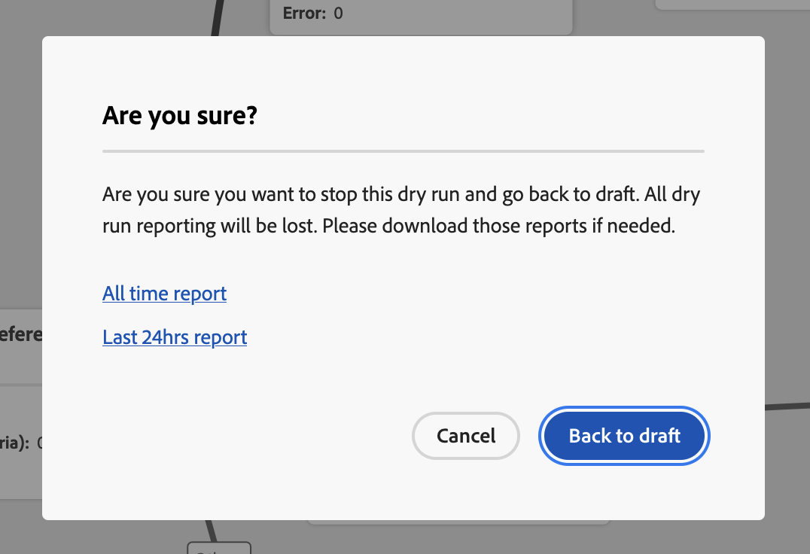

# Reizen op reis {#journey-dry-run}

>[!CONTEXTUALHELP]
>id="ajo_journey_dry_run"
>title="Droge uitvoermodus"
>abstract="Deze reis is in Dry run. Reis Dry run is een speciale publicatiemodus in [!DNL Adobe Journey Optimizer] waarmee reisartsen een reis kunnen testen met behulp van echte productiegegevens zonder contact op te nemen met echte klanten of profielinformatie bij te werken.  Deze functie helpt reisartsen vertrouwen te winnen in hun reisontwerp en doelgroep voordat ze het live publiceren."

>[!CONTEXTUALHELP]
>id="ajo_journey_dry_run_start"
>title="Een rit publiceren in de modus Droog"
>abstract="Journey Dry run is een speciale publicatiemodus in [!DNL Adobe Journey Optimizer] waarmee reisartsen een reis kunnen testen met behulp van echte productiegegevens. Nadat u de reis hebt ontworpen, voert u een droge run uit om te bevestigen dat deze functioneel is en dat de stappen correct zijn. Met deze publicatiemodus kunt u een reis roken zonder dat u de communicatie naar een profiel hoeft te sturen."

Reis Dry run is een speciale publicatiemodus in [!DNL Adobe Journey Optimizer] waarmee reisartsen een reis kunnen testen met behulp van echte productiegegevens zonder contact op te nemen met echte klanten of profielinformatie bij te werken.  Deze functie helpt reisartsen vertrouwen te winnen in hun reisontwerp en doelgroep voordat ze het live publiceren.

➡️ [ Leer meer over reis droog looppas in deze video ](#dry-run-video)

## Belangrijkste voordelen {#journey-dry-run-benefits}

Reis Dry-run versterkt het vertrouwen van de arts en het succes van de reis door veilige, gegevensgestuurde tests van klantreizen mogelijk te maken met behulp van echte productiegegevens, zonder het risico van contact met klanten of het wijzigen van profielinformatie. Deze functie stelt reisartsen in staat om het bereik van het publiek en de logica van de vertakking te valideren voordat ze live gaan, zodat de ritten op de gewenste zakelijke doelen zijn afgestemd.

Met de Rondleiding van de Droog van de Reis, kunt u kwesties vroeg identificeren, het richten strategieën optimaliseren, en het reisontwerp verbeteren dat op daadwerkelijke gegevens-geen veronderstellingen wordt gebaseerd. Dry-run is direct geïntegreerd in het reiscanvas en biedt intuïtieve rapportage en zichtbaarheid in belangrijke prestatie-indicatoren, zodat teams betrouwbaar kunnen herhalen en goedkeuringswerkstromen kunnen stroomlijnen. Dit verbetert de operationele efficiëntie, vermindert het opstartrisico en leidt tot betere resultaten van de klantenservice.

Uiteindelijk, verbetert deze eigenschap tijd-aan-waarde en vermindert reismislukkingen.

Op reis is er een droge run:

1. **Veilig testend milieu**: De profielen op Droog looppaswijze worden niet gecontacteerd, die geen risico verzekeren om mededelingen te verzenden of levende gegevens te beïnvloeden.
1. **Inzichten van het publiek**: De artsen van de reis kunnen publieksbereikbaarheid bij diverse vervoerknopen, met inbegrip van opt-outs &amp; uitsluitingen voorspellen die op de voorwaarden van de Reizen worden gebaseerd.
1. **in real time terugkoppelt**: De metriek wordt getoond direct in het wegcanvas, gelijkend op levende rapportering, toelatend reisartsen om hun reisontwerp te verfijnen.

## Uitvoeringslogica Drogen {#journey-dry-run-exec}

Tijdens de Droge Looppas, loopt de reis op simulatiemodus, die het volgende specifieke gedrag op elke reisactiviteit toepast zonder echte acties teweeg te brengen:

* **de actieknooppunten van het Kanaal** met inbegrip van E-mail, SMS of Push berichten worden niet uitgevoerd.
* **de acties van de Douane** worden onbruikbaar gemaakt tijdens Droog looppas, en hun reacties worden geplaatst aan ongeldig.

  Om de leesbaarheid te verbeteren, worden aangepaste handelingen en kanaalactiviteiten tijdens de uitvoering van een droog programma grijs weergegeven.

  {width="80%" align="left"}

* **Gegevensbronnen**, met inbegrip van externe gegevensbronnen, en **wacht** activiteiten worden onbruikbaar gemaakt door gebrek tijdens de Droog looppas. Nochtans kunt u dit gedrag [ veranderen wanneer het activeren van de Dry looppaswijze ](#journey-dry-run-start).

* **de knopen van de Reactie** worden niet uitgevoerd: alle profielen die het ingaan zullen met succes weggaan. De volgende prioriteitsregels zijn echter van toepassing:
   * Als de knoop van de Reactie van de a **** met één of veelvoudige **unitaire gebeurtenisknopen** parallel wordt gebruikt, zullen de profielen altijd door de reactiegebeurtenis gaan.
   * Als de knoop van de Reactie van de a **** met één of veelvoudige **3} knopen van de reactiegebeurtenis {parallel wordt gebruikt, zullen de profielen altijd door eerste op het canvas (bij de bovenkant) gaan.**

>[!CAUTION]
>
>* Machtigingen voor het starten van een droge runtime zijn beperkt tot gebruikers met de machtiging op hoog niveau van **[!DNL Publish journeys]** . Machtigingen om een droog programma te stoppen zijn beperkt tot gebruikers met de machtiging op hoog niveau van **[!DNL Manage journeys]** . Leer meer over het beheren van [!DNL Journey Optimizer] de toegangsrechten van gebruikers in [ deze sectie ](../administration/permissions-overview.md).
>
>* Alvorens het beginnen gebruiken van het Droge looppas vermogen, [ lees uit de Grafieken en Beperkingen ](#journey-dry-run-limitations).

## Een droge run starten {#journey-dry-run-start}

U kunt de functie Dry-run gebruiken in elke conceptreis zonder fouten.

Voer de volgende stappen uit om de droog-uitvoering te activeren:

1. Open de reis die u wilt testen.
1. Selecteer de knop **[!UICONTROL Dry run]**.

   

1. Selecteer als u **wilt toelaten of onbruikbaar maken** activiteiten en **Externe gegevensbronnen** vraag, wachten en de Dry looppas publicatie bevestigen.

   {width="50%" align="left"}

   Er wordt een statusbericht **[!UICONTROL Activating Dry run]** weergegeven terwijl de overgang plaatsvindt.

1. Als de bewerking is geactiveerd, wordt de **[!UICONTROL Dry run]** -modus geactiveerd.

## Een droge run controleren {#journey-dry-monitor}

Zodra de publicatie van de modus Dry is gestart, kunt u de uitvoering van de reis visualiseren en bepalen hoe profielen door de vertakkingen en knooppunten van de rit worden doorlopen.

Metrische gegevens worden direct op het canvas van de reis weergegeven. Leer meer over reis levende rapportering en metriek, in [ Levend rapport in het wegcanvas ](report-journey.md).

U kunt tot de **Laatste rapporten van 24 uren** en **Al-tijdrapporten** voor de Dry looppas ook toegang hebben. Om tot deze rapporten toegang te hebben, klik het **rapport van de Mening** knoop op de hoger-juiste hoek van het wegcanvas.

>[!CAUTION]
>
> Het melden van gegevens is beschikbaar slechts wanneer de Droog looppas **actief** is.  Zodra gestopt, zullen de rapportgegevens niet meer toegankelijk zijn. Gebruik de **knoop van de Uitvoer** boven de rapporten om hen indien nodig te downloaden.

## Een droge run stoppen {#journey-dry-run-stop}

Na 14 dagen wordt bij Droge ritten automatisch de status **[!UICONTROL Draft]** ingesteld.

Droge ritten kunnen ook handmatig worden gestopt. Voer de volgende stappen uit om de modus Droog uit te schakelen:

1. Open de droge rit die u wilt stoppen.
1. Selecteer de knop **[!UICONTROL Close]** om de test te beëindigen.
Koppelingen naar laatste 24 uur en alle tijdrapporten zijn beschikbaar in het bevestigingsscherm.

   {width="50%" align="left"}

1. Klik op **[!UICONTROL Back to Draft]** om te bevestigen.

## Afvoerkanalen en beperkingen {#journey-dry-run-limitations}

* De profielen op Dry lopen wijze worden geteld naar [ toe te laten Profielen ](../audience/license-usage.md)
* Reizen in de droge-uitvoeringsmodus worden meegeteld voor de live-reisquota
* Droge ritten hebben geen invloed op de bedrijfsregels
  <!--* When creating a new journey version, if a previous journey version is **Live**, then the Dry run activation is not allowed on the new version.-->
* **de acties van de Jump** worden niet toegelaten in Droog looppas.
Wanneer een bronreis a **Jump** gebeurtenis aan een bestemming teweegbrengt, zou die spronggebeurtenis niet van toepassing zijn op een Dry loopwegversie. Bijvoorbeeld, als de recentste versie van een reis in Droog looppas is en vorige is **Levend**, dan zou de spronggebeurtenis de Droog looppasversie negeren en slechts voor **Levend** toepasselijk zijn.

## Reisstapgebeurtenissen en Droge run {#journey-step-events}

De looppas van de Droog van de reis produceert **stepEvents**. Deze stepEvents hebben een specifieke markering en een droog uitvoerings-id: `inDryRun` en `dryRunID` .

* `_experience.journeyOrchestration.stepEvents.inDryRun` retourneert `true` als de droog-uitvoering is geactiveerd, anders `false`
* `_experience.journeyOrchestration.stepEvents.dryRunID` retourneert de id van een droge runtime-instantie

Als u stepEvent gegevens naar **externe systemen** uitvoert, kunt u de looppas Dry uitvoeren uitvoeren gebruikend de `inDryRun` vlag.

Wanneer het analyseren van **reis meldend metriek** gebruikend [!DNL Adobe Experience Platform] de dienst van de Vraag, moeten de droge looppas-geproduceerde stapgebeurtenissen worden uitgesloten. Stel hiervoor de markering `inDryRun` in op `false` .

## Hoe kan ik-video {#dry-run-video}

In deze video ziet u hoe u uw reizen droog kunt uitvoeren.

>[!VIDEO](https://video.tv.adobe.com/v/3464681/?learn=on&enablevpops)
