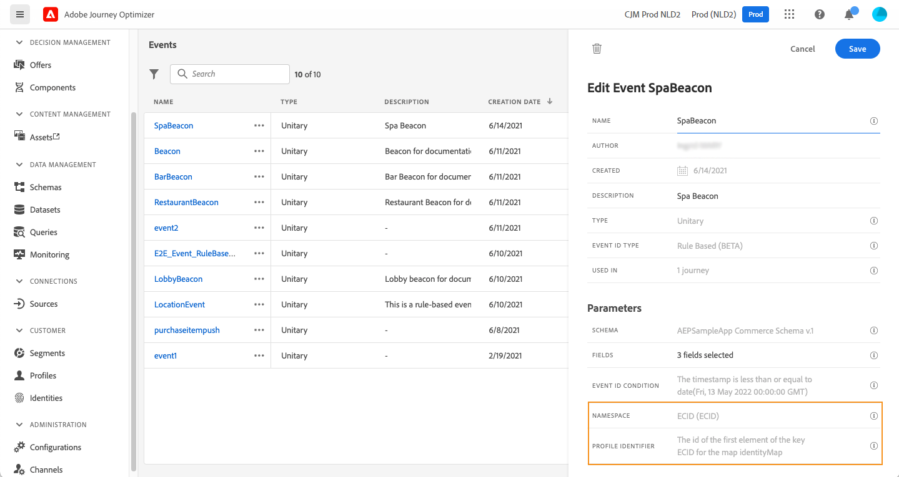
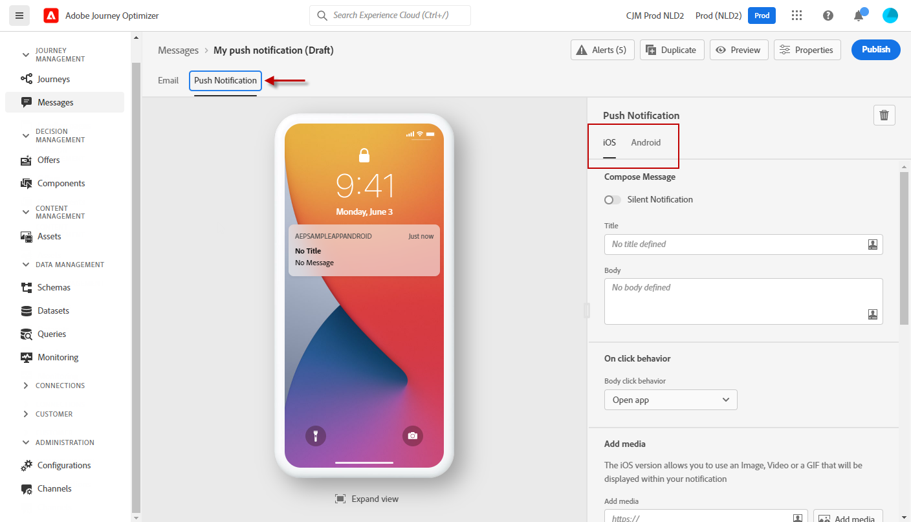
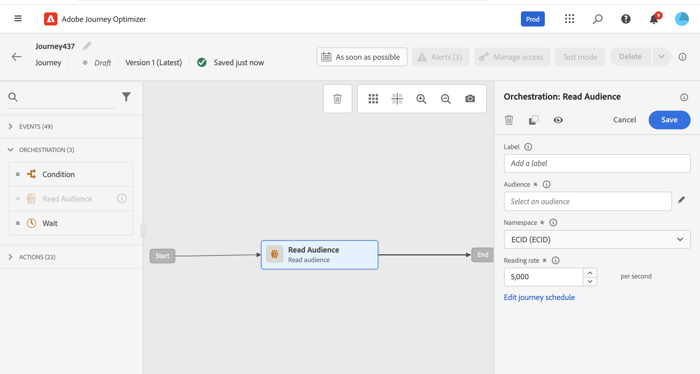
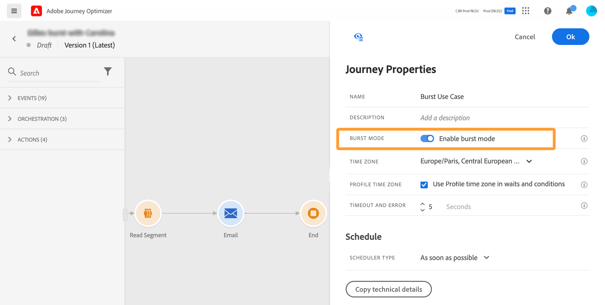

# Aan de slag met reizen{#jo-quick-start}

## Voorwaarden

Voor het verzenden van berichten met ritten is de volgende configuratie vereist:

1. **Een gebeurtenis configureren**: als u uw reizen tijdelijk wilt activeren wanneer een gebeurtenis wordt ontvangen, moet u een gebeurtenis configureren. U bepaalt de verwachte informatie en hoe te om het te verwerken. Deze stap wordt uitgevoerd door een **technische gebruiker**. [Meer informatie](../event/about-events.md).

   

1. **Een segment maken**: uw reis kan ook naar Adobe Experience Platform segmenten luisteren om berichten in partij naar een gespecificeerde reeks profielen te verzenden. Hiervoor moet u segmenten maken. [Meer informatie](../segment/about-segments.md).

   

1. **De gegevensbron configureren**: u kunt een verbinding met een systeem bepalen om extra informatie terug te winnen die in uw reizen, bijvoorbeeld in uw voorwaarden zal worden gebruikt. Tijdens de provisioning wordt ook een ingebouwde Adobe Experience Platform-databron geconfigureerd. Deze stap is niet vereist als u alleen data gebruikt van de gebeurtenissen in uw journey. Deze stap wordt uitgevoerd door een **technische gebruiker**. [Meer informatie](../datasource/about-data-sources.md)

   

1. **Een handeling configureren**: Journey Optimizer-berichtmogelijkheden zijn ingebouwd. U hoeft alleen uw inhoud te ontwerpen en uw bericht te publiceren. Zie [deze sectie](../messages/get-started-content.md). Als u een systeem van derden gebruikt om uw berichten te verzenden, kunt u een douaneactie tot stand brengen. Meer informatie in deze [sectie](../action/action.md). Deze stap wordt uitgevoerd door een **technische gebruiker**.

   

## Uw reis maken{#jo-build}

>[!CONTEXTUALHELP]
>id="ajo_journey_create"
>title="Uw reis maken"
>abstract="In dit scherm wordt de lijst met eerder gemaakte reizen weergegeven. Open een reis of klik &quot;creeer reis&quot;, en combineer de verschillende gebeurtenis, de organisatie en de actieactiviteiten om uw multi-step scenario&#39;s over het kanaal te bouwen."

Deze stap wordt uitgevoerd door de **zakelijke gebruiker**. Hier maak je je reizen. Combineer de verschillende actie-, orkestratie- en gebeurtenisactiviteiten om uw kanaaloverschrijdende scenario’s met meerdere stappen te maken.

Hier volgen de belangrijkste stappen voor het verzenden van berichten via reizen:

1. Klik in de menusectie JOURNEY MANAGEMENT op **[!UICONTROL Journeys]**. De lijst met reizen wordt weergegeven.

   

1. Klikken **[!UICONTROL Create Journey]** om een nieuwe reis te maken.

1. Bewerk de eigenschappen van de journey in het configuratievenster dat aan de rechterkant wordt weergegeven. Meer informatie in deze [sectie](journey-gs.md#change-properties).

   

1. Begin door een gebeurtenis of een **Segment lezen** van het palet naar het canvas. Raadpleeg voor meer informatie over het ontwerpen van reizen de [deze sectie](using-the-journey-designer.md).

   

1. Sleep de volgende stappen die het individu zal volgen en zet ze neer. U kunt bijvoorbeeld een voorwaarde toevoegen, gevolgd door een bericht. Voor meer informatie over activiteiten raadpleegt u [deze sectie](using-the-journey-designer.md).

1. Test uw reis met testprofielen. Meer informatie in deze [sectie](testing-the-journey.md)

1. Publiceer uw reis om deze te activeren. Meer informatie in deze [sectie](publishing-the-journey.md).

   

1. Bewaak uw reis gebruikend de specifieke rapporteringshulpmiddelen om de doeltreffendheid van uw reis te meten. Meer informatie in deze [sectie](../reports/live-report.md).

   

## Eigenschappen wijzigen {#change-properties}

>[!CONTEXTUALHELP]
>id="ajo_journey_properties"
>title="Journeyeigenschappen"
>abstract="U kunt de naam van de reis wijzigen, een beschrijving toevoegen, opnieuw toegang toestaan, begin- en einddatum kiezen en een time-out en foutduur definiëren als u beheerder bent."

Klik op het potloodpictogram in de rechterbovenhoek om de eigenschappen van de rit te openen.

U kunt de naam van de reis wijzigen, een beschrijving toevoegen, terugkeer toestaan, begin- en einddatum kiezen en een **[!UICONTROL Timeout and error]** duur als u beheerder bent.

Voor live reizen worden in dit scherm de publicatiedatum en de naam weergegeven van de gebruiker die de reis heeft gepubliceerd.

De **Technische details kopiëren** staat u toe om technische informatie over de reis te kopiëren die het steunteam kan gebruiken om problemen op te lossen. De volgende informatie wordt gekopieerd: JourneyVersion UID, OrgID, orgName, sandboxName, lastDeployedBy, lastDeployedAt.

### Entrance{#entrance}

Nieuwe reizen zijn standaard geschikt voor herbinnenkomst. U kunt de optie uitschakelen voor &#39;één opname&#39;-reizen, bijvoorbeeld als u een eenmalige gift wilt aanbieden wanneer een persoon een winkel betreedt. In dat geval, wilt u niet de klant de reis kunnen opnieuw ingaan en de aanbieding opnieuw ontvangen.

Wanneer een reis &quot;beëindigt&quot;, zal het de status hebben **[!UICONTROL Closed]**. De reis zal het niet langer mogelijk maken dat nieuwe individuen de reis betreden. Personen die al op reis zijn, zullen de reis normaal afmaken.

Na de standaard wereldwijde time-out van 30 dagen wordt de reis overgeschakeld op de **Voltooid** status. Zie dit [sectie](../building-journeys/journey-gs.md#global_timeout).

### Tijdslimiet en fout bij reisactiviteiten {#timeout_and_error}

Wanneer u een actie of voorwaardenactiviteit bewerkt, kunt u een alternatief pad definiëren in het geval van een fout of time-out. Indien de verwerking van de activiteit die een derdenstelsel ondervraagt, langer duurt dan de in de eigendommen van de reis vastgestelde tijdsduur (**[!UICONTROL Timeout and  error]** (veld), wordt het tweede pad gekozen om een mogelijke fallback-actie uit te voeren.

Toegestane waarden liggen tussen 1 en 30 seconden.

We raden u aan om een zeer korte definitie te geven **[!UICONTROL Timeout and error]** waarde als uw reis tijdgevoelig is (voorbeeld: reageren op de locatie in real time van een persoon) omdat u de handeling niet langer dan een paar seconden kunt uitstellen. Als uw reis minder tijdgevoelig is, kunt u een langere waarde gebruiken om meer tijd aan het geroepen systeem te geven om een geldige reactie te verzenden.

De reizen gebruikt ook een globale onderbreking. Zie de [volgende sectie](#global_timeout).

### Globale time-out voor transport {#global_timeout}

Naast de [timeout](#timeout_and_error) Bij reisactiviteiten wordt ook een wereldwijde reistijd gebruikt die niet in de interface wordt weergegeven en niet kan worden gewijzigd. Deze onderbreking zal de vooruitgang van individuen in de reis 30 dagen na hun binnengaan stoppen. Dit betekent dat de reis van een individu niet langer mag duren dan 30 dagen. Na de periode van 30 dagen worden de gegevens van het individu verwijderd. Personen die aan het einde van de time-outperiode nog onderweg zijn, worden gestopt en als fouten in de rapportage worden ze in aanmerking genomen.

>[!NOTE]
>
>De reizen reageren niet direct op privacy opt-out, toegang of schrappingsverzoeken. De wereldwijde time-out zorgt er echter voor dat individuen nooit langer dan 30 dagen op een reis blijven.

Vanwege de 30 dagen durende reistijd, wanneer het niet is toegestaan om de reis opnieuw te betreden, kunnen we er niet voor zorgen dat het blokkeren van de terugkeer meer dan 30 dagen zal duren. Aangezien we alle informatie over personen die 30 dagen na hun binnenkomst de reis hebben betreden, verwijderen, kunnen we niet weten dat de persoon eerder, meer dan 30 dagen geleden, is binnengekomen.

### Tijdzone en profieltijdzone {#timezone}

De tijdzone wordt gedefinieerd op het niveau van de reis.

U kunt een vaste tijdzone invoeren of Adobe Experience Platform-profielen gebruiken om de tijdzone van de reis te definiëren.

Zie voor meer informatie over tijdzonebeheer [deze pagina](../building-journeys/timezone-management.md).

### Burstmodus {#burst}

De Burst wijze is een betaalde toe:voegen-op die zeer snelle pushbericht toestaat die in grote volumes verzendt. Het wordt gebruikt voor eenvoudige reizen die een gelezen segment en een eenvoudig duwbericht omvatten. De explosie wordt gebruikt wanneer de vertraging in berichtlevering zaken-kritiek is, wanneer u een dringende duwalarm op mobiele telefoons, bijvoorbeeld een breekbericht aan gebruikers wilt verzenden die uw nieuwskanaal app hebben geïnstalleerd.

Beperkingen:

* De reis moet met een gelezen segment beginnen. Gebeurtenissen zijn niet toegestaan.
* De volgende stap moet een pushbericht zijn. Geen andere activiteit of stap is toegestaan (behalve de facultatieve eindactiviteit):
   * Alleen kanaal
   * Geen verpersoonlijking wordt toegestaan in het bericht
   * Het bericht moet klein zijn (&lt;2KB)

Belangrijke opmerking:

Als niet aan een van de eisen wordt voldaan, is de burst mode niet beschikbaar op de reis.

Als u de modus Burst wilt activeren, opent u de rit en klikt u op het potloodpictogram rechtsboven om de eigenschappen van de rit te openen. Vervolgens activeert u de knop **Burst-modus inschakelen** schakelen.

De Burst-modus wordt gedeactiveerd als u een burst-rit wijzigt en een activiteit toevoegt die niet voldoet aan de burst (bericht, andere actie, gebeurtenis, enz.). Er wordt een bericht weergegeven.

Vervolgens test en publiceert u uw reis normaal. Berichten in de testmodus worden niet verzonden via de burst-modus.

## Een reis beëindigen

Een reis kan om twee redenen eindigen:

* De persoon komt bij de laatste activiteit van een weg aan. Deze laatste activiteit kan een eindactiviteit of een andere activiteit zijn. Er bestaat geen verplichting om een pad met een eindactiviteit te beëindigen. Zie [deze pagina](../building-journeys/end-activity.md).
* De persoon komt bij een voorwaardenactiviteit (of een wachttijdactiviteit met een voorwaarde) aan en past geen van de voorwaarden aan.

De persoon kan dan opnieuw de reis betreden als herbinnenkomst is toegestaan. Zie [deze pagina](../building-journeys/journey-gs.md#change-properties)

Een reis kan om de volgende redenen worden gesloten:

* De reis wordt handmatig gesloten via de **[!UICONTROL Close to new entrances]** knop.
* Een reis op basis van een segment met één opname die klaar is met de uitvoering.
* Na het laatste voorkomen van een terugkerende op segment gebaseerde reis.

Wanneer een reis wordt gesloten (om een van de bovenstaande redenen), heeft deze de status **[!UICONTROL Closed]**. De reis zal het niet langer mogelijk maken dat nieuwe individuen de reis betreden. Personen die al op reis zijn, zullen de reis normaal afmaken. Na de standaard wereldwijde time-out van 30 dagen wordt de reis overgeschakeld op de **Voltooid** status. Zie dit [sectie](../building-journeys/journey-gs.md#global_timeout).

Als u de voortgang van alle mensen op de reis moet stoppen, kunt u deze stoppen. Als de reis wordt stopgezet, wordt een time-out voor alle personen op de reis vastgesteld.

Zo sluit of stopt u een reis handmatig:

De **[!UICONTROL Stop]** en **[!UICONTROL Close to new entrances]** opties waarmee u kunt beëindigen **leven** ritten. Als u een reis afsluit, betekent dit **dat de komst van nieuwe klanten op de reis wordt geblokkeerd** en dat de klanten die reeds op de reis zijn aangekomen, deze tot het einde kunnen ervaren. Dit is de meest aanbevolen manier om een einde te maken aan een reis omdat deze de beste ervaring biedt voor klanten. Als we een reis stoppen, moeten mensen die al een reis hebben afgelegd, allemaal stoppen. De reis is eigenlijk uitgeschakeld.

>[!NOTE]
>
>U kunt een gesloten of gestopt reis niet hervatten.

### Een reis sluiten

U kunt een reis manueel sluiten om ervoor te zorgen dat de klanten die reeds de reis inging hun weg kunnen beëindigen maar de nieuwe gebruikers niet de reis kunnen ingaan.

Wanneer een reis gesloten is, krijgt deze de status **[!UICONTROL Closed]**. Na de standaard wereldwijde time-out van 30 dagen wordt de reis overgeschakeld op de **Voltooid** status. Zie dit [sectie](../building-journeys/journey-gs.md#global_timeout).

Een gesloten reisversie kan niet opnieuw worden gestart of verwijderd. U kunt er een nieuwe versie van maken of deze dupliceren. Alleen voltooide reizen kunnen worden verwijderd.

Als u een reis wilt sluiten in de lijst met ritten, klikt u op de knop **[!UICONTROL Ellipsis]** knop rechts van de naam van de reis en selecteer **[!UICONTROL Close to new entrances]**.

U kunt ook het volgende doen:

1. In de **[!UICONTROL Journeys]** klikt u op de rit die u wilt sluiten.
1. Klik rechtsboven op de pijl omlaag.

   

1. Klik op **[!UICONTROL Close to new entrances]**. Er wordt een dialoogvenster weergegeven.
1. Klikken **[!UICONTROL Close to new entrances]** ter bevestiging.

### Een reis stoppen

U kunt een reis stoppen wanneer zich een noodsituatie voordoet en alle verwerking onmiddellijk op een reis moet worden beëindigd.

Een voltooide reisversie kan niet opnieuw worden gestart.

Wanneer een reis wordt gestopt, krijgt deze de status **[!UICONTROL Stopped]**.

U kunt bijvoorbeeld een reis stoppen als een markeerder beseft dat de reis het verkeerde publiek aanvalt of dat een aangepaste actie die berichten moet leveren, niet correct werkt. Om een reis van de lijst van reizen tegen te houden, klik **[!UICONTROL Ellipsis]** knop rechts van de naam van de reis en selecteer **[!UICONTROL Stop]**.

U kunt ook het volgende doen:

1. In de **[!UICONTROL Journeys]** klikt u op de reis die u wilt stoppen.
1. Klik rechtsboven op de pijl omlaag.

1. Klik op **[!UICONTROL Stop]**. Er wordt een dialoogvenster weergegeven.
1. Klikken **[!UICONTROL Stop]** ter bevestiging.
