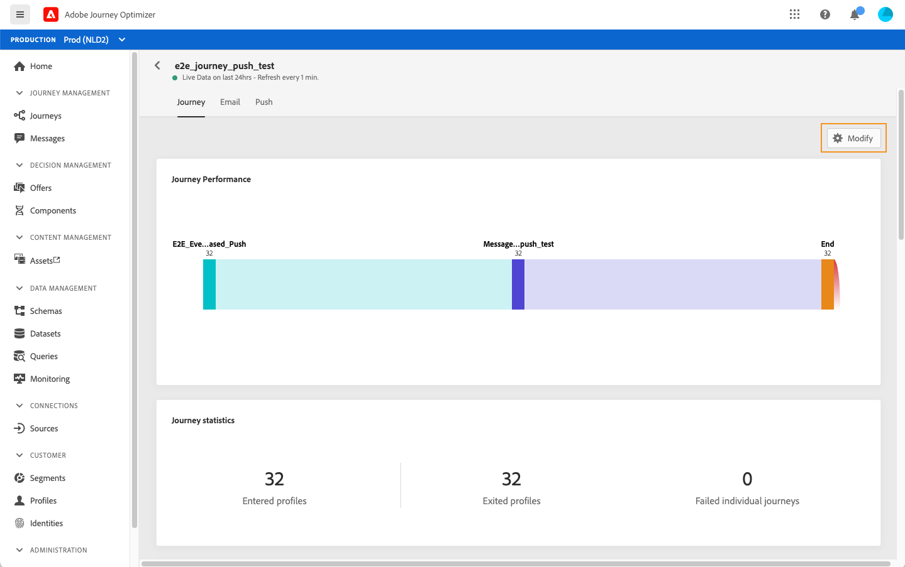
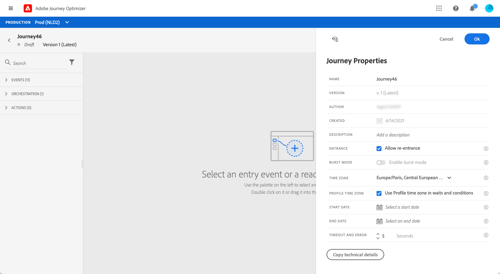

# Aan de slag met reizen{#jo-quick-start}

## Voorwaarden

Voor het verzenden van berichten met ritten is de volgende configuratie vereist:

1. **Een gebeurtenis** configureren: als u uw reizen tijdelijk wilt activeren wanneer een gebeurtenis wordt ontvangen, moet u een gebeurtenis configureren. U bepaalt de verwachte informatie en hoe te om het te verwerken. Deze stap wordt uitgevoerd door een **technische gebruiker**. [Meer informatie](../event/about-events.md).

   

1. **Een segment** maken: uw reis kan ook naar Adobe Experience Platform segmenten luisteren om berichten in partij naar een gespecificeerde reeks profielen te verzenden. Hiervoor moet u segmenten maken. [Meer informatie](../segment/about-segments.md).

   

1. **Configureer de gegevensbron**: u kunt een verbinding met een systeem bepalen om extra informatie terug te winnen die in uw reizen, bijvoorbeeld in uw voorwaarden zal worden gebruikt. Tijdens de provisioning wordt ook een ingebouwde Adobe Experience Platform-databron geconfigureerd. Deze stap is niet vereist als u alleen data gebruikt van de gebeurtenissen in uw journey. Deze stap wordt uitgevoerd door een **technische gebruiker**. [Meer informatie](../datasource/about-data-sources.md)

   

1. **Een handeling** configureren: Journey Optimizer-berichtmogelijkheden zijn ingebouwd. U hoeft alleen uw inhoud te ontwerpen en uw bericht te publiceren. Zie [deze sectie](../get-started-content.md). Als u een systeem van derden gebruikt om uw berichten te verzenden, kunt u een douaneactie tot stand brengen. Meer informatie vindt u in deze [sectie](../action/action.md). Deze stap wordt uitgevoerd door een **technische gebruiker**.

   

## Uw reis maken{#jo-build}

Deze stap wordt uitgevoerd door **zakelijke gebruiker**. Hier maak je je reizen. Combineer de verschillende actie-, orkestratie- en gebeurtenisactiviteiten om uw kanaaloverschrijdende scenario’s met meerdere stappen te maken.

Hier volgen de belangrijkste stappen voor het verzenden van berichten via reizen:

1. Klik in de sectie JOURNEY MANAGEMENT op **[!UICONTROL Journeys]**. De lijst met reizen wordt weergegeven.

   

1. Klik **[!UICONTROL Create]** om een nieuwe reis tot stand te brengen.

1. Bewerk de eigenschappen van de journey in het configuratievenster dat aan de rechterkant wordt weergegeven. Meer informatie vindt u in deze [sectie](journey-gs.md#change-properties).

   

1. Begin door een gebeurtenis of een **Leessegment** activiteit van het palet naar het canvas te slepen. Raadpleeg [deze sectie](using-the-journey-designer.md) voor meer informatie over het ontwerpen van reizen.

   

1. Sleep de volgende stappen die het individu zal volgen en zet ze neer. U kunt bijvoorbeeld een voorwaarde toevoegen, gevolgd door een bericht. Raadpleeg [deze sectie](using-the-journey-designer.md) voor meer informatie over activiteiten.

1. Test uw reis met testprofielen. Meer informatie in deze [sectie](testing-the-journey.md)

1. Publiceer uw reis om deze te activeren. Meer informatie vindt u in deze [sectie](publishing-the-journey.md).

   

1. Bewaak uw reis gebruikend de specifieke rapporteringshulpmiddelen om de doeltreffendheid van uw reis te meten. Meer informatie vindt u in deze [sectie](../reports/live-report.md).

   

## Eigenschappen wijzigen {#change-properties}

Klik op het potloodpictogram in de rechterbovenhoek om de eigenschappen van de rit te openen.

U kunt de naam van de reis wijzigen, een beschrijving toevoegen, terugkeer toestaan, begin- en einddatum kiezen en een **[!UICONTROL Timeout and error]** duur definiëren als u beheerder bent.

Met de **Technische details kopiëren** kunt u technische informatie kopiëren over de reis die het ondersteuningsteam kan gebruiken om problemen op te lossen. De volgende informatie wordt gekopieerd: JourneyVersion UID, OrgID, orgName, sandboxName.

### Entrance{#entrance}

Nieuwe reizen zijn standaard geschikt voor herbinnenkomst. U kunt de optie uitschakelen voor &#39;één opname&#39;-reizen, bijvoorbeeld als u een eenmalige gift wilt aanbieden wanneer een persoon een winkel betreedt. In dat geval, wilt u niet de klant de reis kunnen opnieuw ingaan en de aanbieding opnieuw ontvangen.

Wanneer een reis &quot;beëindigt&quot;, zal het de status **[!UICONTROL Closed (no entrance)]** hebben. De reis zal het niet langer mogelijk maken dat nieuwe individuen de reis betreden. Personen die al op reis zijn, zullen de reis normaal afmaken.

Na de standaard globale onderbreking van 30 dagen, zal de reis aan **Voltooid** status schakelen. Zie deze [sectie](../building-journeys/journey-gs.md#global_timeout).

### Time-out en fout in reisactiviteiten {#timeout_and_error}

Wanneer u een actie of voorwaardenactiviteit bewerkt, kunt u een alternatief pad definiëren in het geval van een fout of time-out. Als de verwerking van de activiteit die een derdesysteem ondervraagt de onderbrekingsduur overschrijdt die in de eigenschappen van de reis (**[!UICONTROL Timeout and  error]** gebied) wordt bepaald, zal de tweede weg worden gekozen om een potentiële reserveactie uit te voeren.

Toegestane waarden liggen tussen 1 en 30 seconden.

Wij adviseren dat u een zeer korte **[!UICONTROL Timeout and error]** waarde bepaalt als uw reis tijdgevoelig is (voorbeeld: reageren op de locatie in real time van een persoon) omdat u de handeling niet langer dan een paar seconden kunt uitstellen. Als uw reis minder tijdgevoelig is, kunt u een langere waarde gebruiken om meer tijd aan het geroepen systeem te geven om een geldige reactie te verzenden.

De reizen gebruikt ook een globale onderbreking. Zie [volgende sectie](#global_timeout).

### Globale time-out voor transport {#global_timeout}

Naast de [timeout](#timeout_and_error) die in reisactiviteiten wordt gebruikt, is er ook een globale reisonderbreking die niet in de interface wordt getoond en niet kan worden veranderd. Deze onderbreking zal de vooruitgang van individuen in de reis 30 dagen na hun binnengaan stoppen. Dit betekent dat de reis van een individu niet langer mag duren dan 30 dagen. Na de periode van 30 dagen worden de gegevens van het individu verwijderd. Personen die aan het einde van de time-outperiode nog onderweg zijn, worden gestopt en als fouten in de rapportage worden ze in aanmerking genomen.

>[!NOTE]
>
>De reizen reageren niet direct op privacy opt-out, toegang of schrappingsverzoeken. De wereldwijde time-out zorgt er echter voor dat individuen nooit langer dan 30 dagen op een reis blijven.

Vanwege de 30 dagen durende reistijd, wanneer het niet is toegestaan om de reis opnieuw te betreden, kunnen we er niet voor zorgen dat de heringstop meer dan 30 dagen werkt. Aangezien we alle informatie over personen die 30 dagen na hun binnenkomst de reis hebben betreden, verwijderen, kunnen we niet weten dat de persoon eerder, meer dan 30 dagen geleden, is binnengekomen.

### Tijdzone en profieltijdzone {#timezone}

De tijdzone wordt gedefinieerd op het niveau van de reis.

U kunt een vaste tijdzone invoeren of Adobe Experience Platform-profielen gebruiken om de tijdzone van de reis te definiëren.

Zie [deze pagina](../building-journeys/timezone-management.md) voor meer informatie over tijdzonebeheer.

## Een reis beëindigen

Een reis kan om twee redenen eindigen:

* De persoon komt bij de laatste activiteit van een weg aan. Deze laatste activiteit kan een eindactiviteit of een andere activiteit zijn. Er bestaat geen verplichting om een pad met een eindactiviteit te beëindigen. Zie [deze pagina](../building-journeys/end-activity.md).
* De persoon komt bij een voorwaardenactiviteit (of een wachttijdactiviteit met een voorwaarde) aan en past geen van de voorwaarden aan.

De persoon kan dan opnieuw de reis betreden als herbinnenkomst is toegestaan. Zie [deze pagina](../building-journeys/journey-gs.md#change-properties)

Een reis kan om de volgende redenen worden gesloten:

* De reis wordt manueel gesloten via **[!UICONTROL Close to new entrances]** knoop.
* Een reis op basis van een segment met één opname die klaar is met de uitvoering.
* Na het laatste optreden van een terugkerend segment gebaseerd transport.

Wanneer een reis (om een van de bovenstaande redenen) wordt gesloten, heeft deze de status **[!UICONTROL Closed (no entrance)]**. De reis zal het niet langer mogelijk maken dat nieuwe individuen de reis betreden. Personen die al op reis zijn, zullen de reis normaal afmaken. Na de standaard globale onderbreking van 30 dagen, zal de reis aan **Voltooid** status schakelen. Zie deze [sectie](../building-journeys/journey-gs.md#global_timeout).

Als u de voortgang van alle mensen op de reis moet stoppen, kunt u deze stoppen. Als de reis wordt stopgezet, wordt een time-out voor alle personen op de reis vastgesteld.

Zo sluit of stopt u een reis handmatig:

Met de opties **[!UICONTROL Stop]** en **[!UICONTROL Close to new entrances]** kunt u **live**-reizen beëindigen. Als u een reis afsluit, betekent dit **dat de aankomst van nieuwe klanten op de reis geblokkeerd is** en dat de klanten die al op de reis zijn aangekomen, deze tot het einde kunnen ervaren. Dit is de meest aanbevolen manier om een einde te maken aan een reis omdat deze de beste ervaring biedt voor klanten. Als we een reis stoppen, moeten mensen die al een reis hebben afgelegd, allemaal stoppen. De reis is eigenlijk uitgeschakeld.

>[!NOTE]
>
>U kunt een gesloten of gestopt reis niet hervatten.

### Een reis sluiten

U kunt een reis manueel sluiten om ervoor te zorgen dat de klanten die reeds de reis inging hun weg kunnen beëindigen maar de nieuwe gebruikers niet de reis kunnen ingaan.

Wanneer een reis gesloten is, heeft deze de status **[!UICONTROL Closed (no entrance)]**. Na de standaard globale onderbreking van 30 dagen, zal de reis aan **Voltooid** status schakelen. Zie deze [sectie](../building-journeys/journey-gs.md#global_timeout).

Een gesloten reisversie kan niet opnieuw worden gestart of verwijderd. U kunt er een nieuwe versie van maken of deze dupliceren. Alleen voltooide reizen kunnen worden verwijderd.

U kunt een reis sluiten door **[!UICONTROL Close to new entrances]** te klikken terwijl het hangen over een reis in de lijst van reizen.

U kunt ook het volgende doen:

1. Klik in de lijst **[!UICONTROL Journeys]** op de rit die u wilt sluiten.
1. Klik rechtsboven op de pijl omlaag.

   

1. Klik op **[!UICONTROL Close to new entrances]**. Er wordt een dialoogvenster weergegeven.
1. Klik **[!UICONTROL Close to new entrances]** om te bevestigen.

### Een reis stoppen

U kunt een reis stoppen wanneer zich een noodsituatie voordoet en alle verwerking onmiddellijk op een reis moet worden beëindigd.

Een voltooide reisversie kan niet opnieuw worden gestart.

Als de reis wordt gestopt, heeft deze de status **[!UICONTROL Stopped]**.

U kunt een reis tegenhouden (bijvoorbeeld als een markeerder beseft dat de reis het verkeerde publiek of een douaneactie verondersteld om berichten te leveren niet correct werkt...) door **[!UICONTROL Stop]** te klikken terwijl het hangen over een reis in de lijst van reizen.

U kunt ook het volgende doen:

1. Klik in de lijst **[!UICONTROL Journeys]** op de reis die u wilt stoppen.
1. Klik rechtsboven op de pijl omlaag.

1. Klik op **[!UICONTROL Stop]**. Er wordt een dialoogvenster weergegeven.
1. Klik **[!UICONTROL Stop]** om te bevestigen.
