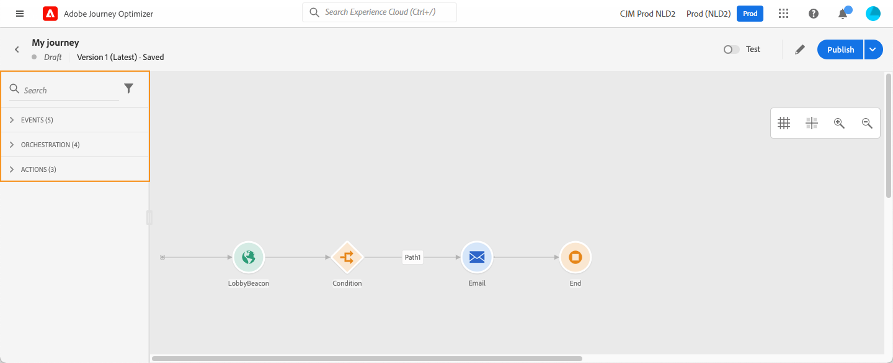

# Uw eerste journey maken {#jo-quick-start}

>[!CONTEXTUALHELP]
>id="ajo_homepage_card2"
>title="Reizen maken"
>abstract="Gebruik **[!DNL Adobe Journey Optimizer]** om in real time orchestratiefase samen te stellen met gebruik van contextuele gegevens die zijn opgeslagen in gebeurtenissen of gegevensbronnen."

>[!CONTEXTUALHELP]
>id="ajo_journey_create"
>title="Journeys"
>abstract="Ontwerpen van klantritten om persoonlijke, contextuele ervaringen te bieden. Met Journey Optimizer kunt u gebruiksscenario&#39;s voor realtime orchestratie maken met contextuele gegevens die zijn opgeslagen in gebeurtenissen of gegevensbronnen. Het **Overzicht** lusje toont een dashboard met zeer belangrijke metriek met betrekking tot uw reizen. Het **doorbladert** lusje toont de lijst van bestaande reizen."

[!DNL Adobe Journey Optimizer] bevat een omnichannel orchestration canvas dat marketers in staat stelt marketingactiviteiten te harmoniseren met een-op-een-klantenservice. Met de gebruikersinterface kunt u activiteiten van het palet naar het canvas slepen om uw reis te maken. Het interface van de reisgebruiker is gedetailleerd op [&#x200B; deze pagina &#x200B;](journey-ui.md).

De belangrijkste stappen om een reis tot stand te brengen zijn gedetailleerd op deze pagina. Zij worden als volgt gestroomlijnd:

In deze handleiding gaat u:

* Een toegangspunt definiëren — een publiekssegment of een realtime-gebeurtenis
* Berichtacties toevoegen via kanalen (e-mail, push of SMS)
* Test uw reis met testprofielen voor activering
* Uw reis publiceren en de prestaties ervan controleren

Bouw uit meerdere stappen klantenreizen om een opeenvolging van interactie, aanbiedingen, en berichten over kanalen in real time in werking te stellen. Deze benadering zorgt ervoor dat klanten op de optimale momenten worden betrokken die op hun acties en relevante bedrijfssignalen worden gebaseerd. Het doelpubliek wordt gedefinieerd op basis van gedrag, contextuele gegevens en bedrijfsgebeurtenissen. De vereisten hangen van uw gebruiksgeval en het [&#x200B; type van reis &#x200B;](entry-management.md#types-of-journeys) af u bouwt.

Leer meer over hoe de profielen door reizen en de tarieven van de reisverwerking in [&#x200B; deze sectie &#x200B;](entry-management.md#journey-processing-rate) stromen.

<!-->[!TIP]
&#x200B;>>
Weet u niet zeker of u een reis of een campagne wilt gebruiken? [&#x200B; Leer hoe te om de juiste benadering &#x200B;](../start/journeys-vs-campaigns.md) te kiezen.
>—>

## Voordat u begint {#prerequisites}

Wat u moet vormen alvorens de bouw afhangt van hoe uw reis wordt teweeggebracht. De meeste reizen beginnen vanaf een van deze twee toegangspunten:

* **op publiek-gebaseerde ingang** — De reis loopt voor een bepaalde reeks profielen in een geplande tijd. [&#x200B; creeer een publiek &#x200B;](../audience/about-audiences.md) in Adobe Experience Platform alvorens uw reis te bouwen. Dit is het aanbevolen beginpunt als je nog geen ervaring hebt met Journey Optimizer.

* **op gebeurtenis-gebaseerde ingang** - de reis wordt teweeggebracht in echt - tijd wanneer een individu een actie, zoals een aankoop of een sign-up uitvoert. [&#x200B; vorm een gebeurtenis &#x200B;](../event/about-events.md) om de trekker en de gegevens te bepalen het draagt.

De volgende elementen zijn optioneel, maar kunnen nodig zijn, afhankelijk van uw gebruiksgeval:

* **Gegevensbron** — om reisvoorwaarden of verpersoonlijking met gegevens van een extern systeem te verrijken, opstelling a [&#x200B; gegevensbron &#x200B;](../datasource/about-data-sources.md).

* **Actie van de Douane** - als u berichten door een derdesysteem eerder dan de ingebouwde kanalen levert, vorm a [&#x200B; douaneactie &#x200B;](../action/action.md).

>[!NOTE]
>
>Als u een gegevensingenieur verantwoordelijk voor de technische opstelling (gebeurtenissen, gegevensbronnen, en acties) bent, verwijs naar [&#x200B; deze sectie &#x200B;](../configuration/about-data-sources-events-actions.md).

>[!NOTE]
>
>De gidsen en de beperkingen van de reis zijn gedetailleerd op [&#x200B; deze pagina &#x200B;](../start/guardrails.md).

## Een journey maken {#jo-build}

Voer de volgende stappen uit om een reis in meerdere stappen te maken:

1. Klik in de menusectie JOURNEY MANAGEMENT op **[!UICONTROL Journeys]** .

1. Klik op de knop **[!UICONTROL Create Journey]** om een nieuwe rit te maken.

1. Bewerk het configuratievenster van de rit om de naam van de rit te definiëren en de eigenschappen ervan in te stellen. Leer hoe te om de eigenschappen van uw reis op [&#x200B; te plaatsen deze pagina &#x200B;](journey-properties.md).

   >[!TIP]
   >
   >**Welk vervoerstype zou ik moeten kiezen?** Als u nog geen ervaring hebt met Journey Optimizer, begint u met een op het publiek gebaseerde reis met behulp van een **[!UICONTROL Read Audience]** -activiteit. Deze gebeurtenis hoeft niet eerder te zijn geconfigureerd en is de eenvoudigste manier om vertrouwd te raken met het canvas. Voor real-time, gebeurtenis-teweeggebrachte ervaringen (bijvoorbeeld, het antwoorden aan een aankoop of een vormvoorlegging), vorm eerst een gebeurtenis en gebruik een op gebeurtenis-gebaseerde ingang. Leer meer over [&#x200B; reistypes &#x200B;](entry-management.md#types-of-journeys).

   

U kunt dan beginnen uw reis te ontwerpen.

## De reis ontwerpen {#jo-design}

De reisontwerper laat u multi-step reizen gebruikend een intuïtieve belemmering-en-dalingsinterface bouwen. De activiteiten in het linkerpalet worden georganiseerd in drie categorieën: **Gebeurtenissen**, **Orchestratie**, en **Acties**. Voor een volledig overzicht van het canvas en zijn controles, verwijs naar [&#x200B; deze pagina &#x200B;](using-the-journey-designer.md).

Volg deze stappen om uw reis te ontwerpen:

1. **voeg een ingangspunt** toe - sleep een gebeurtenis of a **[!UICONTROL Read Audience]** activiteit van het palet op het canvas. Dit bepaalt hoe de profielen de reis ingaan: individueel in echt - tijd (op gebeurtenis-gebaseerd) of allen in één keer van een bepaald publiek (op publiek-gebaseerd).

   

1. **voegt berichtacties** toe - van de **[!UICONTROL Actions]** sectie van het palet, sleep een kanaalactie op het canvas om berichten naar profielen te verzenden die door de reis stromen. Handelingen zijn beschikbaar voor e-mail, pushberichten, SMS en meer.

1. **voegt orkestactiviteiten** toe - gebruik een **[!UICONTROL Condition]** activiteit om de reis in veelvoudige wegen te vertakken die op profielattributen of gedrag worden gebaseerd. Gebruik een **[!UICONTROL Wait]** -activiteit om een vertraging tussen de stappen in te voeren.

>[!TIP]
>
>Voor reizen met meerdere fasen of veel aanraakpunten kunt u overwegen de end-to-end flow te splitsen in kleinere subreizen die verband houden met de **[!UICONTROL Jump]** -activiteit. Dit vermindert de complexiteit en maakt elke subreis gemakkelijker om onafhankelijk te testen. Leer meer in [&#x200B; strategie van het Ontwerp: beetje-gerangschikte sub-reizen &#x200B;](jump.md#jump-strategy).

## De reis testen {#jo-test}

Als u uw reis hebt gemaakt, test u deze voordat u publiceert. Journey Optimizer biedt de wijze van de a **Test** als manier aan om testprofielen te bekijken aangezien zij zich langs de reis bewegen, die potentiële fouten vóór activering ontdekken. Door snelle tests uit te voeren, zorgt u ervoor dat de reizen correct werken, zodat u ze met vertrouwen kunt publiceren. Leer hoe te om uw reis [&#x200B; in deze sectie &#x200B;](testing-the-journey.md) te testen

U kunt uw reis in **Droog looppas** ook uitvoeren. Reis Dry run is een speciale publicatiemodus in Adobe Journey Optimizer die reisartsen in staat stelt een reis te testen met behulp van echte productiegegevens zonder contact op te nemen met echte klanten of profielinformatie bij te werken. Deze functie helpt reisartsen vertrouwen te winnen in hun reisontwerp en doelgroep voordat ze het live publiceren. Leer hoe te om een reis op Dry looppas wijze [&#x200B; in deze sectie &#x200B;](journey-dry-run.md) te publiceren.

## De reis publiceren {#jo-pub}

U moet een reis publiceren om het te activeren en het ter beschikking te stellen voor nieuwe profielen om het in te gaan. Voordat u uw reis publiceert, controleert u of deze geldig is en of er geen fouten zijn. U kunt geen reis met fouten publiceren. Leer meer over reispublicatie in deze [&#x200B; sectie &#x200B;](publish-journey.md).

Na publicatie kunt u uw reis controleren met behulp van de speciale rapportagetools om de effectiviteit van uw reis te meten.

Leer meer over reisrapporten in deze [&#x200B; sectie &#x200B;](../reports/live-report.md).

## Vaak voorkomende gebruiksscenario&#39;s {#use-cases}

Weet u niet zeker waar u wilt beginnen? Hier zijn drie typische scenario&#39;s waar de reizen de meeste waarde leveren:

<table style="table-layout:fixed">
  <tr style="border: 0;">
    <td>
      
      
<strong> Welkome reeksen </strong>  automatisch aan boord nieuwe gebruikers met een opeenvolging van berichten na sign-up, die hen door uw product of dienst leiden.

    </td>
    <td>
      
      
<strong> Van de gebruikslooptijd van het Kart 1&rbrace; re-engaan klanten die zonder een aankoop verlieten door een geschikte herinnering met gepersonaliseerde inhoud te verzenden.</strong> 

    </td>
    <td>
      
      
<strong> re-engagement </strong>  terugwinnen inactieve gebruikers met gerichte aanbiedingen of updates die op hun laatst gekend gedrag worden gebaseerd.

    </td>
  </tr>
  <tr style="border: 0;">
    <td align="center"></td>
    <td align="center"></td>
    <td align="center"></td>
  </tr>
</table>

## Aanvullende bronnen

* **[Overzicht van de ontwerper van de Reis](using-the-journey-designer.md)** - Meester de interface van het wegcanvas om klantenreizen te ontwerpen en te ordenen.
* **[de activiteiten van de Reis](about-journey-activities.md)** - ontdekt alle beschikbare activiteiten met inbegrip van gebeurtenissen, acties, en orchestration componenten.
* **[het Testen reizen](testing-the-journey.md)** - Leer hoe te om uw reizen te testen gebruikend testwijze alvorens aan productie te publiceren.
* **[het Publiceren reizen](publish-journey.md)** - begrijp het proces van de reispublicatie en hoe te om levende reizen te beheren.
* **[Reis die](report-journey.md)** meldt - spoor en analyseert reisprestaties met gedetailleerde metriek en inzichten.
* **[reizen van het Oplossen van problemen](troubleshooting.md)** - vind oplossingen aan gemeenschappelijke reiskwesties en beste praktijken voor het zuiveren.
* **[leerprogramma&#39;s van de Reis &#x200B;](https://experienceleague.adobe.com/en/docs/journey-optimizer-learn/tutorials/journeys/introduction-to-building-a-journey){target="_blank"}** - Onderzoek geleidelijke videoleerprogramma&#39;s op het wegbouw en beste praktijken.

