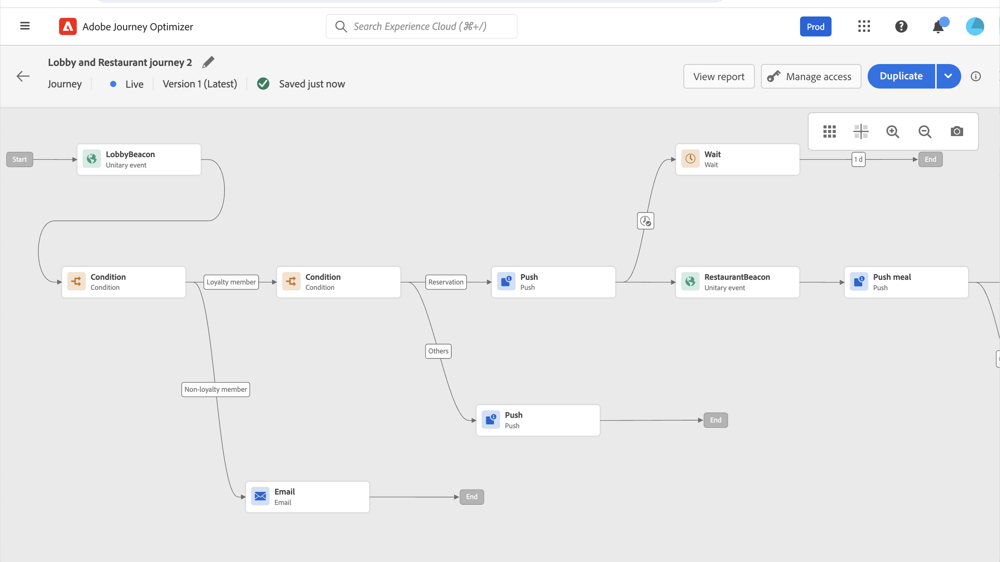

# Uw eerste journey maken{#jo-quick-start}

>[!CONTEXTUALHELP]
>id="ajo_homepage_card2"
>title="Reizen maken"
>abstract="Gebruiken **Adobe Journey Optimizer** gebruiken voor het maken van realtime-formulieren voor het orkestgebruik met gebruik van contextuele gegevens die zijn opgeslagen in gebeurtenissen of gegevensbronnen."

## Vereisten{#start-prerequisites}

Voor het verzenden van berichten met ritten zijn de volgende configuraties vereist:

1. **Een gebeurtenis configureren**: als u uw reizen tijdelijk wilt activeren wanneer een gebeurtenis wordt ontvangen, moet u een gebeurtenis configureren. U bepaalt de verwachte informatie en hoe te om het te verwerken. Deze stap wordt uitgevoerd door een **technisch gebruiker**. [Meer informatie](../event/about-events.md).

   

1. **Een publiek maken**: uw reis kan ook luisteren naar Adobe Experience Platform-publiek om berichten in batch te verzenden naar een opgegeven reeks profielen. Hiervoor moet u een publiek maken. [Meer informatie](../audience/about-audiences.md).

   

1. **De gegevensbron configureren**: u kunt een verbinding met een systeem definiëren om aanvullende informatie op te halen die in uw reizen wordt gebruikt, bijvoorbeeld in uw omstandigheden. Tijdens de provisioning wordt ook een ingebouwde Adobe Experience Platform-databron geconfigureerd. Deze stap is niet vereist als u alleen data gebruikt van de gebeurtenissen in uw journey. Deze stap wordt uitgevoerd door een **technisch gebruiker**. [Meer informatie](../datasource/about-data-sources.md)

   

1. **Een handeling configureren**: Als u berichten verzendt met een systeem van derden, kunt u een aangepaste handeling maken. Meer informatie in deze [sectie](../action/action.md). Deze stap wordt uitgevoerd door een **technisch gebruiker**. Als u de ingebouwde berichtmogelijkheden van Journey Optimizer gebruikt, hoeft u alleen maar een kanaalactie aan uw reis toe te voegen en uw inhoud te ontwerpen.

   

## Toegang tot reizen {#journey-access}

>[!CONTEXTUALHELP]
>id="ajo_journey_create"
>title="Journeys"
>abstract="Ontwerpen van klantritten om persoonlijke, contextuele ervaringen te bieden. Met Journey Optimizer kunt u in real-time gebruikmaken van het orkestgebruik en contextuele gegevens opslaan in gebeurtenissen of gegevensbronnen. De **Overzicht** wordt een dashboard weergegeven met de belangrijkste maatstaven voor uw reizen. De **Bladeren** wordt de lijst met bestaande reizen weergegeven."

### Belangrijkste metriek en reislijst {#access-metrics}

Klik in de menusectie JOURNEY MANAGEMENT op **[!UICONTROL Journeys]**. Er zijn twee tabbladen beschikbaar:

**Overzicht**: op dit tabblad wordt een dashboard weergegeven met de belangrijkste maatstaven voor uw reizen:

* **Profielen verwerkt**: totaal aantal profielen dat in de afgelopen 24 uur is verwerkt
* **Levende reizen**: totaal aantal rechtstreekse reizen met verkeer in de afgelopen 24 uur. Levende reizen omvatten **Eenheidstreizen** (op basis van gebeurtenissen) en **Batchreizen** (lees publiek).
* **Foutfrequentie**: verhouding van alle profielen die fout zijn in vergelijking met het totale aantal profielen dat in de afgelopen 24 uur is ingevoerd.
* **Percentage negeren**: verhouding tussen alle genegeerde profielen en het totale aantal profielen dat in de afgelopen 24 uur is ingevoerd. Een weggegooid profiel vertegenwoordigt iemand die niet in aanmerking komt om de reis binnen te gaan, bijvoorbeeld vanwege een onjuiste naamruimte of vanwege regels voor opnieuw betreden.

>[!NOTE]
>
>Dit dashboard houdt rekening met de reizen met verkeer in de afgelopen 24 uur. Alleen de reizen waartoe u toegang hebt, worden weergegeven. De metriek worden verfrist om de 30 minuten en slechts wanneer de nieuwe gegevens beschikbaar zijn.

**Bladeren**: op dit tabblad wordt de lijst met bestaande reizen weergegeven. U kunt reizen zoeken, filters gebruiken en basishandelingen op elk element uitvoeren. U kunt bijvoorbeeld een item dupliceren of verwijderen. Raadpleeg [deze sectie](../start/user-interface.md#filter-lists) voor meer informatie.

### Reizen filteren {#filter}

In de lijst met reizen kunt u verschillende filters gebruiken om de lijst met reizen te verfijnen, zodat u deze beter leesbaar kunt maken.

Hier zijn de diverse het filtreren verrichtingen die u kunt uitvoeren:

Reizen filteren op basis van hun status, type, versie en toegewezen tags van de **[!UICONTROL Status and version filters]**.

Het type kan zijn: **[!UICONTROL Unitary event]**, **[!UICONTROL Audience qualification]**, **[!UICONTROL Read audience]** of **[!UICONTROL Business event]**.

De status kan zijn:

* **Gesloten**: de reis is afgesloten met de **Dicht bij nieuwe ingangen** knop. De reis houdt in dat nieuwe individuen de reis kunnen betreden. Personen die al onderweg zijn, kunnen de reis normaal afmaken.
* **Concept**: de reis bevindt zich in de eerste fase. Het is nog niet gepubliceerd.
* **Concept (testen)**: de testmodus is geactiveerd met behulp van de **Testmodus** knop.
* **Voltooid**: de reis schakelt na 91 dagen automatisch over naar deze status [algemene time-out](journey-properties.md#global_timeout). Profielen die al op reis zijn, worden normaal afgehandeld. Nieuwe profielen kunnen niet langer de reis betreden.
* **Live**: de reis is gepubliceerd met behulp van de **Publiceren** knop.
* **Gestopt**: de reis is uitgeschakeld met behulp van de **Stoppen** knop. Alle individuen sluiten onmiddellijk de reis.

>[!NOTE]
>
>De publicatielevenscyclus van de Reis omvat ook een reeks tussenliggende statussen die niet beschikbaar zijn voor filtering: &quot;Publishing&quot; (tussen &quot;Draft&quot; en &quot;Live&quot;), &quot;Activating test mode&quot; of &quot;Deactivating test mode&quot; (tussen &quot;Draft&quot; en &quot;Draft (test)&quot;) en &quot;Stopping&quot; (tussen &quot;Live&quot; en &quot;Gestopt&quot;). Wanneer een reis in een tussenstadium is, is het read-only.

Gebruik de **[!UICONTROL Creation filters]** om reizen te filteren op basis van de aanmaakdatum of de gebruiker die ze heeft gemaakt.

Reizen weergeven die gebruikmaken van een specifieke gebeurtenis, veldgroep of handeling van de **[!UICONTROL Activity filters]** en **[!UICONTROL Data filters]**.

Gebruik de **[!UICONTROL Publication filters]** om een publicatiedatum of een gebruiker te selecteren. U kunt bijvoorbeeld kiezen of u de nieuwste versies wilt weergeven van live reizen die gisteren zijn gepubliceerd.

Als u reizen wilt filteren op basis van een specifiek datumbereik, selecteert u **[!UICONTROL Custom]** van de **[!UICONTROL Published]** vervolgkeuzelijst.

Daarnaast worden in de configuratievensters Gebeurtenis, Gegevensbron en Handeling de **[!UICONTROL Used in]** in het veld wordt het aantal ritten weergegeven dat van die specifieke gebeurtenis, veldgroep of handeling gebruikmaakt. U kunt klikken op de knop **[!UICONTROL View journeys]** om de lijst met corresponderende journey’s weer te geven.

## Uw reis maken {#jo-build}

Ontwerpreizen om persoonlijke contextafhankelijke ervaringen te bieden. [!DNL Journey Optimizer] kunt u in real time het gebruikscase van het orkestgebruik met contextafhankelijke gegevens bouwen die in gebeurtenissen of gegevensbronnen worden opgeslagen. Ontwerp multistep geavanceerde scenario&#39;s aangedreven door de volgende mogelijkheden:

* In real time verzenden **unitaire levering** geactiveerd wanneer een gebeurtenis wordt ontvangen, of **in batch** met Adobe Experience Platform-publiek.

* Hefboomwerking **contextafhankelijke gegevens** uit gebeurtenissen, informatie van Adobe Experience Platform of gegevens van externe API-services.

* Gebruik de **ingebouwde kanaalhandelingen** (E-mail, SMS, Push, InApp) voor het verzenden van berichten die zijn ontworpen in [!DNL Journey Optimizer] of maak **aangepaste handelingen** als u een systeem van derden gebruikt om uw berichten te verzenden.

* Met de **reisontwerper** bouwt u gebruiksscenario&#39;s voor meerdere stappen samen: sleep en zet eenvoudig een entry-gebeurtenis of een activiteit voor een lezenpubliek neer, voeg voorwaarden toe en verzend gepersonaliseerde berichten.

➡️ [Deze functie in video detecteren](journey.md#video)

De stappen om berichten door reizen te verzenden zijn hieronder vermeld.

1. Van de **Bladeren** tabblad, klikt u op **[!UICONTROL Create Journey]** om een nieuwe reis te maken.

1. Bewerk de eigenschappen van de journey in het configuratievenster dat aan de rechterkant wordt weergegeven. Leer hoe u de eigenschappen van uw reis instelt in deze [deze pagina](journey-properties.md).

   

1. Begin door een gebeurtenis of een **Publiek lezen** van het palet naar het canvas. Raadpleeg voor meer informatie over het ontwerpen van reizen de [deze sectie](using-the-journey-designer.md).

   

1. Sleep de volgende stappen die het individu zal volgen en zet ze neer. U kunt bijvoorbeeld een voorwaarde toevoegen, gevolgd door een kanaalactie. Voor meer informatie over activiteiten raadpleegt u [deze sectie](using-the-journey-designer.md).

1. Test uw reis met testprofielen. Meer informatie in deze [sectie](testing-the-journey.md)

1. Publiceer uw reis om deze te activeren. Meer informatie in deze [sectie](publishing-the-journey.md).

   

1. Bewaak uw reis gebruikend de specifieke rapporteringshulpmiddelen om de doeltreffendheid van uw reis te meten. Meer informatie in deze [sectie](../reports/live-report.md).

   

## Een reis dupliceren {#duplicate-a-journey}

U kunt een bestaande reis dupliceren vanaf de **Bladeren** tab. Alle objecten en instellingen worden gedupliceerd naar de reiskopie.

Volg onderstaande stappen om dit te doen:

1. Navigeer naar de reis u wilt kopiëren, klik **Meer handelingen** pictogram (de drie punten naast de naam van het transport).
1. Selecteren **Dupliceren**.

   

1. Voer de naam van de reis in en bevestig deze. U kunt de naam ook wijzigen in het scherm met de reiseigenschappen. Standaard wordt de naam als volgt ingesteld: `[JOURNEY-NAME]_copy`

   

1. De nieuwe reis wordt gecreeerd en beschikbaar in de reislijst.
