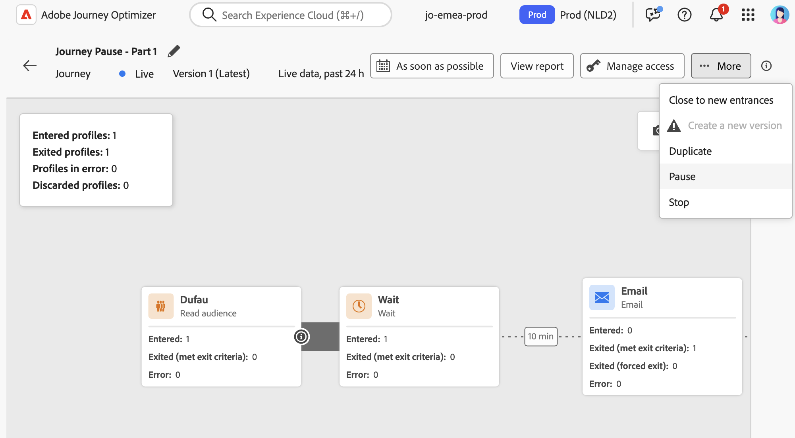

# Een reis pauzeren {#journey-pause}

>[!CONTEXTUALHELP]
>id="ajo_journey_pause"
>title="Uw reis pauzeren"
>abstract="U kunt een live reis pauzeren om te voorkomen dat nieuwe profielen binnenkomen. Kies of u profielen die momenteel op reis zijn, wilt verwijderen of op de juiste plaats wilt houden. Als deze optie behouden blijft, wordt de uitvoering van de volgende actie hervat zodra de reis opnieuw is gestart. Ideaal voor updates of noodstops zonder dat de voortgang verloren gaat."

U kunt uw live reizen pauzeren, alle benodigde wijzigingen uitvoeren en deze op elk gewenst moment hervatten.<!--You can choose whether the journey is resumed at the end of the pause period, or whether it stops completely. --> tijdens de pauze, kunt u [&#x200B; de criteria van de de uitgang van profielattributen &#x200B;](#journey-exit-criteria) toepassen om profielen uit te sluiten die op hun attributen worden gebaseerd. De reis wordt automatisch hervat aan het einde van de pauze. U kunt het [&#x200B; ook manueel hervatten &#x200B;](#journey-resume-steps).

## Belangrijkste voordelen {#journey-pause-benefits}

Het pauzeren en hervatten van reizen geeft de reisartsen meer controle en flexibiliteit door het tijdelijk stilleggen van de actieve reizen toe te staan zonder de ervaring van de klant te verstoren. Wanneer gepauzeerd, worden geen mededelingen verzonden, en de profielen blijven in een geschorste staat tot de reis wordt hervat.

Dit vermogen vermindert het risico om onbedoelde berichten tijdens fouten of updates (bijvoorbeeld: verandering op berichtinhoud) te verzenden, steunt veiliger reisbeheer, en verhoogt praktiserend vertrouwen. De zichtbaarheid in gepauzeerde reizen en hun status rechtstreeks in de gebruikersinterface verbeteren de transparantie en de operationele flexibiliteit verder.

>[!CAUTION]
>
>* Machtigingen om reizen te pauzeren en te hervatten zijn beperkt tot gebruikers met de machtiging op hoog niveau van **[!DNL Publish journeys]** . Leer meer over het beheren van [!DNL Journey Optimizer] de toegangsrechten van gebruikers in [&#x200B; deze sectie &#x200B;](../administration/permissions-overview.md).
>
>* Alvorens het beginnen gebruiken van het pauze/hervattingsvermogen, [&#x200B; lees uit de Guardrails en de beperkingen &#x200B;](#journey-pause-guardrails).


## Hoe een reis pauzeren {#journey-pause-steps}

U kunt om het even welke **Levende** reis pauzeren.

Voer de volgende stappen uit om uw reis te pauzeren:

1. Open de reis die u wilt pauzeren.
1. Klik **...Meer** knoop op de hoger-juiste sectie van het wegcanvas, en selecteer **Pauzeren**.

   

1. Selecteer hoe u profielen wilt beheren die zich momenteel op de reis bevinden.

   {width="50%" align="left"}

   U kunt:

   * **Greep** profielen - de Profielen zullen op de volgende **knoop van de Actie** op de reis wachten die moet worden hervat
   * **verwerpt** profielen - de Profielen zullen van de reis op de volgende **3 knoop van de Actie worden uitgesloten &lbrace;**

   Wanneer u een reis pauzeert, wordt verondersteld dat u van plan bent om het op één of ander punt te hervatten. Een reis kan echter niet voor onbepaalde tijd worden gepauzeerd. Om dit te voorkomen, kunt u bepalen hoe lang de reis moet blijven gepauzeerd (tussen 1 en 14 dagen). Na het geselecteerde aantal dagen wordt de reis automatisch hervat.

1. Klik de **knoop van de Pauze** om te bevestigen.

Het maximumaantal profielen dat kan worden aangehouden in gepauzeerde reizen voor uw organisatie is zichtbaar in de reisinventaris. Het is alleen zichtbaar wanneer ten minste één reis wordt onderbroken. Deze indicator toont ook het totale aantal gepauzeerde reizen. Het wordt elke 30 minuten vernieuwd. Leer meer in de [&#x200B; Grafieken en Beperkingen &#x200B;](#guardrails-and-limitations).

{width="50%" align="left"}

Van de lijst van uw reizen, kunt u één of verscheidene **Levende** reizen pauzeren. Om een groep reizen (_bulkpauze_) te pauzeren, hen in de lijst te selecteren en de **knoop van de Pauze** in de blauwe bar bij de bodem van het scherm te klikken. De **knoop van de Pauze** is slechts beschikbaar wanneer **Levende** reizen worden geselecteerd.


## Logica voor het uitvoeren van gepauzeerde reizen {#journey-pause-exec}

Wanneer een reis wordt gepauzeerd, worden de verse ingangen altijd genegeerd, ongeacht de Greep/de wijze van de Weigering.

Wanneer een reis wordt gepauzeerd, hangt profielbeheer en activiteitenuitvoering van de activiteit af. Gedragingen worden hieronder beschreven. Voor een volledig begrip, zie ook dit [&#x200B; Eind om steekproef &#x200B;](#journey-pause-sample) te beëindigen.


| Reisactiviteiten | Wanneer de reis gepauzeerd is |
|-------------------------|--------------------------------------------------|
| [&#x200B; Kwalificatie van het publiek &#x200B;](audience-qualification-events.md) | <ul> <li>Bij het eerste knooppunt op het canvas: alle profielkwalificaties voor het publiek worden genegeerd </li><li>In andere knopen: Het zelfde gedrag zoals in een levende reis, echter als de publiekskwalificatie na een <strong> Actie </strong> activiteit is en de gebruiker op die actie wordt gepauzeerd, wordt de publiekskwalificatie verworpen. </li></ul> |
| [&#x200B; Eenvoudige Gebeurtenis &#x200B;](general-events.md) | <ul> <li>Bij het eerste knooppunt op het canvas: de gebeurtenis wordt verwijderd</li><li>In andere knopen: Het zelfde gedrag zoals in een levende reis, echter als de gebeurtenis na een <strong> Actie </strong> activiteit is en de gebruiker op die actie wordt gepauzeerd, wordt de gebeurtenis verworpen. </li></ul> |
| [&#x200B; gelezen Publiek &#x200B;](read-audience.md) | Hetzelfde gedrag als tijdens een live reis, met een paar specifieke kenmerken: <ol> <li> Als <strong> Pauze </strong> werd geduwd nadat <strong> gelezen publiek </strong> activiteit was begonnen, zullen de profielen die de reis zijn ingegaan (tot de volgende <strong> actie </strong> activiteit) verdergaan. Als het volledige publiek nog niet is ingevoerd tijdens de reis en het publiek met een bepaalde snelheid leest, worden de resterende profielen in de wachtrij genegeerd.</li><li> Voor afzonderlijke uitvoeringen: Er wordt geen fout weergegeven op het moment van hervatting als de geplande datum voor de hervattingsdatum ligt. Dat schema wordt genegeerd.</li><li>Voor incrementele reizen: <ul><li>Als pauze plaatsvindt vóór de eerste instantie, wordt bij hervatting het volledige publiek afgespeeld. </li><li>Als bijvoorbeeld pauze optreedt op de vierde dag van een dagelijkse herhaling en de reis onderbroken blijft tot de negende dag, worden alle profielen die vanaf de vierde tot de negende dag zijn ingevoerd, hervat  </li></ul></ol> |
| [&#x200B; Reactie &#x200B;](reaction-events.md) | Het zelfde gedrag zoals in een levende reis, echter als de reactie na een <strong> Actie </strong> activiteit is en de gebruiker op die actie wordt gepauzeerd, wordt de reactiegebeurtenis verworpen. |
| [Wachten](wait-activity.md) | Hetzelfde gedrag als tijdens een live reis |
| [Condition](condition-activity.md) | Hetzelfde gedrag als tijdens een live reis |
| [&#x200B; Beslissing van de Inhoud &#x200B;](content-decision.md) | Profielen worden geparkeerd of verwijderd op basis van wat de gebruiker heeft gekozen wanneer de reis is gepauzeerd |
| [&#x200B; Actie van het Kanaal &#x200B;](journeys-message.md) | Profielen worden geparkeerd of verwijderd op basis van wat de gebruiker heeft gekozen wanneer de reis is gepauzeerd |
| [&#x200B; Actie van de Douane &#x200B;](../action/action.md) | Profielen worden geparkeerd of verwijderd op basis van wat de gebruiker heeft gekozen wanneer de reis is gepauzeerd |
| [&#x200B; Profiel van de Update &#x200B;](update-profiles.md) &amp; [&#x200B; Jump &#x200B;](jump.md) | Profielen worden geparkeerd of verwijderd op basis van wat de gebruiker heeft gekozen wanneer de reis is gepauzeerd |
| [&#x200B; Externe Gegevens Source &#x200B;](../datasource/external-data-sources.md) | Hetzelfde gedrag als tijdens een live reis |
| [&#x200B; Criteria van de Uitgang &#x200B;](journey-properties.md#exit-criteria) | Hetzelfde gedrag als tijdens een live reis |


Leer hoe te om verwerpingen in [&#x200B; problemen op te lossen deze sectie &#x200B;](#discards-troubleshoot).

## Hoe te om een gepauzeerde reis te hervatten {#journey-resume-steps}

>[!CONTEXTUALHELP]
>id="ajo_journey_resume"
>title="Uw reis hervatten"
>abstract="Hervat een gepauzeerde reis zodat nieuwe profielen opnieuw kunnen ingaan. Als profielen tijdens de pauze wachtten, zullen ze hun reis voortzetten. Ideaal voor het veilig opnieuw starten van reizen na updates of pauzes."

Gepauzeerde reizen worden automatisch hervat aan het einde van de maximale pauzeduur van 14 dagen. Ze kunnen op elk gewenst moment handmatig worden hervat. Hervat een gepauzeerde reis staat nieuwe profielen toe om opnieuw binnen te gaan. Als profielen tijdens de pauze wachtten, zullen ze hun reis voortzetten. Ideaal voor het veilig opnieuw starten van reizen na updates of pauzes.

Ga als volgt te werk om een gepauzeerde reis te hervatten en opnieuw te luisteren naar de gebeurtenissen van de reis:

1. Open de reis die u wilt hervatten.
1. Selecteer **...Meer** knoop op de hoger-juiste sectie van het wegcanvas, en dan **hervatten**.

   De reisschakelaars aan de **Herhalende** status. Wanneer de reis hervat, beginnen nieuwe ingangen binnen een minuut. Herhalingsprofielen die zijn opgeslagen, kunnen enige tijd in beslag nemen - profielen worden hervat met een tps-snelheid van 5 kB.  Aangezien alle profielen voor de reis moeten worden hervat om **Levend** opnieuw te zijn, kan de overgang van het **Hervatten** aan **Levende** status wat tijd vergen.

1. Klik op de knop **Hervatten** om te bevestigen.


Van de lijst van uw reizen, kunt u één of verscheidene **Gepauzeerde** reizen hervatten. Om een groep ritten (_bulksgewijs hervat_) te hervatten, hen te selecteren en de **hervat** knoop te klikken die in de blauwe bar bij de bodem van het scherm wordt gevestigd. Gelieve te merken op dat de **Hervatten** knoop slechts beschikbaar zal zijn wanneer **Gepauzeerde** reizen worden geselecteerd.


## Een exit-criterium toepassen op een gepauzeerde reis {#journey-exit-criteria}

Wanneer een reis wordt gepauzeerd, kunt u een uitgangscriteria toepassen die op profielattributen worden gebaseerd. Met dit filter kunt u profielen uitsluiten die overeenkomen met de gedefinieerde expressie tijdens het hervatten. Wanneer de op kenmerken gebaseerde afsluitcriteria voor het profiel zijn ingesteld, wordt deze afgedwongen bij actieknooppunten, zelfs bij toegang tot nieuwe profielen. De bestaande profielen die de criteria en de nieuwe profielen aanpassen die de reis ingaan zullen van de reis **op de volgende actieknooppunt** worden uitgesloten zij ontmoeten.

Als u bijvoorbeeld alle Franse klanten wilt uitsluiten van een gepauzeerde reis, voert u de volgende stappen uit:

1. Blader naar de gepauzeerde reis die u wilt wijzigen.

1. Selecteer het **criteria van de Uitgang** pictogram.

    toe

1. In de **montages van de Criteria van de Uitgang**, klik **toevoegt uitgangscriteria** om een filter te bepalen dat op profielattributen wordt gebaseerd.

1. Stel de expressie in om profielen uit te sluiten als het kenmerk country gelijk is aan Frankrijk.

    toe

1. Sparen uw filter en klik de **reis van de Update** knoop om uw veranderingen toe te passen.

1. [&#x200B; hervat de reis &#x200B;](#journey-resume-steps).

   Op het moment van hervatting worden alle profielen met het landkenmerk dat aan Frankrijk is ingesteld, automatisch van de reis bij het volgende actieknooppunt uitgesloten. Alle nieuwe profielen met het kenmerk country die aan Frankrijk zijn toegewezen en die de reis proberen te betreden, worden ook geblokkeerd bij het volgende actieknooppunt.

Ben zich ervan bewust dat de profieluitsluitingen voor profielen momenteel in de reis en voor nieuwe profielen slechts **zullen voorkomen wanneer zij een actieknooppunt** bereiken.

>[!CAUTION]
>
>* U kunt **slechts één** Op kenmerk-Gebaseerde uitgangscriteria van het Profiel per reis plaatsen.
>
>* U kunt slechts tot stand brengen, bijwerken of schrappen een op Attribuut-Gebaseerd Profiel uitgangscriteria in **Gepauzeerde** reizen.
>
>* Leer meer over de op Attribuut-Gebaseerde uitgangscriteria van het Profiel [&#x200B; in deze sectie &#x200B;](journey-properties.md#profile-exit-criteria).

## Afvoerkanalen en beperkingen {#journey-pause-guardrails}

* Een reisversie kan voor maximaal **14 dagen** worden gepauzeerd, met een maximum van **10 miljoen profielen** toegestaan in gepauzeerde reizen over uw organisatie.
Deze limiet wordt elke 30 minuten gecontroleerd. Dit betekent dat u de drempel van 10 miljoen tijdelijk kunt overschrijden, maar als het systeem deze detecteert, worden eventuele extra profielen automatisch verwijderd.

  Als u de reis hervat om het aantal bewaarde profielen terug onder de grens te brengen, hervat de reis onmiddellijk — maar het kan tot 30 minuten duren voor de profieltelling om bij te werken. Tijdens die periode kan het systeem deze profielen nog steeds als gepauzeerd beschouwen.

* Voor reizen die [&#x200B; binnenkomende activiteiten &#x200B;](../channels/gs-channels.md#inbound-channels) omvatten (b.v., in-app, Web, enz.), onderbreekt het pauzeren van de reis geen mededelingen die reeds zijn teweeggebracht. Als een profiel voor een binnenkomende activiteit vóór de pauze gekwalificeerd heeft, zal het overeenkomstige bericht nog worden geleverd. Om alle binnenkomende mededelingen volledig tegen te houden, moet u de reis tegenhouden.
* Gepauzeerde reizen worden meegerekend in de quota voor rechtstreekse reizen
* Profielen die tijdens de pauze zijn opgepakt maar die tijdens de reis zijn verwijderd, worden nog steeds als inzetbare profielen geteld
* Gepauzeerde reizen worden in alle bedrijfsregels in aanmerking genomen, op dezelfde manier als wanneer ze levend waren
* De wereldwijde time-out van de reis geldt nog steeds voor gepauzeerde reizen. Als een profiel bijvoorbeeld 90 dagen op reis was en de reis wordt gepauzeerd, zal dit profiel de reis op de 91ste dag nog steeds verlaten
* Profielen worden **verworpen** in een gepauzeerde reis wanneer zij een actieactiviteit bereiken. Als zij op een wachttijd blijven tijdens de tijd dat een reis wordt gepauzeerd en vertrekken die wachten nadat deze is hervat, zullen zij de reis voortzetten en niet worden weggegooid. [&#x200B; zie de steekproef van begin tot eind &#x200B;](#journey-pause-sample)
* Zelfs na de pauze zouden deze gebeurtenissen, aangezien de gebeurtenissen nog steeds worden verwerkt, worden geteld voor het aantal Journale Gebeurtenissen per seconde quota waarna er een vertraging ontstaat voor de eenheid
* Als profielen tijdens een gepauzeerde rit staan, worden de profielkenmerken tijdens het hervatten vernieuwd
* Voorwaarden worden nog steeds uitgevoerd tijdens gepauzeerde reizen, zodat als een reis is gepauzeerd vanwege problemen met de gegevenskwaliteit, elke voorwaarde vóór een actieknooppunt kan worden geëvalueerd met onjuiste gegevens
* Voor stijgende die publiek **wordt gebaseerd Gelezen publiek** reizen, wordt de gepauzeerde duur overwogen. Dit is niet het geval voor publiekskwalificatie of op gebeurtenis-gebaseerde reizen (als een publiekskwalificatie of een gebeurtenis tijdens een pauze worden ontvangen, en zij de eerste activiteit in de reis zijn, worden die gebeurtenissen verworpen)
* Als profielen op reis worden gehouden en deze reis na een paar dagen automatisch wordt hervat, blijven profielen de reis voortzetten en niet vallen. Als je ze wilt laten vallen, moet je de reis stoppen
* In gepauzeerde reizen, brengen het alarm niet voor [&#x200B; fel segment alarmerend &#x200B;](../reports/alerts.md#alert-read-audiences)
* Er zijn geen auditlogs in het systeem wanneer na 14 dagen pauzestatus de reis wordt beëindigd
* Sommige verwijderde profielen kunnen zichtbaar zijn in de Gebeurtenis van de Stap van de Reis maar niet zichtbaar in het melden. Bijvoorbeeld:
   * De bedrijfsgebeurtenissen van de verwerping voor **Lees Publiek**
   * **Gelezen de banen van het publiek** die wegens gepauzeerde reis worden gelaten vallen
   * Verworpen gebeurtenissen wanneer de **activiteit van de Gebeurtenis** na een actie was waar het profiel wachtte


## Eindmonster {#journey-pause-sample}

Laten we het volgende voorbeeld van de reis nemen:

{zoomable="yes"}

Wanneer het pauzeren van deze reis, selecteert u als de profielen **&#x200B;**&#x200B;of **Greep** worden genegeerd, en dan profielbeheer is het volgende:

1. **AddToCart** activiteit: alle nieuwe profielingangen worden geblokkeerd. Als een profiel al de reis vóór een pauze is ingegaan, gaan zij tot de volgende actieknooppunt voort.
1. **wacht** activiteit: de profielen blijven normaal op de knoop wachten en zullen het weggaan, zelfs als de reis in pauze is.
1. **Voorwaarde**: de profielen blijven door voorwaarden gaan en zich naar de juiste tak bewegen, die op de uitdrukking wordt gebaseerd op de voorwaarde wordt bepaald.
1. **duw**/**e-mail** activiteiten: tijdens een gepauzeerde reis, beginnen de profielen te wachten of worden verworpen (die op de keus door de gebruiker op het tijdstip van pauze wordt gemaakt) op de volgende actieknooppunt wordt gebaseerd. Profielen wachten dus of worden daar genegeerd.
1. **Gebeurtenissen** na **3&rbrace; knopen van de Actie &lbrace;: als een profiel op een** knoop van de Actie **wacht en er een** activiteit van de Gebeurtenis **na het is, als die gebeurtenis in brand wordt gestoken, wordt de gebeurtenis verworpen.**

Zoals per dit gedrag, kunt u profielaantallen zien die op gepauzeerde reis stijgen, meestal in activiteiten vóór **Actie** activiteiten. Bijvoorbeeld, in dat voorbeeld, **wacht** activiteit nog wordt toegelaten, die het aantal profielen verhogen die door de **Voorwaarde** activiteit gaan, aangezien zij het weggaan.

Wanneer u deze reis hervat:

1. Vernieuwde ingangen beginnen binnen een minuut.
1. De profielen die momenteel in de reis op **activiteiten wachtten van de Actie** worden hervat bij een tarief van 5k tps. Zij kunnen dan de **Actie** ingaan zij op wachtten, en de reis voortzetten.

## Problemen met het verwijderen van profielen tijdens gepauzeerde reizen oplossen {#discards-troubleshoot}

U kunt de [&#x200B; Dienst van de Vraag van Adobe Experience Platform &#x200B;](https://experienceleague.adobe.com/docs/experience-platform/query/api/getting-started.html){target="_blank"} gebruiken om gebeurtenissen van de vraagstap te vragen, die meer informatie over profielverwerping, afhankelijk van kunnen verstrekken wanneer zij voorkwamen.

* Gebruik de volgende code voor teruggooi die plaatsvindt voordat het profiel de reis binnengaat:

  ```sql
  SELECT
  TIMESTAMP,
  _experience.journeyOrchestration.profile.ID,
  to_json(_experience.journeyOrchestration)
  FROM
  journey_step_events
  WHERE
  _experience.journeyOrchestration.serviceEvents.dispatcher.eventType = 'PAUSED_JOURNEY_VERSION'
  AND _experience.journeyOrchestration.journey.versionID=<jvId>  
  ```

  Hierin worden de teruggooi vermeld die zich op het punt van binnenkomst van de reis heeft voorgedaan:

   1. Wanneer een kijkreis loopt en de eerste knoop nog verwerkt, als de reis wordt gepauzeerd, worden alle onverwerkte profielen verworpen.

   1. Wanneer een nieuwe eenheidsgebeurtenis voor de beginknoop (om een ingang teweeg te brengen) aankomt terwijl de reis wordt gepauzeerd, wordt de gebeurtenis verworpen.

* Gebruik de volgende code voor teruggooi die plaatsvindt wanneer het profiel zich al in de reis bevindt:

  ```sql
  SELECT
  TIMESTAMP,
  _experience.journeyOrchestration.profile.ID,
  to_json(_experience.journeyOrchestration)
  FROM
  journey_step_events
  WHERE
  _experience.journeyOrchestration.serviceEvents.stateMachine.eventType = 'JOURNEY_IN_PAUSED_STATE'
  AND _experience.journeyOrchestration.journey.versionID=<jvId> 
  ```

  Dit bevel maakt een lijst van teruggooi die gebeurde wanneer de profielen in een reis zijn:

   1. Als de reis wordt gepauzeerd met de toegelaten verwerpingsoptie en een profiel reeds vóór de pauze is ingegaan, zal dat profiel worden verworpen wanneer het de volgende actieknoop bereikt.

   1. Als de reis werd gepauzeerd met de geselecteerde greepoptie maar de profielen werden verworpen wegens het overschrijden van het quotum van 10 miljoen, zullen die profielen nog worden verworpen wanneer zij de volgende actieknooppunt bereiken.


